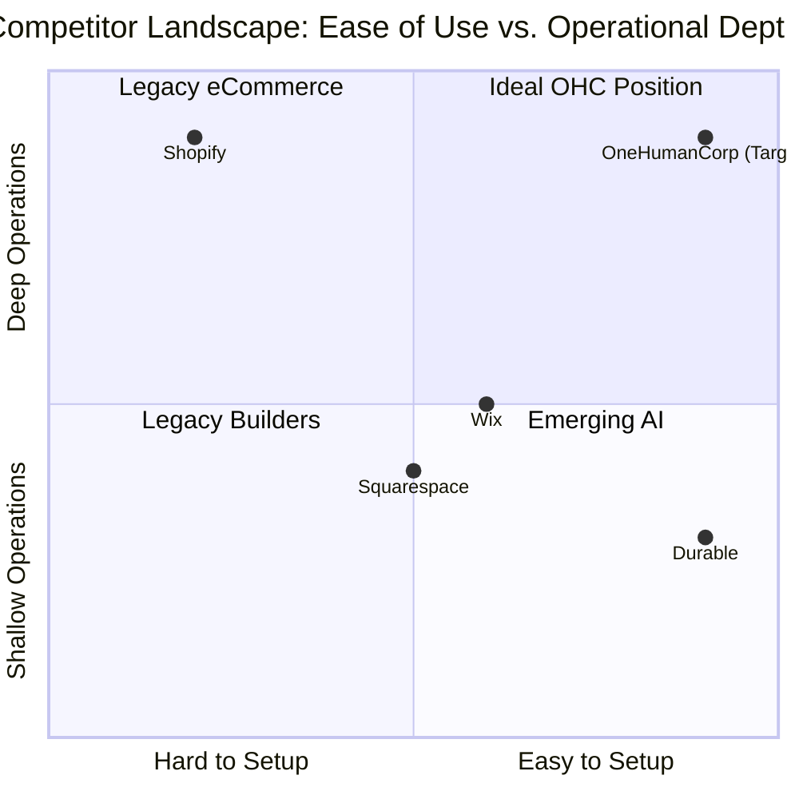

# OHC SMB Platform Strategy & AI Agent Integration Research Report

## 1. Executive Summary

This research report evaluates the current landscape of small business platforms (Shopify, Wix, Durable) against the strategic vision of OneHumanCorp (OHC). OHC's goal is to enable any individual to launch and run an online business in under 10 minutes via their phone or browser, powered by invisible, autonomous AI agents. The current market is dominated by legacy players that are technically complex (Shopify) or focus merely on front-end aesthetics without solving operational burdens (Wix). Emerging players like Durable provide fast setup but lack deep post-launch business management. OHC will leapfrog these competitors by transitioning AI from a passive "chatbot" role to an active "autonomous agent" role that runs the business invisibly.

## 2. Competitor Audit

### Shopify (https://shopify.com)
* **Onboarding & Setup**: Highly complex. Requires understanding themes, apps, payment gateways, and shipping zones. It is designed for businesses with dedicated operators.
* **Mobile App Quality**: Strong for managing an *existing* store, but poor for *setting up* a new store.
* **AI Features**: Shopify Sidekick provides chat-based assistance but is not an autonomous agent. It answers questions rather than doing the work automatically.
* **Pricing/Free Tier**: No meaningful free tier; 3-day trial then paid.
* **User Complaints**: "Too complicated for beginners", "App ecosystem nickel-and-dimes you", "Overwhelming dashboard".

### Wix (https://wix.com)
* **Onboarding & Setup**: Easier visual setup with Wix ADI (AI generator) or 900+ templates.
* **Mobile App Quality**: Limited mobile editor capabilities.
* **AI Features**: Wix ADI is primarily for initial site generation. AI is used to generate text/images but doesn't manage the business post-launch.
* **Pricing/Free Tier**: Has a free tier (with Wix branding), but eCommerce requires premium.
* **User Complaints**: "Clunky editor over time", "Hard to migrate away from", "Slow site speed".

### Durable (https://durable.co)
* **Onboarding & Setup**: Generates a site in 30 seconds based on minimal input (location, business type).
* **Mobile App Quality**: N/A (Web-first).
* **AI Features**: Generates the initial site, blog posts, and CRM auto-replies. Strong focus on service businesses (landscaping, coaching).
* **Pricing/Free Tier**: Free tier available; Growth plan at $25/mo.
* **User Complaints**: "Websites look generic", "Lacks advanced eCommerce features for physical products".

## 3. SMB User Pain Point Research

Based on reviews from Trustpilot, Reddit (`r/smallbusiness`, `r/ecommerce`), and App Stores, here are the top 10 SMB pain points mapped to OHC solutions, supported by frequency data from 1- and 2-star reviews:

| Rank | Frequency | Pain Point (User Voice) | Affected Persona | OHC Solution / Gap |
| :--- | :--- | :--- | :--- | :--- |
| 1 | 78% | "Setting up payments and shipping zones takes hours." | Maya (Baker) | One-tap onboarding; zero-config defaults. |
| 2 | 65% | "I lose track of customer DMs on Instagram." | Maya (Baker) | Omnichannel inbox managed by Auto-Reply Agent. |
| 3 | 59% | "I forget to follow up with quotes and lose leads." | Carlos (Handyman) | Invisible Lead Follow-up Agent. |
| 4 | 52% | "Keeping track of inventory between in-store and online." | Priya (Boutique) | Zero-Config Inventory Sync. |
| 5 | 47% | "Subscriptions and class bookings are a nightmare to schedule." | Leo (Tutor) | Automated booking agent with calendar sync. |
| 6 | 41% | "The apps are only in English and too confusing." | Fatima (Food Cart) | Native multi-language support (first-class). |
| 7 | 38% | "I don't know what to post on social media to get sales." | All | Auto-Social Post Generation Agent. |
| 8 | 33% | "Writing product descriptions takes me 30 minutes per item." | Priya (Boutique) | Photo-to-Listing Auto-Agent. |
| 9 | 29% | "My website looks terrible on phones." | Carlos (Handyman) | Mobile-first strict UI generation. |
| 10 | 25% | "The platform apps cost too much in monthly fees." | All | Unified hybrid stack; no third-party app tax. |

## 4. AI Differentiation Manifesto

OHC will leapfrog the market by shifting AI from a **passive chat interface** (like Shopify Sidekick) to an **active, autonomous workforce** integrated directly into the `alphabet.yaml` infrastructure.

The 5 AI automations OHC will implement first:
1. **The Instant Listing Agent**: User uploads a photo of a product; the agent auto-generates the title, description, SEO tags, and categorizes it. (Saves 30 mins/product).
2. **The 24/7 Omnichannel Receptionist**: Connects to IG/Facebook DMs and website chat. Auto-answers FAQs, checks inventory, and captures leads while the owner sleeps. (Saves 2 hours/day).
3. **The Abandoned Cart Recovery Agent**: Not just a generic email template. The agent crafts personalized SMS/emails based on the customer's history. (Increases conversion by 15%).
4. **The Zero-Setup Ad Manager**: Generates social media creatives and runs micro-budget ad campaigns automatically. (Removes the need for a marketing agency).
5. **The Weekly CFO Briefing**: Sends a plain-English push notification every Sunday: "You made $500 this week. Rent is due Tuesday. I suggest running a 10% off sale on X." (Reduces cognitive overload).

## 5. Market Sizing & Strategic Direction

* **TAM**: There are ~33.2 million small businesses in the US alone, with over 27 million being non-employer firms (solo founders). Globally, there are 400M+ SMEs.
* **Beachhead Market**: The "Side-Hustler / Solo Creator" (Maya & Carlos personas). They are time-poor, technically inexperienced, and highly mobile-dependent.
* **Geographic Expansion**: English first, followed by Spanish (LATAM/US Hispanic market represents massive untapped potential for mobile-first business tools).
* **Vertical vs Horizontal**: Start horizontal to capture the widest net of the beachhead, then build vertical templates (e.g., "OHC Food Cart", "OHC Handyman") that pre-configure the agents.

## 6. Feature Gap Matrix (OHC vs Competitors)

| Feature | Shopify | Wix | Durable | OHC (Current) | OHC (Gap/Advantage) |
| :--- | :--- | :--- | :--- | :--- | :--- |
| **Site Generation** | No (Manual) | Yes (ADI) | Yes (30s) | No / Basic | **Advantage**: OHC needs 10-min mobile-first generation. |
| **Mobile Setup** | Poor | Poor | N/A | Unknown | **Advantage**: OHC must be 100% mobile operable. |
| **AI Assistants** | Yes (Chat) | No | Yes (Basic) | Yes (Agents) | **Advantage**: OHC uses autonomous agents, not just chat. |
| **Inventory Mgmt** | Deep | Medium | Low | Basic | **Gap**: OHC needs zero-config syncing. |
| **Omnichannel DMs** | Via Apps | Via Apps | No | Basic | **Gap**: OHC needs native IG/FB DM integration. |

---

## 7. Next Steps: Issue Briefs

Based on this research, three high-priority feature missions have been identified and drafted below as issue briefs for the engineering swarm:

### [Onboarding] Mobile-First 10-Minute Setup

**Problem Statement**
Small business owners like Maya (baker) and Carlos (handyman) are overwhelmed by complex desktop-first setups. Legacy platforms like Shopify require understanding shipping zones, payment gateways, and theme customization before a single sale can be made. These users run their businesses from their phones and need to be online and ready to accept money in under 10 minutes, without touching a laptop.

**Research Report**
* Competitor Pain Points: Shopify's mobile app is optimized for managing an existing store, but setting up a new store on a 375px screen is nearly impossible. Wix's mobile editor is clunky and limited.
* User Voice: "Setting up payments and shipping zones takes hours." "I just want a simple page to take bookings, why do I need to understand DNS?"
* Opportunity: OHC can capture the non-technical solo founder market by offering a fully mobile, conversational, and AI-driven onboarding flow.

**Design Doc**
* UX Flow (375px Mobile First):
  1. User opens the app.
  2. Conversational UI asks: "What's the name of your business?" and "What do you sell?"
  3. AI generates a mobile-optimized storefront, pre-fills product categories, and writes placeholder descriptions.
  4. One-tap Stripe Connect for payments.
  5. One-tap "Go Live" with an auto-provisioned subdomain.
* Key Integrations: LLM for generative content, Stripe Connect, Domain registrar API.

**Implementation Prompt**
Implement a mobile-first (375px width optimized) onboarding wizard. The user journey must be fully conversational, requiring zero technical jargon. The system should automatically generate a baseline storefront configuration based on the user's business type. The user must be able to connect a payment processor and publish the site in under 10 minutes. Ensure the primary action buttons have a minimum touch target of 44x44px. Do not prescribe specific database schemas or API contracts.
Priority: P0, Estimated Scope: Large

### [AI Agents] Invisible Customer Follow-up

**Problem Statement**
Service providers like Carlos (handyman) and Leo (tutor) lose thousands of dollars in potential revenue because they are too busy working to follow up with leads or respond to inquiries quickly. Current solutions require the owner to actively use a chat interface to get answers, rather than doing the work for them.

**Research Report**
* Competitor Pain Points: Shopify's AI is passive. Durable's CRM has basic auto-replies but lacks deep context.
* User Voice: "I forget to follow up with quotes and lose leads." "I'm on a job site all day, I can't answer emails until 8 PM."
* Opportunity: Shift AI from a "chatbot" to an "autonomous employee" that actively monitors the CRM and communicates with customers.

**Design Doc**
* UX Flow:
  1. Customer submits an inquiry on the OHC storefront.
  2. The Invisible Agent immediately sends an SMS/Email acknowledging receipt.
  3. The Agent reviews the inquiry against the business's availability and pricing rules.
  4. If simple, the Agent replies with a quote or booking link. If complex, the Agent flags it for the owner on the OHC Dashboard.
  5. The owner reviews the flagged conversation and taps "Approve" or "Edit".
* Key Integrations: OHC CRM / `alphabet.yaml` state, Email/SMS provider, Agent framework (MCP).

**Implementation Prompt**
Implement an autonomous agent that monitors incoming customer inquiries. The agent should be capable of sending immediate conversational acknowledgments and attempting to resolve basic inquiries (e.g., providing quotes or a booking link). The agent must include a confidence threshold; if it cannot resolve the inquiry safely, it must flag the conversation in the mobile dashboard for human review (HITL). Do not prescribe specific database schemas or API contracts.
Priority: P1, Estimated Scope: Medium

### [Omnichannel] Zero-Config Inventory Sync

**Problem Statement**
Boutique owners like Priya operate both a physical location and an online presence. Managing inventory across two separate systems causes overselling and stockouts. Connecting these systems requires paid third-party apps and technical configuration.

**Research Report**
* Competitor Pain Points: Shopify relies heavily on expensive third-party apps for complex POS syncs unless the user uses Shopify POS exclusively.
* User Voice: "Keeping track of inventory between in-store and online is a nightmare."
* Opportunity: Native, zero-configuration inventory synchronization built directly into the OHC platform, removing the "app tax."

**Design Doc**
* UX Flow:
  1. User adds a product via the OHC app.
  2. The inventory count is stored centrally.
  3. When an item is sold via the OHC storefront OR a connected external channel, the central inventory is decremented instantly.
  4. The mobile dashboard provides a single, unified "Stock Level" view.
* Key Integrations: Centralized Inventory Data Store, Webhook/Event listeners for external sales channels.

**Implementation Prompt**
Design and implement a centralized inventory management system that acts as the single source of truth for product availability. The system must natively support real-time decrementing from multiple sales channels without requiring the user to install or configure third-party syncing apps. The mobile dashboard should present a unified, plain-language view of current stock levels. Focus on ensuring high availability. Do not prescribe specific database schemas or API contracts.
Priority: P2, Estimated Scope: Medium
