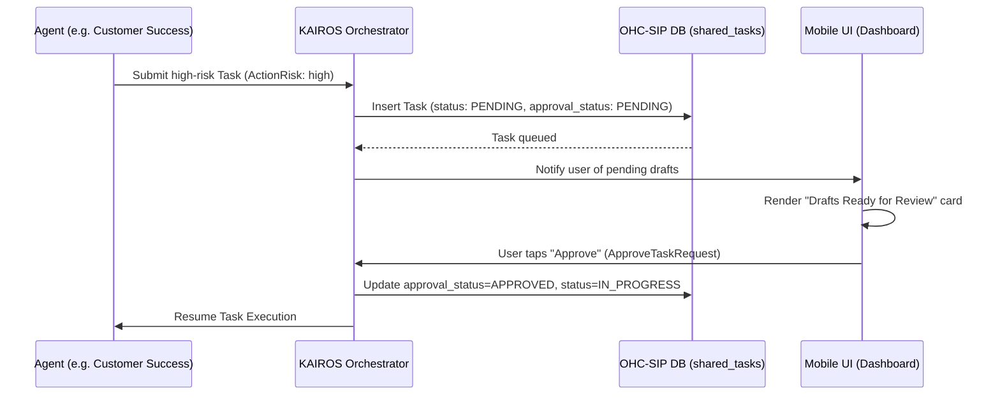

# [architecture] Implement AI Agent Approval Workflow Engine

## Problem Statement
Small business owners rely on OHC to act as an invisible, integrated "digital staff". However, certain high-stakes external actions—such as sending customer emails, issuing refunds, or publishing social media posts—carry significant risk. Non-technical owners need a way to confidently review and approve these actions before they are executed. Currently, there is a lack of a formalized "Draft-for-Review" workflow in the KAIROS Orchestrator. The platform needs an intuitive, mobile-first mechanism where AI agents can queue high-risk actions in a pending state, requiring a simple 1-tap approval from the user via the mobile dashboard before execution.

## Research Report
Market analysis highlights that existing platforms treat AI as bolt-on features (e.g., Shopify Sidekick, Wix AI) without deep workflow automation and safety guardrails for operational and financial tasks. OHC differentiates itself by operating autonomous "Departments". However, true autonomy requires trust.

- **Shopify & Wix**: AI chatbots that provide suggestions but do not autonomously take high-risk operational actions.
- **OHC's Opportunity**: Implementing a strict "Draft-for-Review" workflow ensures the "zero technical knowledge required" mandate is met, while providing a safety net for high-stakes actions. By categorizing tasks as "Auto-Execute" (low-risk) and "Draft-for-Review" (high-risk), OHC can safely scale agentic workflows.

We found that the database schema (`shared_tasks` table) has already been updated via migrations to include `action_risk`, `approval_status`, and `proposed_content`. The backend gRPC service (`approve_task` in `src/server/lib.rs` and `src/server/tasks.rs`) is partially wired. The task queue logic in `src/server/queue.rs` requires minor wiring to persist the new properties into the PostgreSQL tables and return them to the `SharedTaskModel`. The Slint frontend UI already renders a `pending_approvals` view in `src/app/dashboard.slint`.

## Design Doc

### Architecture Diagram

### Key Design Decisions
1. **Action Risk Categorization**:
   - `action_risk` is explicitly tracked on each task (`low` for Auto-Execute, `high` for Draft-for-Review).
2. **Approval Status State Machine**:
   - High-risk tasks are initialized with `approval_status = PENDING`.
   - The user can approve or reject the draft. Upon approval, `approval_status` transitions to `APPROVED` and the task `status` becomes `IN_PROGRESS` or `APPROVED`.
3. **Database Integration**:
   - The `shared_tasks` table persists `action_risk`, `approval_status`, and `proposed_content` directly, allowing efficient queue polling for user intervention.
4. **Mobile UX Flow**:
   - A pending task triggers a mobile notification and appears prominently on the 375px home dashboard.
   - The user sees the `proposed_content` and can approve with a single tap.

## Implementation Prompt
**Task**: Complete the "Draft-for-Review" workflow engine within the KAIROS orchestrator.
**CUJ**: Maya receives a custom order. The Customer Success agent generates a draft confirmation email. This draft is queued in the KAIROS orchestrator. Maya opens her dashboard, sees the "Draft Ready for Review", and clicks "Approve" with a single tap. The system then executes the drafted email.
**Acceptance Criteria**:
- Map the new `action_risk`, `approval_status`, and `proposed_content` fields in the `SharedTaskModel` struct.
- Wire these fields to the `INSERT` and `UPDATE` statements in `TaskQueueService` (`src/server/queue.rs`).
- Ensure the Orchestrator respects the `approval_status` before executing a high-risk task.
- E2E tests must verify that a high-risk task is paused pending approval, and only resumes after the `approve_task` endpoint is invoked. All E2E tests must traverse from the UI to the backend.

## Priority
P1

## Estimated Scope
Medium
