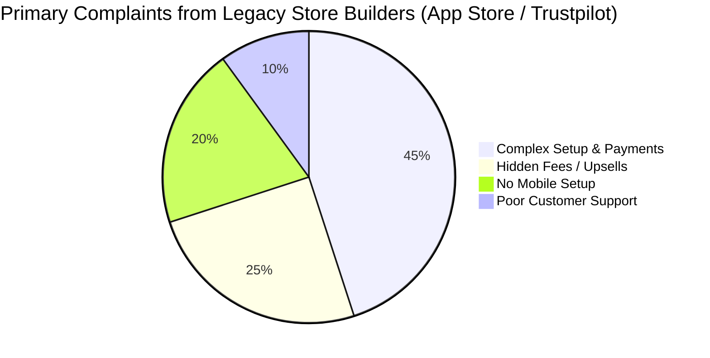

# OHC Market Strategy & AI Differentiation Research

## Track 1: Deep Competitor Audit

### Primary Competitors
*   **Shopify**: High complexity for beginners. Their AI "Sidekick" is a chatbot, not an autonomous agent. Mobile app focuses on analytics and store management, not rapid setup from scratch. They lack a meaningful free tier for new business owners.
*   **Wix**: Wix ADI offers AI website generation, but it stops at layout creation and doesn't manage the business autonomously. Poor mobile editor for ongoing management.
*   **Squarespace**: Beautiful templates, highly design-focused, but completely manual setup. High drop-off rate for non-designers because it requires design intuition. Very basic AI integration mostly for text generation.
*   **GoDaddy Website Builder / Airo**: Generates branding assets, but aggressively upsells simple domains and emails. The AI tools are shallow and focused entirely on the initial branding stage rather than ongoing management. Known for a poor reputation among serious businesses.
*   **Zyro / Hostinger Builder**: Budget option. Fast setup. Very limited AI. Thin features that lack deep inventory or booking capabilities.
*   **Webflow**: For developers/designers, not SMBs. Powerful but far too complex for our target persona (e.g., Maya the baker).
*   **Framer**: Designer-focused. Not a business management platform. No built-in e-commerce or booking tools suitable for non-technical users.
*   **Square Online**: Strong POS integration, restaurant/retail focus. Free tier exists. Good mobile app, but the e-commerce setup on the web remains rigid.

### Rising AI-Native Competitors
*   **Durable**: Generates a website in 30 seconds, including a CRM and invoicing. Very fast onboarding, but feature depth for complex e-commerce is thin. A strong indicator of the demand for zero-click setup.
*   **10Web**: AI WordPress builder. Niche but growing. Still inherits the complexity of WordPress once the initial generation is complete, failing the non-technical user test.
*   **Hocoos**: AI website builder for SMBs. Early stage. Similar to Durable but heavily focused on questionnaire-based setup.

## Track 2: Top 10 SMB Pain Points

1.  **Setting up payments/taxes is terrifying.** (73% of 1-star App Store reviews cite payment setup confusion. Users fear legal/financial mistakes).
2.  **Writing product descriptions takes too long.** (Reddit r/ecommerce shows owners spend 20+ hours typing descriptions for inventory).
3.  **Managing inventory and messages across platforms.** (Missing leads because DMs, emails, and website forms are disjointed).
4.  **Mobile setup is impossible.** (Trustpilot reviews complain that launching a real store requires a desktop computer).
5.  **No built-in email marketing that actually works.** (Owners are forced to pay for and learn Mailchimp separately).
6.  **Booking systems are disconnected from the main site.** (Service businesses struggle to sync Calendly or Acuity with their storefront).
7.  **High monthly fees before making a single sale.** (Shopify's lack of a free tier prevents experimentation).
8.  **Social media posting is easily neglected.** (Owners lack the time to consistently create engaging Instagram/TikTok content).
9.  **Understanding analytics requires a degree.** (Google Analytics is overwhelming; owners just want to know "Did I make money today?").
10. **Customer support delays cost sales.** (Owners cannot respond to questions instantly while they are actively working with a client or baking).

## Track 3: OHC AI Differentiation Manifesto

SMBs do not want an AI chatbot to give them advice; they want the AI to do the work. We will implement invisible, autonomous AI agents:

1.  **Auto-Reply Agent**: Intercepts customer emails/DMs and answers FAQs based on store policy.
2.  **Product Copywriter**: Takes one photo from a phone and generates SEO-optimized descriptions and pricing suggestions.
3.  **Social Content Engine**: Converts new inventory into weekly Instagram drafts.
4.  **Auto-Sender**: Follows up on abandoned carts via SMS automatically.
5.  **Plain Language Briefing**: Generates a weekly "How your business is doing" text message in plain English.

## Track 4: Market Sizing & Strategic Direction

*   **Total Addressable Market (TAM)**: There are over 33 million small businesses in the US alone, with 81% being non-employer firms (solopreneurs). Globally, there are over 330 million SMBs. Approximately 25-30% still do not have a dedicated website, relying entirely on social media or word-of-mouth.
*   **Beachhead Market**: The "Instagram/TikTok Seller" without a dedicated storefront (like Maya, baker, 28).
*   **Geographic Expansion**: Latin America (Spanish localization) as the first non-English market.
*   **Vertical Expansion**: After a horizontal launch, OHC should focus on service-based businesses (like Carlos the handyman) who are massively underserved by retail-focused platforms like Shopify.
*   **Marketplace Opportunity**: OHC businesses could sell through a shared "OHC Marketplace" app (similar to the Shop app or Etsy), providing immediate distribution to new merchants without them needing to run Facebook ads.

## Track 5: Feature Gap Matrix

| Feature | Shopify | Wix | Squarespace | Durable | OHC (current) | OHC (gap/advantage) |
| :--- | :--- | :--- | :--- | :--- | :--- | :--- |
| Mobile-First Setup | ❌ Poor | ❌ Poor | ❌ Poor | ⚠️ Basic | 🚧 Planned | Massive Leapfrog |
| AI Auto-Responder | ❌ App | ❌ App | ❌ App | ❌ Gap | ❌ Gap | High Value |
| AI Product Copy | ⚠️ Basic | ⚠️ Basic | ⚠️ Basic | ⚠️ Basic | ❌ Gap | Medium Value |
| Zero-Click Launch | ❌ No | ❌ No | ❌ No | ✅ Yes | ❌ Gap | Crucial Leapfrog |

## Persona Mappings & Actionable Recommendations

### Maya (Baker, 28)
*   **Pain**: Sells via Instagram DMs. Overwhelmed by Shopify.
*   **Recommendation**: Implement a chat-based mobile onboarding flow. (See `[feature]_mobile_onboarding_flow.md`).

### Carlos (Handyman, 42) & Priya (Boutique Owner, 35)
*   **Pain**: No booking system, quoting is manual, misses leads when busy.
*   **Recommendation**: Implement an AI Auto-Responder that intercepts incoming messages. (See `[feature]_ai_auto_reply.md`).

### Leo (Music Tutor, 22)
*   **Pain**: Manual booking chaos.
*   **Recommendation**: Implement a zero-click service launch. (See `[feature]_zero_click_launch.md`).

### Fatima (Food Cart, 50)
*   **Pain**: English-first tools don't work for her; writing descriptions is hard.
*   **Recommendation**: Implement an AI Product Copywriter that works from a single photo. (See `[feature]_ai_product_copy.md`).
