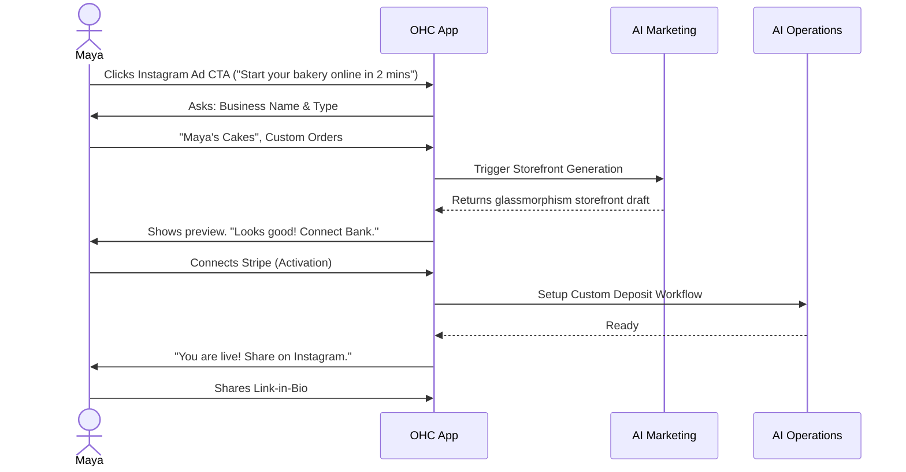
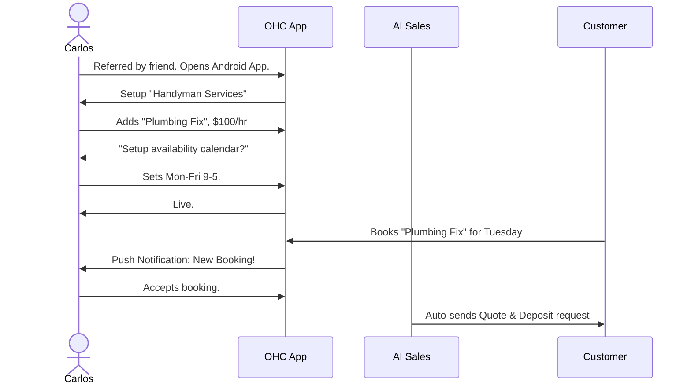
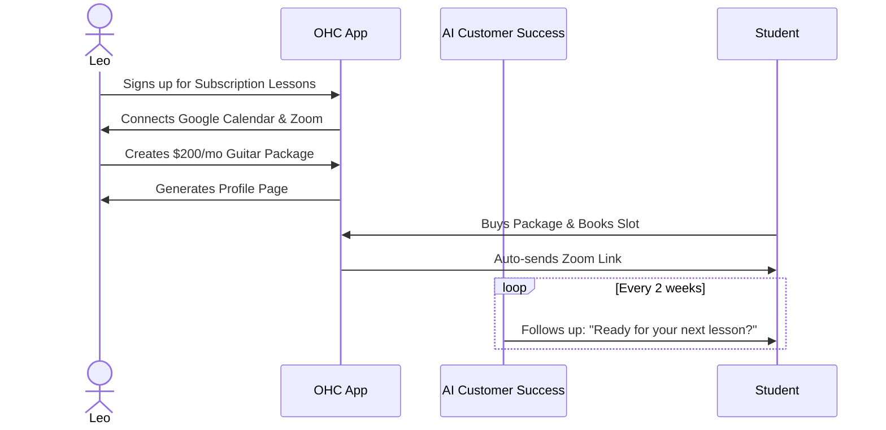
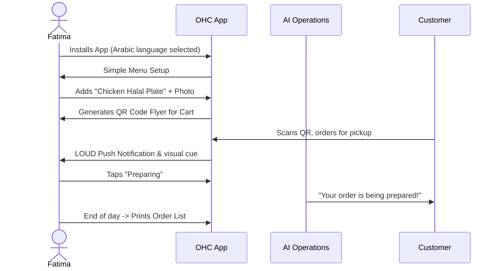

# [Architecture] Business Journey Architecture: End-to-End Persona Journeys

## Title
Implement the End-to-End Business Journey Workflows and Onboarding for All Core Personas

## Problem Statement
Small business owners—ranging from home bakers to freelance handymen—often abandon digital platforms due to overwhelming technical complexity, jargon, and time-consuming setup processes. Traditional platforms (Shopify, Wix, Squarespace) require too many inputs before users see a tangible result, causing high drop-off rates. Our non-technical users need a zero-friction, guided, and mobile-first experience that takes them from "idea" to "live business" in under 10 minutes, with AI seamlessly handling the heavy lifting of storefront design, setup, and initial engagement.

## Research Report
### Findings & Competitive Analysis
- **Shopify**: Excellent for scale, but onboarding requires setting up domains, payment gateways, and complex shipping zones before launching. Time to value is 30-60 minutes. Highly intimidating for a sole proprietor like a food cart operator.
- **Wix/Squarespace**: Focus heavily on visual templates and drag-and-drop design. While easier than Shopify, they still demand creative input and desktop usage. Not genuinely mobile-first.
- **GoDaddy**: Provides some AI generation, but the resulting business tools (booking, POS) are fragmented.
- **OneHumanCorp (OHC) Opportunity**: We provide a cohesive, AI-driven onboarding where the system asks simple questions and automatically generates the storefront, sets up the Stripe connect account, and establishes AI departments. Time to value is < 10 minutes, completely manageable from a 375px mobile screen.

### Key Persona Insights
1. **Maya (Baker)**: Relies heavily on visual mediums (Instagram). Needs a fast transition from social media to a custom order deposit page.
2. **Carlos (Handyman)**: Word of mouth driven. Requires simple service listings and a booking calendar.
3. **Priya (Boutique Owner)**: Needs seamless online/offline inventory sync and POS capabilities.
4. **Leo (Music Tutor)**: Requires subscription-based pricing and automated scheduling links.
5. **Fatima (Food Cart)**: Fast, high-volume transactions. Needs dual language support and simple order queues on a low-end device.

## Design Doc

### Key Design Decisions & Why
- **Progressive Disclosure Onboarding**: Users provide only a name, business type, and primary goal. AI generates the rest. The user can tweak it later.
- **AI-Driven "Aha!" Moment**: Within 3 minutes, the user sees a beautiful, fully functional live page, even if it's a draft.
- **Mobile-First Everything**: All UI wireframes and flows must fit within 375px width. Native keyboards are used appropriately (e.g., number pad for prices).
- **Embedded AI Agents**: The AI isn't a separate "chatbot" page. It appears contextually as "The Manager" or "The Promoter" in the notification feed.

### Mobile UX Flows (375px First)
- **Onboarding Wizard**:
  - Screen 1: "What's the name of your business?"
  - Screen 2: "What do you sell?" (Options: Products, Services, Food, etc.)
  - Screen 3: "Generating your business..." (AI loading animation)
  - Screen 4: Live Preview with a CTA "Add your first item".
- **Activation Flow**: Adding the first item uses a single-screen form: Photo, Name, Price.
- **Dashboard Feed**: The home screen is a contextual feed, not a static menu. "You have 2 new orders to accept", "Your AI Manager drafted an Instagram post for review".

### AI Agent Integration Points
- **Operations Agent**: Activated automatically when an item/service is added to track inventory/bookings.
- **Marketing Agent**: Immediately designs the storefront during onboarding based on business type.
- **Customer Success Agent**: Suggests notification templates when the first order arrives.
- **Business Advisory**: Unlocked after Week 1 to provide the first performance summary.

### Persona Sequence Diagrams (Mermaid.js)

#### 1. Maya (The Home Baker)

#### 2. Carlos (The Freelance Handyman)

#### 3. Priya (The Boutique Owner)

```mermaid
sequenceDiagram
    actor Priya
    participant App as OHC App
    participant AI_Adv as AI Advisory

    Priya->>App: Needs to sync in-store and online.
    App->>Priya: Guided POS & Online Setup
    Priya->>App: Adds Red Dress (Size S, M, L)
    App->>Priya: Generates Web Store & enables Tap-to-Pay
    Priya->>App: Sells 1 in-store (Tap-to-Pay)
    App->>App: Auto-deducts inventory
    AI_Adv->>Priya: "Weekly Report: Red Dresses are selling fast. Upgrade to Starter to add 100+ items."
    Priya->>App: Upgrades to Starter Tier
```

#### 4. Leo (The Music Tutor)

#### 5. Fatima (The Food Cart Operator)

## Implementation Prompt
**For the Implementer Agent:**
Implement the progressive onboarding UI flows and the core state machine for the business journey in the Flutter application.
- Ensure the onboarding wizard supports all five persona types (Products, Services, Subscriptions, Food, Portfolios).
- Build the 375px mobile-first views for the Wizard.
- Integrate the KAIROS Orchestrator triggers so that completing the onboarding wizard immediately queues the "Storefront Generation" background task for the Marketing AI Agent.
- Provide comprehensive E2E tests using Playwright that simulate a non-technical user launching a business from scratch. Do not hardcode fixed wait times; use robust selectors and wait for network idle.
- Maintain 100% test coverage and ensure no regressions in existing flows.

## Priority
P0 (Critical path for user acquisition)

## Estimated Scope
Large
