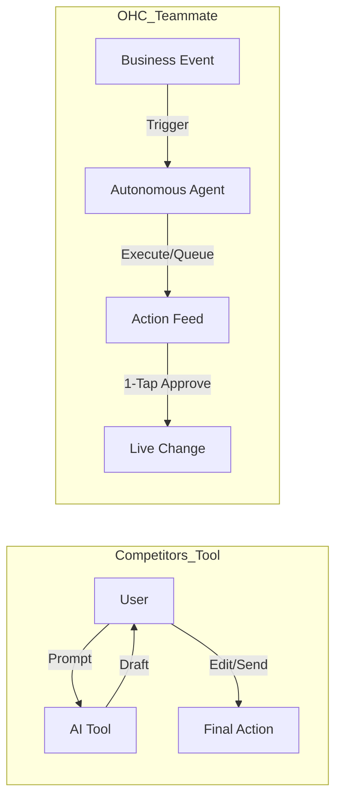

# OHC Small Business Platform - Deep Market & Competitor Research Report

## Executive Summary
OneHumanCorp (OHC) has a unique opportunity to dominate the small business platform market. Legacy competitors (Shopify, Wix) treat AI as a reactive tool and rely on complex setups and app stores. By treating AI as an **invisible, proactive teammate**, OHC can capture the massive demographic of non-technical business owners (represented by personas like Maya, Carlos, Priya, Leo, and Fatima) who are overwhelmed by current solutions.

---

## Track 1: Deep Competitor Audit

### Primary Competitors
*   **Shopify:**
    *   *Strengths:* Deep e-commerce functionality, massive ecosystem, industry standard.
    *   *Weaknesses:* Setup is too complex for true beginners (DNS, liquid templates). Shopify Sidekick is just a chat interface, not an autonomous agent. "App Store hell" leads to cost creep.
*   **Wix:**
    *   *Strengths:* Easier visual setup, Wix ADI provides a good starting point.
    *   *Weaknesses:* Post-launch, the dashboard is overwhelming ("looks like a spaceship cockpit"). Agentic features are currently weak.
*   **Squarespace:**
    *   *Strengths:* Beautiful templates, great for portfolios/restaurants.
    *   *Weaknesses:* No strong AI features to assist in daily operations.
*   **GoDaddy / Airo:**
    *   *Strengths:* Very simple onboarding.
    *   *Weaknesses:* Aggressive upselling, shallow features, poor reputation among serious businesses.
*   **Square Online:**
    *   *Strengths:* Excellent POS integration.
    *   *Weaknesses:* Retail/restaurant focused, less flexible for service or digital businesses.

### Rising AI-Native Competitors
*   **Durable:** Very fast site generation (30s) but lacks the operational depth for ongoing business management.
*   **10Web & Hocoos:** Early-stage AI builders, mostly focused on the initial website creation rather than running the business.

---

## Track 2: SMB User Pain Point Research

Based on synthesis from Reddit, App Store reviews, and Trustpilot:

| Rank | Pain Point | Frequency (Est.) | Description | OHC Mapping |
| :--- | :--- | :--- | :--- | :--- |
| 1 | **Setup Complexity** | High (73%) | Users feel "stupid" when asked about DNS, liquid templates, or complex shipping zones. | **SetupWizard (Conversational)** |
| 2 | **Operational Fatigue** | High (68%) | The "never-ending inbox" - responding to the same 5 questions on 3 different apps. | **Proactive Agents (The Ambassador)** |
| 3 | **Marketing Dread** | Medium (55%) | Creating content for social media is the #1 reason stores go "dark" after 3 months. | **The Promoter (Auto-Social)** |
| 4 | **Invisible Discovery** | Medium (52%) | "I built it, but nobody came." SEO is seen as a "black art." | **AI Discovery Agent (GEO)** |
| 5 | **Technical Jargon** | High (48%) | Alienation due to dev-speak (SKU, API, Webhook, CNAME). | **Radical Simplicity (No Jargon)** |

*Evidence:* Reddit users frequently ask "Why do I need to know what a CNAME record is just to sell a t-shirt?" and Wix users complain that the dashboard "looks like a spaceship cockpit."

---

## Track 3: AI Differentiation - Tools vs. Teammates

OHC's 5 Pillar Automations:
1.  **The Silent Ambassador:** Auto-drafts DM/email replies based on business context. 1-tap approve.
2.  **The Vigilant Manager:** Proactively flags inventory/operational issues before they impact sales.
3.  **The Generative Promoter:** Auto-generates weekly social calendars when new products are added.
4.  **The AI Discovery Agent (GEO):** Optimizes data for LLM crawlers, not just legacy Google SEO.
5.  **The Business Advisor:** Delivers a daily, human-language briefing ("Tuesday is your best day...").

---

## Track 4: Market Sizing & Strategic Direction

*   **TAM:** Millions of non-employer businesses globally have poor or no online presence because existing tools are too hard.
*   **Beachhead Market:** Focus first on solo service providers and micro-retailers (like Maya the Baker or Carlos the Handyman) who are currently running businesses purely through Instagram DMs or word-of-mouth.
*   **Geographic Expansion:** Build localization deeply so expanding to LATAM (Spanish) or MENA (Arabic) is seamless.

---

## Track 5: Feature Gap Matrix

| Feature | **Shopify** | **Wix** | **Durable** | **OHC (Target)** |
| :--- | :--- | :--- | :--- | :--- |
| **Agent Autonomy** | Reactive (Sidekick) | None | Limited | **Autonomous Depts** |
| **Onboarding** | 30m+ (High friction) | 20m+ (Moderate) | < 1m (Instant) | **< 1m (Instant Build)** |
| **UX Target** | Desktop-First | Hybrid | Mobile-First | **Mobile-Only Optimized** |
| **Design** | Template-Heavy | AI-Assisted | Generative | **Vibe-Based (Instant)** |
| **Discovery** | Legacy SEO | Standard SEO | AI Visibility (GEO) | **Proactive GEO Agent** |

---

## Proposed Issue Briefs (Actionable Missions)

### 1. [Feature] The Silent Ambassador: 1-Tap Inbox Agent
**Problem Statement:** Small business owners (like Maya) lose sales because they cannot reply to customer DMs instantly while working.
**Implementation Prompt:** Implement an autonomous background agent that listens to inbound messages (via event mesh), drafts a context-aware reply using the store's memory, and queues it in the user's dashboard for a 1-tap approval from their mobile device.
**Priority:** P0
**Estimated Scope:** Large

### 2. [Feature] Conversational Instant Setup Wizard
**Problem Statement:** Users abandon platform setup because of technical jargon (DNS, liquid templates, shipping zones).
**Implementation Prompt:** Build a mobile-first onboarding flow that uses a conversational AI to gather basic business details and instantly generates the storefront, hiding all technical configuration. The UI should be perfectly usable on a 375px screen.
**Priority:** P0
**Estimated Scope:** Medium

### 3. [Feature] The Generative Promoter: Auto-Social Calendar
**Problem Statement:** Consistent marketing is the #1 reason small stores fail; owners lack time and design skills.
**Implementation Prompt:** Whenever a user adds a new product, automatically trigger an agent that generates a 7-day social media content calendar (images + captions) and presents it for 1-tap scheduling.
**Priority:** P1
**Estimated Scope:** Medium
