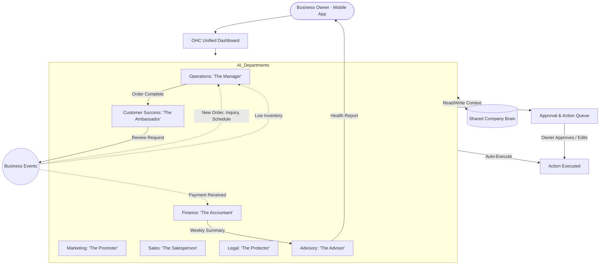

# Title: AI Agent Department Architecture

## Problem Statement
As a small business owner—whether I'm Maya selling custom cakes on Instagram or Fatima managing pre-orders for my food cart—I don't have the time, money, or expertise to hire a full team. I wear all the hats: marketing, sales, accounting, customer service, and operations. But keeping up with all these roles is exhausting and leads to dropped balls, missed sales, and burnout. I need an invisible "team" that handles these roles for me automatically, communicating in plain English, without me needing to understand coding, prompts, or "AI." The system should act like a group of reliable employees who know when to act on their own and when to ask for my approval.

## Research Report
Research shows that small business owners spend up to 40% of their time on administrative tasks rather than their core craft. Tools like Shopify, Wix, and Squarespace provide the digital storefront but still require the owner to manually manage orders, marketing, and follow-ups. While recent AI integrations in these platforms help with drafting text, they don't operate as a cohesive team that *runs* the business in the background.

**Key Findings:**
1. **Terminology Matters:** Words like "agents," "LLMs," or "triggers" are intimidating. Framing them as "Departments" (e.g., The Manager, The Accountant) makes the concept intuitive.
2. **Trust is Gradual:** Owners are hesitant to let automation send messages or issue refunds without oversight. The system needs a "Draft for Review" mode that can graduate to "Auto-Execute" once the owner trusts the department.
3. **Context is King:** The departments need to share a brain. If The Ambassador (Customer Success) emails a customer, The Accountant (Finance) needs to know about it if they are processing a refund.

## Design Doc

### Architecture Diagram

### UI Wireframes & Screen Flow (375px first)
1. **The Team Dashboard (Mobile):** A grid of 7 avatar cards, each representing a department. Each card shows an active status (e.g., "The Manager: 2 orders processing" or "The Ambassador: 1 draft response awaiting review").
2. **Department Detail Screen (e.g., The Promoter):**
   - **Top:** Beautiful Glassmorphism card with the avatar and a friendly greeting.
   - **Middle:** A toggle for "Autonomy Level" (Options: "Draft for my review" vs "Handle automatically").
   - **Bottom:** Recent activity feed showing what The Promoter did today (e.g., "Created an Instagram post draft for your new vegan cake").
3. **Approval Inbox (Sticky Bottom Bar):** A floating action button that glows when a department has drafted something for the owner to approve. Tapping it opens a swipeable stack of cards to "Approve", "Edit", or "Decline" actions.

### Mobile UX Flow
- **Trigger:** A customer DMs Maya on Instagram asking for a quote.
- **Event:** The Ambassador (Customer Success) picks up the DM.
- **Action:** Since it's a quote, The Ambassador flags The Salesperson. The Salesperson drafts a quote based on Maya's pricing memory.
- **Approval:** Maya receives a push notification: *"The Salesperson drafted a quote for Sarah. Review?"*
- **Resolution:** Maya taps the notification, opens the app, sees the pre-written quote in a clean Interface using Inter font, hits "Approve," and the quote is sent.

### AI Agent Integration Points
- **Triggers:** Departments are awakened by Webhooks (e.g., Shopify order, Stripe payment), Schedules (e.g., 9 AM every Monday for Health Reports), or On-Demand (e.g., owner taps "Generate Marketing Post").
- **Coordination:** Departments communicate via a shared internal event bus. An action completed by one department can emit an event that wakes up another.
- **Memory/Context:** All departments read from and write to a centralized "Company Brain" (long-term memory vector store). This ensures they never contradict each other or ask the owner for information they already provided.
- **Approvals:** Actions are routed through a permissions engine. If the owner set the department to "Draft," the action is paused in an Approval Queue until the owner acts on it.
- **Budgeting/Throttling:** AI actions are metered by a token/action counter tied to the tenant's SaaS Tier. Once the Free tier limit (100 actions) is near, The Advisor proactively suggests upgrading to Starter to keep the team running.

### Key Design Decisions & Why
- **Humanized Naming:** Using titles like "The Ambassador" instead of "Customer Service Agent" reduces technical intimidation and aligns with the "hire a team" mental model.
- **Progressive Autonomy:** Forcing actions into a "Draft" state initially builds trust. Owners won't churn due to a rogue AI mistake.
- **Centralized Memory:** Siloed agents are frustrating. A shared memory bank ensures seamless handoffs between Sales and Customer Success.
- **Mobile-First Approval Queue:** The Tinder-style swipe interface for approvals makes managing the AI team something owners can do while waiting in line for coffee.

## Implementation Prompt
**For the Implementer Agent:**
Please build the core AI Department framework for OneHumanCorp. You need to implement the base logic for our 7 departments (Manager, Promoter, Salesperson, Ambassador, Accountant, Protector, Advisor). Focus on the infrastructure that allows these departments to be triggered by events or schedules, share context through a centralized memory store, and respect a user-configurable "Autonomy Level" (Draft vs. Auto-Execute).

Create the necessary mobile-first (375px) UI components that display the "Team Dashboard" with Glassmorphism styling and the swipeable Approval Inbox. Ensure that the multi-tenant tier limits are enforced, preventing departments from executing actions if the tenant's monthly quota is exhausted. Do not worry about the specific prompts or LLM integrations yet; focus on the architectural scaffolding, the state machine for approvals, and the UI representation of the team.

## Priority
P0

## Estimated Scope
Large