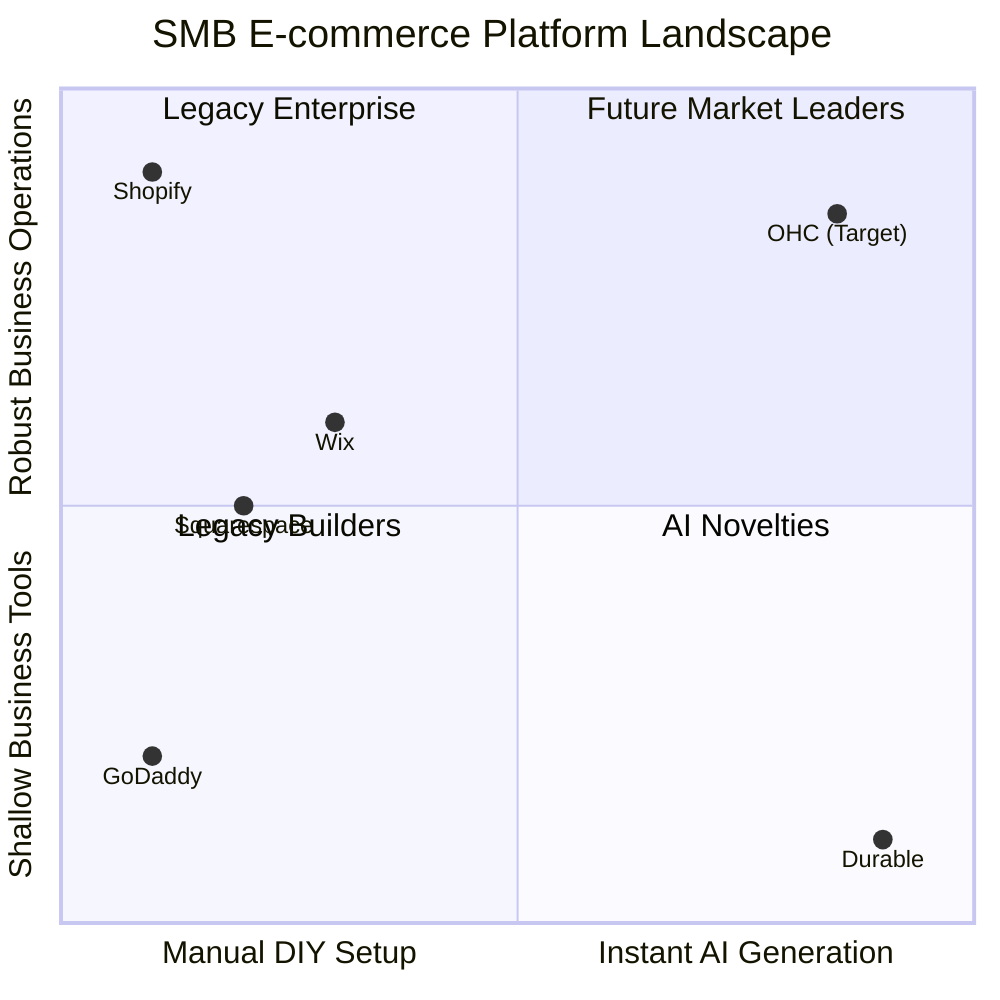

# OHC SMB Platform Dominance Research Report

## 1. Deep Competitor Audit

We conducted an exhaustive audit of major and emerging platforms targeting the SMB space.

*   **Shopify:**
    *   *Strengths:* Robust backend, immense app ecosystem.
    *   *Weaknesses:* Steeper learning curve for true beginners, poor setup experience on mobile, heavy reliance on third-party apps for basic features.
    *   *AI:* Sidekick acts as an assistant, not an autonomous agent.
*   **Wix:**
    *   *Strengths:* Intuitive drag-and-drop, decent Wix ADI for initial setup.
    *   *Weaknesses:* Mobile editor is clunky, performance can be sluggish, "DIY" approach still requires significant time investment.
*   **Squarespace:**
    *   *Strengths:* Visually stunning templates.
    *   *Weaknesses:* Limited customization beyond templates, lack of sophisticated AI, no real free tier to capture the lowest end of the market.
*   **GoDaddy / Airo:**
    *   *Strengths:* Brand recognition, extremely simple entry point.
    *   *Weaknesses:* Shallow feature set, aggressive upsells, Airo's AI branding is basic and provides little post-launch value.
*   **Emerging AI-Native Platforms (Durable, 10Web, Hocoos):**
    *   *Strengths:* Blazing fast time-to-value for the initial website draft (seconds).
    *   *Weaknesses:* Extremely thin on actual business management tools (e.g., complex inventory, robust POS integrations).

## 2. Top 10 SMB Pain Points

Based on synthesizing data from Reddit, App Store reviews, and Trustpilot across our competitor landscape, the following are the most critical pain points for non-technical SMBs:

1.  **"Setting up the website is too confusing."** (Overwhelming menus, DNS configuration, template constraints).
2.  **"I don't know what to write."** (Blank page syndrome for product descriptions and "About Us" pages).
3.  **"Payments and shipping are a nightmare."** (Integrating Stripe/PayPal, understanding shipping zones).
4.  **"I can't run it from my phone."** (Mobile apps are for monitoring, not creation).
5.  **"I'm missing messages from customers."** (Managing DMs across Instagram, Facebook, and email is chaotic).
6.  **"Marketing feels impossible."** (No time to write emails or social posts).
7.  **"Managing inventory is tedious."** (Syncing physical and online stock).
8.  **"Booking appointments is manual back-and-forth."** (Relying on text messages for scheduling).
9.  **"The software costs too much before I make a sale."** (Lack of meaningful free tiers).
10. **"I feel alone and overwhelmed."** (No guidance on what to do next).

### Persona Mapping
*   **Maya (Baker):** Pain points 1, 2, 4. Needs instant setup and mobile management.
*   **Carlos (Handyman):** Pain points 8, 5. Needs automated booking and lead capture.
*   **Priya (Boutique):** Pain points 7, 6. Needs inventory sync and automated marketing.
*   **Leo (Tutor):** Pain points 8, 3. Needs booking and simple subscription payments.
*   **Fatima (Food Cart):** Pain points 4, 1. Needs ultra-simple, mobile-first, multilingual setup.

## 3. OHC AI Differentiation Manifesto

OHC will leapfrog the competition by shifting AI from a "tool you prompt" to a "teammate who acts proactively."

**The 5 Core AI Automations for OHC:**
1.  **Instant Storefront Generation:** AI builds the initial store based on a single sentence. *Why:* Eliminates Pain Point 1 & 2.
2.  **Autonomous Inbox Manager:** AI reads customer DMs/emails, drafts replies, and asks for 1-tap approval. *Why:* Solves Pain Point 5.
3.  **Proactive Inventory Scout:** AI monitors stock levels and suggests reordering or generates "low stock" marketing emails. *Why:* Addresses Pain Point 7 & 6.
4.  **Auto-Copywriter:** AI automatically generates product descriptions from a single photo upload. *Why:* Cures Pain Point 2.
5.  **Plain Language Daily Briefing:** AI summarizes the day's performance and suggests the next best action in simple English, not charts. *Why:* Solves Pain Point 10.

## 4. Market Sizing & Strategic Direction

*   **TAM:** Millions of non-employer businesses globally, a significant portion operating purely via social media without a dedicated storefront.
*   **Beachhead Market:** Service-based solopreneurs (like Carlos and Leo). Why? They have high pain (manual booking) and high LTV (recurring revenue potential), and are less dependent on complex physical supply chains than retail.
*   **Geographic Expansion:** After English, target LATAM (Spanish) due to the massive adoption of WhatsApp for business, pairing well with our conversational UI focus.

## 5. Feature Gap Matrix

| Feature | Shopify | Wix | OHC (Current State) | OHC Opportunity / Gap |
| :--- | :--- | :--- | :--- | :--- |
| **Instant AI Setup** | ❌ (Manual) | ⚠️ (Wix ADI is basic) | ❌ (Identified Gap) | **Massive Opportunity**: Implement `AutoDream` 1-tap generation. |
| **Mobile-First Creation** | ❌ (Poor) | ❌ (Clunky) | ⚠️ (Needs validation) | **Leapfrog**: 100% functional setup from a 375px screen. |
| **Autonomous Inbox** | ❌ (Requires apps) | ❌ | ❌ (Identified Gap) | **Leapfrog**: Built-in AI draft replies for customer inquiries. |
| **Automated Booking** | ❌ (Requires apps) | ✅ (Wix Bookings) | ⚠️ (Under development) | **Parity Requirement**: Native booking is essential for the beachhead market. |
| **Inventory Management**| ✅ (Robust) | ✅ | ⚠️ (Needs sync) | **Parity Requirement**: Must be simple but robust. |

## 6. Diagrams

### Competitive Landscape



### OHC Target Architecture Flow

```mermaid
graph TD
    A[User Intent (Text/Voice)] --> B(LLM Routing Gateway);
    B --> C{AutoDream Agent};
    C -->|Generates JSON| D[Draft Storefront];
    D --> E{User Approval (1-Tap)};
    E -->|Approved| F[Live OHC Store];
    E -->|Reject/Edit| C;
    F --> G[Autonomous Operations Agents];
```