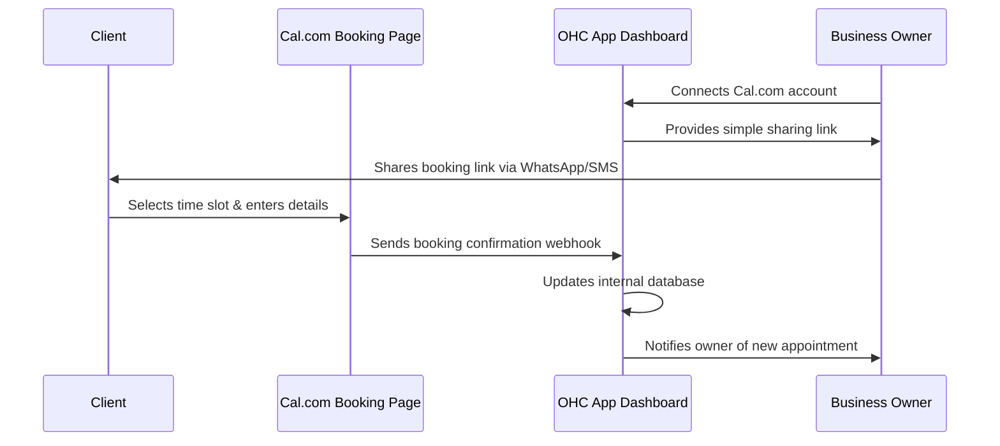

# Title: Unified Appointment Scheduling and Omnichannel Inbox Integration

## Problem Statement
Small business owners like Fatima often juggle multiple apps to run their business. They lose track of customer messages scattered across WhatsApp, Instagram DMs, and Facebook (leading to missed sales), and they waste hours going back and forth trying to find mutually agreeable times for appointments or consultations. These business owners are non-technical; they need a single, simplified dashboard where they can see all their customer messages in one place and allow customers to easily book available time slots without manual intervention.

## Research Report

During this research phase, I evaluated several tools across key categories to determine the best integrations for OHC users in both Cloud and Standalone environments.

### 1. Calendar & Scheduling

**Tool Evaluated: Cal.com**
*   **What problem it solves for which persona**: Allows service-based business owners (like tutors or salon owners) to share a link where clients can book open time slots automatically.
*   **How it would appear to the business owner**: A simple "Appointments" tab where they can copy their booking link and see a list of upcoming meetings. No need to understand calendar sync protocols.
*   **Key advantages and risks**: Open-source, extremely customizable, and integrates directly into white-label platforms. The main risk is the complexity of managing timezone edge cases if the business owner operates internationally.
*   **Rough pricing estimate**: Generous free tier for individuals; team plans start around $12/user/month.
*   **Cloud and Standalone support**: Yes. Cloud can use their managed API; Standalone users could potentially self-host it or use personal API keys.

**Tool Evaluated: Calendly**
*   **What problem it solves for which persona**: Same as above, widely recognized by clients.
*   **How it would appear to the business owner**: Similar connection flow, but potentially feels more like a third-party app.
*   **Key advantages and risks**: High brand recognition. Risk is the restrictive free tier which limits users to a single event type, frustrating small business owners.
*   **Rough pricing estimate**: Free basic plan; premium starts at $10/user/month.
*   **Cloud and Standalone support**: Yes, though API access often requires paid tiers.

### 2. Social Media Integration

**Tool Evaluated: Chatwoot**
*   **What problem it solves for which persona**: Consolidates WhatsApp, Instagram, Facebook, and Email into a single inbox so owners don't miss inquiries.
*   **How it would appear to the business owner**: A "Unified Inbox" screen in OHC. They read and reply to messages exactly like they do on their phone, without knowing which underlying API is sending the message.
*   **Key advantages and risks**: Open-source, excellent omnichannel support. Risk is that Meta API changes frequently require maintenance.
*   **Rough pricing estimate**: Free community edition; managed cloud starts around $19/month.
*   **Cloud and Standalone support**: Yes. Perfect for Standalone (can run locally) and Cloud.

### 3. Payment Processing

**Tool Evaluated: Mercado Pago**
*   **What problem it solves for which persona**: Processing payments for LATAM-based small businesses where credit card penetration is lower and local payment methods (like PIX in Brazil) are necessary.
*   **How it would appear to the business owner**: A simple "Get Paid" button that generates a payment link or QR code to send to customers.
*   **Key advantages and risks**: Dominant in LATAM, high trust. Risk is that it is region-specific, requiring OHC to support multiple gateways depending on the user's country.
*   **Rough pricing estimate**: Typically around 3.99% + fixed fee per transaction, varies by country.
*   **Cloud and Standalone support**: Yes, API works across both environments.

**Recommendation**: The highest immediate value for our users lies in solving the scheduling nightmare. The following Design Doc focuses on integrating **Cal.com** as our primary scheduling infrastructure.

## Design Doc

The integration will introduce a seamless scheduling experience within OHC, backed by Cal.com.

*   **Triggers**: The owner connects their calendar. Clients clicking the owner's booking link triggers the scheduling flow.
*   **Actions**: OHC listens for booking webhooks, automatically populates the owner's dashboard with the new appointment, and dispatches a confirmation notification (e.g., via SMS) to the client.
*   **User View**: A clean, centralized "Appointments" view showing upcoming bookings. Advanced API settings and webhook configurations will be strictly hidden behind an "Advanced Settings" toggle to adhere to the Progressive Disclosure pattern.

## Implementation Prompt

Implement the Cal.com scheduling integration into the OHC application.
1.  Add a user-facing authorization flow where a business owner can easily link their Cal.com account.
2.  Provide a dashboard view that lists upcoming appointments synced seamlessly from Cal.com.
3.  Ensure that when a customer books a new time slot, the appointment automatically reflects in the OHC dashboard.
4.  Follow the Progressive Disclosure pattern by hiding all complex configurations (like API keys or manual webhook setups) behind an "Advanced Toggle."
5.  The integration must be fully functional in both Cloud (multi-tenant) and Standalone modes.

## Priority
P1

## Estimated Scope
Medium
