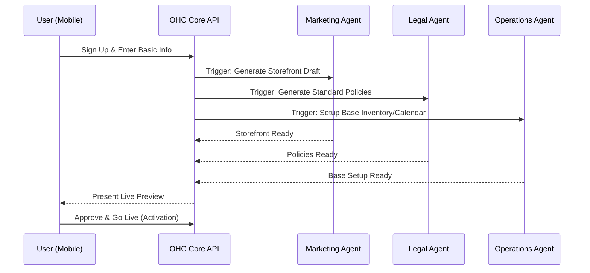
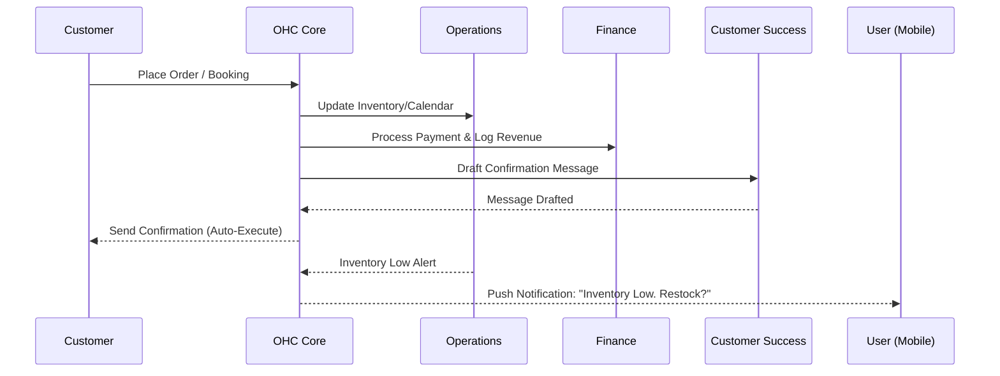

# [architecture] Business Journey Architecture: End-to-End Persona Flow

## Title
End-to-End Business Journey Architecture for OHC Personas

## Problem Statement
Small business owners (our core personas: Maya, Carlos, Priya, Leo, Fatima) have vastly different operational needs but share a common barrier: a lack of technical expertise. Current platforms (Shopify, Wix, Squarespace) force these users through complex, one-size-fits-all onboarding flows that require technical knowledge (DNS setup, theme configuration, plugin installation). This causes high abandonment rates during setup. Once active, users struggle to retain momentum due to the manual overhead of managing inventory, marketing, and customer communications across disparate tools. We need a unified architectural design that models the end-to-end journey (Acquisition, Onboarding, Activation, Retention, Revenue, Referral) for all business types, demonstrating how AI agents seamlessly eliminate these friction points at every stage.

## Research Report
**Findings & Data:**
- **Abandonment Rate:** Industry data shows up to 70% of small business owners abandon traditional site builders within the first hour due to technical overwhelm.
- **Pain Points:**
  - *Setup:* "I don't know what a DNS record is."
  - *Operation:* "I forgot to update my inventory and had to cancel an order."
  - *Marketing:* "I don't have time to post on Instagram."
- **Competitive Analysis:**
  - *Shopify:* Powerful but requires apps/plugins to build a complete solution (e.g., booking apps, subscription apps), steep learning curve.
  - *Wix/Squarespace:* Easier drag-and-drop, but AI is limited to basic text/layout generation (reactive tools), lacking proactive operational intelligence.
  - *GoDaddy:* Fast setup but very rigid and lacks deeper business management capabilities.

**OHC Differentiation:**
OHC acts as a proactive "Teammate" rather than a passive "Tool". By organizing AI into functional "Departments" (Operations, Marketing, Sales, Customer Success, Finance, Legal, Advisory) that operate invisibly over the Teammate Mesh, OHC offloads the cognitive burden of running the business, leading to faster activation and higher long-term retention.

## Design Doc

### 1. Key Design Decisions & Rationale
- **Guided, Progressive Onboarding:** Only ask for the absolute minimum to create a presence (Business Name, Type, Core Offering). AI fills in the rest. Advanced configuration (custom domains, complex variants) is deferred until after the user sees value (Activation).
- **Mobile-First UX:** The entire journey, from onboarding to daily management, is optimized for a 375px mobile screen. Complex data (like analytics) is distilled into plain-language summaries by the Advisory Agent.
- **Agent Orchestration over Teammate Mesh:** Departments coordinate asynchronously via the Orchestrator. For instance, when an order is placed, Operations updates inventory, Finance tracks the payment, and Customer Success prepares a follow-up.
- **Draft-for-Review Approvals:** To build trust, high-risk agent actions (sending emails, publishing social posts) require a 1-tap mobile approval from the owner.

### 2. Journey Stages
- **Acquisition:** Users discover OHC via organic search (optimized by the GEO agent), targeted social ads, or viral referral links (e.g., Link-in-bio on TikTok).
- **Onboarding:** A conversational, wizard-based setup. "What do you sell?" -> "Cakes". The system generates a tailored storefront, standard terms (Legal Agent), and an initial product catalog in under 10 minutes.
- **Activation:** The user receives their first order or booking. This is the "Aha!" moment.
- **Retention:** Daily engagement is driven by proactive notifications. The Advisory agent pushes a simple morning briefing: "You have 3 cake orders today. Should I draft an Instagram post for your new vegan option?"
- **Revenue:** Upsell to paid tiers is contextual. E.g., when the user hits the 100-action limit or wants a custom domain, a friendly prompt suggests upgrading.
- **Referral:** Built-in sharing tools (QR codes, personalized links) generated by the Marketing Agent make it easy for owners to promote their business, inherently promoting OHC.

### 3. Architecture Diagrams (Mermaid.js)

#### 3.1 Onboarding & Activation Sequence

#### 3.2 Order Lifecycle & Department Coordination

### 4. Mobile UX Flow (375px First)
1. **Welcome Screen:** Large, friendly typography. "Let's build your business."
2. **Conversational Input:** Single-input screens. "What's the name of your business?", "What do you offer?" (Large touch targets >= 44x44px, using native keyboards).
3. **The Magic Moment:** A loading state with premium Glassmorphism effects while AI agents generate the site.
4. **Live Dashboard:** A clean, prioritized feed.
   - Top: "Action Required" (e.g., Approve draft email).
   - Middle: "Today's Briefing" (Plain text summary: "$120 earned today").
   - Bottom: Quick Actions (Add product, Share link).
5. **No complex nav:** Avoid deep hierarchical menus. Use a simple bottom tab bar (Home, Orders, Messages, Settings).

### 5. AI Agent Integration Points
- **Onboarding:** Marketing agent creates layout and copy; Legal agent drafts policies.
- **Daily Operations:** Operations agent monitors stock/bookings and flags anomalies.
- **Customer Interaction:** Customer Success agent reads incoming DMs and drafts replies based on the `autodream_memories` vector DB.
- **Growth:** Advisory agent analyzes weekly data and suggests concrete actions (e.g., "Run a weekend promo").

## Implementation Prompt
**For the Implementer Agent:**
Implement the "Guided Business Onboarding Wizard" flow in the backend API and database.
- **User-Facing Outcome:** A new user can hit a single endpoint, provide basic business details (name, category, description), and the system asynchronously orchestrates the AI departments to create a `Tenant`, generate a storefront configuration, and set up base policies, returning a "Ready" state within minutes.
- **CUJ (Critical User Journey):**
  1. User submits basic profile.
  2. The system provisions tenant isolation boundaries.
  3. The Orchestrator dispatches events to Marketing (storefront), Operations (catalog/calendar), and Legal (policies) agents.
  4. User views the dashboard showing the finalized, ready-to-use business setup.
- **Acceptance Criteria:**
  - Must define the API payload for the onboarding request.
  - Must dispatch appropriate events to the Teammate Mesh for AI agent processing.
  - Must handle asynchronous generation, providing a status endpoint to poll for completion.
  - Must include comprehensive E2E tests verifying the full flow from request to tenant provisioning and event dispatch.
*(Note: Do not prescribe specific database schemas or internal function signatures. Design the internal implementation based on this requirement.)*

## Priority
P0 (Critical) - Onboarding is the highest drop-off point and the first impression of the OHC platform.

## Estimated Scope
Large - Involves core orchestration logic, tenant provisioning, and asynchronous agent coordination.
