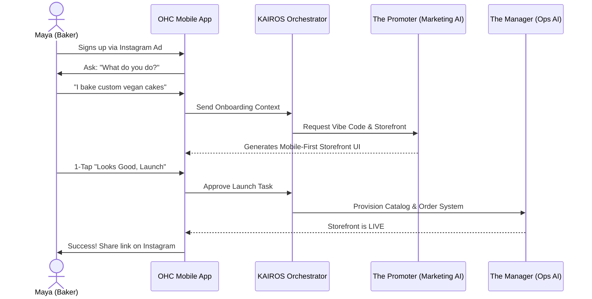
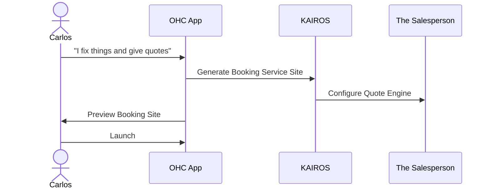
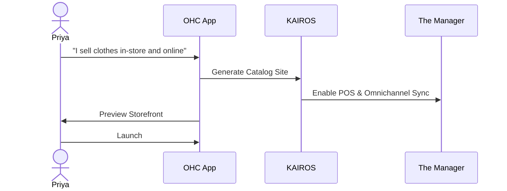
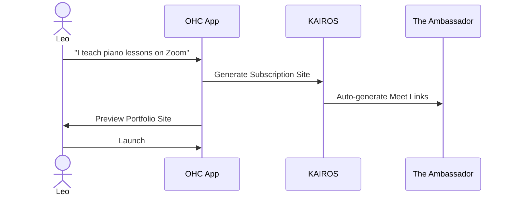
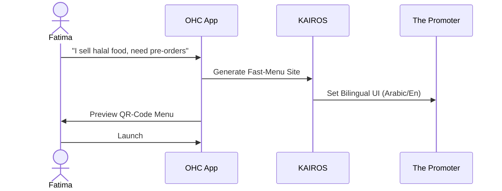

# [architecture] End-to-End Business Journey & AI Orchestration Architecture

## Title
End-to-End Business Journey and AI Orchestration Architecture

## Problem Statement
The OHC platform must serve a diverse set of real-world small business owners (e.g., Maya the Baker, Carlos the Handyman, Priya the Boutique Owner, Leo the Music Tutor, and Fatima the Food Cart Operator) who share a common goal: launching and growing their business entirely from a mobile device without technical expertise. The overarching business journeys—from initial acquisition to sustainable revenue generation and referral loops—must feel like magic, hiding all technical complexity behind friendly AI agents. Without a unified architectural map, we risk introducing friction points where non-technical users might abandon the platform before reaching their "Aha!" activation moment.

## Research Report
### Context and Competitive Analysis
We evaluated the business journey against leading platforms:
- **Shopify & WooCommerce:** Excellent for established businesses, but require significant technical configuration (DNS, themes, payment gateways) that alienate low-tech users.
- **Wix & Squarespace:** Provide decent visual builders but still expose users to too much complexity ("Sections", "Blocks", "SEO Settings"). The mobile-first editing experience is often clunky.
- **GoDaddy:** Fast domain registration but upsells confuse users.
- **OHC Advantage:** True "Zero to Live" in under 10 minutes from a mobile phone (375px viewport). The app acts as an invisible agency, doing the work for the user rather than providing them tools to do it themselves.

### Real User Personas & Journey Scope
- **Maya (28, Baker):** Low-Medium tech (IG Native). Needs storefront, deposit-based orders, IG DM agent.
- **Carlos (42, Handyman):** Low tech (Mobile only). Needs service listings, quote generation, booking calendar.
- **Priya (35, Boutique Owner):** Medium tech. Needs omnichannel sync, variants, in-person tap-to-pay.
- **Leo (22, Music Tutor):** High tech. Needs subscriptions, calendar sync, auto-generated meeting links.
- **Fatima (50, Food Cart):** Low tech (Limited English). Needs pre-order menu, bilingual UI, phone notifications.

## Design Doc

### 1. Architecture Diagram (Mermaid.js)

### 2. UI Wireframes & Screen Flow Description (375px First)
1. **Acquisition/Onboarding Screen:** A simple chat-like interface. Large text: "Tell us about your business." Native mobile keyboard optimized for text input.
2. **Activation Screen:** A full-screen preview of the generated storefront. Uses Glassmorphism, crisp typography (Outfit/Inter). A single primary floating action button (FAB) at the bottom (≥ 44x44px): "Launch My Business."
3. **Retention Dashboard:** After launch, the home screen is a clean feed of AI agent actions and business metrics. "The Manager" card shows "2 Pending Orders", "The Ambassador" card shows "1 Message Draft to Review".

### 3. Mobile UX Flow
- **Offline Support:** All inputs (like drafting a new cake product or a service quote) are saved locally via SQLite and optimistic UI updates.
- **Background Sync:** The KAIROS Orchestrator syncs changes gracefully when connectivity is restored, avoiding blocking loaders.
- **Grandmother Test:** No jargon. Labels use plain language ("Website Link" instead of "CNAME", "Launch" instead of "Deploy").

### 4. AI Agent Integration Points
- **The Manager (Operations):** Monitors the shared task list for `tenant.order.placed` events. Instantly reserves inventory and triggers fulfillment tasks.
- **The Promoter (Marketing):** Triggered during onboarding to synthesize the storefront layout based on the user's bio (Vibe Coding).
- **The Ambassador (Customer Success):** Listens to `tenant.message.received`. Drafts a polite response and places it in a `draft-for-review` state for 1-Tap Approval by the owner.

### 5. Key Design Decisions and Why
- **Deferred Complexity:** We strictly defer custom domain setup and payment gateway API configurations until *after* the activation milestone. This ensures high conversion rates.
- **1-Tap Approval:** High-risk AI actions (like sending quotes or emails) are never auto-executed. They are placed in a queue for user review to build trust without adding cognitive load.
- **Strict Tenant Isolation:** All data models include `tenant_id` to enforce RLS (Row Level Security), guaranteeing privacy in our shared-schema database.

## Implementation Prompt
**To Implementer Agent:**
Implement the end-to-end "Zero to Live" onboarding flow for the mobile app (targeting a 375px viewport first). Build the chat-like onboarding UI that captures the business description and passes it to the Orchestrator. Implement the optimistic UI rendering of the AI-generated storefront preview, and wire up the "Launch" button to transition the business state to live. Ensure all interactions utilize OHC premium design tokens (Glassmorphism, Outfit/Inter typography) and provide a skeleton loading state (shimmer effect) while the Orchestrator prepares the backend resources. Include comprehensive Playwright E2E tests covering the full flow from the first input to the final live storefront.

## Priority
P0

## Estimated Scope
Large

### Extended Persona Journeys

**Carlos (Handyman) Journey**

**Priya (Boutique Owner) Journey**

**Leo (Music Tutor) Journey**

**Fatima (Food Cart) Journey**

