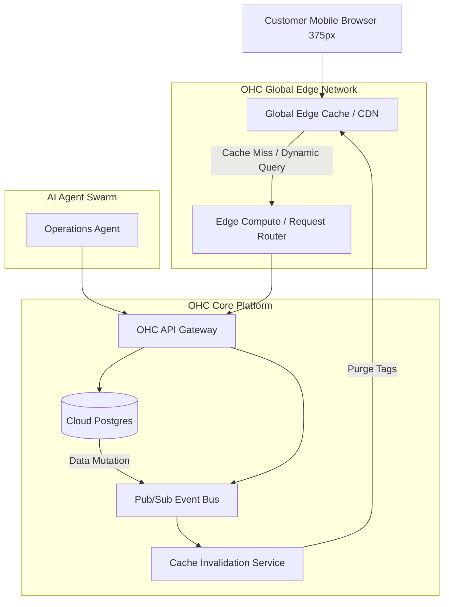

# [Architecture] High-Performance Edge-Caching Dynamic Storefronts

## Problem Statement
Small business owners like Maya (the baker) and Priya (the boutique owner) share links to their storefronts on Instagram, TikTok, and via SMS. When a viral moment happens, or even during a busy holiday weekend, their storefronts need to load instantly. If a customer clicks a link in Maya's Instagram bio and sees a loading spinner for more than a few seconds, they bounce. They need a storefront that is blazingly fast everywhere in the world, works smoothly on mobile, and instantly reflects changes when Maya updates her cake menu or when an item sells out—without requiring them to understand what a CDN or caching is.

## Research Report
**Competitor Systems Audit:**
- **Shopify:** Utilizes a globally distributed edge network with aggressive caching for its liquid templates, ensuring storefronts load quickly globally. However, updating heavily cached content can sometimes experience slight delays unless explicitly purged.
- **Wix / Squarespace:** Good edge delivery, but heavily reliant on client-side JavaScript execution to render visual builders, which can lead to poorer Lighthouse performance scores and slower Time to Interactive (TTI) on low-end mobile devices.
- **Vercel / Next.js (Industry Standard for Edge):** Excellent edge computing and ISR (Incremental Static Regeneration), allowing instantaneous global reads while regenerating static assets in the background when data changes.

**Gaps Identified:**
OHC must provide a dynamic storefront that behaves like a statically built site for end-users (sub-100ms load times globally), but can instantly reflect inventory and menu changes made by the business owner. We lack an explicitly defined, multi-tenant edge-caching layer that seamlessly synchronizes our cloud Postgres ledger updates out to a global CDN network without requiring manual cache invalidations.

## Design Doc

### Architecture Diagram

### Mobile UX Flow (375px First)
1. **The Customer Click:** A customer taps Priya's boutique link on TikTok.
2. **Instant Paint:** The storefront loads within 50ms, served directly from a geographically close edge node. The UI employs smooth, glassmorphism cards.
3. **Dynamic Elements:** Real-time elements like "Only 2 left in stock" are injected dynamically by an edge worker or via a lightweight, asynchronous client-side fetch, without blocking the main visual render.
4. **The Merchant Update:** Priya opens the OHC mobile app and marks a dress as "Sold Out".
5. **Instant Invalidation:** The backend emits an inventory mutation event. The Cache Invalidation Service instantaneously purges the relevant tags at the edge. The next customer request fetches the fresh "Sold Out" state.

### AI Agent Integration Points
- **Operations Agent:** Monitors inventory levels. If an item is selling too fast and nearing stock-out during a viral traffic spike, it can preemptively activate "High-Demand Mode" (e.g., enabling queuing or heavier caching profiles) and notify the owner.
- **Marketing Agent:** Uses the high-performance edge analytics to report exactly which social media link drove the most rapid conversions.

### Key Design Decisions
- **Stale-While-Revalidate (SWR) & Tag-Based Invalidation:** The storefront relies on edge-level SWR. When a product is updated, a tag-based cache purge ensures only the affected tenant's product pages are invalidated, keeping the rest of the multi-tenant system fully cached.
- **Multi-Tenant Isolation at the Edge:** Requests are routed based on subdomain or custom domain. Edge workers resolve the tenant identity securely before rendering or serving cached content.
- **Zero Configuration for Merchants:** Caching, CDN purging, and edge routing are completely invisible to the user. There are no "Clear Cache" buttons in the OHC app.

## Implementation Prompt
Implement a high-performance edge-caching layer for dynamic user storefronts.
- **User-Facing Outcome:** Customer storefronts must load near-instantaneously globally, achieving top-tier performance scores (e.g., Google Lighthouse). When a merchant updates inventory or site content in the OHC app, the changes must be reflected on the live storefront immediately.
- **CUJ (Critical User Journey):**
  1. Customer visits a merchant's storefront URL and sees the cached, fast-loading page.
  2. Merchant updates a product's price or stock level in the OHC mobile app.
  3. The platform automatically triggers a targeted edge cache invalidation.
  4. The next customer visiting the storefront immediately sees the updated price/stock.
- **Acceptance Criteria:**
  - Storefront rendering must support edge caching with a high cache hit ratio.
  - Implement tag-based or targeted cache invalidation triggered by backend data mutations (e.g., inventory updates).
  - The solution must securely handle multi-tenancy at the edge, ensuring one merchant's cache purge does not affect others.
  - Strict adherence to the 375px mobile-first design system for the rendered output.
  - No caching terminology or configuration should be exposed to the merchant UI.

## Priority
P0

## Estimated Scope
Large
