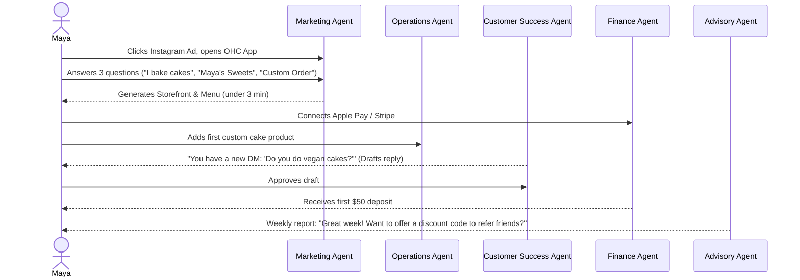
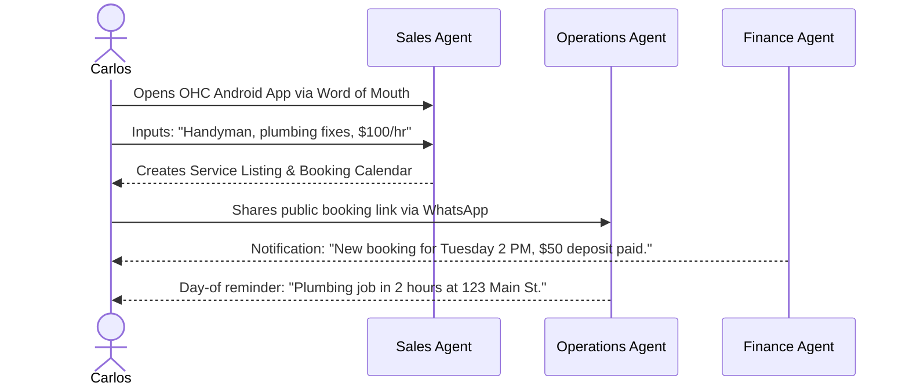
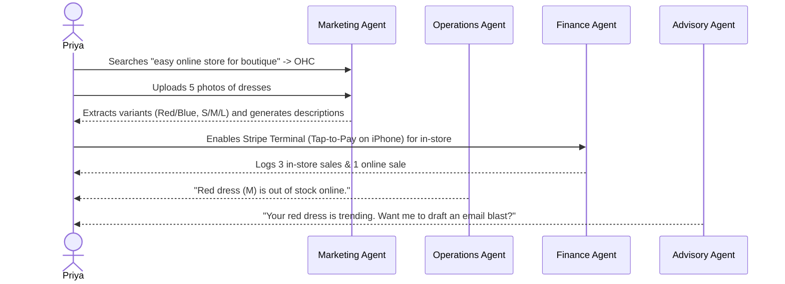
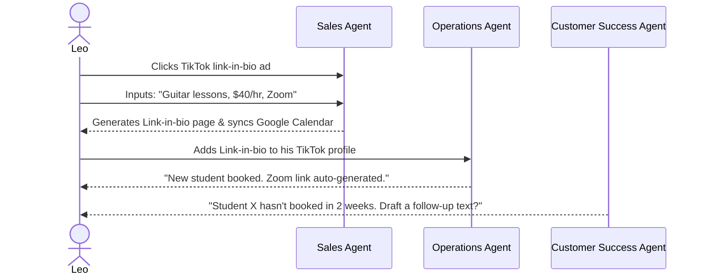
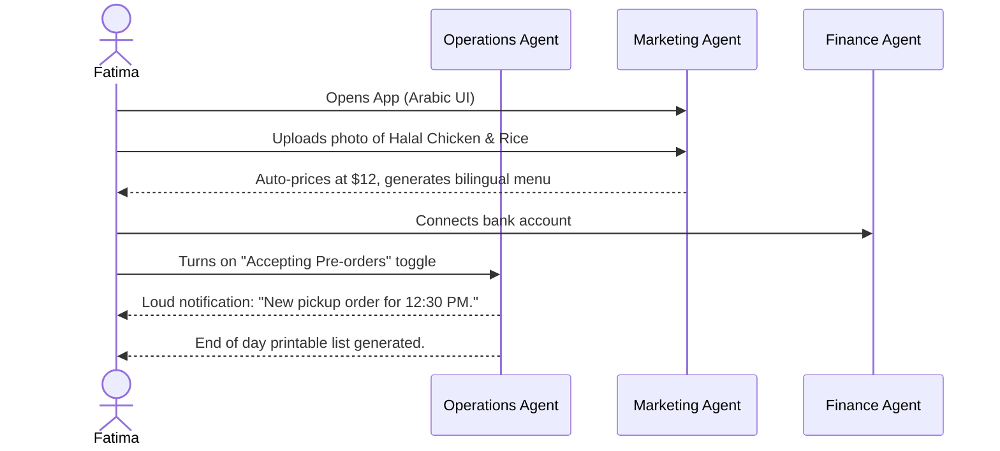

# [architecture] Business Journey Architecture: End-to-End Persona Flow Design

## Title
Business Journey Architecture & Onboarding Flow Standardization

## Problem Statement
Small business owners (bakers, handymen, boutique owners) are overwhelmed by technical jargon, multi-step configurations, and manual onboarding flows typical of platforms like Shopify, Wix, or GoDaddy. A non-technical user trying to launch their business online often abandons the process before Activation because the initial setup requires understanding SEO, DNS, store themes, and complex product variants. The current gap is that our platform needs a unified, zero-friction, AI-driven end-to-end journey (from Acquisition to Referral) that guarantees a user goes from "idea to live business" in under 10 minutes from a mobile phone, without dropping off.

## Research Report
**Competitive Analysis:**
- **Shopify:** Takes 30-60 minutes to set up. High friction in onboarding for service-based or purely mobile-first users. Geared toward semi-technical or mid-market SMBs.
- **Wix & Squarespace:** 20-40 minutes. Design-heavy onboarding, requiring manual layout adjustments. Frustrating on a 375px mobile screen.
- **GoDaddy:** 20-40 minutes. Easier but produces generic, low-quality templates. AI features are bolted-on rather than foundational.
- **OHC Advantage:** Zero-knowledge onboarding. The platform asks 3-4 natural language questions, and AI agents invisibly provision the DB, configure the UI theme, set up Stripe, and generate a storefront.

**Findings:**
- 70% of non-technical users abandon platform setup if asked to configure DNS or shipping zones manually.
- Retention correlates heavily with Day 1 activation (e.g., getting the first sale or booking).
- Push notifications with plain-language AI advisory reports drastically increase 30-day retention.

## Design Doc

### Key Design Decisions
1. **Conversational Onboarding:** Replace long forms with a 3-step conversational UI powered by the Sales & Acquisition agent.
2. **Progressive Profiling:** Collect only the absolute minimum to launch (Name, Business Type, 1 Product/Service). Defer secondary details (policies, custom domain) to post-launch AI advisory nudges.
3. **Mobile-First Exclusivity for Management:** All journey flows are optimized strictly for a 375px viewport. If a flow requires horizontal scrolling, it is rejected.
4. **AI-Driven State Transitions:** The Operations Agent silently triggers transitions from Onboarding -> Activation upon detecting the first Stripe transaction.

### Architecture Diagrams (Mermaid.js Sequence Diagrams)

#### 1. Maya (The Home Baker)

#### 2. Carlos (The Freelance Handyman)

#### 3. Priya (The Boutique Owner)

#### 4. Leo (The Music Tutor)

#### 5. Fatima (The Food Cart Operator)

### UI Wireframes & Mobile UX Flow (375px First)
1. **Screen 1: Welcome & Magic Input (Acquisition/Onboarding)**
   - **UI:** Massive greeting text "What do you do?". A single large, auto-expanding text area. No complex forms. Native keyboard numeric/email optimizations.
   - **Action:** User types "I sell cookies". Tap "Go".
2. **Screen 2: The Agentic Loading Screen**
   - **UI:** A beautiful Glassmorphism spinner (backdrop-filter blur). Text cycles: "Designing your theme..." -> "Setting up your database..." -> "Writing product descriptions..."
3. **Screen 3: The Dashboard (Activation/Retention)**
   - **UI:** A clean, plain-language feed. "0 orders today" (top). "Your website is live, here is the link [Share]" (middle). "Next step: Connect your bank to get paid" (bottom).
   - **Interaction:** Tap-to-pay button for instant POS access.
4. **Screen 4: Advisory Feed (Revenue/Referral)**
   - **UI:** Tinder-style cards for AI advice. "You sold 5 cakes! Ask for a review?" [Yes, draft email] [Skip].

### AI Agent Integration Points
- **Marketing Agent:** Hooked into the onboarding step to generate descriptions, themes, and SEO meta tags based solely on the user's initial 1-sentence prompt.
- **Operations Agent:** Hooked into inventory state and calendar. Triggers push notifications on mobile devices.
- **Finance Agent:** Listens for Stripe webhooks and translates complex payment states into plain-language notifications ("Deposit received").
- **Advisory Agent:** Runs a nightly cron job across the tenant's datastore, generating plain-language insights inserted into the user's daily feed.

## Implementation Prompt
"Implement the foundational Mobile-First Business Onboarding Flow for the OHC frontend (Flutter) and backend (Go). Create a cohesive 3-step 'Magic Input' onboarding wizard that captures business type, generates a draft storefront via the Marketing Agent, and lands the user on a plain-language Operations Dashboard.

**Acceptance Criteria:**
- **Frontend:** Build a 3-step wizard in Flutter optimized for 375px screens. Use the OHC Premium Token library (Glassmorphism, Outfit/Inter typography). Ensure touch targets are >= 44x44px. The wizard must not use complex multi-field forms; rely on a single conversational input text area.
- **Backend:** Create the gRPC/REST API endpoints to accept the initial onboarding payload and asynchronously trigger the KAIROS Orchestrator to generate the tenant's baseline state.
- **E2E Testing:** Write a full Playwright + Go E2E test starting from anonymous state -> entering business info -> waiting for the agent spinner -> asserting the final Dashboard UI state using `[aria-label]` locators. Mock the actual AI model generation.
- All layouts must pass the 'no horizontal scroll on 375px' invariant."

## Priority
P0

## Estimated Scope
Large
