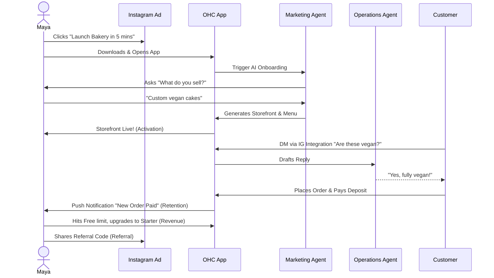
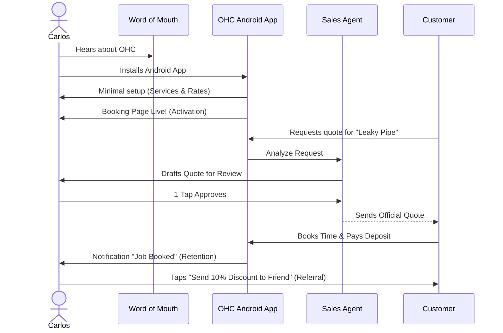
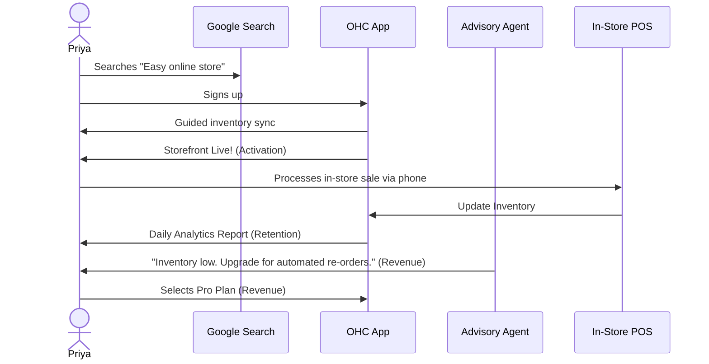
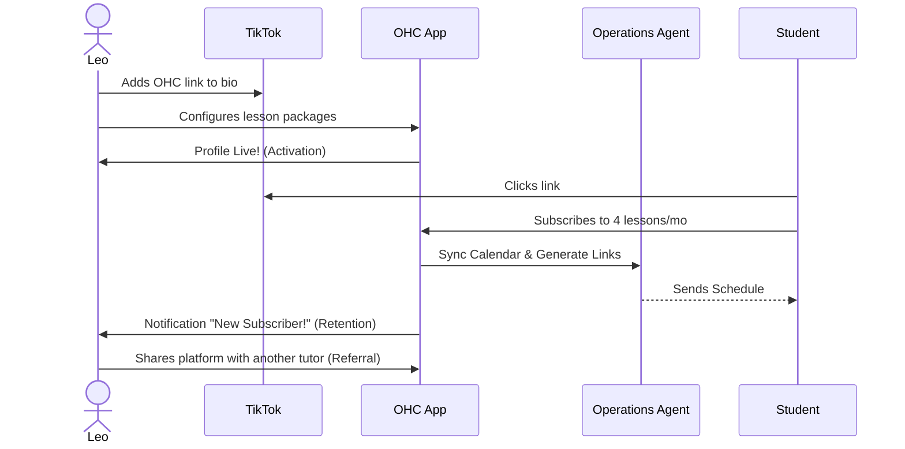
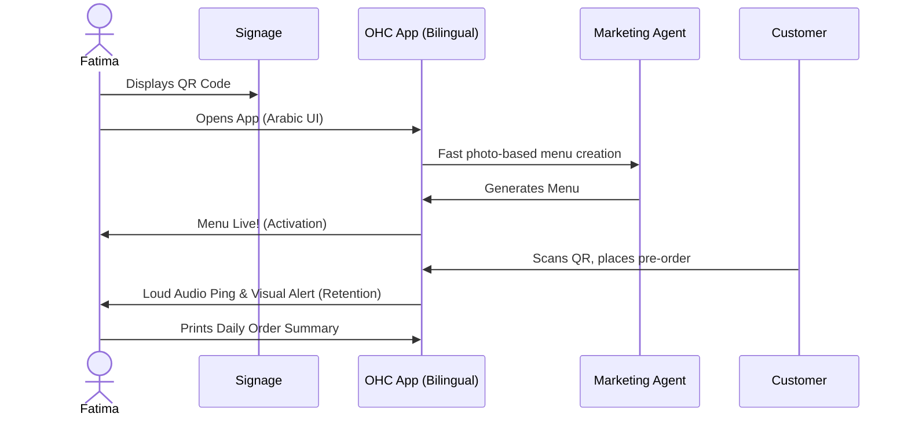

# Title
Architectural Map: End-to-End Business Journey for OHC Personas

## Problem Statement
The OneHumanCorp (OHC) platform aims to empower a diverse range of non-technical small business owners (e.g., Maya the Baker, Carlos the Handyman, Priya the Boutique Owner, Leo the Music Tutor, Fatima the Food Cart Operator) to launch and run their businesses entirely from their mobile devices. Currently, the overarching journeys from user acquisition through activation, retention, revenue generation, and referral are fragmented. There is no unified architectural map that guarantees users can achieve a live, functioning business in under 10 minutes without hitting cognitive overload or technical friction. A cohesive architectural vision of the business journey is required to ensure all platform features and AI agents operate synergistically toward owner success.

## Research Report
### Persona Context & Findings
1.  **Maya (Baker, 28)**: Needs seamless Instagram integration, a visual storefront for custom cakes, and AI-driven direct message handling.
2.  **Carlos (Handyman, 42)**: Operates strictly via an Android device. Needs service listings, simple booking/calendar, deposits, and AI-generated quotes.
3.  **Priya (Boutique Owner, 35)**: Requires omnichannel capability (online + in-store POS), inventory sync, and actionable daily analytics.
4.  **Leo (Music Tutor, 22)**: Needs subscription-based packages, auto-generated meeting links, and a strong TikTok link-in-bio presence.
5.  **Fatima (Food Cart Operator, 50)**: Needs a multi-language, ultra-simple interface for pre-orders and pickup management on a low-end Android device.

### Journey Stages
- **Acquisition**: Users typically discover OHC via Instagram/TikTok ads, word of mouth, or search. The CTA must promise "Live business in 5 mins."
- **Onboarding**: Must be a highly guided, AI-driven chat/wizard flow. Minimum inputs required: Business name, category, and primary goal (e.g., sell products vs. book services). Defer complex setup.
- **Activation**: The true "Aha!" moment. Achieved when the first product is added, the storefront is live, or the first payment is received (must occur by Day 1).
- **Retention**: Maintained via push notifications for real-time events (e.g., new order alerts) and weekly plain-language AI health reports.
- **Revenue**: Triggered when a user outgrows the Free tier (e.g., needs a custom domain, exceeds product limits). Upgrades must be presented contextually as business growth milestones, not hard errors.
- **Referral**: Driven by a viral loop (e.g., built-in referral codes, "Built with OHC" links in footers, rewards for successful referrals).

### Competitive Analysis
- **Shopify/Wix**: Overwhelming onboarding with complex terminology (DNS, shipping zones).
- **OHC Advantage**: Mobile-first, zero-configuration setup with background AI handling all technical lifting.

### Identified Friction Points
1. **Cognitive Overload**: Too many upfront form fields cause abandonment.
2. **Technical Jargon**: Terms like "SSL" or "Payment Gateways" deter non-technical users.
3. **Inventory Sync**: Difficulty mapping real-world physical availability to the digital system without intuitive design.
4. **Language Barriers**: Assuming high English proficiency and technical literacy alienates users like Fatima.

## Design Doc
### Key Design Decisions
- **Progressive Profiling**: Request only critical info upfront. Advanced settings are dynamically suggested by the Business Advisory Agent post-activation.
- **AI-First Setup**: The Marketing & Advertising Agent drives the initial layout and copy generation based on simple prompts.
- **Mobile-First UX**: All flows are designed strictly for a 375px viewport. Desktop views are progressive enhancements.
- **Optimistic UI & Async Processing**: Background agents handle tasks (like domain provisioning) asynchronously to keep the UI instantly responsive.

### Architecture Diagrams (Mermaid.js)

#### 1. Maya (The Home Baker)

#### 2. Carlos (The Handyman)

#### 3. Priya (The Boutique Owner)

#### 4. Leo (The Music Tutor)

#### 5. Fatima (The Food Cart Operator)

### UI Wireframes & Screen Flow (375px)
1. **Welcome Screen**: Single CTA ("Start My Business").
2. **AI Chat Wizard**: Chat interface. "Hi, I'm your Marketing Agent. What's the name of your business?"
3. **Generation Screen**: Glassmorphism shimmer loading state ("Building your storefront...").
4. **Dashboard**: Bottom navigation. Large 44x44px touch targets. Key metrics (Orders, Messages) prominently displayed.

### Mobile UX Flow
- Native keyboard mapping (numeric for pricing, email for contacts).
- Optimistic updates for all actions (e.g., toggling an item to "Sold Out" immediately updates the local UI while background syncs happen).

### AI Agent Integration Points
- **Marketing & Advertising**: Drives onboarding layout and auto-creates content blocks.
- **Operations & Sales**: Drafts customer replies and quotes, pushing them to the dashboard for 1-tap approval.
- **Business Advisory**: Monitors usage and contextually suggests revenue tier upgrades.

## Implementation Prompt
Implement the foundational unified user onboarding flow and dashboard state management supporting the transition from Acquisition to Activation.
1. Build the mobile-first (375px) AI-driven onboarding wizard UI.
2. Implement progressive profiling so users provide minimal data upfront, deferring complex settings.
3. Ensure the final step generates a live storefront/booking page.
4. Integrate the initial AI Agent "1-Tap Approval" interface for the Operations agent on the dashboard.
Acceptance Criteria: A non-technical user can complete the signup flow and view their generated storefront within 10 minutes. The UI must use premium design tokens and optimistic updates.

## Priority
P0

## Estimated Scope
Large
