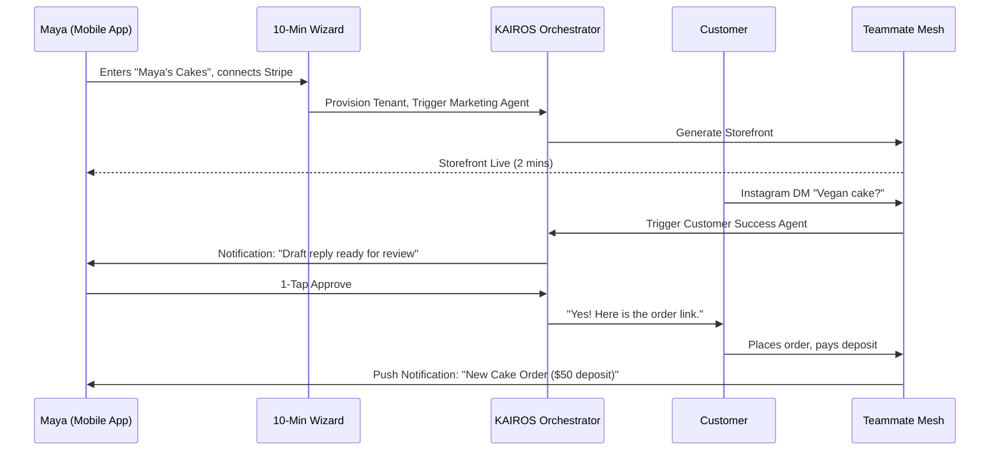
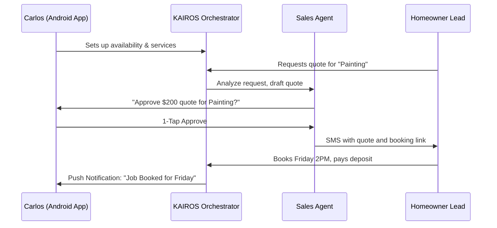
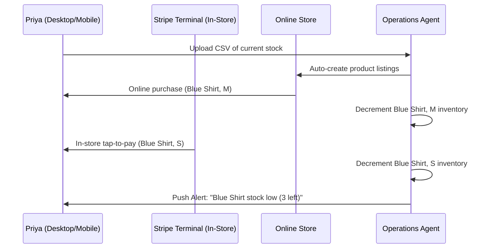
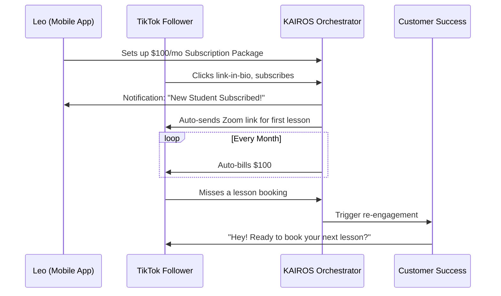
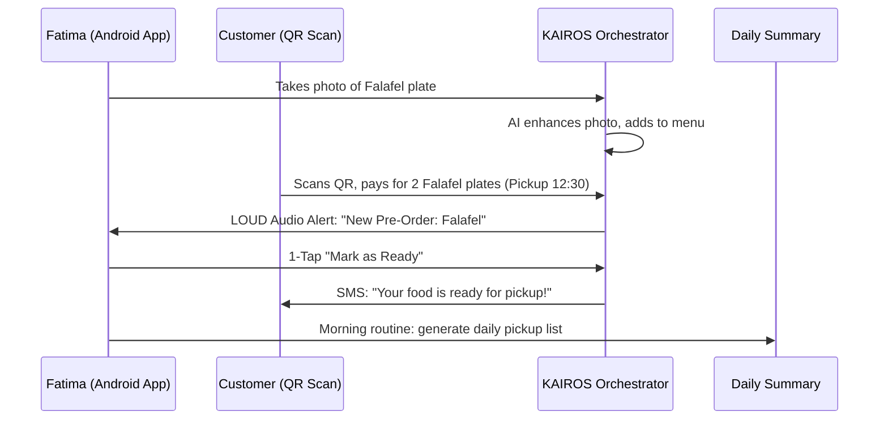

# OHC Business Journey Architecture

## 1. Executive Summary

This document details the complete end-to-end user journeys for the primary OneHumanCorp (OHC) business personas: Maya (Baker), Carlos (Handyman), Priya (Boutique Owner), Leo (Music Tutor), and Fatima (Food Cart Operator). The goal of this architecture is to map their path from discovery to successful platform evangelism, emphasizing radical simplicity, AI automation, and mobile-first interactions that require zero technical knowledge.

---

## 2. Persona User Journeys & Sequence Diagrams

### 2.1 Maya — The Home Baker (28, Non-Technical, Mobile Only)
Maya runs her custom cake business entirely from her iPhone. She needs a beautiful storefront and a way to handle custom deposits without getting bogged down in Shopify's complexity.

* **Acquisition**: Discovers OHC via a targeted Instagram ad emphasizing "Take custom cake orders without a website." CTA: "Start in 3 minutes."
* **Onboarding**: Enters business name and basic details into the 10-Minute Wizard. The AI operations and marketing agents auto-generate a glassmorphic catalog template. Connects Stripe with 2 taps.
* **Activation**: Adds her first product ("Custom 3-Tier Cake") with a 50% deposit requirement. A customer places an order successfully.
* **Retention**: Daily push notifications for new orders. The Customer Success agent drafts replies to her Instagram DMs ("Do you do vegan cakes?").
* **Revenue**: Upgrades to the **Starter Tier ($9/mo)** after reaching her 100th AI action to maintain the automated DM replies and get a custom domain.
* **Referral**: Other bakers see her streamlined "Link in Bio" and ask what platform she uses.

### 2.2 Carlos — The Freelance Handyman (42, Non-Technical, Android Only)
Carlos gets work purely through word of mouth but loses track of texts while working.

* **Acquisition**: Word-of-mouth from another tradesperson. Searches for OHC on his mid-range Samsung phone.
* **Onboarding**: Minimal text inputs. Chooses a clean, professional service listing template. Sets up calendar availability and connects bank info.
* **Activation**: A homeowner uses Carlos's public page to book a Friday slot for "Plumbing Fixes" and pays the deposit.
* **Retention**: Checks his unified customer inbox to see all leads. The Sales Agent auto-follows up with prospects who asked for quotes but didn't book.
* **Revenue**: Upgrades to **Pro ($29/mo)** because he needs unlimited AI actions to handle the volume of automated SMS quotes.
* **Referral**: Mentions how easy the platform is to his electrician friend at the hardware store.

### 2.3 Priya — The Boutique Owner (35, Semi-Technical, Mac + iPhone)
Priya has a physical store and wants to expand online seamlessly without managing two inventories.

* **Acquisition**: Organic search for "Sync physical store inventory with online store easy."
* **Onboarding**: Uploads inventory spreadsheet. AI Operations agent maps product variants (Size S/M/L, Color). Connects Stripe Terminal for in-person tap-to-pay.
* **Activation**: Makes her first online sale and her first in-store tap-to-pay sale on the same day. Inventory decrements globally.
* **Retention**: Logs into the desktop dashboard every morning to view plain-language analytics generated by the Business Advisory Agent.
* **Revenue**: Upgrades to **Pro ($29/mo)** for unlimited products and advanced multi-channel analytics.
* **Referral**: Recommends the platform to a fellow business owner at a local Chamber of Commerce meeting.

### 2.4 Leo — The Music Tutor (22, Non-Technical, TikTok First)
Leo teaches guitar online and needs a way to monetize his TikTok following with recurring subscriptions.

* **Acquisition**: Sees a comparison of link-in-bio tools on TikTok where OHC is praised for handling subscriptions natively.
* **Onboarding**: Creates a creative portfolio page with a video intro. Sets up a monthly recurring lesson package.
* **Activation**: His first student subscribes to the "4 Lessons/Month" package. The system auto-generates Zoom links for each session.
* **Retention**: Uses the built-in AI Marketing agent to draft social media posts. Relies on auto-follow-ups for inactive students.
* **Revenue**: Starts on **Starter ($9/mo)** immediately to use his custom domain (`leoguitar.com`).
* **Referral**: Does a TikTok breakdown of how much money he makes, casually dropping the OHC platform name.

### 2.5 Fatima — The Food Cart Operator (50, Non-Technical, Limited English)
Fatima needs a dead-simple way to handle pre-orders for pickup without language barriers.

* **Acquisition**: Local community rep or flyer in her neighborhood.
* **Onboarding**: Uses the Arabic language UI. Snaps photos of her dishes. AI Marketing agent auto-enhances the photos and structures the menu.
* **Activation**: A customer scans the QR code taped to her cart and pre-orders a meal. Fatima's phone rings with a loud, custom notification.
* **Retention**: Uses the daily summary feature to print a consolidated list of all pickup orders. Uses the "Sold Out" toggle frequently.
* **Revenue**: Uses the **Free ($0/mo)** tier, happily paying the slightly higher transaction fee because the value is immense.
* **Referral**: Another food cart owner next to her asks how she avoids long lines, and she shows them the app.

---

## 3. Friction Point Analysis & Mitigation

Where might these non-technical users abandon the flow, and how does the architecture prevent it?

1. **Friction: Empty State Paralysis (Onboarding)**
   - *Risk:* Maya doesn't know how to design a website. She stares at a blank canvas and quits.
   - *Mitigation:* The 10-Minute Wizard. OHC uses generative AI to fully build the first draft of the site based on 3 simple text inputs (Name, Industry, Vibe). There is no "blank canvas."

2. **Friction: The Stripe/Payment Hurdle (Activation)**
   - *Risk:* Carlos finds entering banking information scary or complex.
   - *Mitigation:* OHC frames this as "Where should we send your money?" rather than "Configure Payment Gateway." We use Stripe Connect with the simplest possible onboarding flow embedded directly in the mobile app.

3. **Friction: Notification Overload (Retention)**
   - *Risk:* Priya gets annoyed by too many separate alerts for every minor AI action.
   - *Mitigation:* The "Draft-for-Review" queue. AI actions are batched into a daily digest unless they are high-priority (like a direct customer question). The Business Advisory agent summarizes data rather than sending raw alerts.

4. **Friction: Technical Jargon (General)**
   - *Risk:* Fatima sees "Configure DNS Records" for her domain and abandons the upgrade.
   - *Mitigation:* The **Grandmother Test**. We handle DNS invisibly using OHC subdomains by default. Upgrading to a custom domain is a 1-click purchase through the app, with zero DNS configuration exposed to the user.

5. **Friction: Accidental AI Hallucination (Trust)**
   - *Risk:* Leo's Customer Success agent sends a poorly worded email to a student, breaking trust.
   - *Mitigation:* Explicit risk tiers. High-risk actions (external communications) ALWAYS require a 1-tap human approval on the mobile app until the user explicitly turns on "Auto-Pilot."

---

## 4. Proposed Next Steps

1. **Implement the 10-Minute Wizard Core Flow:**
   - Focus on the mobile-first UI for the onboarding wizard that collects the minimum data required to trigger the Marketing Agent's storefront generation.
2. **Develop the Unified Omnichannel Inbox:**
   - Centralize Instagram DMs, SMS, and Email into a single database view.
   - Wire the Customer Success agent to listen to this queue and generate draft responses.
3. **Build the Mobile Approval Queue ("Draft-for-Review"):**
   - Create the UI components for reviewing and 1-tap approving AI-generated actions (quotes, emails, social posts).
4. **Draft Analytics Engine for Business Advisory:**
   - Build the pipeline that aggregates daily metrics (sales, visits) and passes them to the Advisory Agent to generate plain-language weekly summaries (e.g., "Tuesday was your best day!").
