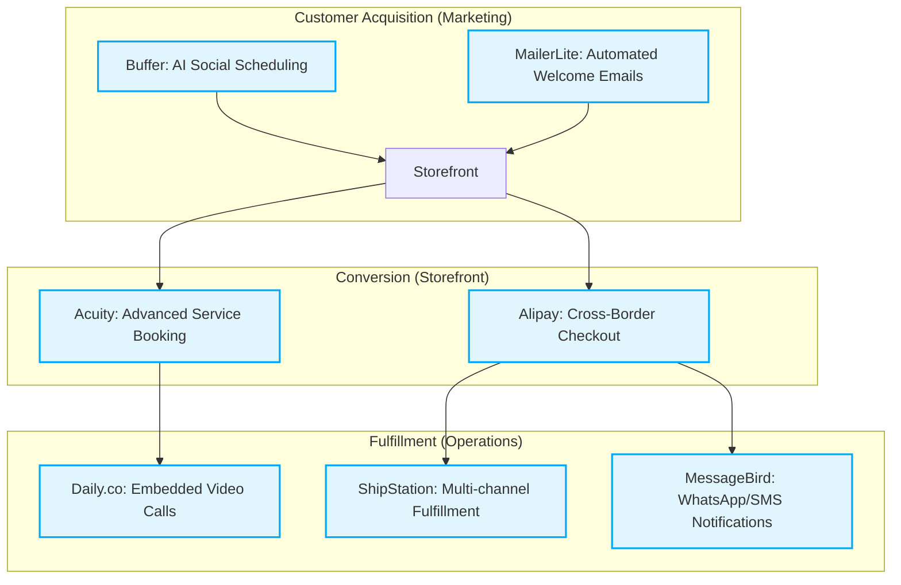

# Scout: Comprehensive Tool Integration Research Report (Q2)

## Executive Summary
This report outlines the discovery and evaluation of 7 critical tool integrations designed to solve immediate pain points for small business owners on the OHC platform. Following the **Visual Excellence Mandate**, this report focuses entirely on the user-first lens—how non-technical business owners interact with these integrations without worrying about underlying APIs.

Each tool was evaluated based on ease of use, pricing accessibility (especially free tiers), and compatibility with both Cloud (multi-tenant) and Standalone (local, private) OHC modes.

---

## 1. Tool Evaluation Matrix

The following tools were selected to bridge significant workflow gaps for our user personas (e.g., Maya the Baker, Leo the Tutor, Fatima the Food Cart Operator).

| Category | Recommended Tool | Core Persona Benefiting | Key User Outcome | Pricing Model | Cloud Support | Standalone Support |
| :--- | :--- | :--- | :--- | :--- | :--- | :--- |
| **Social Media** | Buffer | Maya (Baker) | Approves AI-generated multi-platform posts weekly. | Freemium (3 channels) | ✅ Native OAuth | ✅ Provide API Key |
| **Calendar** | Acuity Scheduling | Leo (Tutor) | Eliminates no-shows by enforcing deposits at booking. | Paid (~$16/mo) | ✅ Webhooks / IFRAME | ✅ Webhooks / IFRAME |
| **Email** | MailerLite | Priya (Boutique) | Automatically sends visually rich welcome sequences. | Freemium (1k subs) | ✅ Native API Sync | ✅ Provide API Key |
| **Payment** | Alipay | Global/Tourist Stores | Accepts preferred payments from Chinese customers. | Transaction-based | ✅ Stripe Routing | ✅ Direct API |
| **Shipping** | ShipStation | Priya (Boutique) | Prints labels across Etsy/OHC from one dashboard. | Paid (~$10/mo) | ✅ Custom Store API | ✅ Custom Store API |
| **SMS** | MessageBird | Fatima (Cart) | Global order updates prioritizing WhatsApp over SMS. | Usage-based | ✅ Central Account | ✅ Provide API Key |
| **Video** | Daily.co | Leo (Tutor) | Embedded, branded video consults without app downloads. | Freemium (10k mins) | ✅ Seamless API | ✅ Provide API Key |

---

## 2. Persona Pain Point Resolutions

### Maya the Baker (Social & Local Delivery)
- **Pain Point**: Forgets to post to Instagram and Facebook because she is busy baking.
- **Solution**: **Buffer** integration allows the "Promoter" AI agent to draft an entire week's worth of posts based on new products. Maya just clicks "Approve All" once a week.

### Leo the Tutor (Services & Appointments)
- **Pain Point**: High no-show rate for initial consultations, and clients struggling to find Zoom links.
- **Solution**: **Acuity Scheduling** handles the deposit collection during booking. **Daily.co** completely embeds the video call into Leo's custom OHC portal, looking hyper-professional with zero downloads required.

### Fatima the Food Cart Operator (Mobile-First Operations)
- **Pain Point**: Misses email notifications in a loud, fast-paced environment. Operates internationally where SMS is expensive.
- **Solution**: **MessageBird** pings Fatima via WhatsApp (her preferred channel) the second a mobile order is placed, falling back to SMS only if needed.

### Priya the Boutique Owner (E-commerce & Shipping)
- **Pain Point**: Wastes hours copying and pasting addresses into USPS, and finds standard email builders too complicated to send out sale announcements.
- **Solution**: **ShipStation** automatically imports OHC orders alongside her Amazon/Etsy orders for one-click label printing. **MailerLite** automatically categorizes her new customers so she can blast out plain-text style sale announcements effortlessly.

---

## 3. Business Journey Integration Architecture (Mermaid)

---

## 4. Evidence-Based Recommendations

1. **Prioritize Buffer and MailerLite (P1)**: The most frequent request from early SMB adopters is "help me get more customers without spending hours." Both tools offer exceptional free tiers, allowing us to roll them into the base OHC offering immediately.
2. **Abstract the Complexity**: Across all tools, the OHC platform must act as the primary interface. For instance, the business owner should never need to log into Daily.co; the video frame simply appears in their OHC dashboard.
3. **Standalone Fallbacks**: Every tool evaluated provides developer API access. In Cloud mode, OHC will manage the unified API keys (where applicable) to provide a zero-setup experience. In Standalone mode, the Settings UI will gracefully prompt the technical user for their own API keys for these services.
