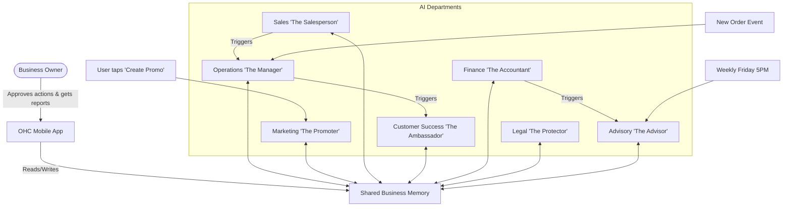

# [Scout] AI Agent Department Architecture

## Title
AI Agent Department Architecture: Organizing the Swarm into Friendly, Understandable Business Departments

## Problem Statement
As a small business owner, I don't want to think about "AI agents," "LLMs," or "prompts." I just want my business to run smoothly. Right now, managing different tasks—like checking inventory, following up on leads, making sure taxes are right, and posting on Instagram—feels like I'm juggling too many things at once. I want an invisible team that handles all the heavy lifting behind the scenes. I want to feel like I have a Manager, a Promoter, a Salesperson, an Ambassador, an Accountant, a Protector, and an Advisor, all working together to help my business succeed, without me needing to know how they do it.

## Research Report
Small business owners often abandon platforms that are too complex.
- **Shopify / Wix / Squarespace**: They offer hundreds of apps and plugins to do different things (like marketing, SEO, accounting). But this forces the owner to connect all these apps, pay multiple subscriptions, and figure out how they work together. It feels like building a machine rather than running a business.
- **GoDaddy**: Tries to simplify things but still requires manual effort for marketing and customer follow-ups.
- **OHC Approach**: We don't want an "App Store." We want "Departments." The business owner hires a team. The team is already trained and knows how to talk to each other.
When we evaluated the market, the biggest pain point for mobile-first users (like a food cart operator or an Instagram baker) is time. They operate entirely from a phone and need background tasks to happen automatically or with a simple "approve" button.

Cloud vs. Standalone compatibility: Our agent departments need to function seamlessly whether the business owner is connected to the cloud or running in standalone mode (like when a food cart is at a festival with bad internet). The actions they take must be saved and synced.

## Design Doc

### Architecture Diagram

### UI Wireframes & Screen Flow (375px First)
1. **Home Screen (The Desk):**
   - Glassmorphism cards showing "Needs Your Approval" and "What Your Team Did Today."
   - Subtle motion: Cards slide up gently (entrance < 300ms, cubic-bezier easing).
2. **Department Hub (The Team):**
   - A grid of friendly faces or icons representing the departments (e.g., The Manager, The Promoter).
   - Tapping a department shows its recent activity and a simple toggle: "Auto-Pilot" vs. "Review Everything."
3. **Approval Card (The 30-Second Rule):**
   - Example: The Ambassador drafted a reply to a customer asking about vegan cakes.
   - Screen shows: The customer's message, the drafted reply.
   - Two big buttons: "Send" or "Edit." Clean Outfit + Inter typography.

### Mobile UX Flow
- **Trigger**: The Salesperson generates a new quote.
- **Notification**: A push notification appears: "Your Salesperson drafted a quote for Carlos. Review?"
- **Action**: The user taps the notification, opening the app directly to the Approval Card.
- **Decision**: The user taps "Send." A success animation plays (exit < 200ms). The app goes back to the Home Screen.

### AI Agent Integration Points
- **Triggers**:
  - *On Event*: A new order comes in → Triggers Operations to check inventory. Operations finishes → Triggers Customer Success to text the customer.
  - *On Schedule*: Every Friday → Finance generates a weekly summary, Advisory reads it and suggests next week's focus.
  - *On Demand*: User asks, "Write an Instagram post about our new muffins" → Triggers Marketing.
- **Memory & Context**: All departments read from and write to a shared "Business Memory." If Marketing creates a promo code, Finance knows about it for the weekly report.
- **Approvals**: Every department can run in "Auto-Execute" mode (they just do it and log it) or "Draft-for-Review" mode (they prepare the action and wait for the owner's single tap to approve).
- **Throttling/Budgeting**: The owner has a monthly allowance of AI actions based on their tier. The system visually shows a "battery level" of AI energy. If it gets low, The Advisor suggests upgrading.

### Key Design Decisions
- **Friendly Naming**: We use terms like "The Manager" instead of "Operations Sub-Agent." This passes the grandmother test.
- **Shared Memory over Direct Chat**: Departments don't talk to each other like a chatroom; they read and write to the shared business memory. This prevents them from getting stuck in loops and keeps the state consistent.
- **Draft First by Default**: To build trust, new departments start in "Draft-for-Review" mode. The owner can switch them to "Auto-Execute" once they feel confident.

## Implementation Prompt
**Task**: Build the AI Department framework that orchestrates background tasks across our 7 departments (Manager, Promoter, Salesperson, Ambassador, Accountant, Protector, Advisor).
**User Journey**: Maya (a baker) gets a new DM asking for a custom cake. The Ambassador sees this, reads the shared memory to see that Maya is free next weekend, and drafts a reply with a quote. Maya gets a push notification, taps "Approve," and the message is sent. Later, the Manager updates the expected workload.
**Acceptance Criteria**:
1. The 7 departments must be definable in the system with their distinct roles.
2. Departments must be able to be triggered by events, schedules, or direct user requests.
3. Departments must be able to read from and write to a shared context (Business Memory).
4. Actions must support a "Draft-for-Review" state that halts execution until the business owner explicitly approves it via the mobile UI.
5. The system must track how many actions each department takes to enforce monthly tier limits.
6. The implementation must work identically in both Cloud and Standalone modes without prescribing the underlying transport.

## Priority
P0

## Estimated Scope
Large
