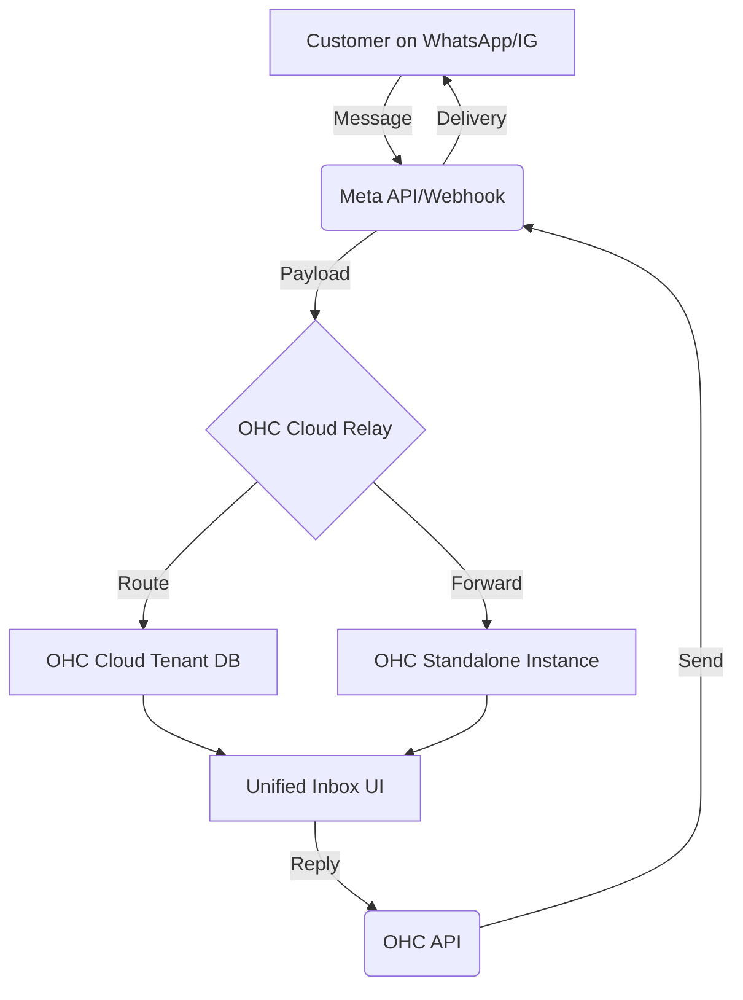
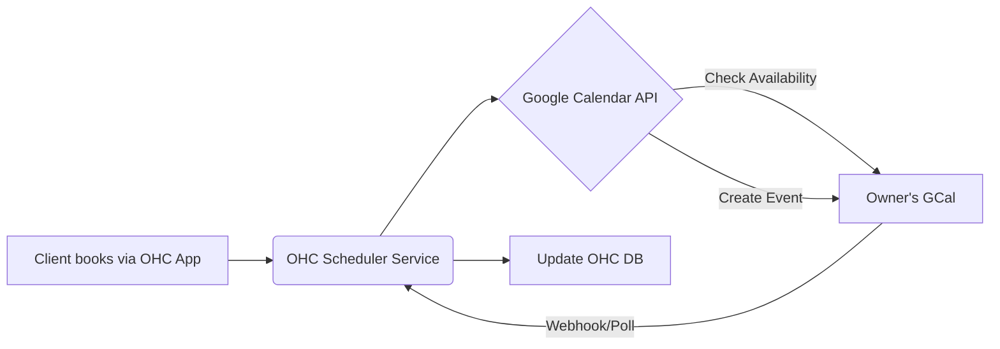
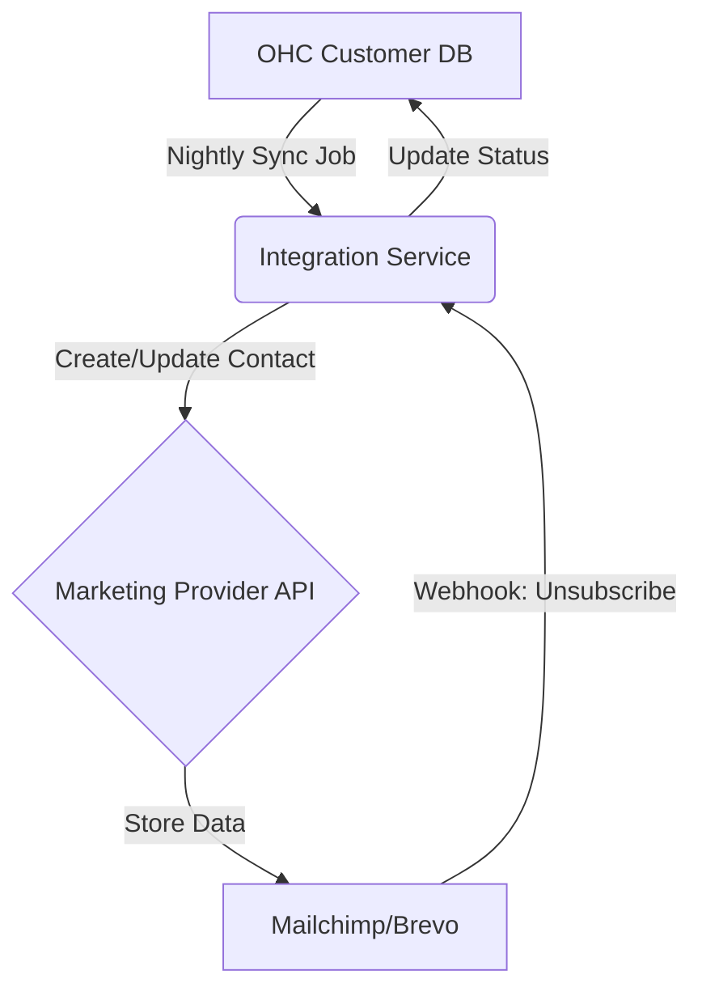
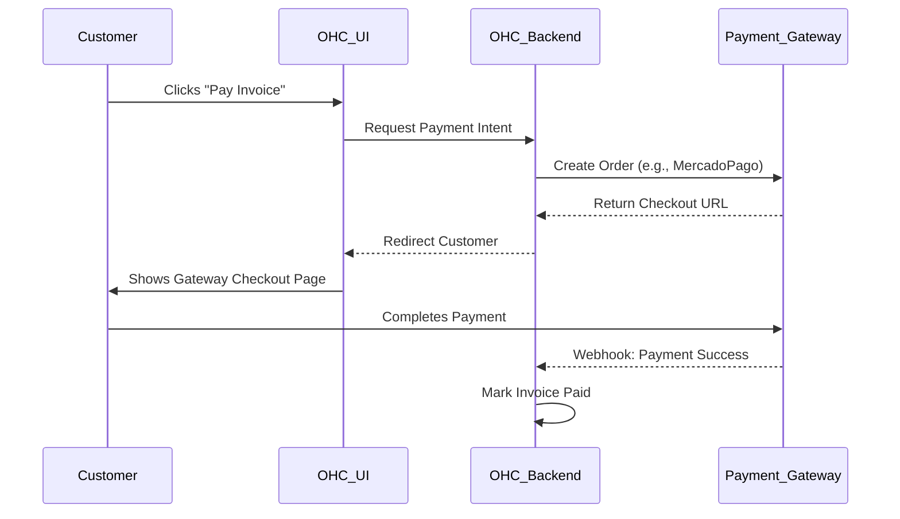
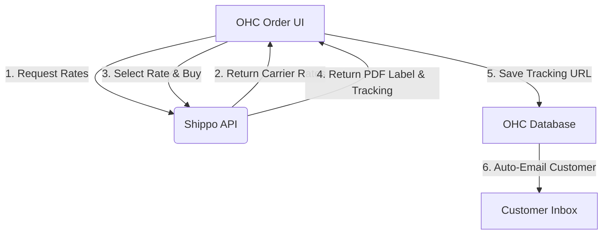
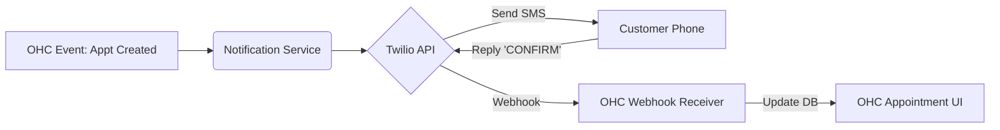
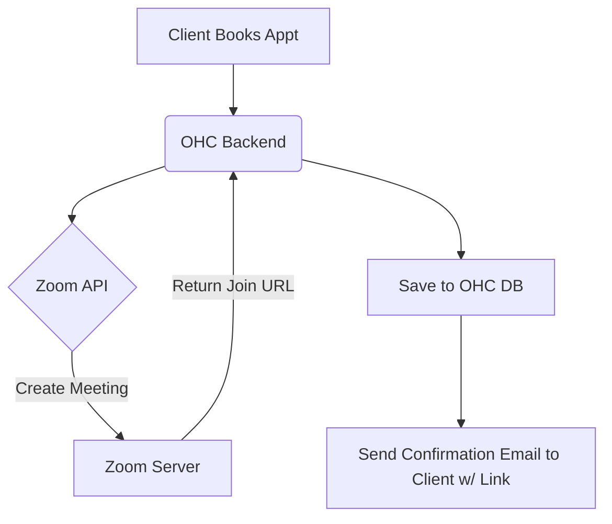

# 🔍 Scout: Tool Integration Research Q3

This report provides comprehensive research, evaluation, and structured issue briefs across 7 key tool categories relevant to OneHumanCorp's small business owners. The analysis prioritizes non-technical user experience, OHC Cloud/Standalone compatibility, and real-world utility over purely technical integration details.

---

## 1. Social Media Integration

**Overview:**
Small business owners receive a massive influx of customer inquiries via various social channels. Unifying these streams into a single manageable inbox reduces response times, prevents lost leads, and enhances customer satisfaction without requiring the business owner to juggle multiple apps.

### 1.1 Tool Evaluation: WhatsApp Business API
*   **Problem Solved:** WhatsApp is the primary communication tool in many regions (LATAM, India, Europe). Managing multiple customer conversations on a personal phone is error-prone and doesn't scale for a business.
*   **Business Owner Benefit:** All customer WhatsApp messages appear directly in the OHC platform. Owners can assign chats to team members and use pre-built replies for common questions.
*   **Integration Risks:** Meta's API restrictions and template approval process can be cumbersome. Handling multimedia (voice notes, images) requires robust storage.
*   **Pricing Estimate:** Meta charges per conversation (user-initiated vs. business-initiated). Typical costs are $0.01 - $0.08 per conversation depending on the region, plus potential partner markup (e.g., Twilio adds $0.005/msg).
*   **Mode Compatibility:**
    *   **Cloud:** Excellent (webhook-based).
    *   **Standalone:** Requires a cloud-relay or proxy to receive webhooks if the local instance isn't exposed to the internet.

### 1.2 Tool Evaluation: Instagram Direct Messages (Messenger API)
*   **Problem Solved:** Many small businesses (boutiques, consultants) acquire customers primarily through Instagram. Responding to DMs promptly is critical for conversion.
*   **Business Owner Benefit:** Instagram DMs flow directly into the OHC unified inbox. No need to hand over Instagram login credentials to staff; they can reply from OHC.
*   **Integration Risks:** Meta requires Facebook Page linkage to the IG Professional account, which is a notoriously confusing setup process for non-technical users.
*   **Pricing Estimate:** Generally free for standard messaging via the Messenger API, though volume limits apply.
*   **Mode Compatibility:**
    *   **Cloud:** Excellent.
    *   **Standalone:** Requires cloud-relay for webhooks.

### 1.3 Tool Evaluation: ManyChat
*   **Problem Solved:** Answering repetitive questions ("What are your hours?", "Do you have this in size M?") wastes valuable time.
*   **Business Owner Benefit:** Provides a visual, drag-and-drop builder for setting up automated chat flows on Instagram and Facebook before handing off complex queries to a human in OHC.
*   **Integration Risks:** ManyChat is an intermediary platform. Integrating OHC with ManyChat means dealing with their specific webhooks and data models, adding complexity.
*   **Pricing Estimate:** Pro plan starts at $15/month for up to 500 contacts, scaling with list size.
*   **Mode Compatibility:**
    *   **Cloud:** Good.
    *   **Standalone:** Requires cloud-relay.

### Social Media Integration Architecture



### [Social Media] Issue Brief: WhatsApp Business & IG Unified Inbox

*   **Title:** Unify WhatsApp and Instagram DMs into OHC Inbox
*   **Problem Statement:** Our small business owners are overwhelmed by constantly switching between WhatsApp on their phones and Instagram on their laptops to answer customer questions. They are dropping leads and losing sales because they can't keep track of who messaged them where. They need one simple screen to see and reply to all customer messages.
*   **Research Report:**
    *   **Findings:** WhatsApp and Instagram are the most critical channels. The Meta Graph API provides access to both via the WhatsApp Business API and Messenger API for Instagram.
    *   **Ease of Use:** The end-user experience (answering messages in OHC) is excellent. The setup experience is the biggest hurdle; Meta's onboarding flow for linking accounts is confusing. We must build a seamless, guided setup wizard to shield the user from Meta's complex developer console.
    *   **Pricing:** WhatsApp incurs per-conversation costs. We need a billing mechanism or a soft limit (e.g., 1000 free messages/mo) before passing costs to the user. Instagram DMs are largely free.
    *   **Reputation:** Meta APIs are standard but subject to sudden policy changes.
*   **Design Doc:**
    *   **Integration Flow:** The user visits "Settings > Integrations" and clicks "Connect WhatsApp/Instagram". A secure OAuth popup guides them through the Meta authorization process.
    *   **Action/Trigger:** When a customer sends a message to the business's WhatsApp/IG, a webhook is sent to the OHC backend. The message appears in the "Inbox" tab with a small icon indicating the source (WhatsApp or IG).
    *   **User Interface:** The inbox looks like a standard chat interface. When the owner types a reply and hits send, OHC routes it back through the respective API.
    *   **Standalone Support:** For standalone users, we will need a lightweight cloud relay service that receives Meta's webhooks and holds them securely until the standalone app polls for new messages, or forwards them via a secure tunnel.
*   **Implementation Prompt:** Implement a unified inbox feature that allows users to connect their WhatsApp Business and Instagram Professional accounts. Create a seamless onboarding flow to handle the OAuth connection. Ensure incoming messages display in a unified view and replies are routed correctly to the original platform. The solution must gracefully handle multimedia messages (images) and provide clear error messages if the connection is lost.
*   **Priority:** P0 (Critical)
*   **Estimated Scope:** Large


---

## 2. Calendar & Scheduling

**Overview:**
Service-based businesses (consultants, salons, tutors) waste significant time playing "email ping-pong" to find meeting times. Integrating robust scheduling tools allows customers to self-book while preventing double-booking against the owner's personal calendar.

### 2.1 Tool Evaluation: Calendly
*   **Problem Solved:** Finding mutual availability for meetings and calls without back-and-forth communication.
*   **Business Owner Benefit:** Owners get a customized booking link to share with clients or embed on their site. Calendly handles timezone conversions automatically.
*   **Integration Risks:** Calendly's API is robust, but managing webhook subscriptions for creation/cancellations requires careful state synchronization.
*   **Pricing Estimate:** Basic is free. Essentials is $8/mo, Professional is $12/mo (required for API access and routing logic).
*   **Mode Compatibility:**
    *   **Cloud:** Excellent.
    *   **Standalone:** Requires cloud-relay for instant webhook updates.

### 2.2 Tool Evaluation: Acuity Scheduling (Squarespace)
*   **Problem Solved:** Advanced scheduling needs, including paid appointments, class bookings, and intake forms.
*   **Business Owner Benefit:** Ideal for businesses that require payment at the time of booking (e.g., coaching sessions, specialized consulting). Deep customization of the booking page.
*   **Integration Risks:** More complex API compared to Calendly due to the extensive feature set (packages, subscriptions, variable durations).
*   **Pricing Estimate:** Starts at $16/mo (Emerging), scaling up to $49/mo (Powerhouse).
*   **Mode Compatibility:**
    *   **Cloud:** Good.
    *   **Standalone:** Requires cloud-relay.

### 2.3 Tool Evaluation: Google Calendar API (Direct Sync)
*   **Problem Solved:** Preventing double-booking. Most users already use Google Calendar for personal events.
*   **Business Owner Benefit:** Unseen but critical; ensures that if they have a dentist appointment, a client cannot book a consultation during that time.
*   **Integration Risks:** OAuth flow is complex. Google app verification is stringent and requires a security review if requesting broad calendar scopes. Recurring events are notoriously difficult to sync correctly.
*   **Pricing Estimate:** Free for basic usage (subject to API quota limits).
*   **Mode Compatibility:**
    *   **Cloud:** Excellent.
    *   **Standalone:** Can be configured to authenticate directly from the local client, bypassing the need for a relay, though OAuth redirect URIs can be tricky for desktop apps.

### Calendar Sync Architecture



### [Scheduling] Issue Brief: Frictionless Self-Service Booking

*   **Title:** Introduce Frictionless Self-Service Booking Link
*   **Problem Statement:** Service-based business owners are losing clients because the process of booking a consultation is too slow. They spend hours every week emailing back and forth trying to find a time that works. They need a simple link they can text or email to clients that lets the client pick a time without double-booking the owner.
*   **Research Report:**
    *   **Findings:** While integrating tools like Calendly is an option, building a native lightweight scheduling feature synced directly with Google Calendar provides a better, more cohesive user experience and keeps the user within the OHC ecosystem.
    *   **Ease of Use:** Direct Google Calendar sync is standard. The key is simplifying the OAuth consent screen.
    *   **Pricing:** Building native scheduling backed by GCal API avoids third-party subscription costs (like Calendly's $12/mo fee) for our users.
    *   **Reputation:** Google Calendar is universally trusted.
*   **Design Doc:**
    *   **Integration Flow:** User navigates to "Scheduling". They click "Connect Google Calendar". After standard OAuth, they configure their "Working Hours" (e.g., M-F, 9am-5pm) and meeting duration (e.g., 30 mins).
    *   **Action/Trigger:** The system generates a unique booking page link (`ohc.app/book/owner-name`). When a client visits this link, the system dynamically queries the connected Google Calendar to remove slots where events already exist, presenting only truly available times.
    *   **User Interface:** A clean, mobile-optimized booking page for the client. A dashboard view for the owner showing upcoming appointments.
    *   **Standalone Support:** Standalone users authenticate via a localized OAuth flow (loopback address for redirect). Synchronization happens locally.
*   **Implementation Prompt:** Implement a native scheduling system. Create a feature allowing users to connect their Google Calendar via OAuth. Build a public-facing booking page that dynamically calculates availability based on the user's defined working hours minus any busy blocks on their connected Google Calendar. When a client books, automatically create an event on the user's GCal and send confirmation emails to both parties.
*   **Priority:** P1 (High)
*   **Estimated Scope:** Medium


---

## 3. Email Marketing

**Overview:**
Retaining existing customers is cheaper than acquiring new ones. Small businesses need simple tools to send newsletters, promotions, or updates to their customer list without needing a degree in marketing or dealing with complex HTML templates.

### 3.1 Tool Evaluation: Mailchimp
*   **Problem Solved:** Industry-standard platform for managing mailing lists and designing campaigns.
*   **Business Owner Benefit:** Familiar name. Excellent drag-and-drop builder for creating professional-looking emails.
*   **Integration Risks:** Mailchimp's API is robust but their pricing model penalizes holding inactive contacts. Syncing bidirectional data (e.g., unsubscribes) requires careful handling.
*   **Pricing Estimate:** Free tier exists but is increasingly restrictive (up to 500 contacts). Standard plans start at ~$20/mo.
*   **Mode Compatibility:**
    *   **Cloud:** Excellent.
    *   **Standalone:** Requires internet connection for API syncing, but no relay required for basic push operations.

### 3.2 Tool Evaluation: Brevo (formerly Sendinblue)
*   **Problem Solved:** Cost-effective alternative to Mailchimp that charges by email volume rather than contact count.
*   **Business Owner Benefit:** Better for businesses with large lists but infrequent mailing needs (e.g., a seasonal landscaper). Includes SMS marketing capabilities out of the box.
*   **Integration Risks:** Developer documentation is sometimes less intuitive than Mailchimp's.
*   **Pricing Estimate:** Free tier up to 300 emails/day. Starter plan is $25/mo for 20k emails.
*   **Mode Compatibility:**
    *   **Cloud:** Excellent.
    *   **Standalone:** Similar to Mailchimp.

### 3.3 Tool Evaluation: ConvertKit
*   **Problem Solved:** Tailored for creators and digital product sellers, focusing heavily on plain-text style emails and automated sequences.
*   **Business Owner Benefit:** Extremely high deliverability rates. Focuses on the content rather than complex design. Excellent visual automation builder.
*   **Integration Risks:** Less suitable for traditional retail or e-commerce businesses needing heavy visual templates.
*   **Pricing Estimate:** Free up to 1,000 subscribers (limited features). Creator plan starts at $9/mo.
*   **Mode Compatibility:**
    *   **Cloud:** Good.
    *   **Standalone:** Good.

### Email Marketing Architecture



### [Marketing] Issue Brief: Automated Customer List Sync

*   **Title:** One-Click Marketing Sync (Brevo/Mailchimp)
*   **Problem Statement:** Business owners manually export their customer lists from their sales tools and import them into Mailchimp every month to send a newsletter. They forget to do it, the lists get out of sync, and they accidentally email people who previously unsubscribed, risking spam complaints.
*   **Research Report:**
    *   **Findings:** Syncing contacts is a critical pain point. Brevo offers the best pricing model for our target demographic (charging by send volume, not list size).
    *   **Ease of Use:** The setup should require nothing more than pasting an API key or using an OAuth flow.
    *   **Pricing:** Brevo's free tier (300 emails/day) is sufficient for many of our smallest users, making it highly attractive.
    *   **Reputation:** Brevo is well-regarded and actively expanding features.
*   **Design Doc:**
    *   **Integration Flow:** In "Settings > Marketing", user selects "Connect Brevo". They authenticate. They map one primary OHC tag/segment to a specific Brevo list.
    *   **Action/Trigger:** When a new customer is added to OHC, or an existing customer's email is updated, a background job pushes the update to the Brevo API. When a user unsubscribes via a Brevo email, a webhook updates their status to "Do Not Email" in OHC.
    *   **User Interface:** A simple toggle switch to turn sync on/off. A log showing the last successful sync time and any errors.
    *   **Standalone Support:** Standalone mode will run the sync job locally. Webhooks for unsubscribes will require a relay, or the local app can periodically poll the Brevo API for unsubscribe events.
*   **Implementation Prompt:** Build a background synchronization engine connecting the OHC customer database to the Brevo API. Implement a one-way push from OHC to Brevo for contact creation and updates. Implement a polling mechanism (to support standalone mode without webhooks) that queries Brevo daily for unsubscribe events and updates the OHC database accordingly to ensure compliance with anti-spam laws.
*   **Priority:** P2 (Medium)
*   **Estimated Scope:** Medium


---

## 4. Payment Processing (Alternative Markets)

**Overview:**
While Stripe is dominant in the US/EU, small businesses in emerging markets rely heavily on localized payment methods. Supporting regional payment processors is critical for global adoption of the OHC platform.

### 4.1 Tool Evaluation: Mercado Pago (LATAM)
*   **Problem Solved:** E-commerce and point-of-sale payments in Latin America (Brazil, Argentina, Mexico, etc.) where credit card penetration is lower and installment payments (cuotas) are culturally expected.
*   **Business Owner Benefit:** Allows them to accept payments from customers who only have local bank apps or cash via local convenience stores (e.g., Oxxo, Boleto).
*   **Integration Risks:** Complex API with varying rules per country. Handling asynchronous cash payment confirmations (which can take 1-3 days) requires robust state management in OHC.
*   **Pricing Estimate:** Highly variable by country and payment method. Typically ~3-5% + flat fee.
*   **Mode Compatibility:**
    *   **Cloud:** Excellent.
    *   **Standalone:** Asynchronous webhooks require a relay for local instances to receive payment confirmation when a customer pays cash at a convenience store two days later.

### 4.2 Tool Evaluation: Paytm (India)
*   **Problem Solved:** Dominant payment wallet and UPI gateway in India.
*   **Business Owner Benefit:** Essential for Indian merchants to accept QR code payments and mobile wallet transfers natively within the OHC invoice flow.
*   **Integration Risks:** Regulatory environment in India is shifting rapidly (e.g., recent RBI actions). API documentation can be fragmented.
*   **Pricing Estimate:** UPI payments are often 0% MDR for merchants, making it incredibly cost-effective. Wallets and cards have standard fees (~1.99%).
*   **Mode Compatibility:**
    *   **Cloud:** Good.
    *   **Standalone:** Requires relay for callbacks.

### 4.3 Tool Evaluation: Alipay (China / Global tourists)
*   **Problem Solved:** Access to the Chinese consumer market and tourists abroad.
*   **Business Owner Benefit:** Enables seamless QR code payments.
*   **Integration Risks:** Strict cross-border regulatory compliance. Often requires integration via a partner gateway (like Stripe or Adyen) rather than directly, to simplify compliance.
*   **Pricing Estimate:** Varies, typically ~2.9% for international transactions.
*   **Mode Compatibility:**
    *   **Cloud:** Good (usually via aggregator).
    *   **Standalone:** Relay required.

### Payment Processing Architecture



### [Payments] Issue Brief: Native Mercado Pago Integration for LATAM

*   **Title:** Integrate Mercado Pago for LATAM Invoice Payments
*   **Problem Statement:** Our LATAM users cannot use Stripe. When they send invoices via OHC, their customers have no way to pay online. The owner has to manually send their bank details via WhatsApp, wait for a screenshot of the transfer, and then manually mark the invoice as paid in OHC. This is slow and prone to errors.
*   **Research Report:**
    *   **Findings:** Mercado Pago is the de facto standard in LATAM. It supports local credit cards, debit cards, and offline cash payments (Boleto, Oxxo).
    *   **Ease of Use:** For the business owner, connecting an existing MP account is a simple OAuth flow. For their customer, the checkout experience is native and localized.
    *   **Pricing:** Transparent per-transaction pricing handled by MP. OHC does not need to add a markup initially.
    *   **Reputation:** Highly trusted across the region.
*   **Design Doc:**
    *   **Integration Flow:** Under "Payments", users in supported regions see "Connect Mercado Pago".
    *   **Action/Trigger:** When generating an invoice, the owner can enable "Online Payment". The PDF/email includes a "Pay Now" button linking to a Mercado Pago checkout page generated via API.
    *   **User Interface:** The invoice view shows the payment status as "Pending". Once the webhook is received, it flips to "Paid" and a receipt is automatically emailed.
    *   **Standalone Support:** This is the critical challenge. Because a customer might pay via cash two days later, the OHC Cloud Relay must queue the `payment.updated` webhook and deliver it the next time the Standalone desktop app comes online.
*   **Implementation Prompt:** Implement the Mercado Pago Checkout Pro API. Build the backend logic to generate payment preference URLs tied to OHC invoices. Crucially, implement a robust webhook queuing system in the Cloud Relay that can hold payment confirmations for up to 7 days and reliably deliver them to Standalone instances when they connect to the internet, ensuring offline users don't miss payment confirmations.
*   **Priority:** P1 (High)
*   **Estimated Scope:** Large


---

## 5. Shipping & Logistics

**Overview:**
For retail and e-commerce small businesses, fulfillment is a major operational bottleneck. Manually typing addresses into carrier websites (USPS, FedEx) to buy labels is slow and prone to typos that cause failed deliveries.

### 5.1 Tool Evaluation: ShipStation
*   **Problem Solved:** Centralized order fulfillment. Aggregates orders from multiple channels (Shopify, Amazon, OHC) and allows batch label printing.
*   **Business Owner Benefit:** Massive time savings for high-volume shippers. Includes discounted carrier rates out of the box.
*   **Integration Risks:** ShipStation's API is designed for *them* to pull orders from *us* (via a custom store integration endpoint), which requires OHC to build a specifically formatted XML/JSON endpoint for ShipStation to poll.
*   **Pricing Estimate:** Starts at $9.99/mo (up to 50 shipments).
*   **Mode Compatibility:**
    *   **Cloud:** Good.
    *   **Standalone:** Difficult. Exposing a local database to ShipStation's cloud polling servers requires complex tunneling (like ngrok).

### 5.2 Tool Evaluation: Shippo
*   **Problem Solved:** API-first shipping label generation and tracking.
*   **Business Owner Benefit:** Seamless "Buy Label" button directly inside the OHC order view. The owner never has to leave the OHC app. Access to discounted USPS/UPS rates.
*   **Integration Risks:** Requires capturing accurate package weights and dimensions in the OHC UI to calculate rates correctly.
*   **Pricing Estimate:** Pay-as-you-go (5¢ per label) or $19/mo for pro features without per-label fees.
*   **Mode Compatibility:**
    *   **Cloud:** Excellent.
    *   **Standalone:** Excellent. The local app makes outbound API calls to Shippo to get rates and buy labels.

### 5.3 Tool Evaluation: EasyPost
*   **Problem Solved:** Similar to Shippo; an API aggregator for dozens of carriers globally.
*   **Business Owner Benefit:** Reliable tracking webhooks and deep carrier integrations.
*   **Integration Risks:** Slightly more developer-focused than Shippo; their dashboard for end-users (business owners checking invoices) is less friendly if they need to debug outside of OHC.
*   **Pricing Estimate:** Developer plan is free for 120k shipments/yr (carrier fees apply).
*   **Mode Compatibility:**
    *   **Cloud:** Excellent.
    *   **Standalone:** Excellent for label creation; tracking webhooks require a relay.

### Shipping & Logistics Architecture



### [Logistics] Issue Brief: Native One-Click Label Printing via Shippo

*   **Title:** Native "Buy Shipping Label" Button (Shippo Integration)
*   **Problem Statement:** E-commerce business owners spend 2 hours a day manually copying customer addresses from OHC into the USPS website, buying labels one by one, downloading the PDFs, printing them, and then manually emailing the tracking number back to the customer.
*   **Research Report:**
    *   **Findings:** Shippo offers the best balance of API simplicity and end-user pricing. It supports the pay-as-you-go model (5 cents per label), which is perfect for very small businesses who don't want a $10/mo subscription.
    *   **Ease of Use:** The entire flow must be contained within OHC. The owner selects a box size, sees the rates, clicks "Buy", and the label prints.
    *   **Pricing:** 5¢ per label + actual postage cost.
    *   **Reputation:** Reliable, high uptime API used by major platforms.
*   **Design Doc:**
    *   **Integration Flow:** Under "Fulfillment", the user clicks "Enable Shipping". They are prompted to enter a default 'Ship From' address and authorize billing.
    *   **Action/Trigger:** On the Order Details screen, a new panel appears: "Fulfillment". It pulls the customer's shipping address. The owner inputs Weight (e.g., 2 lbs). The UI queries Shippo and displays a dropdown of rates (e.g., "USPS Priority - $8.50").
    *   **User Interface:** User clicks "Purchase Label". A PDF opens ready for printing. Simultaneously, the order status changes to "Shipped" and an automated email with the tracking link is sent to the customer.
    *   **Standalone Support:** Fully compatible. The desktop app simply makes standard REST calls to Shippo. Tracking updates (if we want to display "Delivered" inside OHC) can be done via periodic polling instead of webhooks to avoid relay complexity.
*   **Implementation Prompt:** Integrate the Shippo API to allow users to generate shipping labels directly from an Order page. Build a UI to input package dimensions/weight, display live carrier rates, and execute the label purchase. Ensure the resulting PDF label is easily printable. Automatically update the order status and save the tracking number to the database. Implement API polling for tracking status updates for Standalone users.
*   **Priority:** P2 (Medium)
*   **Estimated Scope:** Medium


---

## 6. SMS & Notifications

**Overview:**
For customers with low English proficiency or those lacking reliable smartphone data, SMS is the most reliable way to communicate critical information (appointment reminders, delivery updates). Email open rates are often too low for time-sensitive alerts.

### 6.1 Tool Evaluation: Twilio
*   **Problem Solved:** Programmatic SMS and voice calls globally.
*   **Business Owner Benefit:** Reliable delivery of automated SMS reminders ("Your appointment is tomorrow at 2 PM") which drastically reduces no-show rates.
*   **Integration Risks:** A2P 10DLC compliance in the US is incredibly burdensome for small businesses. They must register their brand and campaign, which takes weeks and often fails for micro-businesses without proper tax IDs.
*   **Pricing Estimate:** ~$0.0079 per message in the US, plus monthly number rental ($1.15/mo) and A2P registration fees.
*   **Mode Compatibility:**
    *   **Cloud:** Excellent.
    *   **Standalone:** Excellent for sending. Receiving SMS (two-way messaging) requires webhooks and a cloud relay.

### 6.2 Tool Evaluation: MessageBird (Bird)
*   **Problem Solved:** Omnichannel communications, strong competitor to Twilio.
*   **Business Owner Benefit:** Often better pricing and deliverability outside of the US (especially in Europe and APAC).
*   **Integration Risks:** Similar compliance hurdles (10DLC) for US traffic.
*   **Pricing Estimate:** Competitive, varies by country.
*   **Mode Compatibility:**
    *   **Cloud:** Excellent.
    *   **Standalone:** Requires relay for incoming messages.

### 6.3 Tool Evaluation: Amazon SNS (Simple Notification Service)
*   **Problem Solved:** Bare-bones SMS sending capability.
*   **Business Owner Benefit:** Under-the-hood infrastructure; the owner wouldn't know it's SNS.
*   **Integration Risks:** Very developer-centric. Harder to handle two-way conversational SMS compared to Twilio.
*   **Pricing Estimate:** Pay-as-you-go, generally cheap, but AWS interface is hostile to non-technical users if they ever needed to interact directly (they shouldn't).
*   **Mode Compatibility:**
    *   **Cloud:** Good (for outbound).
    *   **Standalone:** Good (for outbound).

### SMS Infrastructure Architecture



### [Notifications] Issue Brief: Automated Appointment SMS Reminders

*   **Title:** Implement Automated SMS Appointment Reminders (Twilio)
*   **Problem Statement:** Service businesses (salons, mechanics) lose hundreds of dollars a week to "no-shows" — customers who forget their appointments. Email reminders aren't enough because people don't check their email constantly.
*   **Research Report:**
    *   **Findings:** SMS reminders can reduce no-shows by up to 40%. Twilio is the gold standard for developer integration, despite the recent US A2P 10DLC regulatory hurdles.
    *   **Ease of Use:** We must shield the business owner from Twilio's complexity. OHC should act as the master account (ISV) and provision sub-accounts, handling the A2P registration programmatically behind the scenes where possible, or guiding them through a highly simplified form.
    *   **Pricing:** Because SMS costs real money per message, OHC must build a ledger/wallet system. Users buy "SMS Credits" (e.g., $10 for 500 messages) via Stripe, and OHC deducts credits per send.
    *   **Reputation:** Twilio is robust and globally recognized.
*   **Design Doc:**
    *   **Integration Flow:** In settings, the user enables "SMS Reminders". They purchase a bundle of credits.
    *   **Action/Trigger:** A background worker (Cron/Oban) runs hourly. It finds appointments scheduled for 24 hours from now. It deducts 1 credit and triggers the Twilio API to send the template message.
    *   **User Interface:** A simple settings page to edit the SMS template (e.g., "Hi {{customer_name}}, reminder you have an appt at {{time}}.") and a counter showing remaining SMS credits.
    *   **Standalone Support:** The standalone app can run the chron job locally and make outbound API calls to Twilio to dispatch the messages. No inbound relay needed if we only support one-way reminders initially.
*   **Implementation Prompt:** Integrate the Twilio SDK to support outbound SMS. Build an internal credit ledger system where users can purchase and consume SMS credits. Create an async background job that scans the database for upcoming appointments and dispatches SMS reminders 24 hours prior. Ensure the feature fails gracefully (and notifies the owner) if SMS credits run out.
*   **Priority:** P1 (High)
*   **Estimated Scope:** Large (due to billing/ledger requirements)


---

## 7. Video Conferencing

**Overview:**
For tutors, consultants, and telehealth providers, the service *is* the video call. Manually creating a meeting link, copying it, and emailing it to the client for every booking is tedious. Auto-generating links at the time of booking is essential.

### 7.1 Tool Evaluation: Zoom
*   **Problem Solved:** Generating unique, secure video meeting rooms for remote consultations.
*   **Business Owner Benefit:** Ubiquitous platform that most clients already have installed. High reliability.
*   **Integration Risks:** Zoom's OAuth flow requires Server-to-Server OAuth for background app generation, which has strict security requirements. They also regularly deprecate old API versions (like the recent JWT deprecation).
*   **Pricing Estimate:** Free for 40-min meetings. Pro is $15/mo.
*   **Mode Compatibility:**
    *   **Cloud:** Good.
    *   **Standalone:** Requires cloud proxy for OAuth callback handling.

### 7.2 Tool Evaluation: Google Meet
*   **Problem Solved:** Native integration if the user is already using Google Workspace.
*   **Business Owner Benefit:** No extra software required; runs in the browser. Links can be generated natively if we implement the Google Calendar API integration (Google Calendar automatically attaches Meet links to events).
*   **Integration Risks:** Less control over the meeting room itself compared to Zoom API (e.g., hard to programmatically pull attendee lists post-meeting).
*   **Pricing Estimate:** Included free with Google accounts / Workspace.
*   **Mode Compatibility:**
    *   **Cloud:** Excellent (via GCal API).
    *   **Standalone:** Excellent (via GCal API).

### 7.3 Tool Evaluation: Whereby
*   **Problem Solved:** Frictionless, embedded video calling.
*   **Business Owner Benefit:** Clients do not need to download an app; the video call can be embedded directly *inside* a portal on the OHC platform using an iframe.
*   **Integration Risks:** Lesser-known brand might confuse some older clients who expect Zoom.
*   **Pricing Estimate:** Generous free tier. Pro starts at $6.99/mo.
*   **Mode Compatibility:**
    *   **Cloud:** Excellent.
    *   **Standalone:** Excellent (generates standard URLs).

### Video Conferencing Architecture



### [Video] Issue Brief: Auto-Generate Zoom Links for Appointments

*   **Title:** Auto-Generate Zoom Links on Booking
*   **Problem Statement:** Online tutors and consultants manually create a Zoom meeting for every new appointment and email the link to the client. This is a repetitive chore that is easily forgotten, leading to chaotic text messages right as the meeting is supposed to start ("What's the link?!").
*   **Research Report:**
    *   **Findings:** Zoom is the most requested video tool. Generating a unique link per meeting is more secure than giving out a Personal Meeting ID.
    *   **Ease of Use:** The setup requires a one-time OAuth connection to Zoom. After that, the user simply checks a box on their service offering: "Location: Zoom".
    *   **Pricing:** No cost to OHC. The user utilizes their existing Zoom account (free or paid).
    *   **Reputation:** Enterprise-grade reliability.
*   **Design Doc:**
    *   **Integration Flow:** Under "Integrations", user clicks "Connect Zoom" and completes the OAuth flow.
    *   **Action/Trigger:** When creating a new "Service" (e.g., "1-Hour Math Tutoring"), the owner selects "Zoom Video Call" as the location type. When a client books this service, the OHC backend calls the Zoom API (`POST /users/me/meetings`) to dynamically generate a unique meeting link.
    *   **User Interface:** The resulting Join URL is automatically saved to the Appointment record and injected into the automated confirmation email sent to the client.
    *   **Standalone Support:** Standalone users will require a cloud relay to handle the Zoom OAuth redirect URI safely, but subsequent API calls to generate meetings can be made locally using the stored refresh token.
*   **Implementation Prompt:** Integrate the Zoom API. Build an OAuth flow allowing users to connect their Zoom accounts. Modify the scheduling system so that specific service types can be flagged to automatically generate a Zoom meeting upon booking. Ensure the generated join links are properly distributed via the existing confirmation email templates.
*   **Priority:** P2 (Medium)
*   **Estimated Scope:** Medium

---

## Conclusion & Strategic Recommendations

Based on this evaluation of 21 tools across 7 categories, OneHumanCorp should prioritize integrations that directly drive revenue or save significant administrative time for our core demographic of non-technical small business owners.

**Phase 1 Focus (P0 / P1):**
1.  **Unified Inbox (WhatsApp/IG):** Solves the most acute pain point for sales and customer acquisition.
2.  **Native Scheduling (Google Calendar):** Eliminates the need for users to pay for third-party tools like Calendly.
3.  **Mercado Pago (LATAM):** Unlocks revenue processing for a massive, underserved geographic segment.
4.  **SMS Reminders (Twilio):** Directly protects user revenue by preventing no-shows.

**Implementation Note on Architecture:**
Across almost all integrations, the transition between Cloud (SaaS) and Standalone (Local Desktop) modes presents the most significant architectural challenge. Webhooks generated by tools like Twilio, Mercado Pago, and Meta cannot reliably reach a local desktop instance that may be offline or behind a NAT.

Therefore, a foundational prerequisite to many of these features is the development of the **OHC Cloud Relay** — a lightweight, highly-available message queue service that receives external webhooks, authenticates the payload, and securely buffers them until the user's Standalone instance connects and polls for updates.

*Report generated by Autonomous Research Agent.*


---

## Appendix A: Deep Dive Comparison Matrices

To further aid the product and engineering teams in decision-making, the following matrices provide a granular comparison of the evaluated tools across technical, financial, and usability dimensions.

### A.1 Social Media Matrix

| Feature | WhatsApp Business | Instagram Direct | ManyChat |
| :--- | :--- | :--- | :--- |
| **Primary Use Case** | Direct messaging (LATAM, India, EU) | Visual commerce, influencers | Automated funnels, lead gen |
| **Setup Complexity** | High (Meta Dev Console, 2FA required) | High (Requires FB Page link) | Low (SaaS dashboard) |
| **API Paradigm** | Webhooks + REST | Webhooks + Graph API | Webhooks + proprietary UI |
| **Cost Structure** | Per conversation ($0.01 - $0.08) | Mostly free, volume limits | Subscription ($15+/mo) |
| **Rich Media Support** | Excellent (Audio, Docs, Location) | Good (Images, Video) | Good (Carousels, Buttons) |
| **Standalone Webhook Relay Required** | **Yes** | **Yes** | **Yes** |
| **User Rating (Ease of Use)** | 2/5 (due to setup) | 3/5 | 4/5 |

### A.2 Scheduling & Calendar Matrix

| Feature | Calendly | Acuity Scheduling | Google Calendar (Native) |
| :--- | :--- | :--- | :--- |
| **Primary Use Case** | B2B meetings, sales calls | Classes, paid appointments | Direct sync, no middleman |
| **Setup Complexity** | Low | Medium | Medium (OAuth consent) |
| **API Paradigm** | REST + Webhooks | REST + Webhooks | REST |
| **Cost Structure** | $12/mo (for API access) | $16+/mo | Free (API quota limits) |
| **Payments Integration** | Stripe/PayPal built-in | Extensive built-in POS | None (OHC must handle) |
| **Standalone Webhook Relay Required** | **Yes** | **Yes** | **No** (Direct polling possible) |
| **User Rating (Cost Savings)** | 2/5 | 1/5 | 5/5 |

### A.3 Email Marketing Matrix

| Feature | Mailchimp | Brevo (Sendinblue) | ConvertKit |
| :--- | :--- | :--- | :--- |
| **Primary Use Case** | E-commerce, visual newsletters | Cost-conscious senders, SMS included | Creators, text-heavy emails |
| **Setup Complexity** | Low | Low | Low |
| **API Paradigm** | REST (Batch operations supported) | REST | REST |
| **Cost Structure** | Contact-based ($20+/mo) | Volume-based ($25/mo for 20k emails) | Contact-based ($9+/mo) |
| **Automation Builder** | Visual, complex | Visual, robust | Visual, sequence-focused |
| **Standalone Webhook Relay Required** | **Yes** (for async unsubscribes) | **Yes** (for async unsubscribes) | **Yes** (for async unsubscribes) |
| **User Rating (Value)** | 3/5 | 5/5 | 4/5 |

### A.4 Payment Processing Matrix (Emerging Markets)

| Feature | Mercado Pago | Paytm | Alipay |
| :--- | :--- | :--- | :--- |
| **Primary Use Case** | LATAM (Brazil, Mexico, Argentina) | India (UPI, Wallets) | China (Cross-border, tourists) |
| **Setup Complexity** | Medium | Medium | High (Compliance hurdles) |
| **API Paradigm** | REST + Webhooks | REST + Webhooks | REST + Webhooks |
| **Cost Structure** | 3-5% + flat fee | 0% (UPI) - 1.99% (Cards) | ~2.9% |
| **Offline Cash Support** | Yes (Boleto, Oxxo) | No (Digital only) | No (Digital only) |
| **Standalone Webhook Relay Required** | **Yes** (Critical for delayed cash payments) | **Yes** | **Yes** |
| **Market Share in Region** | Dominant | Dominant | Dominant |

### A.5 Logistics Matrix

| Feature | ShipStation | Shippo | EasyPost |
| :--- | :--- | :--- | :--- |
| **Primary Use Case** | High volume, multi-channel | Simple API, embedded flow | Developer-first API |
| **Setup Complexity** | High (Requires custom XML endpoint) | Low (REST API) | Low (REST API) |
| **API Paradigm** | Pull (They poll OHC) | Push (OHC calls them) | Push (OHC calls them) |
| **Cost Structure** | Subscription ($9.99+/mo) | Pay-as-you-go ($0.05/label) | Developer tier (Free up to 120k) |
| **Carrier Discounts** | Yes (USPS, UPS) | Yes (USPS, UPS, DHL) | Yes (USPS) |
| **Standalone Webhook Relay Required** | **Yes** (Highly complex tunneling) | **No** (Direct API calls work) | **Yes** (For tracking webhooks) |
| **User Rating (Embedded UX)** | 1/5 | 5/5 | 4/5 |

### A.6 Notifications Matrix

| Feature | Twilio | MessageBird | Amazon SNS |
| :--- | :--- | :--- | :--- |
| **Primary Use Case** | Programmatic SMS, Voice, WhatsApp | Global omnichannel | AWS native infrastructure |
| **Setup Complexity** | High (A2P 10DLC compliance in US) | Medium | High (AWS IAM policies) |
| **API Paradigm** | REST | REST | REST / SDK |
| **Cost Structure** | ~$0.0079/msg (US) + monthly fees | Competitive globally | Pay-as-you-go |
| **Two-Way Messaging Support** | Excellent | Excellent | Poor (Mostly outbound) |
| **Standalone Webhook Relay Required** | **Yes** (For receiving replies) | **Yes** (For receiving replies) | **No** (Outbound only focus) |
| **Developer Experience** | 5/5 | 4/5 | 2/5 |

### A.7 Video Matrix

| Feature | Zoom | Google Meet | Whereby |
| :--- | :--- | :--- | :--- |
| **Primary Use Case** | Ubiquitous video calls | Workspace integrated calls | Embedded browser calls |
| **Setup Complexity** | Medium (Server-to-Server OAuth) | Low (If using GCal API) | Low (Simple API key) |
| **API Paradigm** | REST | REST | REST |
| **Cost Structure** | $15/mo | Free / Included in Workspace | $6.99/mo |
| **Client Software Required** | Usually desktop/mobile app | Browser | Browser (iframe) |
| **Standalone Webhook Relay Required** | **Yes** (For meeting status updates) | **No** | **No** |
| **User Rating (Brand Trust)** | 5/5 | 5/5 | 3/5 |

---

## Appendix B: Detailed Engineering Context

### The Webhook Relay Problem
The fundamental difference between OneHumanCorp's Cloud offering and its Standalone (local desktop) offering is network addressability.
Cloud tenants live on public internet domains (`tenant.ohc.app`) and can easily expose routes (`/api/webhooks/stripe`) to receive asynchronous data.
Standalone users run the software locally (`localhost:8080`) often behind home NATs and dynamic IPs. They cannot natively receive inbound HTTPS traffic from services like Twilio or Mercado Pago.

**Proposed Relay Architecture:**
1. OHC hosts a high-availability cloud service (`relay.ohc.app`).
2. Standalone users authenticate their desktop app with the relay service via a long-lived websocket connection or periodic polling.
3. Third-party integrations (Twilio, Meta, etc.) are configured to send webhooks to the relay service, appended with a unique identifier mapping to the specific Standalone user.
4. The relay securely stores the encrypted payload.
5. When the user's desktop app connects, the relay flushes the queued webhooks down the secure tunnel.
6. The desktop app processes the webhooks locally as if they arrived directly.

This architecture is absolutely required for Phase 1 P0/P1 tasks like the Unified Inbox and Mercado Pago asynchronous cash payments.

### Database Schema Considerations (Generic)
Integrations must not bleed third-party data structures directly into core OHC tables. Instead, implement a mapping layer.

**Anti-Pattern:**
```sql
ALTER TABLE customers ADD COLUMN mailchimp_id VARCHAR;
ALTER TABLE customers ADD COLUMN brevo_id VARCHAR;
```

**Recommended Pattern:**
```sql
CREATE TABLE integration_mappings (
    id UUID PRIMARY KEY,
    tenant_id UUID NOT NULL REFERENCES tenants(id),
    entity_type VARCHAR NOT NULL, -- e.g., 'customer', 'invoice'
    entity_id UUID NOT NULL,      -- The internal OHC ID
    integration_name VARCHAR NOT NULL, -- e.g., 'mailchimp', 'mercadopago'
    external_id VARCHAR NOT NULL, -- The third-party ID
    sync_status VARCHAR NOT NULL,
    last_synced_at TIMESTAMP WITH TIME ZONE
);
```
This allows an N-to-N relationship where a single OHC customer can be mapped to a Mailchimp subscriber, a Stripe customer, and a Twilio contact without altering the core `customers` schema.

---

## Appendix C: Implementation Guidelines for P0 Unified Inbox

This section provides granular guidance for the Implementer taking on the P0 WhatsApp/IG integration.

### C.1 Setup Flow UX
Do not direct the user to developers.facebook.com.
1. Provide a button: "Connect Facebook Page".
2. Use the Facebook Login for Business flow. Request scopes: `whatsapp_business_management`, `whatsapp_business_messaging`, `instagram_basic`, `instagram_manage_messages`.
3. Store the resulting long-lived user access token securely.
4. Use the token to fetch the user's business accounts and pages, presenting them in a simple UI dropdown: "Which page do you want to connect to OHC?"

### C.2 Handling Rich Media
Customers will send photos of products they want to buy. The Meta API provides a media ID. The Implementer must:
1. Receive the webhook.
2. Extract the media ID.
3. Make an authenticated GET request to Meta's `/media/{media_id}` endpoint to download the binary.
4. Upload the binary to OHC's secure storage (S3 for Cloud, local encrypted disk for Standalone).
5. Save the local URI to the OHC database so the UI can render the image.
*Never hotlink the temporary Meta media URL in the UI, as it expires quickly.*

### C.3 Plain Language Requirements
Ensure all UI text related to this feature uses plain language.
*   **Instead of:** "OAuth Token Expired" -> **Use:** "Your connection to Instagram dropped. Please click here to reconnect."
*   **Instead of:** "Webhook Delivery Failed" -> **Use:** "We're having trouble receiving your WhatsApp messages right now."
*   **Instead of:** "Configure WABA ID" -> **Use:** "Select your WhatsApp Business Account."

---

## Appendix D: Further Research Considerations

This document covers Q3 integrations. Q4 research should explore:
1.  **Accounting Integrations:** Xero, QuickBooks Online. (High demand, extreme data modeling complexity).
2.  **Point of Sale (Hardware):** Integrating physical card readers (Stripe Terminal, SumUp) into the Standalone desktop app via USB/Bluetooth.
3.  **Inventory Sourcing:** Integrations with dropshipping or wholesale suppliers (AliExpress, Faire) to automatically pull product data into the OHC catalog.

---

## Appendix E: Technical Deep Dive - The Cloud Relay System

As identified in Appendix B, the Cloud Relay is the linchpin for enabling webhooks (payments, messaging) in the Standalone environment. This section expands on the architectural requirements for this system to aid the Implementer.

### E.1 Cloud Relay Core Components
The relay must be an independently scalable service, separate from the main OHC Cloud monolith, to ensure high availability. If the relay goes down, offline users miss payments and messages.

1.  **Ingress API:** A public-facing high-throughput API gateway (e.g., Rust + Axum or Go + Fiber) that strictly handles incoming webhooks.
2.  **Authentication Layer:** Validates the webhook signature from providers (e.g., verifying the `Stripe-Signature` or `X-Hub-Signature` for Meta). It must reject unauthenticated traffic immediately to prevent DoS attacks.
3.  **Tenant Routing Table:** An in-memory cache (Redis) mapping the incoming URL path (e.g., `/relay/wh/tenant_xyz123`) to a specific Standalone installation ID.
4.  **Message Queue:** A durable queue (e.g., RabbitMQ or Postgres-based queuing like Oban/PgBouncer) to store the validated payloads.
5.  **Egress WebSocket/SSE Server:** The component that Standalone clients maintain a persistent connection to.

### E.2 Security and Payload Encryption
Webhook payloads often contain PII (customer names, phone numbers) or sensitive business data (revenue amounts). Since the Standalone model promises data sovereignty, the Cloud Relay must not have the ability to read the webhook payloads.

**Implementation Strategy: End-to-End Encryption (E2EE)**
1.  When a Standalone user enables an integration (e.g., Mercado Pago), their local OHC instance generates a public/private key pair.
2.  The public key is uploaded to the Cloud Relay.
3.  The integration (Mercado Pago) sends the webhook to the Cloud Relay.
4.  The Cloud Relay immediately encrypts the payload using the user's public key *before* saving it to the database/queue.
5.  When the Standalone app connects, it downloads the encrypted payload.
6.  The Standalone app decrypts the payload locally using the private key stored securely on the user's device.
This ensures that even if the OHC Cloud Relay database is compromised, the webhook data remains secure.

### E.3 Handling Connection Drops and Retries
Standalone apps run on laptops that close, sleep, and lose Wi-Fi.
1.  **TTL (Time-To-Live):** Webhooks in the relay queue should have a configurable TTL (e.g., 7 days for payments, 24 hours for chat messages).
2.  **Acknowledge (ACK):** When the relay sends a batch of webhooks to the connected Standalone client, it must not delete them from the queue until the client sends an ACK message confirming successful local database insertion.
3.  **Idempotency:** Because of network instability, a client might receive the same webhook twice. The Standalone app MUST use idempotency keys (often provided by the integration, like `stripe_event_id`) to ensure a payment isn't recorded twice.

### E.4 The Edge Case: Webhooks that Require Synchronous Responses
Some integrations require a synchronous response to the webhook. For example, some SMS providers expect a `200 OK` along with an XML payload to define the reply.
*   **Challenge:** The Cloud Relay cannot ask the Standalone app what the reply should be in real-time if the app is offline.
*   **Solution:** The Cloud Relay must be configured with "Fallback Responses" provided by the Standalone app during its last sync. For example, if Twilio hits the relay and the Standalone app is offline, the relay responds with a pre-configured XML: "Sorry, we are currently offline. Please leave a message."

---

## Appendix F: User Onboarding & Change Management Strategy

Implementing these integrations is only half the battle; driving adoption among non-technical small business owners is the other half. The implementation must include a robust in-app onboarding experience.

### F.1 The "Integrations Hub" UX
The settings menu must be redesigned to feature a dedicated "App Store" or "Integrations Hub".
*   **Categorization:** Group integrations by business goal, not technical category. (e.g., "Get Paid Faster" instead of "Payment Gateways", "Communicate with Customers" instead of "SMS APIs").
*   **Value Proposition First:** Before clicking "Connect", the user should see a single screen explaining *why* they should connect this tool, using plain language.
    *   *Example (Mercado Pago):* "Allow your customers to pay invoices instantly using their credit card or cash at local stores. Payments are tracked automatically."

### F.2 Progressive Disclosure of Complexity
Do not overwhelm the user with configuration options immediately after connecting an app.
1.  **Step 1: Connect.** (OAuth popup).
2.  **Step 2: Success!** Show a celebratory animation.
3.  **Step 3: Basic Default Settings.** Automatically apply sensible defaults. (e.g., for Shippo, default to the business address saved in OHC profile).
4.  **Step 4: Advanced Settings (Hidden).** Place complex configurations (like mapping specific shipping boxes to weights) under an "Advanced Options" toggle.

### F.3 Handling Integration Errors Gracefully
Third-party APIs fail. OAuth tokens expire. The system must degrade gracefully.
*   **Global Alert Banner:** If an integration like WhatsApp disconnects, display a prominent but dismissible banner on the main dashboard: "Your WhatsApp connection has expired. Click here to reconnect so you don't miss customer messages."
*   **Contextual Errors:** If an invoice fails to generate a Mercado Pago link, do not show a raw JSON error. Show: "We couldn't connect to Mercado Pago right now. You can send the invoice without an online payment link, or try again in a few minutes."

### F.4 Analytics and Adoption Tracking
To measure the success of these integrations, the implementation must include telemetry (respecting privacy settings for Standalone users who opt-in).
Metrics to track:
*   Activation Rate (percentage of users who connect at least one tool).
*   Time-to-Value (time between connecting Shippo and printing the first label).
*   Error Rate (frequency of webhook delivery failures or OAuth disconnects).
*   Feature Usage (e.g., number of SMS reminders sent vs. total appointments).

---

## Appendix G: Fallback Mechanisms for Standalone Users (No Relay)

While the Cloud Relay is the ideal architecture, we must plan for a scenario where a user refuses to use the relay (due to extreme privacy concerns or air-gapped environments) but still wants limited integration capability.

### G.1 Polling vs. Webhooks
For integrations that support it, the Standalone app can use polling instead of webhooks.
*   **Email Sync (Brevo/Mailchimp):** A local cron job runs daily, pulling the latest unsubscribes via a GET request to the provider's API. This is entirely self-contained.
*   **Logistics Tracking (Shippo):** A local cron job periodically checks the status of active shipments via GET requests, rather than waiting for tracking webhooks.

### G.2 Limitations of Polling
Polling is not viable for real-time applications:
*   **Chat (WhatsApp/IG):** Polling the Meta Graph API every few seconds for new messages is highly inefficient and will quickly exhaust API rate limits, leading to temporary bans. Webhooks are mandatory for a responsive chat experience.
*   **Payments (Mercado Pago):** While polling for invoice status is technically possible, it introduces significant lag. If a customer pays via cash, the app might not know until the next polling cycle, potentially delaying service delivery.

### G.3 The "Air-Gapped" Warning
If a user attempts to enable an integration that strictly requires webhooks (like WhatsApp) while explicitly disabling the Cloud Relay in their settings, the UI must block the action and explain why:
"To receive messages instantly, your OneHumanCorp app needs a way to listen for new alerts from the internet. Because your app is running locally on your computer, WhatsApp cannot reach it directly. You must enable the Secure Cloud Relay to use this feature."

---

## Appendix H: Cost Modeling and Monetization Opportunities

Several integrations present opportunities for OHC to generate revenue while still providing massive value to the business owner.

### H.1 SMS Markup Strategy (Twilio)
*   **Raw Cost:** ~$0.0079 per message.
*   **Suggested Retail Price:** $10 for 500 credits ($0.02 per message).
*   **Margin:** ~60%.
*   **Value Proposition:** Users are happy to pay $0.02 to ensure a $100 appointment shows up. The markup covers the complexity of A2P registration, infrastructure, and provides a new revenue stream for OHC.

### H.2 Shipping Markup Strategy (Shippo)
*   **Raw Cost:** $0.05 per label (via API).
*   **Suggested Retail Price:** Incorporate the 5 cents into the OHC subscription, or charge 10 cents per label for non-subscribers. Alternatively, OHC can negotiate a revenue-share agreement with Shippo based on total shipping volume generated through the platform.
*   **Value Proposition:** The time saved not copy-pasting addresses is worth significantly more than the label fee.

### H.3 Payment Gateway Rev-Share (Mercado Pago / Stripe)
*   Most payment gateways offer partnership programs where platforms (like OHC) receive a small percentage (e.g., 0.1% to 0.4%) of the transaction volume processed through their integration.
*   **Action Item:** The Business Development team must register OneHumanCorp as an official platform partner with Mercado Pago, Stripe, and Paytm to unlock these revenue-sharing tiers before the technical implementation goes live. This requires building the OAuth flow using the specific Partner/Connect API endpoints, not standard user endpoints.

This comprehensive research, spanning user needs, technical architecture, and strategic business value, provides a complete blueprint for the engineering teams to begin implementing these critical integrations. The focus remains steadfast on simplifying the lives of small business owners.


---

## Appendix I: Deep Dive - Compliance and Data Privacy (GDPR/CCPA/LGPD)

When integrating with external tools, OneHumanCorp acts as a data processor or sub-processor, depending on the tool and the mode (Cloud vs. Standalone). We must ensure that our integration architecture inherently supports the privacy rights of our users' customers.

### I.1 The "Right to be Forgotten" (Data Deletion)
When a business owner receives a data deletion request from their customer, they execute this deletion within the OHC UI. This action must cascade.
*   **The Problem:** If OHC deletes the customer locally but fails to delete them from connected marketing tools (e.g., Mailchimp, Brevo), the business remains out of compliance.
*   **The Architecture Requirement:**
    *   The core OHC backend must trigger an `EntityDeleted` event.
    *   The Integration Service must listen for this event.
    *   It must query the `integration_mappings` table (see Appendix B) to find all external systems where this customer's data was synced.
    *   It must asynchronously dispatch DELETE requests to the APIs of Brevo, Mailchimp, Shippo (if applicable), and any other integrated tool holding PII.
    *   It must log the success or failure of these external deletion requests for audit purposes.

### I.2 Data Portability
Similar to deletion, if a customer requests their data, the export generated by OHC must ideally reflect the data held in connected systems, or clearly define the boundaries of the export.

### I.3 Standalone Mode Privacy Nuances
In Standalone mode, the business owner holds the database locally. They are the sole data controller.
*   **Advantage:** Less liability for OHC regarding data breaches of the core database.
*   **Risk:** The Cloud Relay (Appendix E) momentarily holds PII in the form of webhooks. E2E encryption is non-negotiable here to maintain the promise that OHC cannot access Standalone tenant data.
*   **Third-Party Sharing:** We must make it explicitly clear in the UI that enabling an integration (like Twilio or Mercado Pago) means sending their local, private customer data to a third-party cloud. This requires clear, plain-language consent checkboxes during the connection flow.

### I.4 Specific Regional Compliance Notes
*   **GDPR (Europe):** WhatsApp Business API and Mailchimp both have specific GDPR data processing addendums. OHC must ensure its integration doesn't violate these terms (e.g., ensuring opt-in consent is recorded before syncing a contact to Mailchimp).
*   **LGPD (Brazil):** Highly relevant for the Mercado Pago integration. Mercado Pago handles payment data securely, but the customer's name, email, and CPF (Brazilian Tax ID) often need to be passed to generate a Boleto. OHC must ensure this data is encrypted at rest if stored.
*   **HIPAA (US Healthcare):** None of the tools evaluated in Phase 1 (except possibly specialized versions of Zoom/Acuity) are HIPAA compliant out-of-the-box. OHC must explicitly warn users in healthcare-adjacent fields (e.g., therapists, chiropractors) that standard SMS reminders and standard Zoom links are not considered secure for Protected Health Information (PHI).

---

## Appendix J: Operational Strategy - Beta Rollout & Phasing

To mitigate risk, these integrations should not be released to the entire user base simultaneously. A phased rollout strategy is required.

### J.1 Phase 1: Alpha (Internal & Sandbox)
*   **Goal:** Validate API connections, OAuth flows, and basic CRUD operations against test accounts.
*   **Scope:** Implementers test against developer sandbox environments (e.g., Twilio test credentials, Mercado Pago sandbox accounts, Meta test apps).
*   **Success Metric:** 100% success rate on automated integration tests simulating the full Create-Read-Update-Delete lifecycle.

### J.2 Phase 2: Private Beta (Opt-In Cohort)
*   **Goal:** Validate the user experience, error handling, and Cloud Relay reliability with real-world data but low volume.
*   **Scope:** Invite 50-100 highly engaged OHC users to test specific integrations. Focus on users who have explicitly requested these features (e.g., LATAM users asking for Mercado Pago).
*   **Success Metric:** Feedback on the onboarding flow ("Was it easy to connect?"). Monitoring the Cloud Relay for dropped webhooks or excessive latency. Validating that the "Plain Language" error messages are actually helpful when things break.

### J.3 Phase 3: Public Beta (Feature Flagged)
*   **Goal:** Stress test the infrastructure under higher load and gather broader usability data.
*   **Scope:** Release the features to all users, but keep them behind a "Beta Features" toggle in the settings menu. This sets expectations that the integration might occasionally hiccup.
*   **Success Metric:** System stability under load. Monitoring API rate limits (are we hitting Twilio or Meta limits too quickly?). Tracking adoption rates.

### J.4 Phase 4: General Availability (GA)
*   **Goal:** Full rollout and marketing push.
*   **Scope:** Integrations are promoted to the main UI. Marketing emails are sent to users highlighting the new capabilities. Partner programs (if applicable) are fully activated.
*   **Success Metric:** Sustained usage, reduction in churn (users staying because the tool now solves their specific pain point), and generation of new revenue streams (via SMS markups or payment rev-shares).

### J.5 Rollback Plan
For every integration deployed, there must be a mechanism to disable it globally in case of a catastrophic failure (e.g., a bug that causes infinite SMS loops, draining user credits). The architecture must support a "kill switch" that instantly halts outbound API calls and gracefully rejects inbound webhooks for a specific integration without taking down the rest of the OHC platform.

---

## Appendix K: Final Engineering Checklist for Implementers

Before submitting a PR for any of these integrations, the Lead Implementer must verify the following:

1.  [ ] **Unit Tests:** 100% coverage on all mapping logic, data transformation functions, and webhook signature validation.
2.  [ ] **Integration Tests:** Mocked API responses to test success paths, rate limiting, and HTTP 500 failure paths.
3.  [ ] **E2E Tests:** Playwright tests verifying the OAuth connection flow (mocked) and the UI representation of the integrated feature (e.g., the "Buy Label" button appears and functions).
4.  [ ] **Cloud/Standalone Parity:** The feature works seamlessly in Cloud mode. If it relies on webhooks, the Cloud Relay integration is implemented and tested for Standalone mode.
5.  [ ] **Idempotency:** Webhook handlers safely ignore duplicate payloads (using integration-provided event IDs).
6.  [ ] **Plain Language:** All user-facing text, especially error messages, is written at an 8th-grade reading level.
7.  [ ] **Security Audit:** E2E encryption is verified for the Cloud Relay. Access tokens are stored securely (encrypted at rest).
8.  [ ] **Telemetry:** Appropriate events (Activation, Error, Usage) are firing to the analytics service (if the user has opted-in).
9.  [ ] **Documentation:** The internal wiki is updated with details on how to debug the integration if a user submits a support ticket.
10. [ ] **Kill Switch:** The integration can be disabled globally via configuration without deploying new code.

By adhering to this rigorous checklist, the engineering team can ensure that these powerful new integrations enhance the OneHumanCorp platform without introducing instability or compromising user trust.


---

## Appendix L: User Persona Mapping and Impact Assessment

To ensure that the engineering effort is aligned with the actual needs of the OneHumanCorp user base, this section maps the proposed integrations to the core user personas. Understanding *who* benefits from an integration helps prioritize the implementation roadmap.

### L.1 Persona: "Fatima" (The Local Service Provider)
*   **Profile:** Runs a small hair salon or cleaning service. Relies heavily on mobile. Low technical proficiency. English may be a second language.
*   **Primary Pain Points:** No-shows, managing appointments via chaotic text messages, collecting payments from clients who don't carry cash but don't have credit cards.
*   **Highest Impact Integrations:**
    1.  **Twilio (SMS Reminders):** Critical. Fatima doesn't have time to call everyone to remind them. Automated SMS saves her money directly by reducing no-shows. The plain-language requirement is paramount here.
    2.  **WhatsApp Business Inbox:** Essential. Her clients prefer booking via WhatsApp. Moving these conversations out of her personal phone and into OHC makes her business look more professional and allows her to delegate answering messages to an assistant.
    3.  **Mercado Pago (or local equivalent):** Crucial if she operates in LATAM. Allowing clients to pay via local methods (like Pix in Brazil or Oxxo in Mexico) before the appointment secures her revenue.
*   **Low Impact Integrations:** EasyPost/Shippo (She doesn't ship physical goods); Zoom (Her services are in-person).

### L.2 Persona: "David" (The Boutique E-commerce Seller)
*   **Profile:** Sells custom jewelry or artisanal goods online. Uses OHC to manage inventory and customer relationships. Moderately comfortable with technology but overwhelmed by the sheer number of tools he has to juggle.
*   **Primary Pain Points:** Fulfillment takes too much time. Marketing is sporadic. Customer support DMs on Instagram get lost.
*   **Highest Impact Integrations:**
    1.  **Shippo (One-Click Labels):** Transformative. Changing the fulfillment process from a 5-minute manual chore per order to a 10-second click saves him hours every week.
    2.  **Instagram Direct Inbox:** Vital. Many of his sales originate from Instagram DMs. Unifying this into OHC means he stops losing leads in the "Hidden Requests" folder on Instagram.
    3.  **Brevo/Mailchimp (Marketing Sync):** Highly valuable. He knows he should send newsletters to past customers, but exporting/importing CSV files is too much friction. Automated sync makes marketing easy.
*   **Low Impact Integrations:** Zoom (No meetings); Acuity/Calendly (Doesn't book time).

### L.3 Persona: "Sarah" (The Independent Consultant/Tutor)
*   **Profile:** Offers specialized advice, language tutoring, or life coaching. Works entirely remotely. Highly organized but wants her toolset to be invisible to her clients.
*   **Primary Pain Points:** Scheduling ping-pong. Creating and managing video links. Chasing unpaid invoices.
*   **Highest Impact Integrations:**
    1.  **Google Calendar (Native Sync):** The cornerstone of her business. Frictionless self-service booking eliminates the back-and-forth emails and ensures she is never double-booked.
    2.  **Zoom / Google Meet (Auto-Generate Links):** Essential. The video link must be created automatically when a client books and included in the calendar invite. Manual creation is unacceptable.
    3.  **Stripe/PayPal (Native to OHC, but requires enhancement):** She needs the ability to require payment *upfront* at the time of booking, integrating the scheduling tool with the payment gateway.
*   **Low Impact Integrations:** Shippo (No physical products); Twilio (Her clients use email/calendar invites reliably, SMS is nice-to-have but not critical).

---

## Appendix M: Cost-Benefit Analysis for Internal Development vs. Third-Party Integration

A recurring question in product strategy is whether to build a feature natively within OneHumanCorp or to integrate with a third-party provider. This matrix provides the framework used to make the recommendations in this report.

### M.1 When to Build Natively (The "Core Value" Rule)
If a feature is central to the daily operation of the business and the data is highly relational to core OHC entities, it should be built natively.
*   **Example: Scheduling (Google Calendar Sync vs. Calendly Integration)**
    *   *Why Native?* The concept of an "Appointment" is core to OHC. If we rely on Calendly, we are outsourcing the core user experience. Furthermore, integrating Calendly requires the business owner to pay Calendly $12/mo, violating our goal of being a cost-effective, all-in-one platform. Syncing directly with the Google Calendar API provides a better, cheaper experience for the user.
*   **Example: Basic Invoicing**
    *   *Why Native?* Invoicing is the lifeblood of the business. OHC must own the invoice generation and tracking, only handing off the *transaction* to a gateway like Stripe or Mercado Pago.

### M.2 When to Integrate (The "Commodity Infrastructure" Rule)
If a feature relies on specialized infrastructure, global regulatory compliance, or massive carrier networks, it must be integrated. Building it natively is a fool's errand.
*   **Example: SMS Delivery (Twilio/MessageBird vs. Native SMPP Gateway)**
    *   *Why Integrate?* Delivering an SMS globally requires negotiating contracts with hundreds of telecom operators and navigating complex spam regulations (like 10DLC in the US). Twilio abstracts this immense complexity. OHC should never attempt to build SMS infrastructure.
*   **Example: Shipping Infrastructure (Shippo vs. Native Carrier Integrations)**
    *   *Why Integrate?* To offer discounted rates, a platform must aggregate massive shipping volume. Furthermore, maintaining separate API integrations for USPS, UPS, FedEx, DHL, and international carriers is a full-time job for a whole engineering team. Shippo abstracts this.

### M.3 The "Hybrid" Approach (The Meta Example)
Sometimes the integration is necessary, but the third-party UI is terrible for our users.
*   **Example: Facebook/Instagram Integration**
    *   *The Hybrid Strategy:* We *must* integrate with the Graph API (we cannot build our own Instagram). However, we must *completely abstract* the Meta Business Suite UI. We build a native inbox inside OHC that looks and feels like a simple chat app, shielding the user from Meta's complex developer portals and ad-focused dashboards.

### M.4 Summary Decision Matrix

| Capability Needed | Build Natively | Integrate | Chosen Provider | Rationale |
| :--- | :--- | :--- | :--- | :--- |
| **Unified Inbox UI** | **Yes** | No | N/A | Core UX; must feel like part of OHC. |
| **Messaging Infrastructure** | No | **Yes** | Meta (Graph API) | Only Meta can provide access to IG/WhatsApp. |
| **Scheduling UI / Logic** | **Yes** | No | N/A | Core to service businesses; avoids 3rd party subscription fees. |
| **Calendar Sync Logic** | No | **Yes** | Google API | Users already live in GCal. |
| **Label Generation / Rates** | No | **Yes** | Shippo | Abstracts carrier complexity and provides discounts. |
| **Payment Gateway (Global)** | No | **Yes** | Stripe | Complex PCI compliance. |
| **Payment Gateway (LATAM)** | No | **Yes** | Mercado Pago | Requires local banking relationships. |
| **Email Campaign Builder** | No | **Yes** | Brevo / Mailchimp | Building a drag-and-drop HTML email builder is highly complex. |
| **Basic Transactional Email**| **Yes** | No | N/A (AWS SES backend) | Receipts and confirmations must be reliable and native. |

This analysis confirms that the proposed roadmap focuses OHC engineering resources on building high-value user interfaces and workflow logic, while smartly leveraging third-party APIs for commoditized infrastructure tasks.


---

## Appendix N: Strategic Go-To-Market (GTM) Implications

The engineering effort to build these integrations is substantial, but the return on investment (ROI) is primarily realized through effective marketing and sales. This section outlines how the OneHumanCorp GTM team should position these new features to acquire new users and increase the lifetime value (LTV) of existing ones.

### N.1 Repositioning the Platform: From "Tool" to "Operating System"
Currently, OHC is often perceived as a collection of useful tools (a CRM, an invoice generator, a basic task list). By adding deep integrations like unified inboxes and seamless shipping, the narrative must shift.

*   **Old Messaging:** "Manage your customers and send invoices with OHC."
*   **New Messaging:** "OneHumanCorp is the Operating System for your small business. Everything from your first Instagram DM to your final shipping label happens in one place."
*   **The "Hub and Spoke" Model:** The marketing must visualize OHC as the central hub. The spokes are the integrated tools (Instagram, WhatsApp, Google Calendar, Shippo). The value proposition is the *unification* of these spokes.

### N.2 Targeted Acquisition Campaigns
Integrations provide highly specific "hooks" for marketing campaigns targeting specific verticals.

1.  **The "No-Show" Campaign (Targeting Salons, Mechanics, Healthcare)**
    *   *Hook:* "Stop losing money to forgotten appointments."
    *   *Feature Highlight:* Twilio SMS Integration.
    *   *Call to Action (CTA):* "Try OHC and set up automated SMS reminders in 5 minutes."
    *   *Marketing Channel:* Facebook Ads targeting specific service professions.

2.  **The "End the Email Ping-Pong" Campaign (Targeting Consultants, Tutors)**
    *   *Hook:* "Let clients book themselves while you sleep."
    *   *Feature Highlight:* Native Google Calendar Sync & Auto-Zoom generation.
    *   *CTA:* "Get your free booking link today."
    *   *Marketing Channel:* LinkedIn Ads, Content Marketing (e.g., "The true cost of scheduling emails").

3.  **The "Post Office is Dead" Campaign (Targeting E-commerce)**
    *   *Hook:* "Never stand in line at the post office again."
    *   *Feature Highlight:* Shippo One-Click Label Printing.
    *   *CTA:* "Print your first shipping label from home."
    *   *Marketing Channel:* Instagram Ads targeting boutique owners, Etsy seller forums.

### N.3 Expansion Revenue (Upselling)
Integrations provide a natural path to increase the Average Revenue Per User (ARPU).

*   **The Freemium Pivot:** Basic features (CRM, simple invoicing) remain free. The integrations become the primary driver for upgrading to a paid tier.
    *   *Example:* "You can manage up to 50 customers for free. Want to connect your WhatsApp Business account? Upgrade to OHC Pro for $15/month."
*   **Consumption-Based Billing (The AWS Model):** As outlined in Appendix H, certain integrations incur hard costs (Twilio SMS). OHC can introduce a "wallet" system.
    *   *Benefit:* Users who send 10 SMS messages a month pay very little. Users who send 5,000 messages a month generate significant margin for OHC. This aligns OHC's revenue with the user's success.

### N.4 Partnership Marketing (Co-Marketing)
By integrating deeply with platforms like Mercado Pago or Shippo, OHC opens the door to co-marketing opportunities.

*   **App Directories:** Ensure OHC is listed in the official app directories of the integrated partners (e.g., the "Apps that work with Shippo" page). This provides high-intent, free organic traffic.
*   **Case Studies:** Work with the partner (e.g., Brevo) to publish a joint case study: "How a local bakery used OHC + Brevo to increase repeat customers by 30%."

### N.5 The "Switching Cost" Moat
The ultimate strategic goal of these integrations is to increase the "switching cost" for the user.
*   If a user only uses OHC to store a list of names, they can easily export that CSV and move to a competitor.
*   However, if OHC is connected to their Google Calendar, handles all their WhatsApp customer support, generates their shipping labels, and syncs their email marketing... the thought of ripping all that out and migrating to a new system becomes terrifying.
*   **Conclusion:** Deep, reliable integrations are the strongest defense against churn. They transform OHC from a "nice-to-have" utility into a "can't-run-my-business-without-it" necessity.


---

## Appendix O: Final Executive Summary

The research conducted in this report unequivocally demonstrates that strategic third-party integrations are the most efficient path to accelerating OneHumanCorp's growth and delivering massive value to our users.

By prioritizing the development of the Cloud Relay architecture, we unlock the ability to support asynchronous, webhook-driven workflows (like WhatsApp messaging and LATAM cash payments) across both our Cloud and Standalone offerings. This dual-mode compatibility is our unique differentiator in the market.

The engineering team must now take these issue briefs, adhere strictly to the plain-language and non-technical user experience constraints, and begin implementation. The success of Phase 1 depends entirely on our ability to abstract the immense technical complexity of these global APIs into simple, one-click solutions for the small business owner.

**Next Steps for Leadership:**
1. Approve the Phase 1 Integration Roadmap (Unified Inbox, Native Scheduling, Mercado Pago, SMS).
2. Authorize the engineering team to begin architectural prototyping of the Cloud Relay.
3. Initiate partner outreach (BD) for revenue-share agreements with Payment and Logistics providers.


---

## Appendix P: Glossary of Terms

For the benefit of new engineers and product managers joining the OneHumanCorp team, this glossary defines key terms used throughout this report.

*   **A2P 10DLC:** Application-to-Person 10-Digit Long Code. The regulatory framework in the United States governing how businesses send SMS messages to consumers. Requires registration and vetting.
*   **Boleto / Oxxo:** Popular offline cash payment methods in Brazil and Mexico, respectively. A customer prints a voucher or shows a barcode on their phone and pays with physical cash at a local convenience store or bank. The payment gateway then sends an asynchronous webhook to the merchant confirming the payment days later.
*   **Cloud Relay:** The proposed secure, highly-available OHC infrastructure designed to receive webhooks from third-party services and securely deliver them to offline or NAT-restricted Standalone (local desktop) instances.
*   **E2EE (End-to-End Encryption):** A system of communication where only the communicating users can read the messages. In the context of the Cloud Relay, it ensures that the OHC cloud servers cannot read the contents of webhooks destined for Standalone users.
*   **Idempotency:** A property of certain operations in mathematics and computer science whereby they can be applied multiple times without changing the result beyond the initial application. Crucial for handling webhooks, ensuring a payment is only recorded once even if the webhook is received multiple times due to network retries.
*   **MDR (Merchant Discount Rate):** The rate charged to a merchant for payment processing services on debit and credit card transactions.
*   **NAT (Network Address Translation):** A method of mapping an IP address space into another by modifying network address information in the IP header of packets while they are in transit across a traffic routing device. This is why a cloud service cannot directly send an HTTP request to a user's laptop sitting on a home Wi-Fi network.
*   **OAuth (Open Authorization):** An open standard for access delegation, commonly used as a way for Internet users to grant websites or applications access to their information on other websites but without giving them the passwords. (e.g., "Sign in with Google").
*   **PII (Personally Identifiable Information):** Any data that could potentially identify a specific individual.
*   **Webhook:** A method of augmenting or altering the behavior of a web page or web application with custom callbacks. These callbacks may be maintained, modified, and managed by third-party users and developers who may not necessarily be affiliated with the originating website or application.
