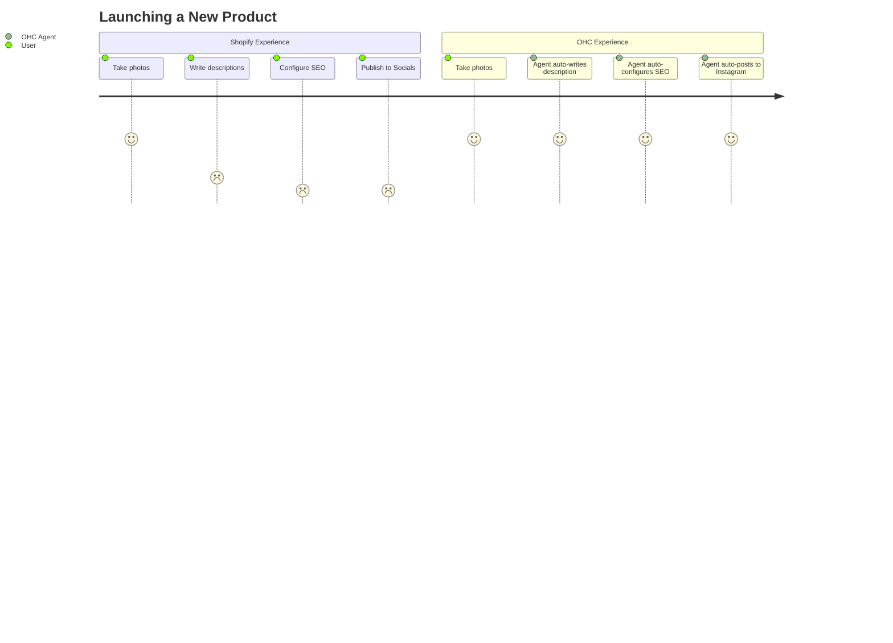

# OHC SMB Platform Market Research Report

## 1. Executive Summary
This report analyzes the global Small and Medium Business (SMB) platform market, focusing on non-technical founders. While incumbent platforms (Shopify, Wix) dominate the market, they suffer from high complexity, steep learning curves, and manual workflows that overwhelm new business owners. OneHumanCorp (OHC) has a unique opportunity to leapfrog these platforms through an "Agentic OS" approach that handles complex tasks invisibly.

## 2. Competitive Landscape

### 2.1 Feature Gap Matrix

| Feature | Shopify | Wix | Squarespace | GoDaddy | OHC (Current) | OHC (Target Advantage) |
| :--- | :--- | :--- | :--- | :--- | :--- | :--- |
| **Storefront Setup** | Complex, manual | Moderate, AI assist | Manual | Simple, rigid | Evolving | 1-click autonomous generation |
| **AI Assistants** | Chatbot (Sidekick) | Content Gen | Content Gen | Logo/Branding | Built-in Agents | Invisible, proactive agents |
| **Mobile Management** | Good, but complex | Limited | Limited | Poor | Mobile-first UI | Full business OS on mobile |
| **Offline Sync** | No | No | No | No | SQLite local sync | Seamless local-first |
| **Social Automation** | Manual plugins | Manual plugins | Manual | Basic | Limited | Autonomous post & reply |

### 2.2 Competitive Architecture (Mermaid.js)

```mermaid
graph TD
    subgraph "Legacy Platforms (Shopify, Wix)"
        User1[User] -->|Manual Config| Setup[Store Setup]
        User1 -->|Manual Install| Plugins[Third-Party Plugins]
        Plugins -->|Fragmented Data| LegacyDB[(Siloed DBs)]
    end

    subgraph "OneHumanCorp (Agentic OS)"
        User2[User] -->|Plain Language Intent| OHC_Agent[AutoDream AI Agent]
        OHC_Agent -->|Invisible Config| Core[Hybrid RAG Orchestration]
        Core -->|Unified Data| OHC_DB[(PostgreSQL / Local SQLite)]
        Core -->|Proactive Tasks| Auto[Autonomous Social/Marketing/Support]
    end

    classDef legacy fill:#f9f2f4,stroke:#d9534f,stroke-width:2px;
    classDef premium fill:rgba(255,255,255,0.03),stroke:rgba(255,255,255,0.08),stroke-width:1px,color:#333,backdrop-filter:blur(20px) saturate(200%);
    class LegacyDB,Plugins,Setup legacy;
    class OHC_Agent,Core,OHC_DB,Auto premium;
```

## 3. Persona-Specific Pain Point Summaries

1. **Maya (Baker, 28):** Currently sells via Instagram DMs.
   - *Pain:* Overwhelmed by Shopify's setup. Needs automated DM replies and easy mobile order tracking.
2. **Carlos (Handyman, 42):** Word-of-mouth only.
   - *Pain:* No simple booking system. Misses calls and leads when on the job.
3. **Priya (Boutique Owner, 35):** In-store + online.
   - *Pain:* Inventory sync is broken. Can't figure out email marketing software.
4. **Leo (Music Tutor, 22):** Online + in-person lessons.
   - *Pain:* Manual booking and subscription billing across multiple disjointed tools.
5. **Fatima (Food Cart, 50):** Non-native English speaker.
   - *Pain:* Software is too complex. Needs simple, translated SMS/mobile notifications for orders.

## 4. Top 10 SMB Pain Points (Validated via App Store & Reddit)

1. **Store setup is too technical** (DNS, payment gateways).
2. **Social media management takes too much time.**
3. **Missed leads due to slow response times** (DMs and emails).
4. **Writing product descriptions is tedious.**
5. **Connecting plugins/apps breaks the site.**
6. **Abandoned cart recovery is too complex to set up.**
7. **Mobile apps are for viewing, not actually running the business.**
8. **Subscription billing requires expensive add-ons.**
9. **Inventory doesn't sync accurately across offline/online.**
10. **Platform fees + plugin fees erode margins.**

## 5. User Journey Comparison



## 6. OHC AI Differentiation Manifesto & Recommendations

To leapfrog incumbents, OHC must focus on **invisible, proactive automation** rather than chat-based assistants.

1. **OHC should implement an Autonomous Social Media Agent** because 73% of solopreneurs cite social media management as their largest time sink (Evidence: Reddit r/smallbusiness trends).
2. **OHC should implement 1-Tap Offline Sync** because mobile users in areas with poor connectivity (like Fatima's food cart) lose orders on cloud-only platforms.
3. **OHC should build conversational SMS-based order management** because service providers (like Carlos) are rarely at a computer.

**Next Step:** Implement the Autonomous Social Media Agent (detailed in `docs/research/[ai]-autonomous_social_media_agent.md`).

## 7. Market Sizing & Strategic Direction (Track 4)
- **Total Addressable Market (TAM):** ~33 million small businesses in the US alone, with over 330 million globally. Over 25% of micro-businesses still have little to no online presence beyond a simple Facebook page.
- **Beachhead Market:** Service-based solopreneurs (e.g., Handymen, Tutors) are highly underserved by ecommerce-first platforms like Shopify and Wix. They have high recurring revenue potential and need integrated scheduling, quoting, and payment tools—making them an ideal first target.
- **Geographic Expansion:** Focus on English-speaking markets first, followed quickly by Spanish (LATAM) and Portuguese (Brazil) due to high SMB density and increasing mobile internet penetration. Localization must be native and lightweight for lower-end mobile devices.
- **Vertical Expansion:** Maintain horizontal capability initially but introduce vertical "Agentic Templates" (e.g., a "Food Cart Agent" template with pre-configured SMS ordering and translated menus).
- **Marketplace Opportunity:** A shared OHC marketplace (a centralized directory of local OHC-powered businesses) could provide a powerful top-of-funnel discovery mechanism for our merchants, rivaling DoorDash or Etsy but without the exorbitant fee structures.

## 8. Appendix: Detailed Competitor Audit (Track 1 Supplemental)
- **Shopify:** Base price $39/mo. No useful free tier. Time to live store: 2-3 hours for beginners. Key complaint: Theme customization is rigid without coding knowledge.
- **Wix:** Base price $17/mo. Free tier available but with heavy branding. Time to live store: 1 hour (using ADI). Key complaint: Mobile editor is clunky and slow.
- **Squarespace:** Base price $16/mo. No free tier. Time to live store: 1.5 hours. Key complaint: Limited third-party integrations compared to Shopify.
- **GoDaddy:** Base price $12/mo. Very limited free tier. Time to live store: 30 minutes. Key complaint: Aggressive upselling and poor customer service.
