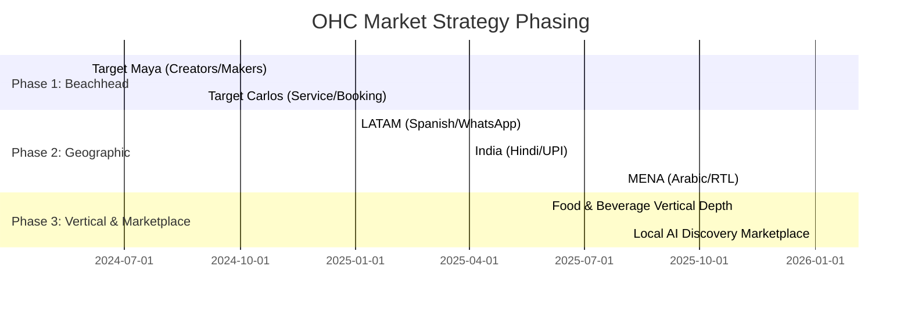
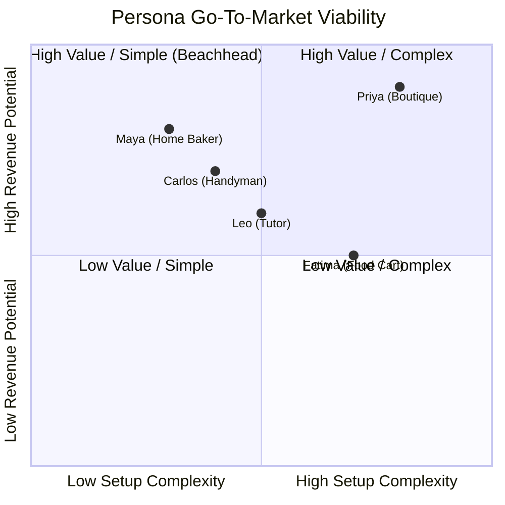

# [research]_market_sizing_and_strategic_direction

## Title
Market Sizing & Strategic Expansion Direction for OneHumanCorp (OHC)

## Problem Statement
While OHC aims to empower all non-technical small business owners, trying to capture everyone simultaneously diffuses our marketing and engineering efforts. We lack a clear view of our Total Addressable Market (TAM), an optimal beachhead persona, and a prioritized sequence for geographic, vertical, and marketplace expansion. To reach dominance, OHC must identify the exact sequence of markets and personas that will maximize user acquisition and lifetime value (LTV).

## Research Report
### Total Addressable Market (TAM)
- **United States:** According to the US Census Bureau, there are approximately 33 million small businesses, of which roughly 27 million are "non-employer" firms (solopreneurs, freelancers, micro-businesses).
- **Globally:** The World Bank and OECD estimate there are over 400 million micro and small enterprises globally.
- **Online Presence:** Estimates suggest around 36% to 40% of small businesses still do not have a dedicated website or online storefront, relying purely on word-of-mouth or social media (like Maya the Baker using Instagram DMs). This represents a global immediate TAM of ~140 million underserved users, and a US TAM of ~10 million users.

### Beachhead Market: The Optimal Persona
Evaluating our 5 personas (Maya, Carlos, Priya, Leo, Fatima), the optimal beachhead market is **Maya the Home Baker (and similar solopreneur creators/makers).**
- **Why Maya?**
  - **High Density:** Massive density on Instagram, TikTok, and Etsy.
  - **Underserved:** Overwhelmed by Shopify's complexity, high Etsy fees, and lack of AI assistance.
  - **High Engagement:** Constant need for order taking, custom quoting, and deposit payments.
  - **LTV Potential:** These businesses scale through repeat customers, requiring exactly the tools OHC provides (Customer Success AI, Operations AI).
- **Secondary (Fast Follower):** Carlos the Handyman (Service & Bookings). Simple service listings with automated quoting solves a high-value pain point quickly.

### Geographic Expansion Strategy
After dominating the English-speaking market, OHC should prioritize regions with high smartphone penetration and massive informal micro-economies.
1. **Spanish/LATAM:** High mobile commerce adoption (Mercado Libre influence), heavy WhatsApp usage. Requires deep WhatsApp integration for the "Customer Success" agent.
2. **Hindi/India:** Booming micro-entrepreneurship, mobile-first population (UPI payments integration is critical).
3. **Arabic/MENA:** Fast-growing digital markets. Requires RTL (Right-to-Left) UI support and integration with local payment gateways.
4. **Portuguese/Brazil:** Large social commerce market via Instagram and WhatsApp.

### Vertical Expansion
After horizontal stability, OHC should build vertical depth targeting **Food & Beverage (e.g., Fatima the Food Cart)**.
- **Features Needed:** POS integration, tap-to-pay on phone, multi-language menus, high-visibility prep queues, and HACCP compliance templates.
- **Why?** High transaction volume and local network effects (QR codes on carts drive app downloads).

### Marketplace Opportunity
- **Demand:** Solopreneurs deeply desire top-of-funnel traffic (the main reason they tolerate Etsy's fees).
- **Opportunity:** An OHC-powered "Local AI Marketplace." Instead of competing globally, an AI agent connects local buyers with OHC merchants (e.g., "Find me a vegan cake maker in Austin").
- **Recommendation:** Delay until 100,000 active merchants. Focus first on providing individual storefronts before aggregating them.

## Design Doc
### Key Strategic Decisions
- **Focus Area:** Maya (Makers/Creators) first. Marketing should be tailored strictly to "Launch your creator business from your phone."
- **Platform Focus:** WhatsApp integration for LATAM and MENA expansion.
- **Marketplace Strategy:** Develop "Local Discovery API" where OHC stores are indexed and surfaced to local consumers via AI search (Generative Engine Optimization - GEO).

### Architecture Diagrams (Mermaid.js)

#### 1. Strategic Phasing Chart

#### 2. Persona Value vs. Complexity

### Comparative Table: Geographic Expansion Matrix
| Region | Primary Language | Key Payment Integration | Key Communication Channel | Priority |
|---|---|---|---|---|
| LATAM | Spanish | Mercado Pago | WhatsApp | 1 |
| India | Hindi | UPI / Paytm | WhatsApp | 2 |
| MENA | Arabic | PayTabs / Telr | WhatsApp / IG | 3 |
| Brazil | Portuguese | PIX | WhatsApp | 4 |

## Implementation Prompt
**To Implementer Agent:**
Review the Market Sizing & Strategic Direction report. Based on the identification of Maya (the Home Baker/Creator) as the beachhead market, implement the onboarding UI flow specifically tailored to the "Creator/Maker" persona. The wizard should ask no more than 3 questions (e.g., "What do you create?", "What is your Instagram handle?", "Connect Stripe for deposits") and instantly generate a mobile-first catalog storefront. Ensure the integration with the Marketing Agent focuses on converting Instagram followers into storefront visitors.

## Priority
P0

## Estimated Scope
Large
