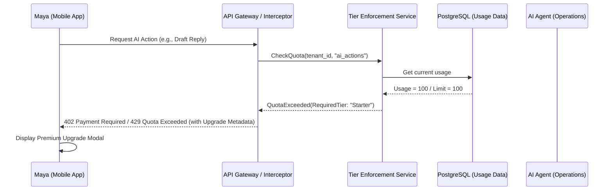

# Issue Brief: Multi-Tenant Tier Enforcement Architecture

## Problem Statement
While the current design documents mention SaaS tiers (Free, Starter, Pro, Business) with specific limits (AI actions/month, storage, product count, custom domains), there is no centralized architecture defining how these limits are enforced across the platform. Non-technical users need clear, actionable guidance when they hit limits, and the system must reliably enforce these constraints without impacting performance. If a user hits a limit (e.g., trying to use an AI agent when out of quota), the platform should gracefully guide them to an upgrade rather than failing silently or throwing a technical error.

## Research Report
- **Competitor Landscape**:
  - Shopify enforces limits primarily on staff accounts and locations; storage is largely unlimited but API rate limits apply.
  - Wix and Squarespace have strict tiering on storage, video hours, and custom domain capabilities, often presenting clear upgrade modals when a limit is reached.
- **OHC Current State**: The platform utilizes PostgreSQL RLS for isolation and Prometheus for metering, but lacks a unified policy enforcement engine that intercepts actions before they occur and surfaces plain-language upgrade prompts.
- **Opportunity**: Build a centralized Tier Enforcement Service that intercepts requests, checks usage against tier quotas, and returns standardized responses that the frontend can use to display beautiful, contextual upgrade prompts.

## Design Doc

### High-Level Architecture
The Multi-Tenant Tier Architecture introduces a centralized enforcement layer and defines how limits are monitored and exposed.

1.  **Tier Policy Definition**: A configuration-driven system (e.g., in the database or config map) defining the exact limits for each tier (Free, Starter, Pro, Business).
2.  **Usage Tracking**:
    - **Synchronous**: Limits like "Max Products" or "Custom Domain" are checked synchronously at the time of creation.
    - **Asynchronous/Metered**: Limits like "AI Actions per month" or "Storage Space" are aggregated asynchronously via background workers reading from metrics or database counts to avoid slowing down critical paths.
3.  **Enforcement Interceptors (Gateways)**:
    - gRPC interceptors and REST middleware intercept incoming requests.
    - The interceptor queries the Tier Enforcement Service for the tenant's current usage vs. limit.
    - If a limit is exceeded, the request is rejected with a specific `RESOURCE_EXHAUSTED` error containing metadata about the limit and the required upgrade tier.
4.  **Frontend Handling (Mobile-First)**:
    - The Flutter app catches these specific error types.
    - Instead of showing a technical error, it displays a "Glassmorphism" styled bottom sheet or modal explaining the limit in plain language (e.g., "You've used all 100 of your free AI actions this month! Upgrade to Starter to unlock 1,000 actions.") with a 1-tap upgrade button.

### Architecture Diagram (Mermaid.js)

### Key Invariants
- **Performance**: Quota checks for high-throughput actions must use fast, cached lookups (e.g., Redis) rather than full DB table scans.
- **Graceful Degradation**: If the Tier Enforcement Service is unreachable, default to allowing the action (fail open) to prevent disrupting user business.
- **Clear Upgrades**: Limit exhaustion must always provide a clear path to upgrade, presented from the business owner's perspective.

### Migration Strategy
- Introduce the tier definitions and basic tracking first without enforcement (shadow mode).
- Implement enforcement on "hard" limits like Custom Domains and new Product Creation.
- Roll out asynchronous metered limits (Storage, AI Actions) once tracking is validated.

## Implementation Prompt
Implement the Multi-Tenant Tier Enforcement Architecture.
1. Create the backend `TierEnforcementService` that manages tier definitions and validates quota checks for `ai_actions`, `product_count`, `storage_bytes`, and `custom_domain`.
2. Add gRPC/REST interceptors to the API layer that call this service and return standardized quota-exceeded errors with metadata.
3. On the frontend (Flutter), implement a global error handler that intercepts these quota errors and displays a premium, mobile-first upgrade modal (following the OHC Premium Token library design) that clearly explains the limit and offers a 1-tap upgrade path. Ensure the entire flow is tested E2E. Do not prescribe specific DB schemas; use the existing tenant model.

## Priority
P1

## Estimated Scope
Medium
