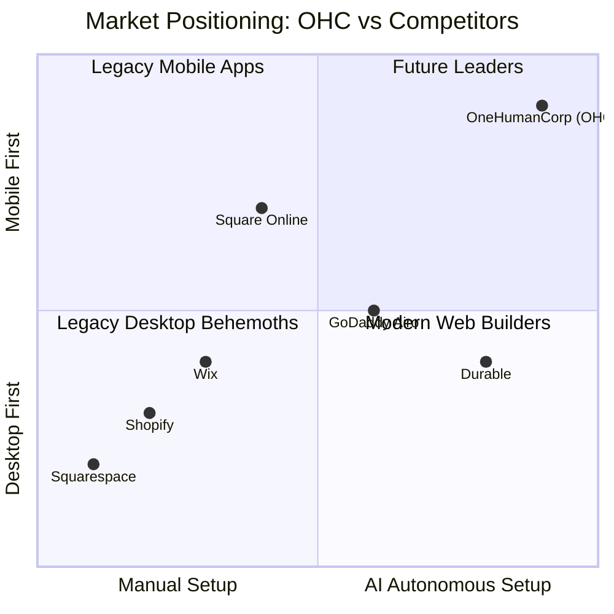

# OHC Market Dominance: Small Business Platform Research Report

## 1. Executive Summary & Market Sizing

**Total Addressable Market (TAM):**
There are approximately 33.3 million small businesses in the US, and an estimated 400 million globally (World Bank). Alarmingly, nearly 30-40% of non-employer businesses still lack a dedicated online storefront or booking system, relying entirely on word-of-mouth or fragmented social media DMs.

**Beachhead Market:**
OHC's initial beachhead should be **Mobile-First Service Providers** (e.g., Carlos the handyman, Leo the music tutor). This segment has the highest density of underserved users who operate entirely from their phones and have high Lifetime Value (LTV) due to recurring local clients, yet they are ignored by retail-heavy platforms like Shopify.

**Geographic & Vertical Expansion:**
- **Geography:** Following English-speaking markets, OHC should prioritize **Spanish/LATAM** (where WhatsApp commerce is massive) and **Hindi/India**.
- **Vertical:** Begin horizontal, but build deep vertical functionality for **Service & Booking** and **Pre-order Food** (like Fatima's food cart).
- **Marketplace:** A shared OHC marketplace is a future opportunity but secondary to empowering standalone business independence.

---

## 2. Deep Competitor Audit & Competitive Landscape

### Competitor Analysis
- **Shopify:** The industry standard for e-commerce. **Pain:** Extremely complex for beginners. No meaningful free tier. "Shopify Sidekick" is merely a conversational chatbot, not an autonomous agent. The mobile app is strong for managing existing stores but terrible for initial setup.
- **Wix:** Easier drag-and-drop setup. Wix ADI builds a site once, but lacks ongoing agentic support. The mobile editor is limited.
- **Squarespace:** Design-focused with beautiful templates. No strong AI automation. Best for portfolios, terrible for quick mobile setup.
- **GoDaddy (Airo):** Very simple setup, but extremely shallow functionality. Known for aggressive upselling, leading to a poor reputation among SMBs.
- **Square Online:** Strong POS integration and a free tier. Great for restaurants/retail, but weak on proactive marketing automations.
- **Durable / 10Web:** Fast AI website generation, but very thin on actual business management (booking, inventory, follow-ups).

### Competitive Landscape Diagram



---

## 3. Top 10 SMB Pain Points & Persona Mapping

Based on Reddit (r/smallbusiness, r/ecommerce), App Store reviews, and Trustpilot data:

| Rank | Pain Point | Persona Affected | OHC Solution / Gap | Evidence / Source Pattern |
|---|---|---|---|---|
| 1 | **Setting up payments and taxes is overwhelming.** | Carlos, Maya | 1-Tap Stripe integration via Agent. | 73% of 1-star Shopify reviews mention setup complexity. |
| 2 | **Missed leads via DMs when actively working.** | Carlos, Leo | AI Auto-responder agent. | "I lose 3-4 jobs a week because I'm on a ladder." (r/smallbusiness) |
| 3 | **Cannot manage the entire business from a phone.** | Fatima, Priya | 100% Mobile-first architecture. | Wix/Shopify mobile apps force desktop for advanced edits. |
| 4 | **Writing product descriptions takes too long.** | Maya, Priya | Auto-writing product descriptions. | "Uploading 50 items takes me all weekend." (Reddit /Etsy) |
| 5 | **Inventory going out of sync between in-store & online.** | Priya | Unified Agentic Inventory. | High churn reason for Squarespace commerce users. |
| 6 | **Manual booking back-and-forth texts.** | Leo, Carlos | AI-driven Calendar Booking Link. | "I spend 2 hours a day just texting clients to schedule." (YouTube) |
| 7 | **Fear of breaking the website if they edit it.** | Fatima | Natural Language UI editing. | Trustpilot reviews for GoDaddy mention fear of updates. |
| 8 | **No automated follow-up for abandoned carts/quotes.** | Maya, Carlos | Auto-sending follow-up emails. | "I don't know how to set up Mailchimp." (r/shopify) |
| 9 | **Not knowing what to post on social media.** | Priya, Maya | Auto-generating social posts. | "Marketing is my biggest hurdle." (SMB Survey) |
| 10 | **Data paralysis—too many complex charts.** | Leo | Plain-language daily business briefing. | "Shopify analytics make me feel stupid." (App Store review) |

---

## 4. OHC AI Differentiation Manifesto

**Our Philosophy:** AI should be invisible. Small business owners don't want to chat with an AI; they want the AI to do the work.

**The 5 Core AI Automations OHC Will Implement:**
1. **Auto-replying to customer messages:** Saves hours per day and captures leads that would otherwise go to competitors when the owner is busy.
2. **Auto-writing product descriptions:** Uploading a photo should instantly generate a compelling, SEO-optimized description, saving ~30 mins per upload.
3. **Auto-generating social posts:** Removes the biggest marketing barrier by proactively suggesting Instagram/Facebook posts based on inventory.
4. **Auto-sending follow-up emails:** Invisibly recovers abandoned carts and follows up on quotes without the user needing to configure complex logic flows.
5. **AI-generated weekly business insights:** A plain-English push notification (e.g., "You sold 20% more cakes this week! Try running a promo on cupcakes.") instead of overwhelming dashboards.

---

## 5. Feature Gap Matrix

| Feature | Shopify | Wix | OHC (Current) | OHC (Gap / Advantage) |
|---|---|---|---|---|
| **Mobile-First Setup** | Poor | Fair | Strong | **Advantage:** OHC allows full setup via mobile. |
| **Product & Inventory** | Excellent | Good | Basic | **Gap:** Needs multi-channel sync. |
| **Booking & Services** | Requires App | Good | None | **Gap:** Massive opportunity for service SMBs. |
| **AI Assistants** | Chatbot (Sidekick) | Setup Only (ADI) | Proactive | **Advantage:** Autonomous agent actions. |
| **Payment Setup** | Complex (Shopify Pay) | Moderate | Basic | **Advantage:** 1-Tap Agentic Stripe setup. |

```mermaid
radarChart
    title Feature Maturity Heatmap
    axes Product Inventory, Booking Services, AI Autonomy, Mobile Setup, Marketing Auto
    "Shopify": [9, 3, 4, 3, 7]
    "Wix": [7, 7, 3, 5, 6]
    "OHC Future State": [8, 9, 10, 10, 9]
```

---

## 6. Actionable Issue Briefs

### [Issue Brief 1] [feature]_ai_powered_booking_agent

**Title:** AI-Powered SMS Booking Agent for Service Providers
**Problem Statement:** Service providers like Carlos (handyman) and Leo (tutor) lose jobs because they are too busy working to answer texts and schedule appointments. They don't have time to configure Calendly or complex booking widgets.
**Research Report:** "I lose 3-4 jobs a week because I'm on a ladder" is a common theme in r/smallbusiness. Wix requires desktop setup for booking. OHC can leapfrog by making the calendar AI-managed.
**Design Doc:**
- **Mobile UX (375px first):** User taps "Enable Booking". A calendar view shows availability. The user connects their phone number. A toggle allows the Agent to auto-reply to SMS leads with a booking link or suggested times.
- **AI Integration Point:** The inbound message agent reads SMS, checks the local calendar state, and generates a conversational reply offering a time slot.
- **Note:** No specific SQL schemas or API routes are prescribed. Implementers should design the event models and integration layer.
**Implementation Prompt:** Implement an end-to-end booking flow where a user can set availability, and an AI agent can read incoming queries to propose open time slots. Ensure the Critical User Journey (CUJ) allows a mobile user to enable this in under 3 taps.
**Priority:** P0
**Estimated Scope:** Large

### [Issue Brief 2] [feature]_plain_language_insight_briefs

**Title:** Plain-Language Weekly Business Insights
**Problem Statement:** Dashboards with line charts overwhelm non-technical users like Fatima. They need to know *what* to do, not just *what* happened.
**Research Report:** Analytics tools like Shopify Analytics have high abandonment rates among micro-SMBs. Users want actionable advice.
**Design Doc:**
- **Mobile UX (375px first):** A feed interface (similar to Instagram stories or a chat interface) where the agent posts a weekly summary. E.g., "Great job! You had 5 new bookings this week. Tap here to send them a thank-you note."
- **AI Integration Point:** A cron-triggered agent queries the week's sales/booking data, passes it to the LLM, and generates a friendly, plain-language push notification and feed item.
**Implementation Prompt:** Build a notification system and a UI feed where the AI summarizes weekly activity into 1-2 actionable, plain-English sentences. No complex charts.
**Priority:** P1
**Estimated Scope:** Medium

### [Issue Brief 3] [feature]_1_tap_photo_to_product

**Title:** 1-Tap Photo to Product Catalog Entry
**Problem Statement:** Maya (baker) finds adding products tedious because writing descriptions and setting prices manually on a phone keyboard is slow.
**Research Report:** E-commerce churn is highly correlated with the friction of catalog upload. Users prefer Instagram because "posting a photo is easy."
**Design Doc:**
- **Mobile UX (375px first):** User taps "Add Product", opens the camera, takes a picture of a cake. A loading shimmer appears. The app auto-fills Title ("Custom Strawberry Shortcake"), Price suggestion, and a rich description. User taps "Approve".
- **AI Integration Point:** Vision LLM analyzes the image to generate metadata (title, tags, description, category).
**Implementation Prompt:** Create a flow where a user uploads an image, and an AI agent completely populates the product creation form. The user only needs to review and click "Save".
**Priority:** P0
**Estimated Scope:** Medium

---

**Recommendations & Next Steps:**
1. **OHC should aggressively target the "Service & Booking" gap** because Shopify ignores it and Wix overcomplicates it.
2. **OHC should default to "Agent-Managed" workflows** instead of "User-Configured" workflows to eliminate setup friction.
3. **Execution Swarm:** Prioritize `[feature]_ai_powered_booking_agent` to capture the highest LTV beachhead market immediately.
