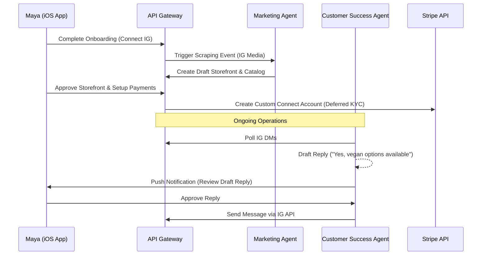
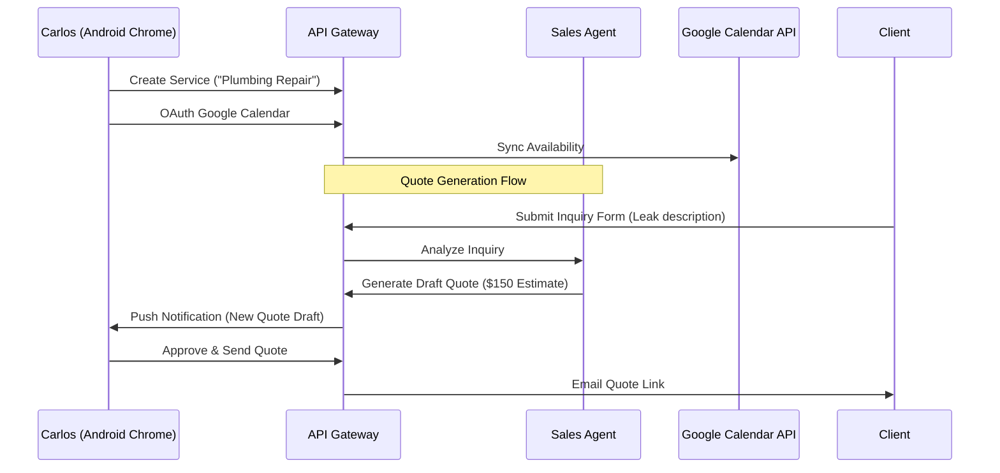
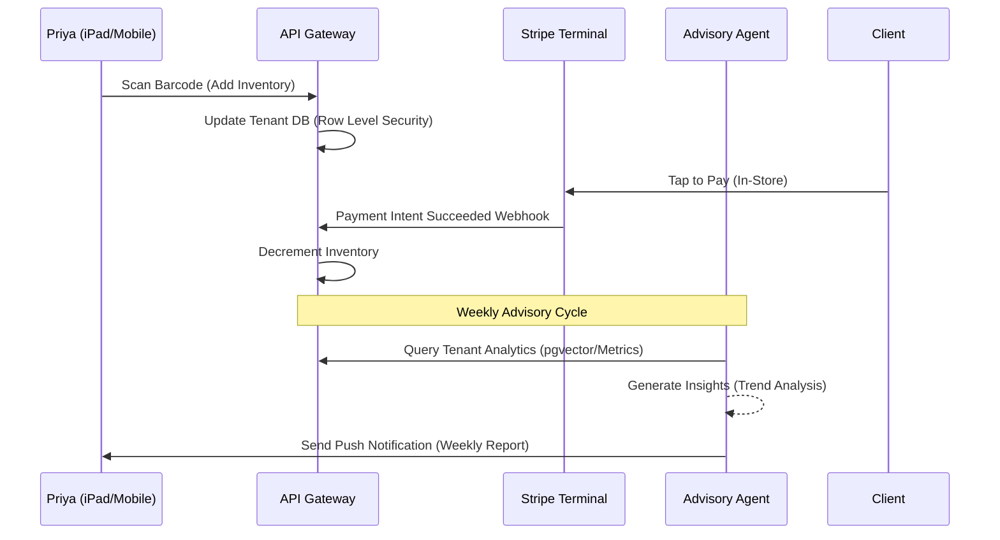
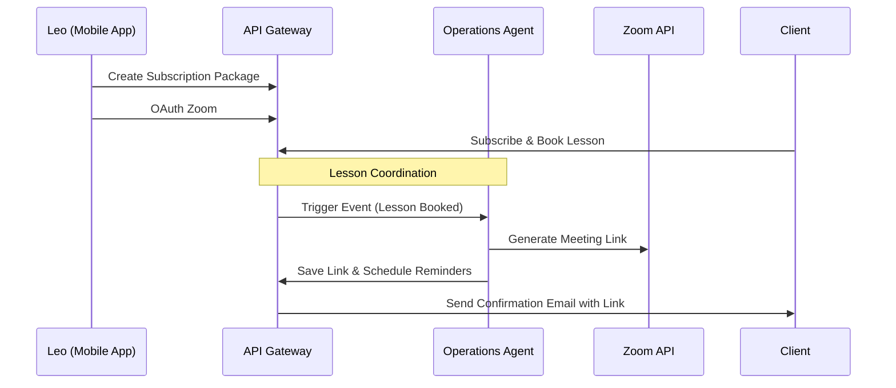
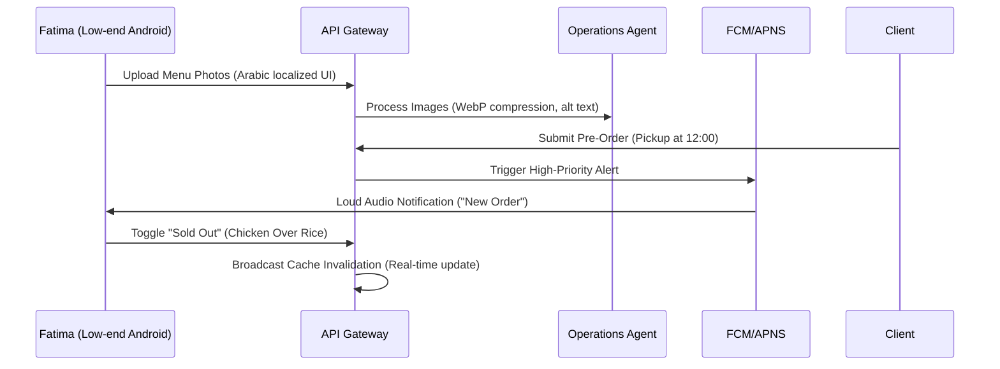

# Architecture: Business Journey Maps & Ecosystem Integration

## Executive Summary
This design document defines the end-to-end user journeys for the primary OneHumanCorp (OHC) user personas. By mapping out how different types of non-technical business owners move through Acquisition, Onboarding, Activation, Retention, Revenue, and Referral, we can pinpoint integration friction points and architectural requirements for the KAIROS Orchestrator and the backend service ecosystem. The fundamental premise is that AI Agents handle complexity invisibly.

## Problem Statement
Small business owners lacking technical skills struggle with complex, disparate tools. They need a single, simplified funnel that takes them from "idea" to "live business" in under 10 minutes. If the platform feels like a traditional CMS, they will abandon the process.

## 1. Maya — The Home Baker (Physical Products / Custom Orders)
**Persona Focus:** Mobile-only, deposit-based custom orders, visual catalog.

### Journey Map
*   **Acquisition:** Maya sees an Instagram ad showing another baker managing orders via OHC on their iPhone. CTA: "Start your bakery in 5 minutes."
*   **Onboarding:** Downloads the iOS app. Enters business name ("Maya's Sweets") and connects her Instagram account. The "Marketing & Advertising" agent immediately scrapes her latest cake photos to build a visual catalog.
*   **Activation (Day 1):** She sets her first item price and connects a bank account (Stripe onboarding deferred, simply inputs routing details). Her custom order form goes live.
*   **Retention:** Push notifications arrive for new orders and DMs. The "Customer Success" agent auto-replies to "Do you do vegan cakes?" DMs.
*   **Revenue:** Maya moves to the Starter Tier ($9/mo) when she exceeds 10 active products. The trigger is an in-app banner: "Your catalog is growing! Unlock unlimited listings."
*   **Referral:** Maya shares a customized QR code (generated by the Marketing agent) on her physical cake boxes. Other bakers ask her how she manages her orders so smoothly.

### Architecture Sequence

## 2. Carlos — The Freelance Handyman (Services & Bookings)
**Persona Focus:** Android, service listings, booking calendar, quotes.

### Journey Map
*   **Acquisition:** Organic search ("how to get an online booking link for plumbing"). Discovers an OHC SEO-optimized landing page.
*   **Onboarding:** Enters business details via the web app (Chrome on Android). The "Legal & Compliance" agent generates standard service disclaimers.
*   **Activation (Day 1):** Adds three services (e.g., "General Repair - $50/hr"). Connects Google Calendar. A customer books the first slot and pays a deposit.
*   **Retention:** The "Sales & Acquisition" agent auto-generates quotes based on customer inquiry forms. Carlos reviews the draft quote and sends it with one tap.
*   **Revenue:** Carlos upgrades to Pro Tier ($29/mo) to unlock the custom domain feature to print on his business cards.
*   **Referral:** Carlos gets a unique referral link. When another contractor signs up through his link, Carlos gets a month free.

### Architecture Sequence

## 3. Priya — The Boutique Owner (Physical Retail + Online)
**Persona Focus:** Desktop & Mobile, inventory sync, in-person POS, variants.

### Journey Map
*   **Acquisition:** Word-of-mouth referral from another boutique owner.
*   **Onboarding:** Uses iPad. Sets up the primary location. The "Operations" agent establishes the inventory baseline.
*   **Activation (Day 1):** Scans barcodes using the iPad camera to input inventory quickly. Enables Stripe Terminal for in-person tap-to-pay.
*   **Retention:** Daily mobile analytics. The "Business Advisory" agent sends a weekly digest: "Blue dresses sold 3x faster this week."
*   **Revenue:** Starts on Business Tier ($79/mo) immediately for multi-domain support and unlimited inventory.
*   **Referral:** Invites her staff members to manage the store under the same tenant account (RBAC).

### Architecture Sequence

## 4. Leo — The Music Tutor (Digital / Subscriptions)
**Persona Focus:** Subscriptions, calendar sync, automated links, TikTok link-in-bio.

### Journey Map
*   **Acquisition:** Sees an OHC link-in-bio on another creator's TikTok profile.
*   **Onboarding:** Creates an account and selects "Link-in-bio setup". Connects Zoom.
*   **Activation (Day 1):** Sets up a monthly subscription for 4 lessons. His link-in-bio is active on TikTok.
*   **Retention:** The "Operations" agent automatically generates Zoom links for booked slots and emails them to the student. The "Sales" agent pings Leo about inactive students.
*   **Revenue:** Stays on the Starter Tier ($9/mo).
*   **Referral:** The "Powered by OHC" badge on his link-in-bio acts as a passive referral engine.

### Architecture Sequence

## 5. Fatima — The Food Cart Operator (Food & Beverage)
**Persona Focus:** Low-end Android device, multi-language (Arabic/English), pre-orders, sold-out toggles.

### Journey Map
*   **Acquisition:** Local community organization recommends OHC for street vendors.
*   **Onboarding:** App detects language preference (Arabic) and defaults UI. Fatima uploads photos of her menu items.
*   **Activation (Day 1):** Sets menu prices. Enables the "Accepting Pre-Orders" toggle.
*   **Retention:** Relies heavily on the simple push notification sound ("Cha-ching") to alert her of a new pickup order while cooking. Uses the rapid "Sold Out" toggle to manage inventory in real-time.
*   **Revenue:** Starts on Free tier. Upgrades to Starter ($9/mo) when she exceeds the 100 API actions/mo limit due to high order volume.
*   **Referral:** Direct community word-of-mouth.

### Architecture Sequence

## Key Architectural Decisions & Takeaways

1.  **Event-Driven Agent Triggers:** Agents must be triggered by asynchronous events (e.g., webhook from Stripe, database insert for a new inquiry) rather than synchronous blocking calls. The `SKIP LOCKED` pattern in Postgres is essential for reliable task queuing.
2.  **Deferred Friction:** Onboarding must strictly defer high-friction tasks (e.g., Stripe KYC, complex tax setups) until *after* the user has activated their storefront.
3.  **Human-in-the-Loop Defaults:** For sensitive actions (e.g., sending quotes, replying to customers), agents default to drafting. The business owner must approve the action via push notification, ensuring trust is built gradually.
4.  **Network Resilience (Mobile-First):** For users like Fatima on low-end devices or slow networks, critical state changes (like the "Sold Out" toggle) must be handled optimistically on the client while utilizing background retry queues for the API call.
