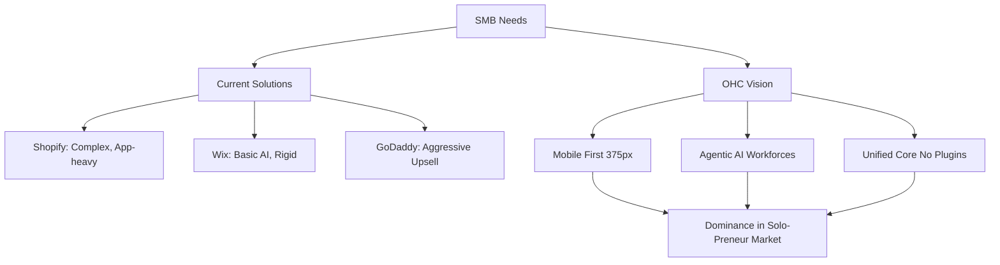
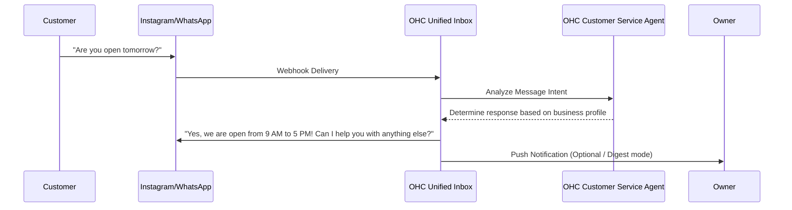

# [Research] SMB Market Analysis & Omnichannel AI Inbox Issue Brief

## Product Vision Alignment
OneHumanCorp (OHC) empowers non-technical small business owners—like Maya the baker, Carlos the handyman, and Fatima the food cart owner—to launch and run a real business from their phone or browser in under 10 minutes. By treating technical complexity as the enemy and deploying invisible AI agents to handle the heavy lifting, OHC ensures the user just makes decisions.

---

## Track 1: Deep Competitor Audit

| Competitor | Target Audience | AI Features | Free Tier | Mobile App Quality | Time to Live Store | Main Pain Points |
| :--- | :--- | :--- | :--- | :--- | :--- | :--- |
| **Shopify** | Scaling SMBs / Mid-Market | Sidekick (Chat assistant, not agentic) | None (3-day trial) | Excellent for management; Poor for setup | Hours - Days | Too complex for beginners, expensive plugins, steep learning curve. |
| **Wix** | General SMBs | Wix ADI (One-time generation) | Adequate | Limited editor | Minutes - Hours | Overwhelming template choices, rigid once generated. |
| **Squarespace** | Creatives / Restaurants | Weak | None (14-day trial) | Good | Hours | Lacks deep business management features. |
| **GoDaddy** | Beginners | Airo (Branding/Site draft) | Very limited | Poor | Minutes | Aggressive upselling, shallow features, poor reputation. |
| **Square Online**| Local Retail / F&B | Weak | Strong | Good | Hours | Limited customization, focused mainly on POS. |
| **Durable** | Sole Proprietors | AI site generation in 30s | Free to build, pay to host | N/A (Web) | Seconds | Extremely thin on business management. |

**Observation:** Existing platforms treat AI as a novelty feature (chatbot or initial generation) rather than an embedded operational agent.

---

## Track 2: Top 10 SMB User Pain Points
*Compiled from App Store reviews (Shopify, GoDaddy, Wix), r/smallbusiness, r/ecommerce, and Trustpilot.*

1. **"Setting up the store is too confusing."** (Overwhelming options, DNS, themes). -> *OHC Opportunity: Autonomous setup from a single prompt.*
2. **"I can't afford all the apps required to run my business."** (Shopify app store fatigue). -> *OHC Opportunity: All-in-one platform without plugin costs.*
3. **"I miss messages from customers on Instagram/Facebook/WhatsApp."** -> *OHC Opportunity: Unified Omnichannel AI Inbox.*
4. **"I spend hours writing product descriptions."** -> *OHC Opportunity: AI auto-generation from photos/bullet points.*
5. **"Mobile apps don't let me build the store, only manage it."** -> *OHC Opportunity: True Mobile-First Parity (375px).*
6. **"I don't know what to post on social media."** -> *OHC Opportunity: AI social media generation agent.*
7. **"Following up with leads takes too much time."** -> *OHC Opportunity: Automated AI follow-ups.*
8. **"Inventory syncing between in-person and online is broken."** -> *OHC Opportunity: Single source of truth system.*
9. **"Booking appointments is a manual mess."** -> *OHC Opportunity: Integrated AI scheduler.*
10. **"Understanding my analytics is too hard."** -> *OHC Opportunity: Weekly AI narrative insights ("Here's what happened this week and what to do next").*

---

## Track 3: OHC AI Differentiation Manifesto
To leapfrog competitors, OHC must shift AI from "assistant" to "agentic employee".

**The 5 High-Value AI Automations OHC Will Implement First:**
1. **The Omnichannel Auto-Responder:** Integrates IG, FB, WhatsApp, and SMS. AI auto-replies to FAQs (hours, pricing) and escalates complex queries. *Why: Saves hours daily and prevents lost sales.*
2. **The "Snap-to-Product" Creator:** User snaps a photo of a product; AI generates description, pricing estimate, and SEO tags instantly. *Why: Removes the friction of inventory creation.*
3. **The Autonomous Social Media Manager:** Auto-generates weekly content calendars based on inventory changes and posts them. *Why: Social media is the #1 acquisition channel but the #1 deferred task.*
4. **The Rescue Agent (Abandoned Cart & Leads):** Automatically messages users who dropped off, offering help or a discount in natural language. *Why: Direct, measurable impact on revenue.*
5. **The Sunday Summary:** Every Sunday evening, AI sends a 3-bullet SMS summary of business performance and 1 suggested action for the week. *Why: Makes the owner feel in control without needing to look at a dashboard.*

---

## Track 4: Market Sizing & Strategic Direction

* **TAM:** ~33 Million small businesses in the US alone (US Chamber of Commerce). A significant percentage (estimated 25-30%) still lack an effective online presence or rely solely on social media.
* **Beachhead Market:** "The Overwhelmed Solo-Preneur" (Maya the baker, Carlos the handyman, Leo the tutor). High density, currently underserved by complex tools like Shopify.
* **Geographic Expansion:** US/Canada (English) first, followed by LATAM (Spanish) and Brazil (Portuguese) due to the high density of WhatsApp-first micro-businesses.
* **Vertical Expansion:** Start horizontal, then introduce "Packs" (e.g., Service Pack for booking, Retail Pack for inventory).

---

## Track 5: Feature Gap Matrix

| Feature Area | Shopify | Wix | OHC (Current) | OHC (Gap/Advantage) |
| :--- | :--- | :--- | :--- | :--- |
| **Store Generation** | Manual | AI Assisted | Unknown/In-Progress | **Advantage:** Autonomous generation via LLM. |
| **Mobile Setup** | Poor | Poor | Unknown | **Advantage:** Mobile-first (375px) creation. |
| **Unified Inbox** | Add-on/App | Basic | Missing | **Gap:** Need a centralized messaging hub. |
| **Agentic AI** | Chatbot only | No | Core Platform | **Advantage:** AI does the work, doesn't just assist. |
| **Booking/Services** | Add-on/App | Built-in | Missing | **Gap:** Native scheduling system. |

---

## Issue Brief: The Unified Omnichannel AI Inbox

**Title:** Implement Unified Omnichannel AI Inbox for SMBs

**Problem Statement:**
Small business owners (like Maya the baker and Carlos the handyman) are losing sales because customer inquiries are scattered across Instagram DMs, Facebook Messenger, WhatsApp, SMS, and email. They cannot manage multiple apps on their phone while working, leading to slow response times and lost revenue. They need a single, unified inbox where AI can handle routine questions automatically.

**Design Doc:**

*   **Architecture (High Level):**
    *   **Entities:** `Conversation` (Unified thread), `Message` (Individual item), `Channel` (IG, FB, SMS, Web), `Contact` (Customer profile).
    *   **Integration Points:** Webhooks for incoming messages from Meta (IG/FB/WA) and Twilio (SMS).
    *   **AI Integration:** The message routing engine passes incoming messages to the "Customer Service Agent" (an LLM) to classify intent. If intent is routine (e.g., "What are your hours?", "Do you sell X?"), the AI drafts and (if configured) auto-sends a response.
*   **Mobile UX Flow (375px baseline):**
    1.  **Home Screen:** Prominent "Inbox" icon with unread badge.
    2.  **Inbox List:** Unified feed. Icons indicate the source channel (e.g., small IG logo next to the sender's name).
    3.  **Conversation View:** Standard chat interface. Messages handled by AI are subtly badged (e.g., "Replied by OHC Agent").
    4.  **Action Sheet:** Owner can tap a message to instantly turn an inquiry into a draft "Quote" or "Order" link.

**Implementation Prompt:**
Implement the core infrastructure and UI components for the Unified Omnichannel Inbox. The feature must provide a single view for messages originating from different mock external channels. The system should intercept incoming messages and pass them through a classification pipeline (representing the AI agent) before displaying them in the inbox. The UI must be perfectly usable on a 375px mobile screen. Focus on the Critical User Journey: A customer sends a message via a 3rd party channel, it appears in the unified OHC inbox, the AI automatically drafts a relevant reply, and the business owner can review and approve/send the reply with one tap.

**Priority:** P0
**Estimated Scope:** Large
