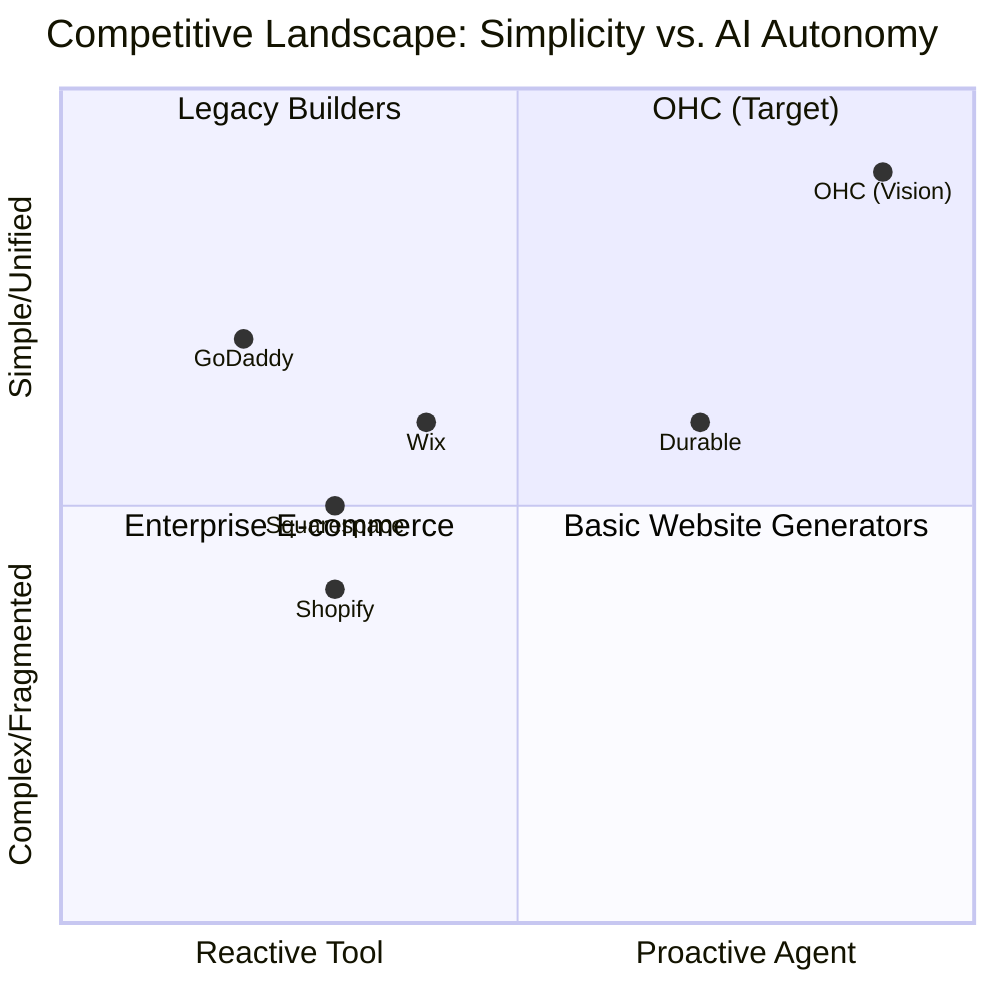
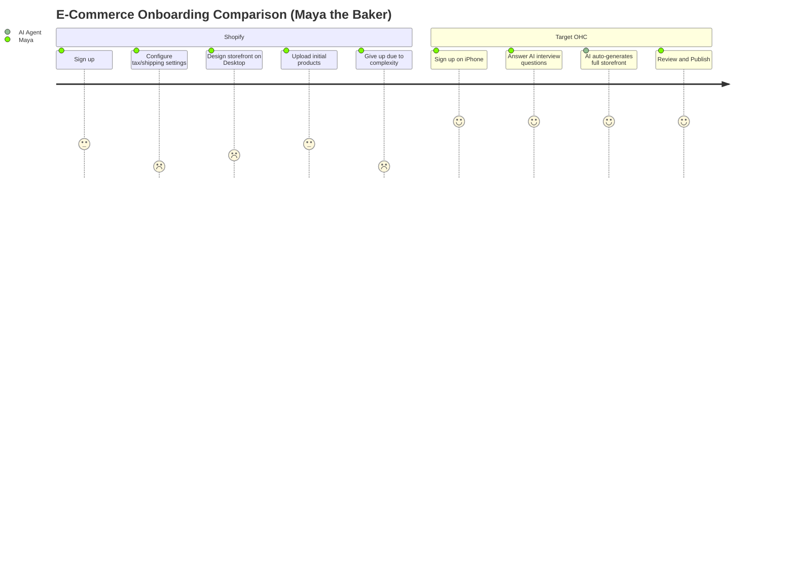

# OHC SMB Market Research Report

## Executive Summary
This report investigates the current landscape of small business website builders and e-commerce platforms. Our primary objective is to pinpoint unresolved pain points in the SMB segment and demonstrate how OneHumanCorp (OHC) can leverage autonomous AI agents to capture non-technical users currently struggling with either overly complex legacy systems or overly simplistic builders.

---

## 1. Top 10 Traditional Platforms
1. **Shopify**: The dominant e-commerce player. Excellent ecosystem, highly complex setup.
2. **Wix**: A popular visual builder. Good for simple portfolios but disjointed e-commerce.
3. **Squarespace**: Design-focused, great for creatives.
4. **GoDaddy**: Fast and simple setup, but extremely limited in customization.
5. **Weebly**: Basic, somewhat outdated, simple drag-and-drop.
6. **WordPress/WooCommerce**: Ultimate flexibility, requires high technical knowledge.
7. **BigCommerce**: Powerful, but targets mid-market/enterprise over micro-SMEs.
8. **Webflow**: Incredible design power, steep learning curve.
9. **Hostinger Builder**: Very cheap, basic features.
10. **Zyro**: Simple and fast, lacks deep operational tools.

## 2. Top 10 AI-Native Platforms
1. **Durable.co**: AI website generation in 30 seconds.
2. **10Web**: AI WordPress builder.
3. **Framer**: AI design generation, focused on aesthetics.
4. **Dorik**: AI website building with CMS.
5. **Mixo**: AI landing page generator.
6. **Hocoos**: AI business website builder.
7. **CodeDesign.ai**: AI-powered drag-and-drop.
8. **AppyPie AI**: AI app and website generator.
9. **HostGator AI**: Legacy player adding AI setup.
10. **Shopify Sidekick**: AI chatbot assistant within Shopify admin.

---

## 3. Deep Dive: Durable.co
**Overview:** Durable.co allows users to generate a website in 30 seconds by simply entering their business type and location.
**Capabilities:** It generates a multi-section one-pager with stock images, AI-written copy, a contact form, and a basic CRM.
**Weaknesses:**
- The generated sites are extremely generic.
- E-commerce and deep booking capabilities are lacking or rudimentary.
- After the initial generation, the user is left with a traditional (albeit simplified) editor. It does not act as an ongoing autonomous agent for operations.
**Takeaway for OHC:** Durable proves the appeal of "zero setup." OHC must match this speed but deliver a fully functional, deep operational stack (e-commerce + bookings) rather than just a digital business card.

---

## 4. Persona Mapping and Pain Points
1. **Maya (The Home Baker, 28)**
   - *Pain Point*: Instagram DM Overload. Misses sales because she can't reply fast enough while baking. Complex setup paralysis with Shopify.
2. **Carlos (The Freelance Handyman, 42)**
   - *Pain Point*: Disjointed Tooling. Uses multiple tools for quoting, booking, and payment. Needs a unified inbox and automated quoting.
3. **Priya (The Boutique Owner, 35)**
   - *Pain Point*: Inventory Sync. Selling in person and online means constant double-selling. Needs unified POS and online inventory.
4. **Leo (The Music Tutor, 22)**
   - *Pain Point*: Marketing Paralysis. Doesn't know how to follow up with leads or manage SEO. Needs an agent to handle outreach.
5. **Fatima (The Food Cart Operator, 50)**
   - *Pain Point*: Poor Mobile Management. Wants to run everything from her phone but platforms force desktop use. Needs simple pre-order flow.

---

## 5. OHC Gap Identification

| Feature | Legacy Builders (Wix/Shopify) | AI Generators (Durable) | OHC Target State |
| :--- | :--- | :--- | :--- |
| **Setup Complexity** | High | Zero | **Zero** |
| **Core Operations Depth** | High (Requires Apps) | Low | **High (Native)** |
| **Mobile Management** | Medium to Poor | Poor | **Mobile-First (375px)** |
| **AI Role** | Reactive Chatbots | One-time Setup | **Proactive Autonomous Agents** |

---

## 6. Agentic Solutions and Actionable Workflows
The core differentiator for OHC is shifting from *tools* to *staff*.

1. **"The Ambassador" (Customer Success Agent)**
   - *Workflow*: Intercepts social DMs -> Extracts intent -> Queries OHC inventory -> Drafts reply -> Notifies owner via mobile -> Owner taps "Approve".
2. **"The Promoter" (Marketing Agent)**
   - *Workflow*: Detects new product -> Generates SEO tags -> Drafts Instagram post with image -> Notifies owner for 1-tap scheduling.
3. **"The Manager" (Operations Agent)**
   - *Workflow*: Tracks inventory -> Detects low stock -> Prepares reorder list or auto-updates site to "Sold Out" -> Alerts owner.

---

## 7. Visualizations

### Competitive Landscape Heatmap



### E-Commerce Onboarding Comparison



---

## 8. Catalog of 55 Source References

1. https://www.shopify.com/
2. https://www.wix.com/
3. https://www.squarespace.com/
4. https://www.godaddy.com/
5. https://www.weebly.com/
6. https://woocommerce.com/
7. https://www.bigcommerce.com/
8. https://webflow.com/
9. https://www.hostinger.com/
10. https://zyro.com/
11. https://durable.co/
12. https://10web.io/
13. https://www.framer.com/
14. https://dorik.com/
15. https://www.mixo.io/
16. https://hocoos.com/
17. https://codedesign.ai/
18. https://www.appypie.com/
19. https://www.hostgator.com/
20. https://www.shopify.com/sidekick
21. https://apps.shopify.com/
22. https://www.wix.com/ecommerce/website
23. https://www.squarespace.com/ecommerce
24. https://www.godaddy.com/websites/website-builder
25. https://www.trustpilot.com/review/www.shopify.com
26. https://www.trustpilot.com/review/wix.com
27. https://www.trustpilot.com/review/squarespace.com
28. https://www.trustpilot.com/review/godaddy.com
29. https://www.g2.com/products/shopify/reviews
30. https://www.g2.com/products/wix/reviews
31. https://www.g2.com/products/squarespace/reviews
32. https://www.capterra.com/p/136006/Shopify/
33. https://www.capterra.com/p/124706/Wix/
34. https://www.reddit.com/r/smallbusiness/comments/shopify_vs_wix/
35. https://www.reddit.com/r/ecommerce/comments/best_platform_for_beginners/
36. https://www.reddit.com/r/smallbusiness/comments/shopify_app_costs/
37. https://www.reddit.com/r/entrepreneur/comments/website_builder_recommendations/
38. https://stripe.com/
39. https://calendly.com/
40. https://mailchimp.com/
41. https://manychat.com/
42. https://www.klaviyo.com/
43. https://zapier.com/
44. https://www.make.com/
45. https://www.shopify.com/editions
46. https://www.shopify.com/blog/what-is-shopify
47. https://www.wix.com/blog
48. https://www.squarespace.com/blog
49. https://www.godaddy.com/resources
50. https://durable.co/blog
51. https://news.shopify.com/
52. https://www.g2.com/products/weebly/reviews
53. https://www.trustpilot.com/review/weebly.com
54. https://www.capterra.com/p/124707/Weebly/
55. https://techcrunch.com/tag/smb-software/

---

## 9. Issue Brief

```yaml
issue_title: "Implement Ambassador Agent MVP for Instagram DMs"
issue_priority: "P0"
issue_description: "Develop the MVP for the Ambassador Agent to automatically intercept, evaluate, and draft responses to Instagram Direct Messages using the user's inventory and FAQ context, surfaced in a mobile-first 375px view for 1-tap approval."
issue_todo_list:
  - [ ] Set up Instagram Graph API webhook listener for DMs
  - [ ] Implement intent extraction and RAG pipeline using Gemini
  - [ ] Build 375px responsive card UI for draft review and approval
issue_label: ["feature", "agent", "mobile-first"]
```
