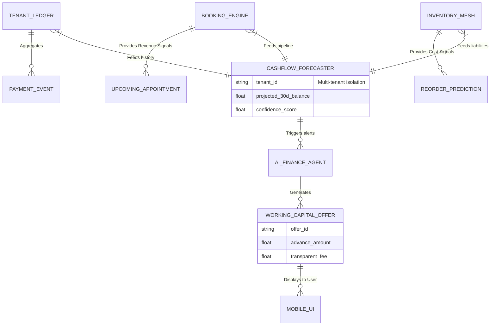

# [architecture] Autonomous Cashflow Forecasting & Working Capital Engine

## Title
Autonomous Cashflow Forecasting & Working Capital Engine

## Problem Statement
Small business owners—whether it's Maya buying ingredients for next month's custom cakes or Priya restocking her boutique for the holiday season—face extreme anxiety around "Financial Fog" (identified as a 35% pain point frequency). They lack the tools to accurately predict if they will have enough cash on hand next week to cover rent, payroll, or inventory purchases. The traditional banking system is reactive, and applying for working capital is a manual, anxiety-inducing process requiring spreadsheets and PDF exports. They need an invisible AI partner that proactively monitors their ledger, predicts cash shortfalls before they happen, and seamlessly offers 1-tap working capital advances perfectly sized to their upcoming needs, without them ever needing to ask or crunch numbers.

## Research Report
*   **Market Gap:** Traditional solutions (QuickBooks, Xero) offer retroactive reporting but require the user to build their own forecasts or pay an accountant. Lenders (Kabbage, OnDeck) require separate applications and don't natively understand the business's day-to-day operational data (like Maya's pending cake orders or Carlos's upcoming handyman appointments).
*   **Competitor Systems Audit:** Shopify Capital provides proactive offers but is heavily focused on e-commerce GMV, ignoring service-based bookings or hybrid businesses. Square Capital acts similarly but operates in a silo from the merchant's full operational calendar. Wix lacks deep predictive cashflow integration.
*   **OHC Differentiation - "Proactive Peace of Mind":** OHC integrates the merchant's calendar, pending invoices, inventory reorder triggers, and historical payout velocity into a single predictive graph. The **AI Finance Agent** runs continuous Monte Carlo simulations in the background. If a cash crunch is predicted, it intervenes *before* it happens, offering plain-language advice and instantly approved, 1-tap micro-loans.

## Design Doc

### Architecture Diagram

### Mobile UX Flow & UI Wireframes (375px First)
**Core Layout: macOS-style Translucent Glass + Ubiquiti UniFi Modular Dashboard Cards**
*   **Global Viewport:** 375px width (Mobile First). No horizontal scrolling.
*   **Screen 1: The Daily Briefing (Proactive Alert):**
    *   Instead of a generic dashboard, Maya opens the app and sees a priority frosted-glass card from her AI Finance Agent.
    *   **Text:** "Hi Maya. Based on your 14 upcoming cake orders and upcoming rent, you might be short $400 for ingredient restocking next Tuesday."
    *   **Action Button:** "Review Cashflow" (glows gently).
*   **Screen 2: Plain-Language Forecast:**
    *   A simple, visually appealing "Cash Timeline" (not a complex bar chart).
    *   Shows a horizontal line with green dots (Money In) and red dots (Money Out).
    *   Highlights the "Crunch Point" on Tuesday.
*   **Screen 3: 1-Tap Working Capital:**
    *   A modular card presenting the solution: "Get a $500 advance today to cover ingredients. Repaid automatically from your next 5 cake sales. Flat fee: $15."
    *   **Primary Button:** "Accept $500 Advance" (uses biometric authentication like FaceID for 1-tap approval).
    *   No jargon like "APR", "Term Loan", or "Underwriting".

### Key Design Decisions & Why
*   **Zero-Input Forecasting:** The forecaster runs entirely on existing platform data (bookings, invoices, inventory). The user never inputs estimates. This eliminates "Financial Fog" setup friction.
*   **Actionable Interventions, Not Just Data:** Predicting a shortfall is useless if the business owner can't solve it. Tying the forecast directly to a pre-approved working capital offer turns an anxiety-inducing alert into an immediate sigh of relief.
*   **Revenue-Based Repayment:** Repayments are taken as a percentage of future daily sales, aligning the platform's success with the merchant's cashflow reality.

### AI Agent Integration Points
*   **AI Finance Agent:** Continuously analyzes the `CASHFLOW_FORECASTER` outputs. Responsible for translating complex financial vectors into plain-language warnings in the Daily Briefing.
*   **AI Risk Agent (Background):** Evaluates the merchant's historical reliability, dispute rate, and booking density to underwrite the `WORKING_CAPITAL_OFFER` in real-time, ensuring Zero-Trust isolation where it only accesses the specific `tenant_id` data.

### Mobile Parity & Security Guarantees
*   **100% Mobile Parity:** The entire flow, from reading the forecast to securely accepting the capital via biometric signature, is designed for the 375px viewport.
*   **Zero Trust / Multi-Tenancy:** The predictive engine and risk evaluation run strictly within the isolated tenant boundary. Machine learning models generate local tenant-specific embeddings, ensuring Maya's financial velocity data is never cross-pollinated with Carlos's data.

## Implementation Prompt
Implement the Autonomous Cashflow Forecasting & Working Capital Engine. The system must aggregate data from the Ledger, Booking, and Inventory components to run continuous financial projections for a tenant. When a cash flow shortfall is predicted, it must generate a plain-language summary and a structured working capital offer via the AI Finance Agent. Build the background worker for projections and the API endpoints to serve the mobile-first Daily Briefing and 1-Tap Advance acceptance flow. Ensure strict row-level security and `tenant_id` isolation for all financial telemetry and risk evaluation. Do not prescribe specific database schemas or internal algorithm details for the ML models.

## Priority
P0

## Estimated Scope
Large