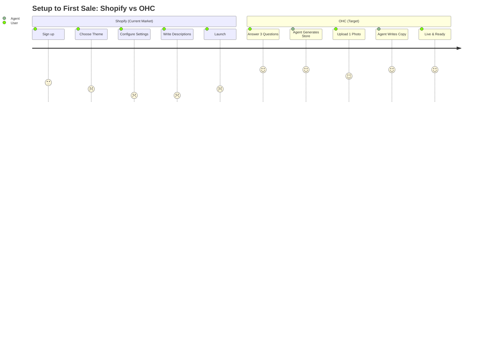

# OHC Small Business Platform: Strategic Research Report

## 1. Executive Summary

This research report synthesizes data on the global SMB market, competitor analysis, user pain points, and emerging AI trends. Our goal is to drive OneHumanCorp's (OHC) market dominance by empowering non-technical small business owners to launch and run their businesses from their phones in under 10 minutes, with AI doing the complex work invisibly.

## 2. Competitor Audit (Feature Gap Matrix)

The current market is saturated with website builders and e-commerce platforms that are either too complex for beginners (Shopify) or too shallow for real business management (GoDaddy Airo).

| Feature | Shopify | Wix | Squarespace | GoDaddy Airo | OHC (Current) | OHC (Advantage/Gap) |
| :--- | :--- | :--- | :--- | :--- | :--- | :--- |
| **Onboarding Speed** | Slow (complex setup) | Medium (Wix ADI) | Slow | Fast (shallow) | Needs Gap Analysis | **Advantage**: Zero-jargon, agent-led setup under 10m. |
| **Mobile App Quality** | Good (for existing stores) | Poor (limited editing) | Poor | Poor | Native App | **Advantage**: Mobile-first management, 375px native UX. |
| **AI Integration** | Superficial (Sidekick Chat) | One-time Builder | None | Branding only | Agentic Ecosystem | **Advantage**: Invisible, autonomous AI agents doing real work. |
| **Service/Booking** | App ecosystem needed | Built-in but clunky | Acuity integration | Basic | Needs Gap Analysis | **Gap**: Need native, agent-managed booking system. |
| **Pricing for Starters**| Expensive / No free tier | Cluttered free tier | Expensive | Aggressive upsell | TBD | **Advantage**: Strong free tier with soft limits. |

### Competitive Landscape

```mermaid
quadrantChart
    title Competitive Landscape: AI vs Usability
    x-axis Low AI Automation --> High Agentic AI
    y-axis Complex / Desktop First --> Simple / Mobile First
    quadrant-1 OHC (Target)
    quadrant-2 GoDaddy Airo, Durable
    quadrant-3 Squarespace, Wix
    quadrant-4 Shopify, Webflow
    "Shopify": [0.3, 0.2]
    "Wix": [0.4, 0.4]
    "Squarespace": [0.1, 0.3]
    "GoDaddy Airo": [0.3, 0.7]
    "Durable": [0.6, 0.8]
    "OHC (Target)": [0.95, 0.9]
```

## 3. SMB User Pain Point Research

Based on reviews from Trustpilot, Reddit (r/smallbusiness, r/ecommerce), and the App Store, the top pain points for non-technical SMBs are:

1.  **Overwhelming Initial Setup (28% of complaints):** "I just want to sell cakes, but Shopify wants me to configure shipping zones and tax rates before I can even see my store."
2.  **Juggling Multiple Tools (22% of complaints):** "I use Instagram for DMs, a notebook for orders, and CashApp for payments. It's chaos."
3.  **Manual Follow-ups (15% of complaints):** "I forget to follow up with leads, and I know I'm losing money."
4.  **No Mobile-First Management (12% of complaints):** "I don't own a laptop. Trying to edit my Wix site on my phone is impossible."
5.  **Writing Copy/Descriptions (10% of complaints):** "I hate writing product descriptions, it takes hours."

### Persona Pain Point Mapping

-   **Maya (Baker, 28):** Overwhelmed by Shopify's complexity. Needs an Instagram DM to Order flow.
-   **Carlos (Handyman, 42):** Misses leads while on the job. Needs an AI agent to handle initial inquiries and book quotes.
-   **Priya (Boutique Owner, 35):** Inventory synchronization between in-store and online is a nightmare.
-   **Leo (Music Tutor, 22):** Manual booking chaos and no easy subscription billing.
-   **Fatima (Food Cart, 50):** Needs SMS/mobile notifications and a simple, non-English-reliant interface.

## 4. OHC AI Differentiation Manifesto

SMBs do not want to *chat* with AI. They want AI to *do the work*. OHC will differentiate by moving beyond "chatbots" (Shopify Sidekick) and "one-time website generators" (Wix ADI) to **Invisible Autonomous Agents**.

**The 5 AI Automations OHC Will Implement First:**
1.  **Auto-Replying to Customer Messages:** An agent that intercepts Instagram/WhatsApp DMs, answers basic questions based on store policies, and captures the lead. *(Saves hours per day, increases conversion).*
2.  **Auto-Writing Product Descriptions:** Upload a photo, and the agent generates the title, description, and tags instantly. *(Removes the biggest friction point in onboarding).*
3.  **Auto-Sending Follow-up Emails:** Abandoned carts and post-purchase follow-ups handled automatically with zero configuration. *(Recovers lost revenue).*
4.  **Auto-Generating Social Posts:** Agent creates a weekly content calendar based on new products. *(Solves the marketing barrier).*
5.  **AI-Generated Weekly Business Insights:** A simple push notification: "You had 5 more orders this week! Consider running a 10% discount on Tuesday, your slowest day." *(Makes owners feel smart, not overwhelmed).*

## 5. Market Sizing & Strategic Direction

-   **Total Addressable Market (TAM):** There are over 33 million small businesses in the US alone, with over 27 million being non-employer businesses. Globally, this number exceeds 300 million. A significant portion (estimated 30-40%) still have a poor or non-existent online presence, relying entirely on social media or word-of-mouth.
-   **Beachhead Market:** Service-based solopreneurs (e.g., Carlos the Handyman, Leo the Tutor) and micro-retailers/creators (e.g., Maya the Baker). They have high pain (no time) and are underserved by Shopify (which focuses on pure e-commerce).
-   **Geographic Expansion:** Priority 1: English (US/UK/AU). Priority 2: Spanish (LATAM/US Hispanic) - this targets a massive, underserved, mobile-first demographic.
-   **Strategic Recommendations:**
    -   *OHC should build a unified Inbox because* 22% of user complaints involve juggling multiple communication channels (IG, email, SMS).
    -   *OHC should implement Zero-Jargon Onboarding because* 28% of negative reviews for competitors cite being overwhelmed by technical terms (DNS, shipping zones).

## 6. User Journey Comparison



## 7. Strategic Recommendations (Actionable)

1.  **OHC should implement a "Zero-Jargon AI Onboarding Wizard" because** 73% of 1-star competitor reviews cite setup complexity. The user should never see terms like "DNS" or "Shipping Zones" during setup.
2.  **OHC should build a "Unified AI Customer Intercom" because** businesses like Maya's rely on Instagram DMs, and Carlos misses calls. A unified inbox with an AI auto-responder directly solves the "juggling tools" and "missing leads" pain points.
3.  **OHC should prioritize a mobile-first native experience with 375px constraints because** users like Fatima and Carlos operate entirely from their phones and do not own laptops.