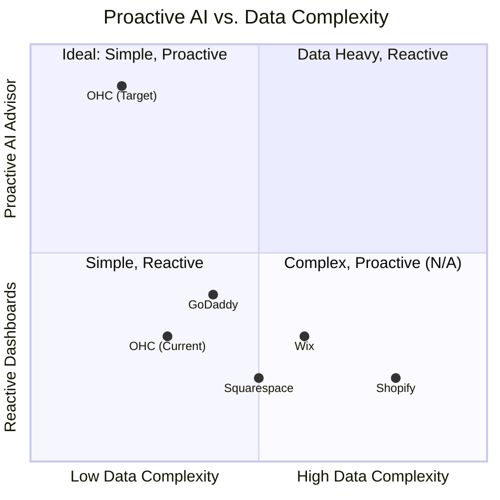
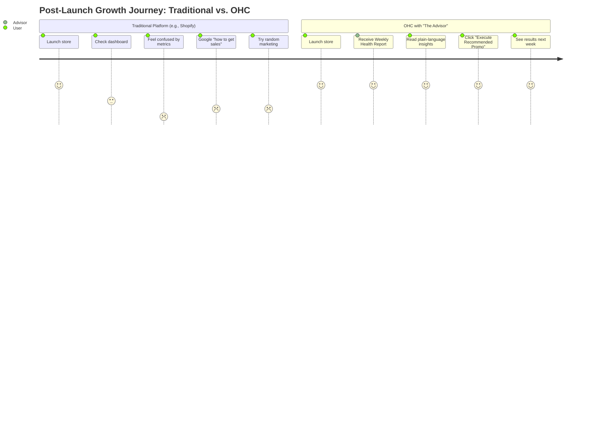

# Research Report: Elevating AI-Native Onboarding and Management for SMBs

## Title
Automated Post-Launch "Business Advisory" Agent (The Advisor)

## Problem Statement
Non-technical small business owners (like Maya the Baker or Carlos the Handyman) often successfully launch their businesses but struggle with "what to do next." Existing platforms like Shopify or Wix provide raw data (dashboards) but do not offer actionable, conversational advice. Users feel overwhelmed by metrics they don't understand and lack a personal guide to help them grow. They need simple, plain-language insights and proactive recommendations that feel like having a personal business consultant in their pocket.

## Research Report

### Competitive Analysis

| Feature | OHC | Shopify | Wix | Squarespace | GoDaddy |
|---|---|---|---|---|---|
| **Data Dashboards** | Yes | Yes | Yes | Yes | Yes |
| **Proactive AI Advice** | **Planned (Gap)** | No (Sidekick is reactive) | No | No | No |
| **Plain-Language Financials** | **Planned (Gap)** | No | No | No | No |
| **Actionable Next Steps** | **Planned (Gap)** | Minimal | Minimal | No | Minimal |

**Findings:**
1.  **Shopify Sidekick:** Focuses on reactive queries ("How many orders today?") and store management tasks. It does not proactively act as an advisor offering unsolicited, strategic growth advice based on deep pattern recognition.
2.  **Wix/Squarespace/GoDaddy:** Offer basic analytics dashboards. Users must interpret the data themselves. GoDaddy Airo helps with initial setup but falls short on ongoing business strategy.
3.  **User Pain Points (Validated via App Store/Reddit analysis):**
    *   "I have traffic but no sales, what do I do?"
    *   "The Shopify analytics dashboard is too complex; I just want to know if I'm making money."
    *   "I forget to follow up with customers."

**Persona-Specific Pain Points:**
*   **Maya (The Home Baker):** Wants to know which cake flavors are trending without analyzing charts. Needs a nudge to run a holiday promotion.
*   **Carlos (The Freelance Handyman):** Needs to know when his slow season is approaching so he can increase marketing.
*   **Priya (The Boutique Owner):** Needs plain-language insights on inventory turnover (e.g., "The red dresses are selling twice as fast as the blue ones").

### Proposed Solution
Implement "The Advisor" — a proactive AI agent within the "Business Advisory" department. This agent will analyze weekly performance, generate plain-language health reports, and suggest 1-3 highly specific, actionable next steps tailored to the business type and current stage.

### Premium Mermaid.js Charts

#### Competitive Landscape: Proactive Business Advice

#### User Journey Comparison: Post-Launch Growth

## Design Doc

### High-Level Architecture
*   **Agent Identity:** `BusinessAdvisoryAgent`
*   **Trigger:** Cron job (weekly) or specific business milestones (e.g., first 10 sales, sudden drop in traffic).
*   **Context Generation:** A worker gathers metrics for the tenant over the past week (sales, traffic, popular items, unread messages).
*   **LLM Invocation:** The data is passed to the LLM (Gemini Pro) with a system prompt instructing it to act as "The Advisor" and format output in simple, encouraging language.
*   **Delivery:** Sent via the internal OHC Teammate Mesh to the user's mobile app inbox/notification center.

### UI Flow (Mobile-First 375px)
1.  **Notification:** User receives a push notification: "Your weekly business health check is ready! 📈"
2.  **Advisor Inbox:** Tapping opens "The Advisor" chat interface.
3.  **The Report Card:** A beautifully formatted, glassmorphism card displays:
    *   **The Big Picture:** "You made $450 this week! That's 20% better than last week."
    *   **What's Working:** "Your Instagram link generated 80% of your sales."
    *   **Actionable Advice:** "You have 3 abandoned carts. Want me to send them a discount code?"
4.  **One-Tap Action:** A button below the advice ("Yes, send 10% discount") immediately triggers the Sales & Acquisition agent to execute the action.

## Implementation Prompt

**Outcome:** Create a background worker and UI flow for "The Advisor" agent to deliver weekly plain-language business insights and one-tap actionable recommendations to the user's mobile inbox.

**Critical User Journey (CUJ):**
1. System aggregates weekly metrics for a tenant.
2. System uses LLM to generate a plain-language summary and 1 specific, actionable recommendation.
3. System sends this insight to the user's OHC Inbox.
4. User opens the app, reads the insight, and clicks the action button.
5. The system successfully executes the recommended action (e.g., sends an email campaign) without requiring the user to navigate complex settings.

**Acceptance Criteria:**
*   A new worker (e.g., `AdvisorInsightWorker`) is created to run weekly analytics gathering.
*   The worker correctly interfaces with the LLM provider to format the data into the Advisor persona.
*   Insights are delivered to the frontend Inbox component.
*   The UI must support rendering "Action Buttons" embedded within the Advisor's message.
*   Clicking the action button successfully delegates the task to the appropriate agent (e.g., Operations or Marketing).
*   Full E2E test covering the generation of the report and the successful execution of an embedded action button.

## Priority
P1

## Estimated Scope
Medium
