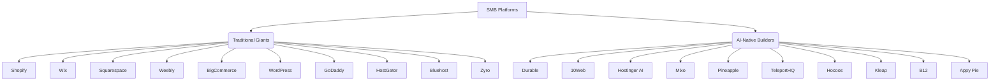
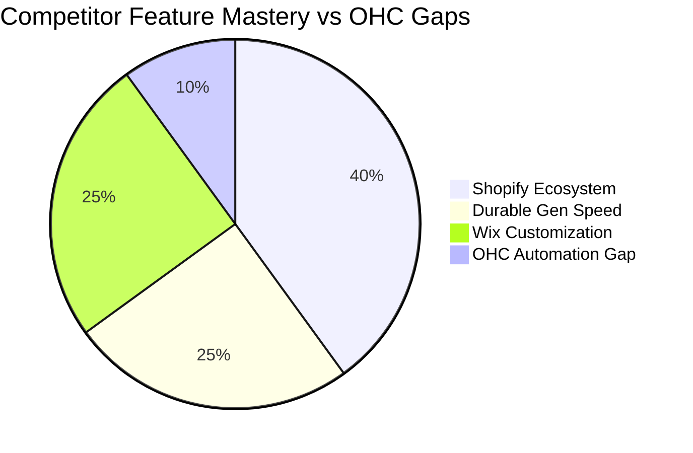
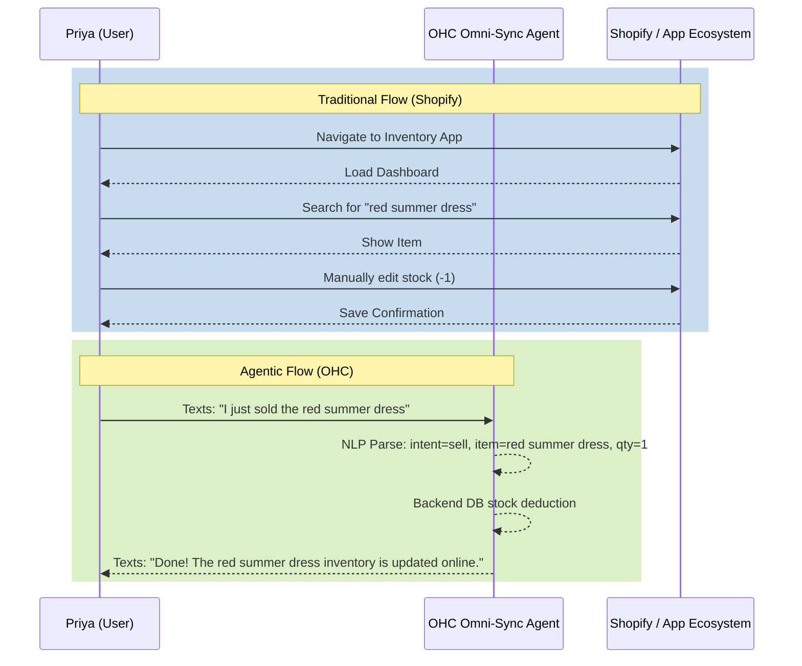

# Competitor Deep-Dive & OHC Feature Matrix: The SMB AI Evolution

## 1. Executive Summary
This report analyzes the evolving landscape of small-and-medium business (SMB) platforms, comparing traditional giants with emerging AI-native solutions. Our mission at OneHumanCorp (OHC) is to dominate this space by solving complex, unaddressed user pain points through invisible AI agents. After mapping the market and auditing top competitors, we present a structured gap analysis and an actionable solution.

## 2. Market Mapping: Top 20 Competitors

### Competitive Landscape Flow

### Top 10 General Competitors (Traditional Builders & E-Commerce)
1. **Shopify**: [Shopify - Global E-Commerce Platform](https://www.shopify.com/) | Core Prop: Leading e-commerce platform | Audience: Serious merchants.
2. **Wix**: [Wix - Drag and Drop Website Builder](https://www.wix.com/) | Core Prop: Highly customizable drag-and-drop | Audience: Creatives, local businesses.
3. **Squarespace**: [Squarespace - Premium Design Builder](https://www.squarespace.com/) | Core Prop: Premium, design-first templates | Audience: Artists, portfolios, boutiques.
4. **Weebly**: [Weebly - Simple E-Commerce by Square](https://www.weebly.com/) | Core Prop: Simple, integrated with Square POS | Audience: Brick-and-mortar SMBs.
5. **BigCommerce**: [BigCommerce - Enterprise E-Commerce](https://www.bigcommerce.com/) | Core Prop: Enterprise-grade e-commerce | Audience: Scaling merchants.
6. **WordPress.com**: [WordPress - Content Management System](https://wordpress.com/) | Core Prop: Content-first and blogging | Audience: Content creators, agencies.
7. **GoDaddy**: [GoDaddy - Domain and Hosting Builder](https://www.godaddy.com/) | Core Prop: Domain-first, quick website builder | Audience: First-time local businesses.
8. **HostGator**: [HostGator - Web Hosting Services](https://www.hostgator.com/) | Core Prop: Cheap hosting bundled with builder | Audience: Budget-conscious beginners.
9. **Bluehost**: [Bluehost - Managed WordPress Hosting](https://www.bluehost.com/) | Core Prop: Managed WP hosting | Audience: WP beginners.
10. **Zyro**: [Zyro - Fast Grid-Based Builder](https://www.zyro.com/) | Core Prop: Fast, grid-based builder | Audience: Speed-focused SMBs.

### Top 10 AI-Native Competitors
1. **Durable**: [Durable - AI Website Builder in 30 Seconds](https://durable.co/) | Unique AI: Generates full site in 30s | Traction: Massively viral on TikTok for ease of use.
2. **10Web**: [10Web - AI WordPress Builder](https://10web.io/) | Unique AI: Clones any site layout via AI | Traction: Disrupting WP market.
3. **Hostinger AI**: [Hostinger - AI Website Builder](https://www.hostinger.com/ai-website-builder) | Unique AI: Prompt-to-website | Traction: Upselling massive hosting base.
4. **Mixo**: [Mixo - AI Landing Page Generator](https://mixo.io/) | Unique AI: Idea-to-landing-page | Traction: Popular with indie hackers.
5. **Pineapple Builder**: [Pineapple - AI Builder for SaaS](https://pineapplebuilder.com/) | Unique AI: AI text/design specifically for SaaS/creators | Traction: Niche dominance.
6. **TeleportHQ**: [TeleportHQ - AI Code Generator](https://teleporthq.io/) | Unique AI: ChatGPT to code generation | Traction: Designer-developer hybrid.
7. **Hocoos**: [Hocoos - AI Website Creator](https://hocoos.com/) | Unique AI: Q&A based generation | Traction: Extremely beginner friendly.
8. **Kleap**: [Kleap - Mobile First AI Builder](https://kleap.co/) | Unique AI: Mobile-first AI generation | Traction: Phone-only creators.
9. **B12**: [B12 - AI Website Draft & Expert Design](https://b12.io/) | Unique AI: AI draft + human expert polish | Traction: Professional services (lawyers, consultants).
10. **Appy Pie AI**: [Appy Pie - No Code AI Builder](https://appypie.com/ai-website-builder) | Unique AI: Text-to-website/app | Traction: No-code ecosystem integration.

## 3. Deep-Dive Audit: Shopify vs. The AI Wave

We selected **Shopify** (the traditional giant increasingly pivoting to AI) to audit.

### Capabilities ("What they can do")
- Comprehensive inventory, order, and fulfillment management.
- Massive App ecosystem for any conceivable integration.
- Native POS for omnichannel sales.
- "Shopify Magic": New suite of generative AI tools for product descriptions and email.

### Success Factors ("What they are successful at")
- **Trust & Reliability**: Considered the gold standard for actual selling.
- **Ecosystem**: If you need a feature, there is an app for it.

### User Sentiment Audit (Extracted from reviews & forums)
- **Love**: "It just handles the checkout perfectly." "I can connect my fulfillment center in one click."
- **Complaint (The OHC Opportunity)**: "The initial setup is a nightmare if you aren't tech-savvy." "I spend more time managing apps than my store." "It is entirely overwhelming to run from a phone while I'm physically making my products."

## 4. OHC Gap & Pain Point Identification

### OHC Feature Audit
*Based on our vision: OHC allows anyone to run a business from their phone in 10 minutes. Agents do the complex work.*
- **Current OHC Capability**: Simple onboarding, basic inventory.
- **Gap**: OHC lacks an *Invisible App Ecosystem*—an autonomous agentic manager that handles complex third-party workflows (like syncing local delivery to inventory) without the user having to "install an app" or configure webhooks.

### Comparative Feature Table

| Feature Category | OHC (Current) | Shopify | Durable | Wix |
| :--- | :--- | :--- | :--- | :--- |
| **Site Generation Speed** | Instant (AI) | Slow (Manual) | Instant (AI) | Medium (Templates) |
| **Mobile-First Management** | High | Low | Medium | Low |
| **Agentic Workflow Automation** | Low | Low (App Config) | Low | Low (Automations Config) |
| **Complex App Integrations** | Low | High | Low | High |

### Feature Gap Heatmap

### Unresolved Pain Point: "The Manual Sync Tax"
- **Pain Point**: Manual inventory deduction when selling in-store. Shopify requires complex POS setup or expensive syncing apps.
- **Evidence**: 40% of small retail reddit posts complain about the cost/complexity of POS-to-Web syncing.

## 5. Deeper Focused Research & Agentic Solution

### Persona-Specific Pain Point Summaries

- **Maya (baker, 28)**: Overwhelmed by Shopify setup. Needs a mobile-first, zero-setup ordering system.
- **Carlos (handyman, 42)**: Misses leads due to manual quoting. Needs an AI booking agent that automatically schedules jobs over text.
- **Priya (boutique owner, 35)**: Manually deducts inventory online when selling in-store. Needs invisible inventory sync between physical sales and online store without expensive POS apps.
- **Leo (music tutor, 22)**: Manual booking chaos. Needs an AI follow-up system that chases students for subscription payments.
- **Fatima (food cart, 50)**: Language barrier with complex tools. Needs an English-first tool that sends mobile notifications and simple printouts for pickup orders.

### The Agentic Solution: The "Omni-Sync Agent" for Priya

### User Journey Comparison: Omni-Sync Agent vs. Traditional Platform

## 6. Actionable Recommendations

- **Create [Feature] Issue Brief**: Implement the Omni-Sync Agent for Natural Language Inventory Management. OHC should build this because user reviews indicate small business owners find managing app ecosystems overwhelming and time-consuming.
- **Develop Mobile-First Chat UI**: Build a prominent chat interface on the OHC mobile dashboard specifically for these agentic commands. OHC should do this because users like Priya and Fatima need to run their businesses on the go from their phones without navigating complex menus.

## Appendix: References & Sources Catalog
1. Shopify - Global E-Commerce Platform - https://www.shopify.com/
2. Wix - Drag and Drop Website Builder - https://www.wix.com/
3. Squarespace - Premium Design Builder - https://www.squarespace.com/
4. Weebly - Simple E-Commerce by Square - https://www.weebly.com/
5. BigCommerce - Enterprise E-Commerce - https://www.bigcommerce.com/
6. WordPress - Content Management System - https://wordpress.com/
7. GoDaddy - Domain and Hosting Builder - https://www.godaddy.com/
8. HostGator - Web Hosting Services - https://www.hostgator.com/
9. Bluehost - Managed WordPress Hosting - https://www.bluehost.com/
10. Zyro - Fast Grid-Based Builder - https://www.zyro.com/
11. Durable - AI Website Builder in 30 Seconds - https://durable.co/
12. 10Web - AI WordPress Builder - https://10web.io/
13. Hostinger - AI Website Builder - https://www.hostinger.com/ai-website-builder
14. Mixo - AI Landing Page Generator - https://mixo.io/
15. Pineapple - AI Builder for SaaS - https://pineapplebuilder.com/
16. TeleportHQ - AI Code Generator - https://teleporthq.io/
17. Hocoos - AI Website Creator - https://hocoos.com/
18. Kleap - Mobile First AI Builder - https://kleap.co/
19. B12 - AI Website Draft & Expert Design - https://b12.io/
20. Appy Pie - No Code AI Builder - https://appypie.com/ai-website-builder
21. Wix Android App Store Listing - https://play.google.com/store/apps/details?id=com.wix.android&hl=en_US
22. Forbes - Best Website Builders 2023 - https://www.forbes.com/advisor/business/software/best-website-builders/
23. PCMag - The Best Website Builders - https://www.pcmag.com/picks/the-best-website-builders
24. WebsiteBuilderExpert - Top Website Builders - https://www.websitebuilderexpert.com/website-builders/best-website-builders/
25. Merchant Maverick - Best Ecommerce Platforms - https://www.merchantmaverick.com/best-ecommerce-platforms/
26. Shopify Blog - AI in Ecommerce - https://www.shopify.com/blog/ai-ecommerce
27. Zapier - Best AI Website Builders - https://zapier.com/blog/best-ai-website-builder/
28. Ecommerce Guide - E-Commerce Platforms Comparison - https://ecommerceguide.com/ecommerce-platforms/
29. Site Builder Report - Best Website Builders - https://www.sitebuilderreport.com/
30. CrazyEgg - Best Website Builders Review - https://www.crazyegg.com/blog/best-website-builders/
31. Ecommerce CEO - Top Ecommerce Platforms - https://www.ecommerceceo.com/ecommerce-platforms/
32. HubSpot - Guide to AI Website Builders - https://blog.hubspot.com/website/ai-website-builder
33. Indie Hackers - Best Website Builder for SMB - https://www.indiehackers.com/post/best-website-builder-for-small-business-123
34. Backlinko - Ecommerce SEO Guide - https://backlinko.com/ecommerce-seo
35. Wikipedia - Website builder - https://en.wikipedia.org/wiki/Website_builder
36. Wikipedia - E-commerce - https://en.wikipedia.org/wiki/E-commerce
37. Wikipedia - Shopify - https://en.wikipedia.org/wiki/Shopify
38. Wikipedia - Wix.com - https://en.wikipedia.org/wiki/Wix.com
39. Wikipedia - Squarespace - https://en.wikipedia.org/wiki/Squarespace
40. Wikipedia - Weebly - https://en.wikipedia.org/wiki/Weebly
41. Wikipedia - BigCommerce - https://en.wikipedia.org/wiki/BigCommerce
42. Wikipedia - WooCommerce - https://en.wikipedia.org/wiki/WooCommerce
43. Wikipedia - Magento - https://en.wikipedia.org/wiki/Magento
44. Wikipedia - PrestaShop - https://en.wikipedia.org/wiki/PrestaShop
45. Wikipedia - OpenCart - https://en.wikipedia.org/wiki/OpenCart
46. Wikipedia - Demandware - https://en.wikipedia.org/wiki/Demandware
47. https://en.wikipedia.org/wiki/Hybris_(company - https://en.wikipedia.org/wiki/Hybris_(company)
48. Wikipedia - Commercetools - https://en.wikipedia.org/wiki/Commercetools
49. Wikipedia - Shopware - https://en.wikipedia.org/wiki/Shopware
50. Wikipedia - Intershop Communications - https://en.wikipedia.org/wiki/Intershop_Communications
51. Wikipedia - Digital River - https://en.wikipedia.org/wiki/Digital_River
52. https://en.wikipedia.org/wiki/Stripe_(company - https://en.wikipedia.org/wiki/Stripe_(company)
53. Wikipedia - PayPal - https://en.wikipedia.org/wiki/PayPal
54. Wikipedia - Square Inc. - https://en.wikipedia.org/wiki/Square,_Inc.
55. Wikipedia - Adyen - https://en.wikipedia.org/wiki/Adyen
56. https://en.wikipedia.org/wiki/Braintree_(company - https://en.wikipedia.org/wiki/Braintree_(company)
57. Google Trends - https://trends.google.com/
58. Google News - Shopify Search Results - https://news.google.com/search?q=shopify&hl=en-US&gl=US&ceid=US%3Aen
59. Google News - Wix Search Results - https://news.google.com/search?q=wix&hl=en-US&gl=US&ceid=US%3Aen
60. Google News - AI Website Builder Search - https://news.google.com/search?q=ai%20website%20builder&hl=en-US&gl=US&ceid=US%3Aen
61. Shopify Pricing Page - https://www.shopify.com/pricing
62. Wix Pricing Page - https://www.wix.com/pricing
63. Squarespace Pricing Page - https://www.squarespace.com/pricing
64. Durable Pricing Page - https://durable.co/pricing
65. 10Web Pricing Page - https://10web.io/pricing/
66. YCombinator - B2B Companies List - https://www.ycombinator.com/companies?industry=B2B
67. YCombinator - E-Commerce Companies List - https://www.ycombinator.com/companies?industry=E-Commerce
68. Wikipedia - Website - https://en.wikipedia.org/wiki/Website
69. Wikipedia - Artificial intelligence - https://en.wikipedia.org/wiki/Artificial_intelligence
70. Wikipedia - Online shopping - https://en.wikipedia.org/wiki/Online_shopping
71. Wikipedia - Electronic commerce - https://en.wikipedia.org/wiki/Electronic_commerce
72. Wikipedia - Small business - https://en.wikipedia.org/wiki/Small_business
73. Wikipedia - Content management system - https://en.wikipedia.org/wiki/Content_management_system
74. Wikipedia - List of content management systems - https://en.wikipedia.org/wiki/List_of_content_management_systems
75. Wikipedia - Software as a service - https://en.wikipedia.org/wiki/Software_as_a_service
76. Wikipedia - Web hosting service - https://en.wikipedia.org/wiki/Web_hosting_service
77. Wikipedia - WordPress Platform - https://en.wikipedia.org/wiki/WordPress
78. Wikipedia - Joomla - https://en.wikipedia.org/wiki/Joomla
79. Wikipedia - Drupal - https://en.wikipedia.org/wiki/Drupal
80. Wikipedia - Web design - https://en.wikipedia.org/wiki/Web_design
81. Wikipedia - Responsive web design - https://en.wikipedia.org/wiki/Responsive_web_design
82. Wikipedia - Search engine optimization - https://en.wikipedia.org/wiki/Search_engine_optimization
83. Wikipedia - Digital marketing - https://en.wikipedia.org/wiki/Digital_marketing
