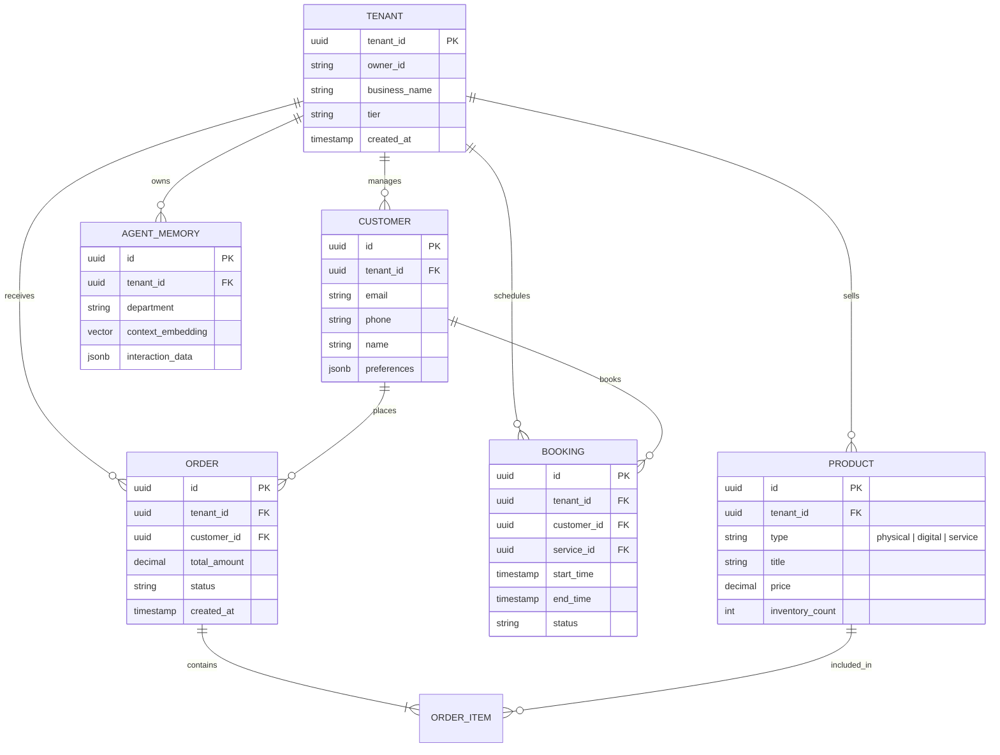

# [Architecture] Unified Data Model Architecture

## Problem Statement
The OneHumanCorp (OHC) platform serves diverse non-technical business owners, ranging from bakers to handymen to online tutors. These personas have significantly different entity and data requirements (e.g., physical inventory, booked time slots, digital downloads). Operating these businesses on a single platform requires a robust, unified data model that can effortlessly support all variants while enforcing strict multi-tenant isolation so that zero-knowledge users never accidentally expose their data or run into structural limitations as they grow. A fragmented or poorly isolated schema leads to data leaks, complicated AI agent context retrieval, and increased latency across mobile clients.

## Research Report
An analysis of competing platforms highlights the challenges in multi-tenant data modeling:
- **Shopify & Wix:** Emphasize physical and digital products well but require complex app ecosystems to handle services or bookings, resulting in fragmented data models that are hard for AI to reason over universally.
- **Squarespace:** Connects portfolio and store, but lacks deep multi-tenant row-level capabilities that scale dynamically without significant schema gymnastics.
- **OHC Opportunity:** By architecting a unified PostgreSQL schema with native `tenant_id` Row Level Security (RLS) embedded deeply into every entity, we establish a robust foundation. This allows our AI departments to seamlessly traverse orders, bookings, customers, and payments in one cohesive graph.

## Design Doc

### Entity-Relationship Architecture Diagram

### Key Invariants
1. **Absolute Tenant Isolation:** Every single table in the schema MUST include a `tenant_id` column.
2. **Row Level Security (RLS):** PostgreSQL `ENABLE ROW LEVEL SECURITY` must be applied to all tables. Policies ensure that a business owner (or their authenticated AI agents) can only ever read, update, or delete rows where the `tenant_id` matches their authenticated session context.
3. **Unified Entity Graph:** Physical products, digital goods, and service bookings all tie back uniformly to `Order` and `Customer` entities, allowing AI and reporting systems to aggregate revenue agnostic of the product type.

### Migration Strategy
- **Additive Changes:** Schema evolution should rely on additive migrations (adding columns, creating new tables) rather than destructive ones, leveraging PostgreSQL's transactional DDL.
- **JSONB for Extensibility:** Use `jsonb` columns for highly variable attributes (like `preferences` on Customer or `metadata` on Product variants) to reduce the need for constant schema migrations when adding new niche business types.
- **Zero-Downtime:** All migrations must be designed for zero-downtime execution, using `CONCURRENTLY` for index creation and default values to avoid table rewrites.

### UI Wireframes Description
- **Data Privacy Settings (375px):** A minimalist mobile view where the business owner can see their active plan, storage limits, and export their entire customer list.
- **Unified Customer Profile:** A single screen that aggregates a customer's total lifetime value, combining both service bookings (e.g., handyman visits) and product purchases (e.g., parts).

### Mobile UX Flow
1. **Trigger:** Business owner taps "Customers" from the bottom navigation.
2. **View:** They see a unified list of customers. Tapping a customer reveals their holistic history (Orders + Bookings).
3. **AI Action:** A button "Ask Ambassador" allows the owner to ask "When was Carlos's last plumbing fix?"
4. **Resolution:** The AI agent securely queries the `ORDER` and `BOOKING` tables under the strict RLS of the current `tenant_id` and replies instantly.

### AI Agent Integration Points
- **Context Retrieval:** The `AGENT_MEMORY` table utilizes pgvector. When the Ambassador department interacts with a customer, it retrieves their past `ORDER` and `BOOKING` data joined securely by `tenant_id`.
- **Advisory Analytics:** The Business Advisory agent can safely aggregate financial metrics across `ORDER` and `BOOKING` tables to generate weekly insights, knowing RLS prevents accidental data cross-pollination.

## Implementation Prompt
**Task:** Implement the unified multi-tenant database schema foundation in PostgreSQL, including the core tables (Tenant, Customer, Product, Order, Booking, AgentMemory).
**CUJ:** A user logs in and their backend session correctly establishes their `tenant_id` context. All subsequent database reads/writes (whether initiated by the UI or an autonomous AI agent) are automatically filtered by PostgreSQL RLS, preventing them from accessing another user's data.
**Acceptance Criteria:**
- Define the DDL for the core tables with `tenant_id` on every table.
- Implement PostgreSQL Row Level Security (RLS) policies for tenant isolation.
- Ensure `pgvector` extension is enabled and integrated into the `AgentMemory` schema.
- Write backend E2E tests verifying that queries attempting to access data from a different `tenant_id` return zero rows.

## Priority
P0

## Estimated Scope
Large

