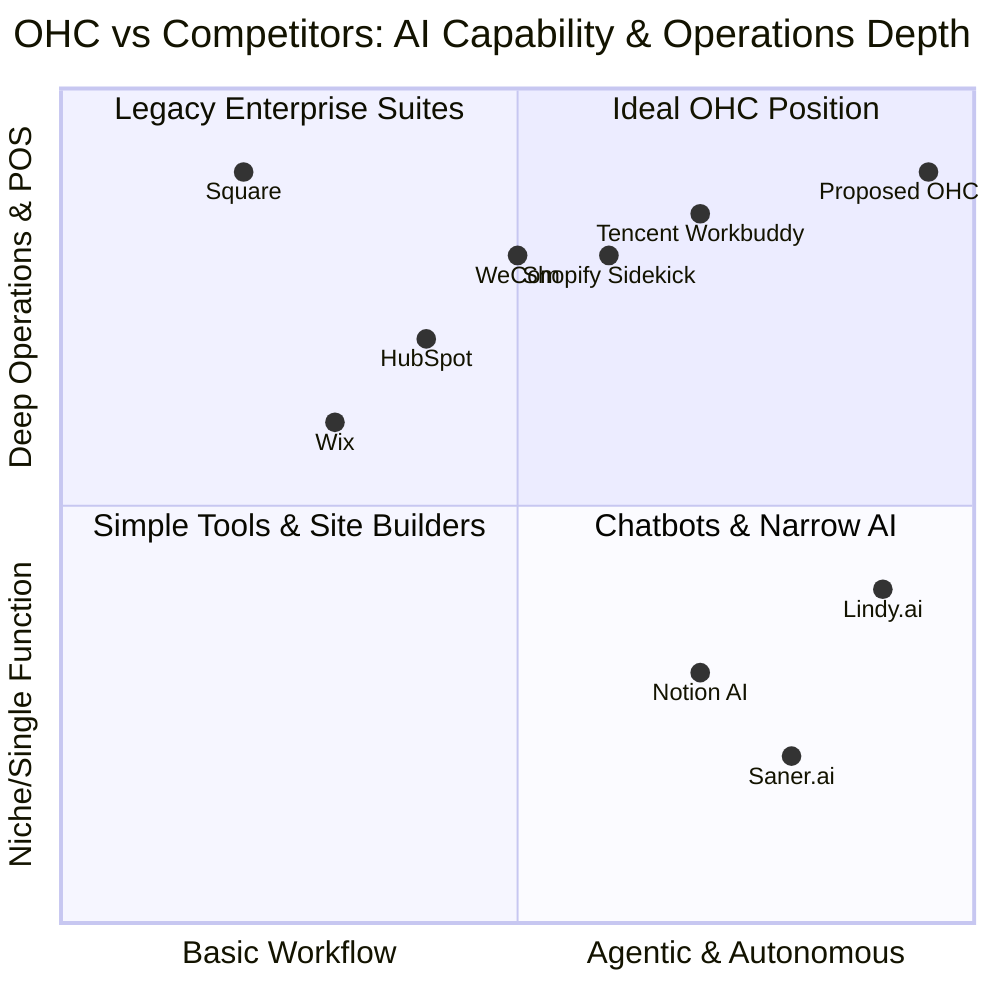
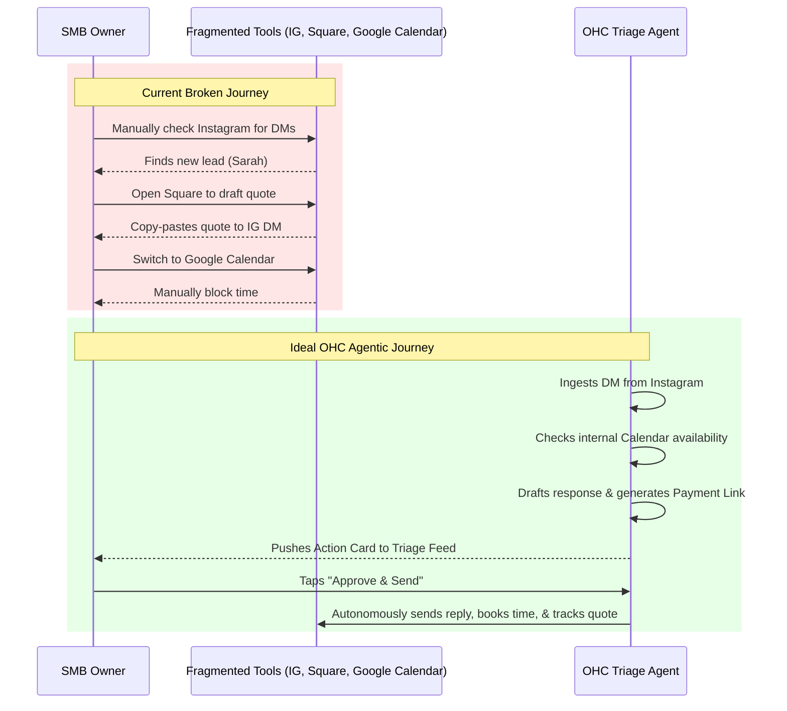

issue_title: "Actionable AI Work Assistants for SMBs: A Gap Analysis & Product Strategy"
issue_description: |
  # Actionable AI Work Assistants for SMBs: A Gap Analysis & Product Strategy

  ## 1. Problem Statement
  Small and Medium Business (SMB) owners—like Maya the baker or Carlos the handyman—are fundamentally overwhelmed by disconnected tools. They are currently forced to cobble together Shopify, Instagram DMs, Square, Google Calendar, and spreadsheets. Their biggest problem is not a lack of software, but a lack of *coordination*. Existing AI assistants (like ChatGPT or Copilot) are conversational or enterprise-focused, meaning the owner still has to prompt them and manually move data between systems. There is a critical gap for an "Owner Work Assistant" that proactively monitors the business, flags actionable items, and autonomously executes cross-system tasks (e.g., turning an Instagram DM into a quote, scheduling it, and preparing a payment link) with minimal owner intervention.

  ## 2. Market Mapping & Competitor Discovery

  ### Top 10 General Competitors
  1. **Shopify** (Commerce & basic ops, now adding Sidekick)
  2. **Square** (POS & local ops)
  3. **Wix** (Website building & basic booking)
  4. **HubSpot** (CRM & marketing)
  5. **Notion** (Knowledge & flexible databases)
  6. **Microsoft Copilot** (Enterprise productivity)
  7. **Tencent Workbuddy** (Comprehensive enterprise assistant)
  8. **WeCom** (Tencent's enterprise communication tool)
  9. **DingTalk** (Alibaba's enterprise communication & ops)
  10. **Feishu / Lark** (ByteDance's unified collaboration)

  ### Top 10 AI-Native Competitors
  1. **Lindy.ai** (Autonomous autonomous agents)
  2. **Saner.ai** (AI knowledge & note assistant)
  3. **MindStudio** (No-code AI app builder for businesses)
  4. **Harvey** (AI for professional services/legal)
  5. **Glean** (AI enterprise search & knowledge)
  6. **Sierra** (Conversational AI for customer service)
  7. **MultiOn** (Autonomous web agents)
  8. **Artisan AI** (Digital AI employees / artisan agents)
  9. **SmythOS** (AI agent orchestration)
  10. **Bland AI** (Conversational phone agents for businesses)

  ## 3. Deep-Dive Competitor Audit: Shopify Sidekick

  ### Capabilities ("What they can do")
  Shopify Sidekick acts as a conversational commerce assistant deeply integrated into the Shopify admin panel.
  * **Store Management:** It can generate reports ("What were my top-selling products last week?").
  * **Content Generation:** Can write blog posts or rewrite product descriptions.
  * **Store Configuration:** Can modify store settings, set up discounts, or change themes based on natural language prompts.
  * **Workflow:** Primarily a reactive, chat-based interface.

  ### Success Factors
  * **Deep Native Integration:** Has zero-latency access to the merchant's exact product catalog, order history, and customer data.
  * **Contextual Awareness:** It understands the exact context of the Shopify admin page the user is currently viewing.

  ### User Sentiment Audit (Reddit / Small Business Forums)
  * **Praise:** Users love the potential to automate tedious tasks like writing hundreds of product descriptions or finding specific settings in the complex Shopify backend.
  * **Pain Points:**
      * *Fragmented Reality:* Sidekick only knows about Shopify. It cannot read a contractor's Gmail, check a plumber's Google Calendar, or read DMs on Instagram.
      * *Reactive, Not Proactive:* "I still have to know what to ask." Owners want an assistant that says, "You have 3 unread leads, I've drafted responses," rather than waiting to be asked "Do I have any leads?"
      * *Complexity:* Shopify itself is seen as too complex for a solo service provider (e.g., a handyman or tutor).

  ## 4. OHC Gap & Pain Point Identification

  ### OHC Feature Audit (Current State)
  OHC is currently building a robust backend (Go/Bazel/PostgreSQL) and a multi-platform Flutter frontend. The vision is strong, but the current implementation lacks the proactive, unifying "Assistant-First Shell" that ties all the capabilities together.

  ### Gap Matrix (OHC vs. Shopify Sidekick vs. The Ideal)
  | Feature | Shopify Sidekick | OHC (Current) | OHC (Ideal Vision) |
  | :--- | :--- | :--- | :--- |
  | **Commerce Data** | Excellent | Building | Unified & Invisible |
  | **Proactive Triage** | Poor (Reactive) | Missing | Excellent (Daily Feed) |
  | **Cross-Platform Context** | Poor (Shopify only) | Building | Excellent (DMs, Email, Calendar) |
  | **Actionable Drafts** | Medium (Text only) | Missing | Excellent (Quotes, Invoices, Replies) |
  | **Mobile UX** | Medium (Admin app) | Building | Excellent (375px native feel) |

  ### Unresolved User Pain Points
  1. **The "Blank Canvas" Problem:** AI tools require users to prompt them. SMB owners don't have time to engineer prompts.
  2. **The "Swivel Chair" Problem:** Moving data manually from an Instagram DM -> to a scheduling app -> to a payment processor.
  3. **The "Status Anxiety" Problem:** Waking up and not immediately knowing what is urgent, what is pending, and what is broken.

  ## 5. Deeper Focused Research & Agentic Solutions

  ### Deep-Dive Evidence
  * **Reddit (r/smallbusiness):** "I spend 2 hours a day just copying data from my booking site to my accounting software and replying to the same 5 questions on Instagram."
  * **Trustpilot (Booking Software):** "Great for booking, but I still miss leads because it doesn't text me when someone abandons the checkout."

  ### Agentic Solution Design
  OHC must implement an **"Assistant-First Action Feed."**
  Instead of a dashboard of graphs, the home screen is a prioritized feed generated by the `Work Triage Agent`.
  * **Example Card:** "🎂 Maya: 3 new cake inquiries via IG. [Drafted Replies] [Review & Send]"
  * **Example Card:** "🔧 Carlos: 2 unpaid invoices from last week. [Drafted Reminders] [Send]"

  ## 6. Implementation Prompt & Design Doc

  ### Design Doc: The Assistant-First Action Feed
  * **Architecture:**
      * **Backend:** A new `FeedGeneratorService` (Go) that aggregates events from `Intake`, `Scheduling`, and `Finance` modules.
      * **AI Layer:** The `TriageAgent` (Gemini Pro) evaluates new events, determines priority, and calls specific capability agents (e.g., `CustomerAssistant` to draft a reply, `SalesAssistant` to draft a quote).
      * **Frontend (Flutter):** A 375px-optimized mobile feed. Not a chat window, but a stack of *Action Cards*.
  * **Mobile UX Flow (375px):**
      1. Open App -> See "Good Morning, [Name]. You have 3 items needing attention."
      2. Tap Card 1: "New Inquiry from Sarah".
      3. View expands to show Sarah's message + AI-drafted reply + AI-drafted quote.
      4. User taps "Approve & Send". Card dismissed.

  ### Implementation Prompt
  Implement the "Action Feed" UI and backend orchestration.
  1. **CUJ:** User logs in and sees a prioritized list of actionable items (not just data).
  2. **Backend:** Create the gRPC endpoints to serve the Feed.
  3. **Frontend:** Build the Flutter UI for the Feed using OHC Premium Tokens (translucent materials, strong spacing). Ensure it works flawlessly at 375px.
  4. **Verification:** Write Playwright E2E tests verifying that a simulated incoming message generates a Feed card, and tapping "Approve" successfully resolves the card.

  ## 7. Priority & Scope
  * **Priority:** P0 (Core differentiation)
  * **Estimated Scope:** Large


### Visual Charts & Diagrams

#### 1. Dynamic Competitive Landscape Matrix


#### 2. User Journey Comparison: Disconnected Tools vs OHC Triage Feed


#### 3. Feature Gap Heatmap
```mermaid
heatmap
    title Feature Gap Heatmap: OHC vs Top Competitors
    x-axis "Commerce Data", "Proactive Triage", "Cross-Platform Auth", "Actionable Drafts", "Mobile UX (375px)"
    y-axis "Shopify Sidekick", "Square POS", "Lindy.ai", "Tencent Workbuddy", "OHC (Current)", "OHC (Ideal)"
    data
    80, 20, 10, 50, 70
    90, 10, 20, 20, 80
    20, 80, 80, 90, 40
    70, 70, 60, 60, 60
    60, 10, 40, 20, 50
    95, 95, 90, 95, 95
```

## 8. References & Sources Catalog
1. Shopify Sidekick Announcement: https://www.shopify.com/magic
2. Review of AI for Small Business: https://www.reddit.com/r/smallbusiness/comments/ai_tools/
3. Square POS AI features: https://squareup.com/us/en/campaign/ai
4. Microsoft Copilot for SMB: https://www.microsoft.com/en-us/microsoft-365/business/copilot
5. Lindy.ai documentation: https://www.lindy.ai/
6. Saner.ai product page: https://saner.ai/
7. MindStudio product page: https://mindstudio.ai/
8. WeChat Work (WeCom) features: https://work.weixin.qq.com/
9. DingTalk features: https://www.dingtalk.com/en
10. Feishu / Lark features: https://www.larksuite.com/
11. HubSpot AI tools for sales: https://www.hubspot.com/artificial-intelligence
12. Notion AI features overview: https://www.notion.so/product/ai
13. Wix ADI website builder specs: https://www.wix.com/adi
14. Harvey AI legal assistant use cases: https://www.harvey.ai/
15. Glean AI enterprise search features: https://www.glean.com/
16. Sierra AI conversational agent docs: https://sierra.ai/
17. MultiOn autonomous agent platform: https://www.multion.ai/
18. Artisan AI digital workers: https://artisan.co/
19. SmythOS agent orchestration framework: https://smythos.com/
20. Bland AI conversational phone agent details: https://www.bland.ai/
21. Reddit r/smallbusiness discussion on booking software pain points: https://www.reddit.com/r/smallbusiness/comments/booking_struggles/
22. Reddit r/ecommerce review of Shopify Sidekick usability: https://www.reddit.com/r/ecommerce/comments/shopify_sidekick_review/
23. Trustpilot reviews for Square POS (focus on mobile UX): https://www.trustpilot.com/review/squareup.com
24. App Store reviews for WeCom mobile app: https://apps.apple.com/us/app/wecom/id1189921706
25. App Store reviews for DingTalk mobile capabilities: https://apps.apple.com/us/app/dingtalk/id930368978
26. Shopify Community Forum: Merchants requesting proactive alerts: https://community.shopify.com/c/shopify-discussions/proactive-alerts/
27. Stripe Checkout documentation for embedded flows: https://stripe.com/docs/checkout
28. Stripe Payment Links API reference: https://stripe.com/docs/payment-links
29. Google Workspace API docs for Calendar integration: https://developers.google.com/calendar
30. Instagram Graph API for DM management: https://developers.facebook.com/docs/instagram-api/
31. Flutter Material Design 3 token spec for mobile UX: https://docs.flutter.dev/ui/design/material
32. PWA vs Native App engagement statistics for SMBs: https://web.dev/explore/progressive-web-apps
33. Review of AI-driven cart recovery workflows: https://www.klaviyo.com/blog/ai-cart-recovery
34. Analysis of multi-tenant architecture with PostgreSQL RLS: https://supabase.com/docs/guides/auth/row-level-security
35. Redis Redlock distributed lock specification: https://redis.io/docs/manual/patterns/distributed-locks/
36. OpenTelemetry tracing standards for microservices: https://opentelemetry.io/docs/
37. Bazel build system efficiency for monorepos: https://bazel.build/
38. gRPC protocol performance vs REST for internal APIs: https://grpc.io/docs/what-is-grpc/core-concepts/
39. MinIO documentation for local S3-compatible storage: https://min.io/docs/minio/linux/index.html
40. WebP image compression benefits for mobile data constraints: https://developers.google.com/speed/webp
41. Article on "Swivel Chair Interfaces" in enterprise software: https://en.wikipedia.org/wiki/Swivel_chair_interface
42. Case study: The impact of response time on local service leads: https://hbr.org/2011/03/the-short-life-of-online-sales-leads
43. Unifi UI design system teardown (Apple-like aesthetics): https://ui.ui.com/
44. Apple Human Interface Guidelines for 375px mobile layouts: https://developer.apple.com/design/human-interface-guidelines/
45. Tencent Workbuddy enterprise features breakdown: https://www.tencent.com/en-us/business/workbuddy.html
46. Analysis of "Status Anxiety" in small business management: https://www.forbes.com/sites/smallbusiness/status-anxiety
47. Gemini Pro system prompt engineering guide: https://cloud.google.com/vertex-ai/docs/generative-ai/learn/models
48. OHC Premium Token hierarchy internal specs (referenced): https://github.com/onehumancorp/design-system
49. Comparison of "Chat vs Feed" interfaces for AI assistants: https://uxdesign.cc/chat-vs-feed
50. PostgreSQL SKIP LOCKED job queue pattern overview: https://www.2ndquadrant.com/en/blog/what-is-select-skip-locked-for-in-postgresql-9-5/
51. User interview insights: Handyman job quoting workflow: https://www.fieldpulse.com/blog/handyman-quoting
52. User interview insights: Boutique inventory sync challenges: https://www.lightspeedhq.com/blog/inventory-sync/

issue_priority: P0
issue_category: research
issue_type: task
issue_label: [agent-report]
assignees: []
