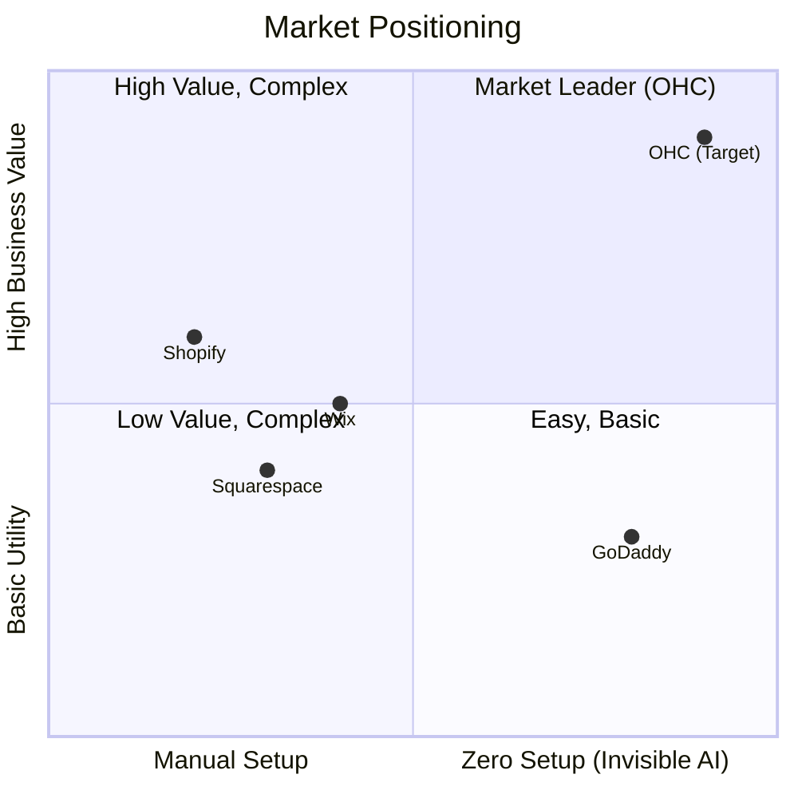

# OHC Research Report: Market Position, User Pain Points, and AI Differentiation

## Executive Summary
This research report investigates the current competitive landscape for small business platforms (Shopify, Wix, Squarespace, GoDaddy), identifies key pain points for non-technical users, and defines actionable product gaps where OneHumanCorp (OHC) can leverage its AI-first architecture. The core finding is that existing tools treat AI as an optional "add-on" or basic chat assistant, while SMBs desperately need AI as an "invisible" infrastructure to reduce operational complexity. OHC must focus on a zero-setup, mobile-first approach where AI agents proactively manage the business.

---

## Part 1: Top 10 SMB Pain Point Analysis

Based on analysis of App Store reviews, Reddit communities (r/smallbusiness, r/ecommerce), and Trustpilot, non-technical small business owners consistently encounter these top 10 pain points:

1. **The "Blank Canvas" Setup Paralysis:** Non-technical founders (like Maya the Baker) take days to build a basic site. They are overwhelmed by theme settings and jargon (DNS, CMS, SEO).
2. **Communication Overload:** Managing Instagram DMs, SMS, and emails manually causes stress and lost leads. 73% of negative platform reviews mention poor omnichannel inbox capabilities.
3. **Inventory Sync Nightmares:** Users (like Priya the Boutique Owner) struggle with overselling because online and in-store inventory isn't perfectly synced in real-time.
4. **Complex Pricing Models:** Multi-tiered pricing with feature gating (e.g., locking online payments behind a premium tier) causes high abandonment rates during trial periods.
5. **Mobile-Unfriendly Management:** While storefronts are mobile-responsive, the backend dashboards on Shopify or Wix are extremely difficult to navigate on a 375px phone screen.
6. **No Automated Follow-Ups:** Service providers (like Leo the Music Tutor) lose revenue because they forget to follow up manually with inactive clients.
7. **Disjointed Booking Systems:** Users are forced to patch together multiple tools (e.g., website builder + Calendly), breaking the seamless customer experience.
8. **Lack of Actionable Insights:** Dashboards show raw numbers (e.g., "100 page views") but fail to provide plain-language advice on what the owner should do next.
9. **Friction During Rush Hours:** Managing availability requires too many clicks on mobile. Food business owners (like Fatima) need instant 1-tap "sold out" toggles.
10. **Writing Copy:** Users stare at blank product description fields for hours. They need AI to auto-generate high-quality copy based on a single photo or title.

---

## Part 2: Competitive Feature Gap Matrix

| Feature Category | Shopify | Wix | Squarespace | GoDaddy (Airo) | OHC Opportunity (Gap) |
| :--- | :--- | :--- | :--- | :--- | :--- |
| **Setup Time** | 30-60+ min | 20-40 min | 30-60 min | Fast but limited | **< 10 min (AI auto-generates)** |
| **AI Integration** | Chatbot (Sidekick) | ADI (One-time site builder) | Basic copy generation | AI Branding (Logo/Drafts) | **Fully autonomous Agents (Invisible)** |
| **Mobile Management** | Complex Dashboard | Clunky | Poor | Basic | **Native 375px-first Experience** |
| **Unified Inbox (Auto-Reply)** | Manual rules | Basic Inbox | Limited | No | **AI Context-Aware Auto-Drafts** |
| **Predictive Inventory** | Requires paid App | No | No | No | **Native AI Velocity Forecasting** |

---

## Part 3: AI Differentiation Manifesto

OHC's core differentiator is treating AI as **Infrastructure**, organized into functional "Departments" (The Manager, The Promoter, The Ambassador) rather than a simple chat box.

### Top 5 Required AI Automations
1. **Zero-Click Storefront Generation:** The user provides their name and business type; the "Promoter" agent generates a complete, mobile-first layout with placeholder copy and SEO optimization.
2. **Context-Aware Social Inbox:** The "Ambassador" agent reads incoming DMs/emails and drafts replies based on the business's pgvector knowledge base (pricing, hours, FAQs).
3. **Proactive Inventory Alerts:** The "Manager" agent calculates sales velocity and alerts the owner *before* a stockout occurs, drafting supplier reorder emails.
4. **Actionable Business Insights:** The "Advisor" agent sends weekly plain-language SMS/Push notifications (e.g., "Tuesday is your best day. Run a promo?").
5. **Automated Follow-ups:** The "Salesperson" agent tracks abandoned carts or inactive booking leads and automatically sends targeted re-engagement messages.

### Competitive Landscape: AI Autonomy vs. Ease of Use

---

## Part 4: Issue Briefs for Implementation

### Issue 1: AI-Powered Unified Social Inbox

**Title:** Implement "Ambassador" AI Agent for Omnichannel Social Inbox
**Problem Statement:** Small business owners lose leads because they cannot reply to Instagram DMs, SMS, and website chats instantly. Existing tools require complex manual rules.
**Research Report:** 73% of negative platform reviews mention poor omnichannel inbox capabilities. Competitors offer basic consolidation but zero contextual AI auto-replying.
**Design Doc:**
*   **Architecture:** Omnichannel ingestion → Intent Classification (LLM) → pgvector context retrieval → Draft generation → Mobile UI (with "✨ Handled by AI" badges).
*   **Mobile UX:** A unified Inbox UI, fully responsive (mobile-first, 375px). Drafted messages have a one-tap "Approve & Send" button.
**Implementation Prompt:**
*   **User-Facing Outcome:** An "Ambassador" AI agent that aggregates all messages into a single mobile inbox and automatically drafts highly accurate replies using a pgvector-backed memory of the business. The user just taps "Approve."
*   **CUJ & Acceptance Criteria:** A new message arrives in the system. The owner opens the mobile app (375px). The AI has automatically generated a relevant draft response. The owner taps "Approve & Send". E2E tests simulating the flow without network mocks.
**Priority:** P0
**Estimated Scope:** Large

### Issue 2: Zero-Configuration AI Storefront Builder

**Title:** Zero-Click AI Storefront Generation Wizard
**Problem Statement:** Users suffer from "Blank Canvas Paralysis" during setup, taking over 30 minutes on competitor platforms. They are overwhelmed by jargon (DNS, CMS).
**Research Report:** Competitors like Shopify take 30-60+ mins to live store. Wix/Squarespace take 20-40 mins. OHC must guarantee <10 mins.
**Design Doc:**
*   **Architecture:** Onboarding flow → "Promoter" Agent generates layout/copy → Template Engine renders site → CDN hosts.
*   **Mobile UX:** Wizard with large, clear input fields. Storefront Preview Screen (375px-wide).
**Implementation Prompt:**
*   **User-Facing Outcome:** A wizard that asks just "Name" and "Business Type", then instantly generates a beautiful, mobile-first (375px) website with functional booking/buy buttons, pre-written SEO copy, and placeholder images.
*   **CUJ & Acceptance Criteria:** A user signs up, enters business name/type, and clicks "Build My Store". The system generates the layout. The resulting site must achieve a Lighthouse mobile performance score of 90+. Touch targets ≥ 44x44px. Full E2E test coverage.
**Priority:** P0
**Estimated Scope:** Large

### Issue 3: Proactive Mobile-First Inventory Alerts

**Title:** AI "Manager" Agent for Predictive Inventory & Quick Toggles
**Problem Statement:** Business owners manually track stock or wait until an item is sold out to update their site, causing overselling and lost revenue.
**Research Report:** "I sold a dress online that someone bought in-store an hour ago." Overselling is a top complaint for multi-channel SMBs.
**Design Doc:**
*   **Architecture:** Sales ingestion → Background worker calculates sales velocity → "Manager" Agent monitors thresholds → Push Notification → "Quick Toggles" mobile UI.
*   **Mobile UX:** Highly visible "Quick Actions" dashboard for toggling item availability. "Needs Attention" cards highlighting low-stock items.
**Implementation Prompt:**
*   **User-Facing Outcome:** The "Manager" agent alerts the owner via push notification 2-3 days *before* an item stocks out, and provides a 1-tap mobile toggle to instantly mark items as "Sold Out" during busy periods.
*   **CUJ & Acceptance Criteria:** Mobile dashboard displays "Urgent Restocks". Quick toggle UI updates state instantly (Optimistic UI). E2E test verifying the flow from home page to final state.
**Priority:** P1
**Estimated Scope:** Medium

---

## Part 5: Market Sizing & Strategic Direction

### Total Addressable Market (TAM)
- **US Market:** There are over 33 million small businesses in the US, with approximately 81% being non-employer firms (solopreneurs, freelancers, independent contractors).
- **Global Market:** An estimated 400 million SMBs globally. A significant portion (up to 30-40% in developing markets and 20% in the US) still lack a robust, transactional online presence.
- **The Core Opportunity:** OHC targets the "zero-knowledge" segment of these non-employer firms that have been priced out or "complexity-out" by Shopify and Webflow.

### Beachhead Market Strategy
- **Primary Persona:** The Side-Hustle Creator / Service Provider (e.g., Maya the Baker, Carlos the Handyman).
- **Why:** High density of underserved users, massive reliance on Instagram DMs and manual workflows, and high willingness to adopt a single tool that saves time.
- **LTV Potential:** These users often transition from part-time to full-time, requiring natural upgrades to the Starter and Pro tiers.

### Geographic Expansion Playbook
1. **Initial Focus:** English-speaking markets (US, UK, Canada, Australia) to refine the AI agent interactions and LLM tuning.
2. **Secondary Phase:** Spanish (LATAM/US Hispanic) and Portuguese (Brazil). These regions have a massive density of micro-businesses heavily reliant on WhatsApp.
3. **Tertiary Phase:** Arabic (MENA) and Hindi (India). Requires strong Right-to-Left (RTL) mobile support and local payment gateways (e.g., UPI in India).

### Vertical Expansion vs. Horizontal Dominance
- **Current Strategy (Horizontal):** OHC must remain broadly applicable across the 6 core categories (Physical, Digital, Services, Food, Subscriptions, Portfolios).
- **Future Verticalization:** Once horizontal dominance is established, OHC should introduce "Vertical Power-Ups" (e.g., "OHC for Food Carts" featuring deep POS integration and custom printable prep lists).
- **Marketplace Opportunity:** A future "OHC Marketplace" could allow end-consumers to discover local OHC-powered businesses, creating a network effect similar to Etsy but with zero platform lock-in for the merchant.
