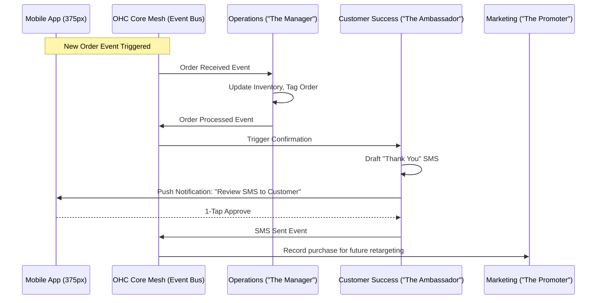

# [Architecture] AI Agent Department System

## Problem Statement
Small business owners like Maya (the baker) and Carlos (the handyman) are overwhelmed by the operational complexity of running a business. They don't want to "configure AI workflows" or "prompt chat agents"; they just want the work done. The current system relies too much on manual user inputs, whereas the ideal OneHumanCorp (OHC) platform should act as a proactive, invisible teammate. We need to architecture an event-driven AI system organized into familiar "Departments" (like Marketing, Operations, Finance) that handle tasks seamlessly in the background, presenting only one-tap approvals for critical actions.

## Research Report
**Findings & Competitive Analysis**
- Existing platforms like Shopify or Wix treat AI as a reactive tool—users must click an "Ask AI" button or type a prompt.
- Real business owners think in terms of roles (e.g., "I need someone to manage my marketing").
- Trust is the biggest hurdle for automated actions. Owners want to review high-stakes actions (like refunds or mass emails) but ignore low-stakes tasks (like inventory updates).
- **Core Insights**: AI must be integrated as a "Teammate", proactively triggered by business events, running in a mesh network, and using Draft-for-Approval workflows.

## Design Doc

### Architecture Diagram

### UI Wireframes & Screen Flow (375px first)
**Mobile UX Flow: The "Teammate Inbox"**
1. **Home Dashboard (375px):** Instead of a standard metrics dashboard, the home screen features a unified "Inbox" of drafted actions from various departments.
2. **Action Card:**
   - **Header:** "The Ambassador (Customer Success)"
   - **Content:** "Drafted a reply to Instagram DM from @vegan_eats: 'Yes, we do vegan cakes! Would you like me to send the menu?'"
   - **Interactions:** [Approve] [Edit] [Reject]
3. **Department Settings:** A simple list of toggles for each department. E.g., "The Manager: Automatically accept orders when inventory is > 0" (Toggle On/Off).

### AI Agent Integration Points
1. **Event Triggers:** Departments subscribe to real-world business events (e.g., `Order Created`, `DM Received`, `Low Inventory`, `End of Week`).
2. **Memory & Context:**
   - All departments share a tenant-scoped Memory Consolidation system.
   - When Marketing drafts a promo email, it queries memory for past successful campaigns and the specific customer's purchase history.
3. **Approval Mechanisms (Auto-Execute vs. Draft-for-Review):**
   - High-risk actions (spending money, sending broad emails, legal changes) are drafted and sent to the owner's phone as a push notification for a 1-tap approval.
   - Low-risk actions (inventory syncing, internal tagging) are auto-executed and logged.
4. **Budgeting & Throttling:**
   - AI action points are budgeted per tier (e.g., Free = 100 actions/mo).
   - When 80% capacity is reached, "The Advisor" department triggers a gentle upsell notification: "You're growing fast! Upgrade to Starter to let us handle more messages."

### Key Design Decisions and Why
- **"Department" Naming Convention:** Using terms like "The Ambassador" and "The Promoter" passes the Grandmother Test. It avoids jargon like "LLM Agent" or "Vector Store".
- **Draft-for-Review by Default:** Builds trust. As users trust the system, they can toggle specific actions to "Auto-Execute".
- **Event-Driven Mesh:** Rather than a monolithic AI prompt, decoupled departments listen to core events. This prevents context limits and hallucination by giving each agent a narrow, specific role.

## Implementation Prompt
**Context for Implementer:**
We need to build the foundational event-tracking and draft-approval workflow for the AI Departments. Start with the "Operations" and "Customer Success" departments.

**Customer User Journey (CUJ):**
1. Maya (baker) receives a new cake order.
2. The core system publishes an `Order Received` event.
3. The Operations agent automatically updates inventory.
4. The Customer Success agent drafts a confirmation SMS and sends a push notification to Maya's mobile app.
5. Maya opens the app, sees the drafted SMS on a beautiful Glassmorphism card, and taps "Approve". The SMS is sent.

**Acceptance Criteria:**
- Create the event subscriber framework for Departments.
- Implement the "Teammate Inbox" UI component for reviewing drafts (ensure mobile-first styling at 375px, Glassmorphism `backdrop-filter: blur(20px)`, and smooth entrance animations).
- No direct database mocking in E2E tests—test against a real local flow.
- Ensure 100% unit test coverage for new components and minimum 5 Playwright tests for the CUJ.

## Priority
P0 (Critical)

## Estimated Scope
Large
