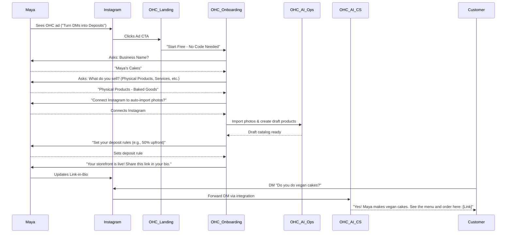
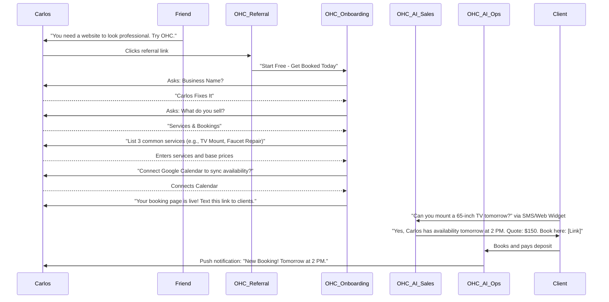
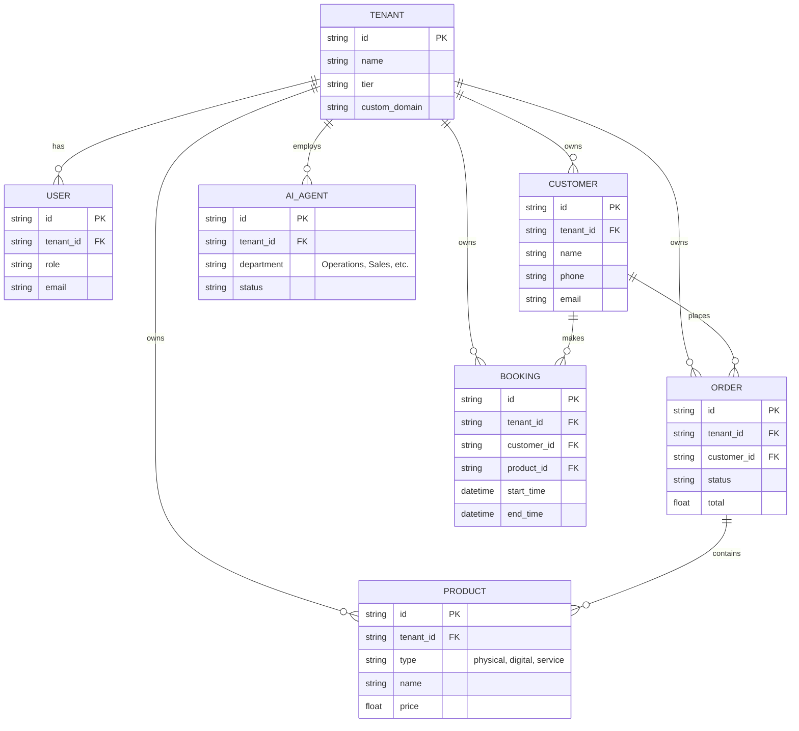
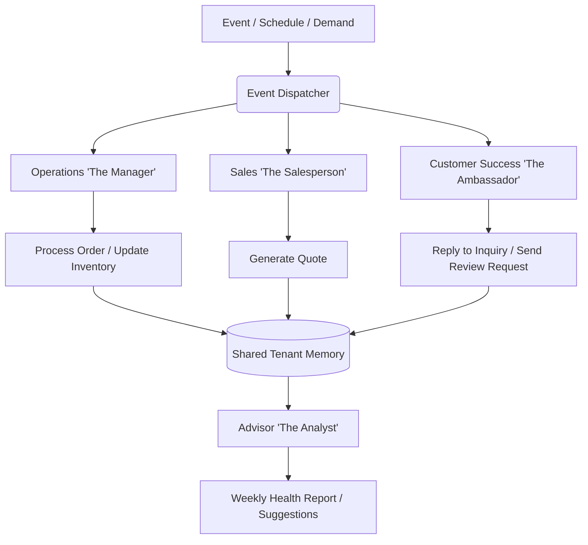

# Research Report

## Business Journey Architecture

### Overview
This report outlines the end-to-end user journey for non-technical business owners using OneHumanCorp (OHC). We will focus on two key personas: Maya (baker, Instagram-based) and Carlos (handyman, word-of-mouth-based). The goal is to provide a seamless transition from discovery to a fully functional online business in under 10 minutes.

### 1. Maya (Baker, Instagram-Based)

#### Sequence Diagram

#### Journey Breakdown
*   **Acquisition:** Maya discovers OHC via a targeted Instagram ad highlighting the pain point of managing orders via DMs.
*   **Onboarding:** The wizard minimizes friction by importing her existing Instagram photos. It focuses on the core need: taking deposits.
*   **Activation:** Success is measured by publishing the link-in-bio and receiving the first automated deposit.
*   **Retention:** Push notifications on her phone for new orders and deposits keep her engaged.
*   **Revenue:** Upgrades from Free to Starter when she exceeds the 10-product limit or wants a custom domain (`mayascakes.com`).

### 2. Carlos (Handyman, Word-of-Mouth)

#### Sequence Diagram

#### Journey Breakdown
*   **Acquisition:** Word-of-mouth referral from another small business owner.
*   **Onboarding:** Focuses on listing services and syncing his existing calendar. Simple, text-based inputs.
*   **Activation:** Success is the first booked appointment via the link he texts to clients.
*   **Retention:** Daily SMS/push summaries of his upcoming schedule.
*   **Revenue:** Upgrades when he wants to use the "AI Salesperson" to automatically generate quotes from SMS inquiries.

---

## Data Model Architecture

### Overview
The OHC data model must support strict multi-tenancy, offline-first mobile synchronization, and flexible entity relationships to accommodate various business types.

### Entity-Relationship Diagram

### Key Invariants
1.  **Strict Multi-Tenancy:** Every operational table MUST include a `tenant_id` column. All queries MUST scope by `tenant_id` derived securely from the authenticated user's session token. Row Level Security (RLS) is mandatory at the database level.
2.  **Offline Support:** Entities accessed by mobile clients (Products, Orders, Customers) must support eventual consistency and local caching.
3.  **Agent Context:** AI Agents operate strictly within the context of a single `tenant_id`. They cannot cross-pollinate data between businesses.

### Migration Strategy
Database schemas will evolve using standard up/down migration scripts. Crucially, any new table storing tenant data MUST include the `ALTER TABLE [table_name] ENABLE ROW LEVEL SECURITY;` statement in the same migration file.

---

## AI Agent Department Architecture

### Overview
AI Agents in OHC are presented as "Departments" to non-technical users. They handle complex workflows invisibly, requiring minimal configuration.

### Agent Flow Architecture

### Key Principles
*   **Friendly Naming:** Agents are referred to by their roles (e.g., "The Manager", "The Promoter").
*   **Shared Memory:** All agents within a tenant read from and write to a shared memory pool (the AutoDream pipeline), ensuring consistency. If Sales promises a discount, Operations knows about it.
*   **Approval Workflows:** High-risk actions (e.g., sending a mass email, issuing a large refund) require the business owner's approval (Draft-for-Review). Low-risk actions (e.g., answering FAQ) are Auto-Execute.
*   **Budgeting:** Agent activity is metered against the tenant's tier limits (e.g., 100 AI actions/month on Free).

---

## Website & Storefront Builder Architecture

### Overview
The storefront builder must be intuitive, mobile-first, and require zero coding knowledge.

### Design Principles
*   **Block-Based:** Users construct pages using pre-defined semantic blocks (Hero, Product Grid, Testimonials, Booking Calendar).
*   **Grandmother Test:** If a user can't publish a page in 30 seconds, the UI is too complex.
*   **Progressive Disclosure:** Advanced settings (e.g., SEO metadata, custom CSS via glassmorphism tokens) are hidden behind an "Advanced Mode" toggle.

### Content Blocks
1.  **Hero:** Image/Video background, Headline, primary CTA.
2.  **Product/Service Grid:** Dynamically populated from the Product catalog.
3.  **Booking Calendar:** Integrates directly with the tenant's availability and deposit rules.
4.  **Contact/Inquiry Form:** Feeds directly into the "Salesperson" AI agent for follow-up.

---

## Multi-Tenant SaaS Tier Architecture

### Tier Breakdown

| Tier | Price | Target Persona | Key Limits | AI Usage | Custom Domain |
|---|---|---|---|---|---|
| **Free** | $0 | Hobbyist (Maya starting out) | 10 Products | 1 Dept (Ops), 100 actions/mo | No (OHC Subdomain) |
| **Starter** | $9/mo | Side-Hustle | 100 Products | 3 Depts, 1,000 actions/mo | Yes |
| **Pro** | $29/mo | Full-Time (Carlos) | Unlimited | 10 Depts, Unlimited | Yes + SSL |
| **Business** | $79/mo | Small Agency / Retail | Unlimited | Unlimited Depts | Yes + Multi-domain |

### Upgrade Flow
Upgrades are contextual. If Maya tries to add an 11th product, a modal appears: "Your business is growing! Upgrade to Starter to add unlimited products and a custom domain." The focus is on the value unlocked, not the technical limits.
