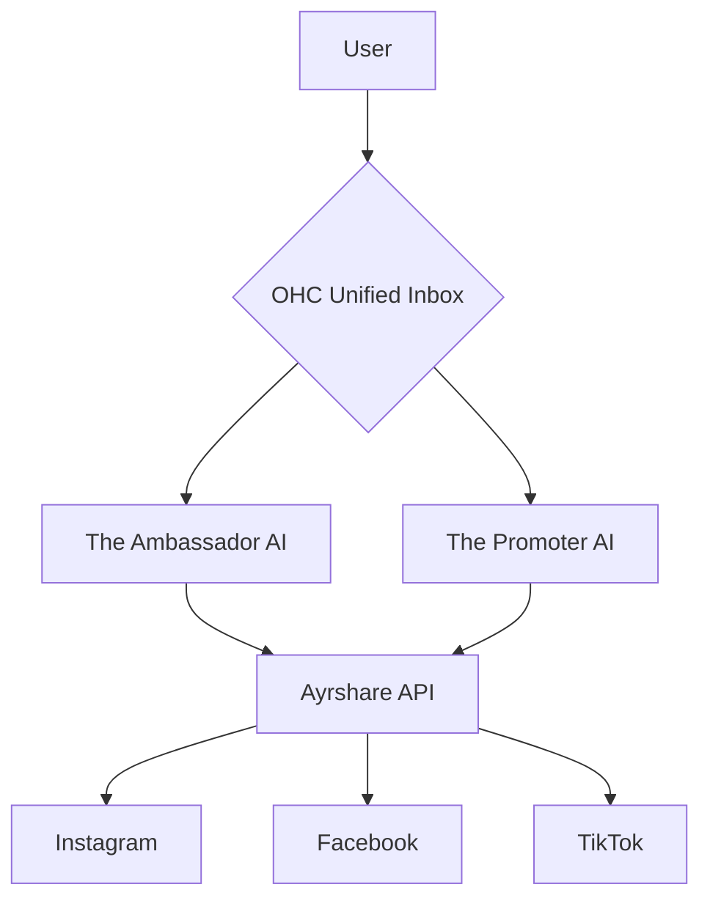
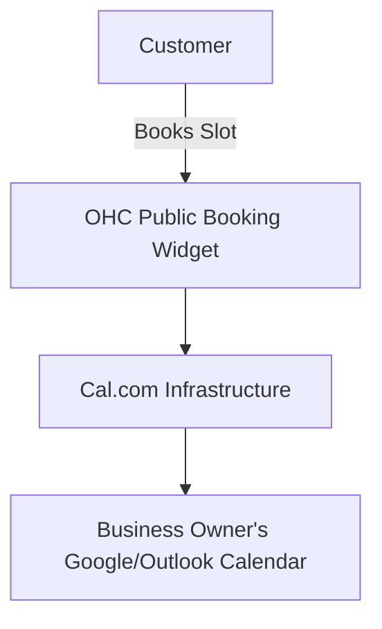
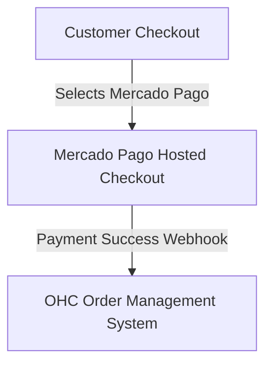
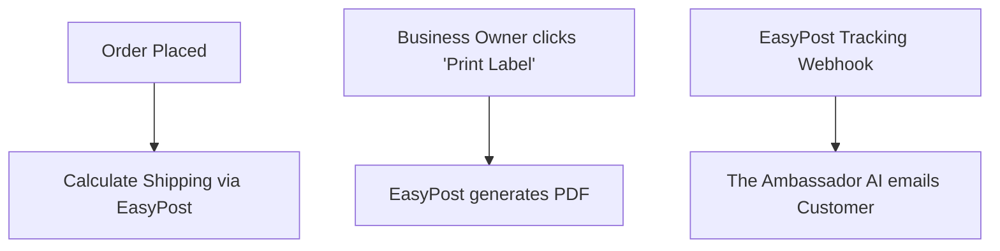
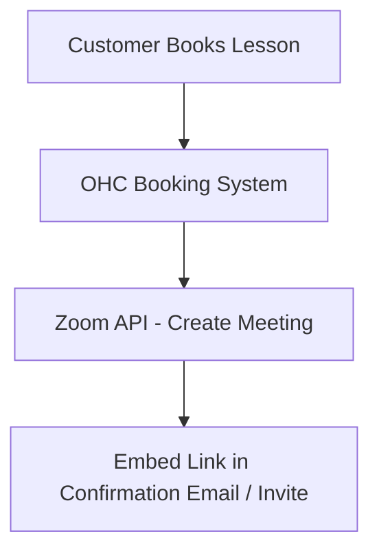

# Scout: Tool Integration Research Q2 Report

## Executive Summary
This report outlines seven key tool integrations designed to solve real-world problems for small business owners across various operational domains. These tools have been evaluated for ease of use, pricing, and compatibility with both Cloud (SaaS) and Standalone (local) OHC environments.

## 1. Social Media Integration
**Title**: Integrate Ayrshare for Unified Social Media Inbox and Cross-Posting
**Problem Statement**: Small business owners (like Maya the Baker) waste time jumping between Instagram, Facebook, and TikTok. They need a unified inbox and seamless cross-posting.
**Research Report**:
- **Tool**: Ayrshare
- **Evaluation**: Unified API for posting and messaging across major platforms. Avoids the need to manage multiple native integrations.
- **Ease of Use**: Non-technical users benefit by never leaving the OHC interface.
- **Pricing**: Free tier available, scaling per user.
- **Compatibility**: Works well in Cloud mode. Standalone may require personal API keys or direct OAuth.
**Design Doc**:
- Users link accounts via OAuth in "Marketing & Advertising" tab.
- "The Ambassador" AI monitors incoming DMs and drafts replies in a unified "Customer Inbox."
- "The Promoter" AI schedules and auto-posts images.

**Implementation Prompt**: Connect Ayrshare to allow users to link social media accounts. Implement a unified inbox for reading/replying to messages and a scheduler for outbound posts.
**Priority**: P1 | **Estimated Scope**: Large

---

## 2. Calendar & Scheduling
**Title**: Integrate Cal.com for Zero-Config Booking & Calendar Sync
**Problem Statement**: Users like Leo the Music Tutor lose customers to back-and-forth scheduling via text. They need a public booking link syncing with their personal Google/Outlook calendars.
**Research Report**:
- **Tool**: Cal.com
- **Evaluation**: Open-source scheduling infrastructure handling timezone math and conflict resolution natively.
- **Ease of Use**: Highly embeddable, seamless for non-technical users.
- **Pricing**: Free tier for individuals.
- **Compatibility**: Perfect for both Cloud (SaaS) and self-hosted Standalone OHC modes.
**Design Doc**:
- "The Manager" AI sets up dynamic booking links based on business hours.
- One-click OAuth to connect Google/Outlook calendars in "Operations".
- Cal.com handles conflict resolution on the OHC public page.

**Implementation Prompt**: Embed Cal.com infrastructure to allow users to sync personal calendars and expose a public booking widget on their storefront to prevent double-booking.
**Priority**: P0 | **Estimated Scope**: Medium

---

## 3. Email Marketing
**Title**: Integrate Resend for AI-Powered Email Marketing
**Problem Statement**: Business owners want to notify customers about new stock or sales, but traditional tools (like Mailchimp) are too complex.
**Research Report**:
- **Tool**: Resend
- **Evaluation**: Developer-friendly, reliable email API. Ideal for AI-generated HTML emails from simple text prompts.
- **Ease of Use**: Zero-friction. User provides a 1-sentence prompt, AI generates the email and inserts product photos.
- **Pricing**: ~$20/mo for up to 50k emails; economical to bundle in OHC premium tier.
- **Compatibility**: Cloud uses OHC's centralized account. Standalone requires user's SMTP credentials.
**Design Doc**:
- "Marketing" tab -> "Send a Broadcast".
- User provides prompt -> AI Agent generates preview.
- System chunks customer list and sends via Resend API.

**Implementation Prompt**: Build a feature where a user prompts an AI to draft an email blast enriched by their product catalog. Upon approval, queue emails to opted-in customers via the Resend API, handling rate limits.
**Priority**: P2 | **Estimated Scope**: Medium

---

## 4. Payment Processing
**Title**: Integrate Mercado Pago for LATAM Payments
**Problem Statement**: LATAM business owners cannot easily use Stripe and need a trusted local processor (e.g., for Pix or Pago Fácil).
**Research Report**:
- **Tool**: Mercado Pago
- **Evaluation**: Dominant LATAM provider supporting local payment methods. Settlement times can be longer.
- **Ease of Use**: Familiar regional checkout experience.
- **Pricing**: Variable by country (~4-5% per transaction).
- **Compatibility**: Cloud (OAuth) and Standalone (API Key).
**Design Doc**:
- If user selects a LATAM country during onboarding, Mercado Pago is offered.
- User connects account. Customers see "Pay with Mercado Pago" at checkout.
- Webhooks update order status upon success.

**Implementation Prompt**: Add Mercado Pago as a secondary payment provider for LATAM regions. Implement checkout redirect flow and handle success/failure webhooks for order status updates.
**Priority**: P2 | **Estimated Scope**: Large

---

## 5. Shipping & Logistics
**Title**: Integrate EasyPost for Painless Shipping Labels & Tracking
**Problem Statement**: Boutique owners hate manually copying addresses to carrier sites. They need one-click label printing and auto-tracking emails.
**Research Report**:
- **Tool**: EasyPost
- **Evaluation**: Unified API for 100+ carriers (USPS, FedEx, UPS). Abstracts carrier complexities.
- **Ease of Use**: One button to generate a label from an order.
- **Pricing**: Free tier for low volume, pennies per label thereafter.
- **Compatibility**: Fully compatible via API.
**Design Doc**:
- "Operations" calculates shipping rate via EasyPost at checkout.
- Business owner clicks "Print Label" in Order details.
- EasyPost generates PDF. Tracking webhooks trigger auto-emails.

**Implementation Prompt**: Connect EasyPost to the fulfillment flow to calculate rates, generate shipping labels, and automatically send tracking updates via webhooks.
**Priority**: P1 | **Estimated Scope**: Medium

---

## 6. SMS & Notifications
**Title**: Integrate Twilio for SMS Order Notifications
**Problem Statement**: Users operating in noisy environments (e.g., food carts) miss app notifications and need reliable SMS alerts for new orders.
**Research Report**:
- **Tool**: Twilio
- **Evaluation**: Global coverage, incredibly reliable. Complex A2P 10DLC compliance in the US.
- **Ease of Use**: Simple opt-in toggle for the business owner.
- **Pricing**: Pay-as-you-go (~$0.0079/SMS in US).
- **Compatibility**: Cloud (Central OHC Twilio account). Standalone (User provides API key).
**Design Doc**:
- Toggle "Send me SMS for new orders" in Settings.
- Paid orders trigger Operations agent to send an SMS via Twilio.

**Implementation Prompt**: Integrate Twilio SDK for outbound SMS. Add opt-in setting for order alerts. Ensure US messaging compliance.
**Priority**: P2 | **Estimated Scope**: Medium

---

## 7. Video Conferencing
**Title**: Integrate Zoom for Auto-Generated Meeting Links
**Problem Statement**: Service providers (like tutors) manually create and email meeting links. Links need to be auto-generated when a lesson is booked.
**Research Report**:
- **Tool**: Zoom
- **Evaluation**: Ubiquitous for online lessons with a strong API. Requires annual app review for OAuth.
- **Ease of Use**: Invisible to the user; links appear in calendar invites.
- **Pricing**: Free tier (40-min limit); Pro from $15/mo.
- **Compatibility**: Cloud (OAuth). Standalone (Server-to-Server OAuth).
**Design Doc**:
- User connects Zoom account in Sales dashboard.
- Booking an online service calls Zoom API to create a meeting.
- Link embedded in automated calendar invite/confirmation email.

**Implementation Prompt**: Create Zoom OAuth integration. Auto-generate Zoom meeting links when virtual services are booked, and include them in customer confirmations.
**Priority**: P1 | **Estimated Scope**: Medium

---

## Tool Integration Summary Table

| Category | Tool | Priority | Scope | Cloud Mode | Standalone Mode | Pricing Estimate |
|---|---|---|---|---|---|---|
| Social Media | Ayrshare | P1 | Large | Yes | Yes (API Key/OAuth) | Free tier, scales per user |
| Calendar | Cal.com | P0 | Medium | Yes | Yes (Self-hosted) | Free tier |
| Email Marketing | Resend | P2 | Medium | Yes (Central) | Yes (Custom SMTP) | ~$20/mo per 50k emails |
| Payment Processing | Mercado Pago | P2 | Large | Yes (OAuth) | Yes (API Key) | ~4-5% / tx (variable) |
| Shipping | EasyPost | P1 | Medium | Yes | Yes | Pennies/label after free tier |
| SMS | Twilio | P2 | Medium | Yes (Central) | Yes (API Key) | ~$0.0079/SMS (US) |
| Video | Zoom | P1 | Medium | Yes (OAuth) | Yes (S2S OAuth) | Free (40m), $15/mo Pro |

## Persona Pain Point Resolutions
- **Maya the Baker (Social):** No longer juggles 3 apps; uses OHC's unified inbox to reply to DMs and schedule posts.
- **Leo the Music Tutor (Calendar/Video):** No manual link sending. Cal.com handles booking, Zoom auto-generates the link.
- **Priya the Boutique Owner (Shipping):** Stops copy-pasting addresses. EasyPost prints labels in one click.
- **Fatima the Food Cart (SMS):** Hears the SMS "ding" over the fryer instead of missing silent app notifications.
- **LATAM Merchants (Payments):** Can actually get paid via Mercado Pago instead of bouncing off Stripe.
