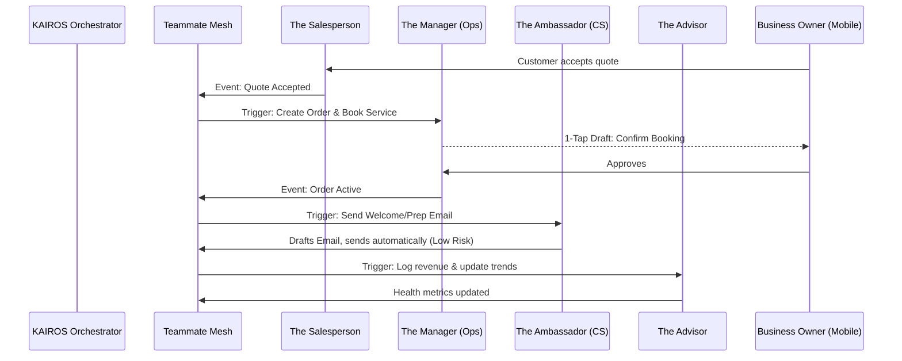

# AI Agent Department Architecture

## Title
OHC AI Agent Departments: Seamless, Autonomous Business Operations

## Problem Statement
Small business owners—like Maya the baker, Carlos the handyman, and Priya the boutique owner—don't have the time, capital, or expertise to hire a full staff of managers, promoters, salespeople, and accountants. Existing platforms force them to learn complex tools, install dozens of confusing plugins, or manually manage everything from answering late-night Instagram DMs about vegan cakes to sending invoices for plumbing jobs. They need a system that acts like a real team, running invisibly in the background, handling the heavy lifting of daily operations without requiring them to become software experts.

## Research Report
Current platforms fail the "Grandmother Test" and overwhelm non-technical users with fragmented tools:
- **Shopify**: Requires extensive app ecosystem (often $50-$200/mo extra) to handle complex flows like pre-order management, email follow-ups, and subscription management. Users have to manually configure Zapier to string tools together.
- **Wix/Squarespace**: Focus heavily on visual site building. They lack proactive agents. A user has to log in and manually check for low inventory or manually craft a promotional email.
- **GoDaddy**: Basic tools that require manual operation. Their "AI" features are mostly limited to text generation for website copy, rather than autonomous task execution (like auto-drafting a quote for a leaky pipe).

**OHC Advantage:**
OHC introduces "AI Agent Departments"—7 specialized agents mirroring real-world business roles (Operations, Marketing, Sales, Customer Success, Finance, Legal, and Advisory). They communicate seamlessly via the KAIROS Orchestrator. By leveraging the Teammate Mesh and AutoDream pipeline, agents have shared memory of the business (e.g., remembering Maya's vegan cake trend) and can perform cross-department handoffs without any user intervention.

## Design Doc

### Architecture Diagram

### UI Wireframes & Screen Flow (375px first)
**Screen 1: The Inbox & Action Feed**
- **Header**: Glassmorphic top bar showing total active alerts.
- **Content**: A vertical list of action cards.
  - Card 1: "The Salesperson: New quote request from John (Leaky Pipe). Tap to review draft."
  - Card 2: "The Ambassador: Drafted reply to Instagram DM asking about vegan cakes."
- **Footer**: Bottom navigation (Home, Action Feed, Customers, Settings).

**Screen 2: 1-Tap Approval Detail**
- **Content**: Clear, plain-language summary.
  - "The Salesperson suggests quoting $150 for 'Leaky Pipe Repair' based on your usual rates."
- **Action**: Large, accessible buttons (Touch Target ≥ 44x44px). [Approve & Send] [Edit Details] [Reject].

### Mobile UX Flow
1. **Notification**: User receives a native push notification (e.g., "New quote draft needs your approval").
2. **Review**: Tapping the notification opens the 1-Tap Approval Detail screen.
3. **Action**: The user taps "Approve & Send".
4. **Optimistic Update**: The UI instantly shows a success state (shimmer effect transitioning to a green checkmark).
5. **Background Sync**: KAIROS processes the approval, triggering the Sales agent to send the quote and the Operations agent to tentatively hold a calendar slot.

### Key Design Decisions
- **Friendly Naming Convention**: Use terms like "The Manager" instead of "Operations API Worker" so non-technical users immediately understand the agent's purpose.
- **Tier-Based Budgeting**: Free tiers get 1 department and limited actions. Upgrades are suggested contextually (e.g., "The Advisor" noting that upgrading unlocks "The Promoter" to run email campaigns).
- **Draft-for-Review vs. Auto-Execute**: High-risk actions (sending money, final quotes, public posts) require 1-tap approval. Low-risk actions (updating inventory tags, drafting internal notes) auto-execute to minimize cognitive load.
- **Tenant Isolation**: Every agent action and memory retrieval is strictly scoped to the `tenant_id` to prevent cross-business data leaks.

### AI Agent Integration Points
- **KAIROS Shared Task List**: Centralized queue where agents claim tasks based on their department.
- **Teammate Mesh**: The event bus used for handoffs (e.g., Ops finishes order -> triggers Finance).
- **AutoDream Memory**: Agents query the vector database to retrieve historical context (e.g., "Customer X prefers evening appointments").

## Implementation Prompt
**To Implementer Agent:**
Implement the core event-driven infrastructure for the AI Agent Departments (Operations, Marketing, Sales, Customer Success, Finance, Legal, Advisory). Your goal is to establish the KAIROS Orchestrator routing that allows one department to trigger another (e.g., a "Quote Accepted" event from Sales must automatically trigger Operations to draft a new booking).
Build the mobile-first (375px) "Action Feed" UI where users can view and 1-tap approve high-risk agent drafts. Ensure the UI feels incredibly responsive (optimistic updates with skeleton loading/shimmers).
Do not prescribe the specific database schema, the LLM inference engine, or the specific queue worker implementation. Focus on the user journey: the business owner must receive a unified, prioritized feed of AI actions and be able to confidently approve them in seconds. Ensure comprehensive E2E tests covering a complete cross-department task handoff and user approval flow.

## Priority
P0

## Estimated Scope
Large
