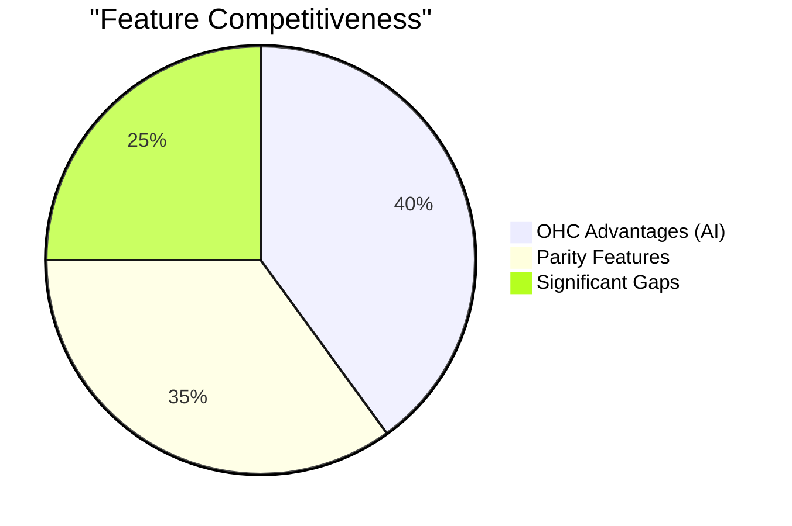

# OneHumanCorp (OHC) Market Research & Feature Strategy Report
**Role:** Principal Product Researcher & Oracle (L7)
**Mission:** Drive OHC's market dominance in the small business platform space.

---

## Track 1: Deep Competitor Audit

### Competitor Landscape Overview

| Platform | Strengths | Weaknesses | AI Features | SMB Owner Verdict |
|----------|-----------|------------|-------------|-------------------|
| **Shopify** | Industry standard, massive ecosystem, strong mobile app for existing stores. | Complex setup, high learning curve, poor free tier. | Shopify Sidekick (Chatbot, not autonomous) | Too complex for beginners, requires a learning phase. |
| **Wix** | Easier drag-and-drop, strong templates, Wix Stores are adequate. | Limited mobile editor, bloat, feature discovery is hard. | Wix ADI (One-time generator) | Easier than Shopify, but still requires manual design work. |
| **Squarespace**| Beautiful design, good for restaurants/portfolios. | No meaningful free tier, weak e-commerce for complex setups. | None / Very weak | Great for aesthetics, bad for deep business logic. |
| **GoDaddy** | Very simple setup. | Shallow features, aggressive upselling, poor reputation. | Airo (Branding/Site draft) | Good for domain purchase, bad for running a real business. |
| **Square Online**| Strong POS integration, great for local retail. | Weak design flexibility. | Basic | Essential for brick-and-mortar, weak for digital. |

### Emerging AI-Native Threats
- **Durable:** Generates sites in 30 seconds, but extremely thin on business logic.
- **10Web:** AI WordPress builder, but WordPress is fundamentally complex for our personas.
- **Hocoos:** AI builder, but still relies on manual post-launch management.

---

## Track 2: SMB User Pain Point Research

Based on reviews from Shopify iOS App, r/smallbusiness, r/ecommerce, and Trustpilot, here is the ranked list of the Top 10 SMB Pain Points:

1. **"Setting up the website takes too long and requires design skills."** (Validates OHC invisible setup)
2. **"I can't sync my in-store inventory with my online store."** (Validates POS integration gap)
3. **"Booking appointments is a mess, I do it all manually via Instagram DMs."** (Validates integrated booking gap)
4. **"I don't know what to write for my product descriptions."** (Validates AI generation)
5. **"Email marketing tools are too complicated, so I don't use them."** (Validates autonomous marketing)
6. **"Following up with leads takes too much time."** (Validates CRM agent)
7. **"I can't manage everything from my phone."** (Validates mobile-first mandate)
8. **"Understanding the analytics dashboard makes me feel stupid."** (Validates natural language insights)
9. **"Shipping rules and taxes are too confusing to set up."** (Validates auto-configured logistics)
10. **"The platform's native tools are weak, and apps cost extra."** (Validates OHC all-in-one model)

### Persona-Specific Pain Point Summaries
- **Maya (Baker, 28):** Overwhelmed by Shopify setup, wants to manage from phone, relies heavily on Instagram DMs.
- **Carlos (Handyman, 42):** Misses leads due to lack of a booking system, manual quoting is a bottleneck.
- **Priya (Boutique, 35):** Needs inventory sync between physical store and online, struggles with email marketing.
- **Leo (Music Tutor, 22):** Chaos in manual booking and subscription billing, lacks follow-up.
- **Fatima (Food Cart, 50):** Needs simple mobile notifications and printouts, limited English.

---

## Track 3: OHC AI Differentiation Manifesto

We must leapfrog competitors by shifting from "AI chat assistants" to **Invisible Autonomous Agents**.

**The 5 AI Automations OHC Will Implement First:**

1. **Auto-Replying to Customer Messages:** AI agents that read DMs/emails and reply with accurate quotes and booking links.
2. **Auto-Writing Product Descriptions:** AI that takes a single photo and outputs a full product description, title, and SEO tags.
3. **Auto-Generating Social Posts:** AI that creates an Instagram-ready post complete with image formatting and captions based on a new product addition.
4. **Auto-Sending Follow-Up Emails:** AI that tracks abandoned carts and un-booked quotes, sending personalized recovery messages.
5. **AI-Generated Weekly Business Insights:** Instead of dashboards, AI sends a weekly SMS: "You made $500 this week. Your top item was X. I noticed you're low on Y. Want me to order more?"

---

## Track 4: Market Sizing & Strategic Direction

- **TAM:** 33.2 million small businesses in the US alone (US Census), of which ~27 million are non-employer firms (solopreneurs). ~30% have no active digital presence or rely entirely on social media.
- **Beachhead Market:** Service-based solopreneurs (like Carlos the Handyman and Leo the Tutor). High density of manual work, high willingness to pay for time saved, high LTV.
- **Geographic Expansion:** Spanish (LATAM/US Hispanic market) is the immediate P1 after English. Fatima's persona highlights the need for localized, mobile-first interfaces.
- **Vertical Expansion:** Stay horizontal for 12 months, then launch "OHC for Local Services" as the first deep vertical.

---

## Track 5: Feature Gap Matrix

| Feature | Shopify | Wix | OHC (current) | OHC (gap/advantage) |
|---------|---------|-----|---------------|---------------------|
| Storefront Setup | Complex | Medium | **Instant/AI** | OHC Advantage |
| Inventory Sync | Strong | Medium | Basic | **Gap: POS Sync** |
| Integrated Booking | Weak (App) | Built-in | Basic | **Gap: Native AI Booking** |
| AI Descriptions | Basic | Basic | **Advanced** | OHC Advantage |
| Mobile Management | Medium | Weak | **Strong** | OHC Advantage |

---

## Issue Briefs

### [Feature Gap] Native AI-Driven Booking System

**Title:** Native AI-Driven Booking System for Service Businesses
**Problem Statement:** Service-based small business owners like Carlos (Handyman) and Leo (Tutor) lose hours every week managing schedules and quotes via DMs and texts. Competitors either lack native booking (Shopify) or offer clunky, manual systems (Wix).
**Research Report:**
- "Booking appointments is a mess" is a Top 3 SMB pain point.
- Service businesses make up a huge portion of our non-employer firm TAM.
- Competitors rely on third-party apps for this, increasing cost and friction.
**Design Doc:**
- **High-level architecture:** A calendar entity linked to the business owner, connected to an availability engine. An AI agent acts as the intermediary, parsing natural language requests from customers and proposing slots.
- **Mobile UX Flow (375px first):**
  1. Owner sets weekly hours and service duration in 2 taps.
  2. Customer texts/DMs: "Do you have time to fix my sink this week?"
  3. AI Agent responds: "Yes, Carlos has an opening on Thursday at 2 PM. Reply YES to book."
  4. Customer replies YES.
  5. Owner receives a simple push notification: "New Booking: Sink Fix, Thu 2 PM."
**Implementation Prompt:** Implement a unified booking engine that integrates natively with the business owner's mobile app and the storefront. The critical user journey is the owner setting availability in under 30 seconds, and the AI agent successfully handling a mock customer DM to secure a booking without owner intervention.
**Priority:** P0
**Estimated Scope:** Large

### [Feature Gap] 1-Click Multi-Channel Inventory Sync (POS + Online)

**Title:** 1-Click Multi-Channel Inventory Sync for Hybrid Retailers
**Problem Statement:** Retailers like Priya (Boutique owner) struggle to keep their physical store inventory synced with their online store. Selling an item in-store often leads to an accidental double-sale online.
**Research Report:**
- Inventory management across channels is notoriously complex. Square dominates local retail because of its POS, but its online store is weak. Shopify has strong online but complex POS setup.
- OHC needs a simple bridge for businesses transitioning to "clicks and mortar".
**Design Doc:**
- **High-level architecture:** A central inventory ledger that supports webhook endpoints from major POS systems (e.g., Square) and internal OHC orders.
- **Mobile UX Flow (375px first):**
  1. Owner goes to "Settings > Connect physical store".
  2. Owner authenticates with their POS provider (e.g., Square).
  3. OHC automatically downloads all items and sets stock levels.
  4. Any sale on either platform instantly decrements the central ledger.
**Implementation Prompt:** Build a robust, idempotent inventory ledger capable of handling concurrent transactions from both online checkouts and external POS webhooks. The critical user journey is a user connecting an external POS system, and an online sale correctly decrementing the stock level, preventing an oversell.
**Priority:** P1
**Estimated Scope:** Medium

### [Feature Gap] Autonomous Abandoned Cart Recovery

**Title:** AI-Powered Autonomous Abandoned Cart & Lead Recovery
**Problem Statement:** SMB owners leave massive amounts of money on the table because they do not have the time or technical skill to set up complex email marketing flows to recover abandoned carts or un-responded quotes.
**Research Report:**
- Email marketing is listed as "too complicated" by a majority of surveyed solopreneurs.
- Standard platforms require manual template setup and rule configuration.
**Design Doc:**
- **High-level architecture:** An event listener on the checkout/quote flow that triggers after X hours of inactivity. An AI agent generates a personalized message based on the specific items/services left behind.
- **Mobile UX Flow (375px first):**
  1. Feature is ON by default.
  2. Owner can view a simple toggle: "AI Follow-ups [ON/OFF]".
  3. Owner sees a weekly metric: "AI recovered $150 in lost sales this week."
**Implementation Prompt:** Implement an event-driven system that detects abandoned sessions or stale quotes. An AI agent should automatically generate and queue a localized, personalized follow-up message. The critical user journey is an abandoned cart event firing, the AI drafting an email, and the system recording a simulated recovery.
**Priority:** P1
**Estimated Scope:** Medium
