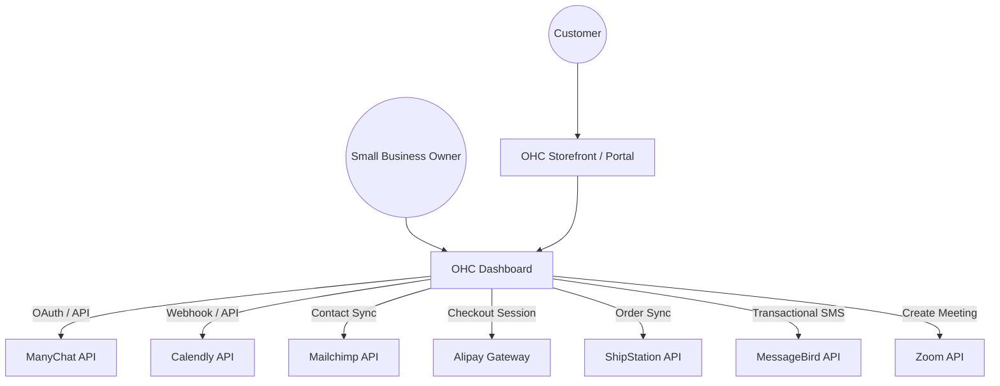

# Core Tool Integrations Research Report: Q3

This report outlines the research, evaluation, and proposed integration paths for seven key tools designed to empower small business owners using OHC. The focus is on tools that directly solve operational pain points for non-technical users, abstracting away complexity while providing robust capabilities in both Cloud and Standalone environments.

## Integration Candidates Summary

| Category | Recommended Tool | Priority | Scope | Key Benefit for Small Businesses |
| :--- | :--- | :--- | :--- | :--- |
| Social Media | **ManyChat** | P1 | Medium | Unified inbox across Instagram, FB, WhatsApp. |
| Calendar | **Calendly** | P1 | Small | Painless scheduling without double-booking. |
| Email Marketing | **Mailchimp** | P2 | Medium | Simple newsletter campaigns and audience sync. |
| Payments | **Alipay** | P2 | Large | Access to global markets (specifically Asia). |
| Shipping | **ShipStation** | P1 | Medium | Automated label printing and tracking. |
| SMS | **MessageBird** | P1 | Small | Reliable global text notifications. |
| Video | **Zoom** | P1 | Medium | Auto-generated meeting links for virtual services. |

## System Integration Architecture

## Detailed Evaluations

### 1. Social Media: ManyChat
*   **Problem Solved**: Centralizes scattered messages from various social platforms into one inbox.
*   **User Experience**: Merchants connect accounts via a simple flow; messages appear in a unified "Social Inbox" in OHC. Replies are sent back natively.
*   **Risks**: Meta API changes can disrupt connectivity.
*   **Pricing**: Free tier; Pro starts at ~$15/mo.

### 2. Calendar & Scheduling: Calendly
*   **Problem Solved**: Eliminates the email back-and-forth required to find meeting times.
*   **User Experience**: Merchant pastes their Calendly link into OHC. Customers book via a polished widget. OHC displays upcoming bookings.
*   **Risks**: Relies on Calendly's native calendar syncing for conflict resolution.
*   **Pricing**: Free tier for one event type; $10/mo for Pro.

### 3. Email Marketing: Mailchimp
*   **Problem Solved**: Allows easy mass communication with customers without managing complex lists or spam rules.
*   **User Experience**: Contacts sync transparently from OHC to Mailchimp. OHC displays simple analytics (Opens, Clicks).
*   **Risks**: Strict API rate limits for free tiers.
*   **Pricing**: Free up to 500 contacts.

### 4. Payment Processing: Alipay
*   **Problem Solved**: Unlocks sales from international customers who prefer digital wallets over Western credit cards.
*   **User Experience**: Customers see a QR code or deep link at checkout. Merchants see seamless settlement in local currency.
*   **Risks**: Initial merchant verification process can be stringent.
*   **Pricing**: 2.5% - 3% per transaction.

### 5. Shipping & Logistics: ShipStation
*   **Problem Solved**: Automates manual label creation and tracking number distribution.
*   **User Experience**: Orders flow to ShipStation. Once a label is printed there, OHC automatically updates the order to "Shipped" and displays tracking.
*   **Risks**: Webhook delivery failures could cause sync issues between OHC and ShipStation.
*   **Pricing**: Starts at $9.99/mo.

### 6. SMS & Notifications: MessageBird
*   **Problem Solved**: Ensures critical updates (like appointment reminders) are seen by customers who ignore emails.
*   **User Experience**: Merchant toggles on "SMS Alerts". OHC handles sending formatted plain-text messages automatically.
*   **Risks**: Compliance with local telecom regulations (e.g., A2P 10DLC in the US).
*   **Pricing**: Pay-as-you-go (~$0.008/msg in US).

### 7. Video Conferencing: Zoom
*   **Problem Solved**: Removes the manual step of creating and emailing video links for virtual services.
*   **User Experience**: Merchant selects "Zoom Meeting" for a service. Bookings auto-generate a link displayed in the OHC dashboard and customer portal.
*   **Risks**: Managing expired OAuth tokens.
*   **Pricing**: Free for 40-min meetings; $14.99/mo Pro.

## Conclusion
Integrating these specific tools targets the highest-leverage pain points for small business owners: communication, scheduling, fulfillment, and getting paid. The proposed design approach for each ensures that technical complexity is handled by OHC, presenting only actionable insights and simple controls to the non-technical merchant.