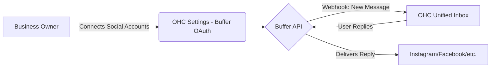
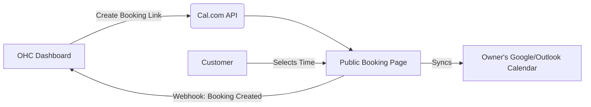
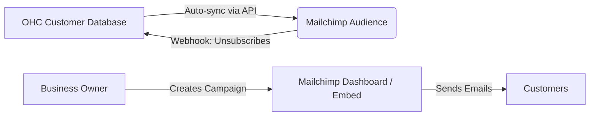
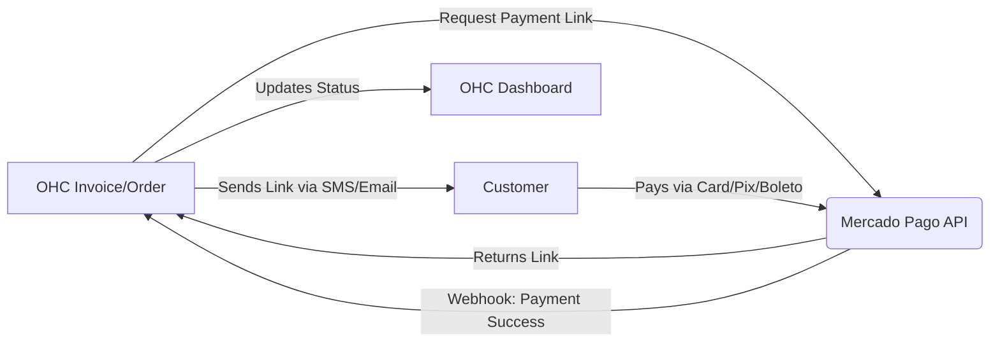
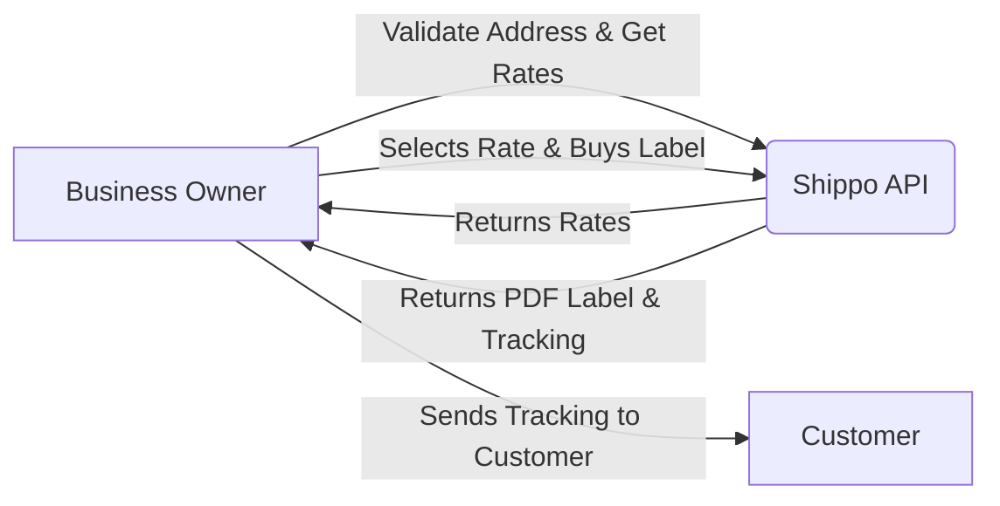
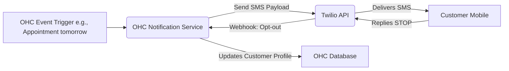
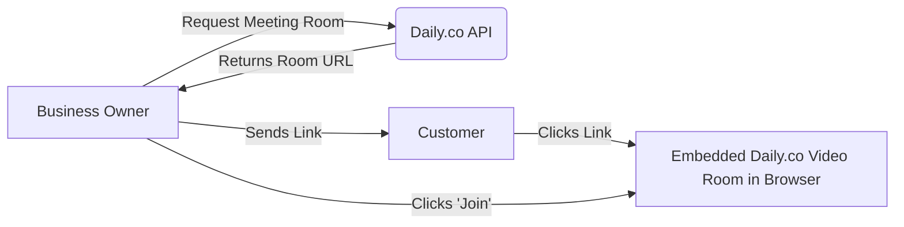

# Research Report: OHC Tool Integrations

## Introduction

This report evaluates potential third-party tool integrations for the Open Home Control (OHC) platform, specifically chosen for their value to small business owners. The research covers seven required categories: Social Media Integration, Calendar & Scheduling, Email Marketing, Payment Processing, Shipping & Logistics, SMS & Notifications, and Video Conferencing.

The goal is to identify tools that can seamlessly integrate into the OHC ecosystem, supporting both multi-tenant (Cloud) and single-tenant (Standalone) deployments, while focusing on a non-technical user experience (the "Business Owner Lens").

## Evaluated Tools

| Category | Recommended Tool | Core Value Proposition | Pricing (Est.) | Cloud & Standalone Support |
| :--- | :--- | :--- | :--- | :--- |
| **Social Media Integration** | Buffer | Unified social inbox and post scheduling | Free tier; $6/mo per channel | Yes |
| **Calendar & Scheduling** | Cal.com | Open-source, customizable booking pages | Free for individuals; $12/user/mo | Yes |
| **Email Marketing** | Mailchimp | Automated campaigns and audience management | Free tier; Starts at $13/mo | Yes |
| **Payment Processing** | Mercado Pago | Specialized LATAM payment gateway | Transaction fees (varies by region) | Yes |
| **Shipping & Logistics** | Shippo | Multi-carrier shipping label generation | Free tier; $17/mo for Pro | Yes |
| **SMS & Notifications** | Twilio | Global, reliable SMS delivery | Pay-as-you-go (~$0.008/msg) | Yes |
| **Video Conferencing** | Daily.co | WebRTC video/audio APIs | 10k free mins; $0.004/min | Yes |

## Issue Briefs

---

### [Social Media Integration] Buffer Integration for Unified Inbox

**Problem Statement:** Small business owners struggle to keep up with customer messages scattered across Instagram, Facebook, TikTok, and WhatsApp. They need a single place to view and respond to all social interactions without constantly switching apps.

**Research Report:** Buffer offers a robust API and a strong reputation for simplifying social media management. Its "Community Inbox" feature allows users to engage with comments and messages from multiple platforms. Buffer's pricing is accessible (free tier available, paid plans start at ~$6/month per channel), making it ideal for small businesses. The API allows for reading and replying to comments, which fits the unified inbox use case perfectly. It operates primarily as a cloud service, but OHC can securely manage the API keys and webhooks in both Cloud and Standalone modes.

**Design Doc:**

*   **Mobile UX Flow:**
    1.  User navigates to Settings > Social Media on the OHC mobile app.
    2.  User taps "Connect Buffer" and completes the OAuth flow.
    3.  A new "Inbox" tab appears on the main dashboard.
    4.  The Inbox displays a unified list of messages with platform icons.
    5.  Tapping a message opens a chat interface to reply directly.

**Implementation Prompt:** Implement a unified inbox feature using the Buffer API. The user should be able to connect their Buffer account via OAuth. Once connected, OHC should display incoming comments/messages from all connected social channels in a single, chronological feed. Users must be able to reply to these messages directly from the OHC interface, and the reply should be published to the original social platform via Buffer. The focus is on a clean, simple chat-like interface that hides the complexity of managing multiple social networks.

**Priority:** P1
**Estimated Scope:** Medium

---

### [Calendar & Scheduling] Cal.com Integration for Booking Management

**Problem Statement:** Service-based business owners (consultants, tutors, salons) spend too much time going back and forth over email or text to schedule appointments. They need a simple, self-service booking page that syncs with their personal calendar to prevent double-booking.

**Research Report:** Cal.com is an open-source scheduling tool that is highly customizable and developer-friendly. It offers a generous free tier for individuals and a $12/user/month team plan. It natively supports syncing with Google Calendar, Outlook, and Apple Calendar, handling timezone conversions and conflict resolution automatically. Because it is open-source and API-first, it is an excellent fit for OHC's architecture, supporting both Cloud and Standalone modes effectively (it can even be self-hosted, though the cloud API is sufficient for this integration).

**Design Doc:**

*   **Mobile UX Flow:**
    1.  User goes to Settings > Scheduling.
    2.  User connects their Cal.com account or creates a new one through an embedded flow.
    3.  User defines availability rules (e.g., "9 AM - 5 PM, Mon-Fri").
    4.  OHC generates a shareable booking link (e.g., `cal.com/owner/consultation`).
    5.  The OHC dashboard displays upcoming appointments synced from Cal.com.

**Implementation Prompt:** Integrate Cal.com to allow business owners to generate and manage booking links directly from OHC. The integration should handle OAuth connection to Cal.com. OHC should display a summary of upcoming appointments on the main dashboard. The user should be able to copy their public booking link easily to share with customers. The technical complexity of defining event types and availability should be abstracted away behind a simple "Simple Mode" setup wizard in OHC.

**Priority:** P0
**Estimated Scope:** Medium

---

### [Email Marketing] Mailchimp Integration for Customer Engagement

**Problem Statement:** Business owners want to send newsletters, promotions, and updates to their customer base but find traditional email marketing tools too complex to set up and manage alongside their primary business software.

**Research Report:** Mailchimp remains the industry standard for small business email marketing. It offers a free tier (up to 500 contacts) and paid plans starting around $13/month. Its API is mature and well-documented. The key value for OHC is syncing the OHC customer database automatically with a Mailchimp audience, eliminating manual CSV exports/imports. Mailchimp's strict anti-spam compliance tools also protect the business owner's reputation.

**Design Doc:**

*   **Mobile UX Flow:**
    1.  User navigates to Customers > Marketing.
    2.  User taps "Connect Mailchimp" (OAuth).
    3.  OHC automatically syncs existing OHC contacts to a designated Mailchimp list.
    4.  A toggle is provided to "Auto-add new customers to mailing list."
    5.  The dashboard shows high-level stats (e.g., "Last campaign: 45% open rate").

**Implementation Prompt:** Implement a seamless contact synchronization between OHC and Mailchimp. When a user connects their Mailchimp account, OHC should automatically keep the Mailchimp audience up-to-date with the OHC customer list. This includes handling new additions, updates to contact info, and respecting unsubscribe events via webhooks. The OHC UI should provide a simple "Sync Status" indicator and basic metrics from recent campaigns, directing the user to Mailchimp's interface for actual email design.

**Priority:** P2
**Estimated Scope:** Medium

---

### [Payment Processing] Mercado Pago Integration for LATAM Markets

**Problem Statement:** Small businesses in Latin America need a reliable way to accept digital payments (credit cards, Pix, Boleto) that integrates with their local banking systems, as global providers like Stripe are not always accessible or preferred by local consumers.

**Research Report:** Mercado Pago is the leading payment processor in Latin America, offering extensive support for local payment methods across countries like Brazil, Mexico, Argentina, and Colombia. It charges transaction fees rather than monthly subscriptions. Integrating Mercado Pago allows OHC to effectively serve the LATAM market. The API supports generating payment links and processing checkouts, which works well for both Cloud and Standalone environments.

**Design Doc:**

*   **Mobile UX Flow:**
    1.  User creates an Invoice in OHC.
    2.  User selects "Get Payment Link" (Mercado Pago must be configured in Settings).
    3.  OHC generates a short link.
    4.  User shares the link with the customer via WhatsApp or SMS.
    5.  When paid, the invoice status automatically changes to "Paid" and sends a push notification to the owner.

**Implementation Prompt:** Integrate Mercado Pago to allow business owners to generate payment links for invoices or direct sales. The system must securely handle API credentials. OHC should provide a button to "Generate Payment Link" on any invoice or order. The system must listen for Mercado Pago webhooks to automatically mark invoices as "Paid" in the OHC database when the transaction is completed successfully. The integration must gracefully handle failures and pending statuses (e.g., waiting for Boleto payment).

**Priority:** P1
**Estimated Scope:** Large

---

### [Shipping & Logistics] Shippo Integration for Label Generation

**Problem Statement:** E-commerce and retail business owners waste hours manually copying customer addresses into carrier websites to buy shipping labels and track packages.

**Research Report:** Shippo aggregates multiple carriers (USPS, UPS, FedEx, DHL, etc.) into a single API. It offers a pay-as-you-go model (free tier with a small per-label fee) and discounted shipping rates, which is highly attractive to small businesses. The API handles address validation, rate comparison, label generation, and tracking. This integration is essential for any product-based business using OHC.

**Design Doc:**

*   **Mobile UX Flow:**
    1.  User opens a "Pending Shipment" order.
    2.  User taps "Create Shipping Label."
    3.  OHC displays 2-3 cheapest/fastest options (abstracting away the complex list of all services).
    4.  User taps "Buy Label."
    5.  The label PDF is displayed for printing (or saving to mobile), and the tracking number is automatically added to the order.

**Implementation Prompt:** Implement shipping label generation using the Shippo API. When viewing an order requiring shipment, the user should be able to click a button to fetch shipping rates. The integration must perform address validation first. After the user selects a rate, OHC should purchase the label via Shippo, store the tracking number, and provide the user with a downloadable/printable PDF of the label. The UI must simplify the carrier options, presenting only the most relevant choices (e.g., "Cheapest" vs. "Fastest") to avoid overwhelming non-technical users.

**Priority:** P1
**Estimated Scope:** Large

---

### [SMS & Notifications] Twilio Integration for Global Messaging

**Problem Statement:** Business owners need a reliable way to send urgent updates, appointment reminders, or simple confirmations to customers via SMS, especially in regions or demographics where email open rates are low.

**Research Report:** Twilio is the industry leader for programmable SMS. It offers robust global carrier coverage, high deliverability, and handles complex opt-out compliance (e.g., STOP messages). Pricing is pay-as-you-go (roughly $0.008 per message in the US, varying globally). Integrating Twilio allows OHC to offer automated SMS notifications (like "Your order is ready" or "Appointment reminder"), which is a critical feature for service and local retail businesses.

**Design Doc:**

*   **Mobile UX Flow:**
    1.  User goes to Settings > Notifications.
    2.  User toggles "Send SMS Reminders to Customers" to ON.
    3.  User inputs their Twilio API keys (Advanced Mode) or uses OHC's managed Twilio pool (Simple Mode, if applicable).
    4.  User can customize a simple text template: "Hi {{name}}, your appointment is at {{time}}."
    5.  The system automatically sends these messages without further manual input.

**Implementation Prompt:** Integrate Twilio to provide automated SMS notifications to customers based on OHC events (e.g., upcoming appointments, order status changes). The system must securely store Twilio API credentials. The UI should allow business owners to enable/disable specific SMS triggers and customize basic message templates using merge tags (like customer name or date). The integration MUST handle Twilio webhooks for opt-outs (STOP requests) and automatically update the customer's profile in OHC to prevent future SMS delivery, ensuring compliance.

**Priority:** P0
**Estimated Scope:** Medium

---

### [Video Conferencing] Daily.co Integration for Virtual Consultations

**Problem Statement:** Consultants, tutors, and telehealth providers need a frictionless way to host video meetings without forcing their clients to download external apps like Zoom or navigate complex meeting links.

**Research Report:** Daily.co provides WebRTC-based video and audio APIs that allow video calls to be embedded directly into a web or mobile application. They offer 10,000 free minutes per month, which is generous for small businesses, followed by a low per-minute rate. By using Daily.co, OHC can offer "one-click" virtual meetings embedded within the OHC platform, providing a highly professional, branded experience for the business owner's clients.

**Design Doc:**

*   **Mobile UX Flow:**
    1.  User schedules a new "Virtual Consultation".
    2.  OHC automatically generates a Daily.co room link in the background.
    3.  At the time of the meeting, the user taps a "Join Video Call" button on the appointment details screen.
    4.  The video interface opens directly within the OHC app (or mobile browser), without requiring a separate app download.

**Implementation Prompt:** Integrate Daily.co to automatically provision video meeting rooms for scheduled virtual appointments. When an appointment is created that requires video, OHC should call the Daily.co API to create a unique room. OHC must store this room URL and present a clear "Join Meeting" button to both the business owner (within OHC) and the customer (via a public portal or email link). The video experience should utilize Daily.co's prebuilt UI to minimize development time while ensuring a reliable, responsive video experience on both desktop and mobile.

**Priority:** P2
**Estimated Scope:** Medium
