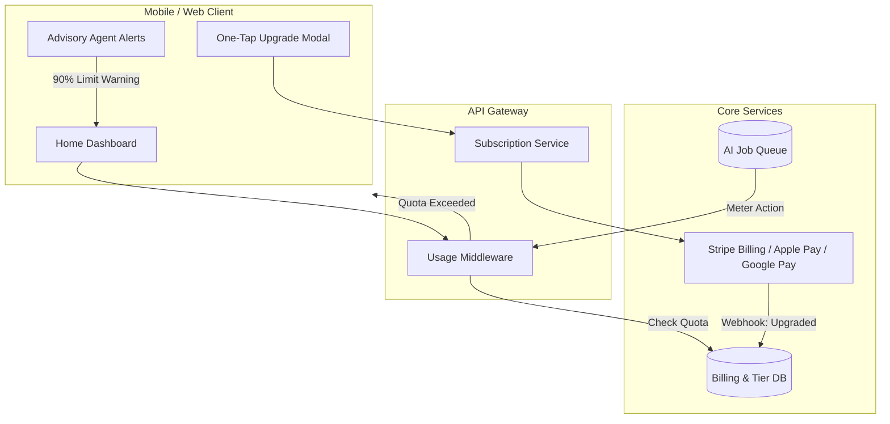

# Title
Multi-Tenant SaaS Tier Architecture & Upgrade Path UX

# Problem Statement
Small business owners coming to OneHumanCorp (OHC) need immediate value to build trust, which is why a generous "Free" tier is critical. However, as they grow—adding more products, exceeding AI action limits, or needing a custom domain—they need a frictionless way to upgrade. Currently, the platform lacks a formalized SaaS tier architecture that clearly defines resource constraints, gracefully handles limit exhaustion (e.g., "AI quota exceeded"), and naturally guides non-technical users (like Carlos or Maya) to upgrade without overwhelming them with confusing metrics or jargon. The challenge is communicating these technical limits (storage, database tenants, API usage) in plain, business-owner-friendly language while providing a seamless upgrade experience right from their phone.

# Research Report
Competitive analysis of platforms like Shopify, Wix, and Squarespace reveals that complex, feature-gated pricing tiers often paralyze new users.
- **Shopify**: Trial periods (no free tier), pushing users into monthly subscriptions before they've made a sale.
- **Wix/Squarespace**: Offers free tiers, but heavily limits core functionality (like accepting payments) or brands the site intrusively.
- **OHC's Differentiation**: OHC's Free tier must be *genuinely useful*—allowing users to process payments and use basic AI departments. The constraints should be around scale (number of products, amount of storage, AI action volume) and premium branding (custom domain), not core utility.

**SaaS Tier Matrix:**
| Tier | Price | Products | AI Departments | AI Actions/mo | Storage | Custom Domain | Target Persona |
|---|---|---|---|---|---|---|---|
| **Free** | $0 | 10 | 1 (Ops) | 100 | 500MB | No (OHC sub) | New side-hustlers (e.g., student selling art) |
| **Starter** | $9/mo | 100 | 3 | 1,000 | 5GB | Yes | Maya (Baker), Leo (Tutor) |
| **Pro** | $29/mo | Unlimited | 10 | Unlimited | 50GB | Yes + SSL | Priya (Boutique), Carlos (Handyman) |
| **Business** | $79/mo | Unlimited | Unlimited | Unlimited | 500GB | Yes + multi-domain | High-volume businesses |

# Design Doc

The Multi-Tenant Tier System must invisibly track usage and gracefully handle limits on the client side, ensuring a premium mobile-first UX.

## User-Facing Limits & Limit Exhaustion Flow

1. **AI Action Limits**:
   - **What it means**: Every time an AI agent drafts an email, replies to an IG DM, or generates a product description, it consumes an "Action."
   - **Limit Reached UX**: When a user reaches 90% of their limit, the Business Advisory agent sends a friendly push notification: *"You've been busy! Your AI agents are almost out of energy for the month. Upgrade to Starter to keep them running, or they'll take a break until the 1st."*
   - **Exhaustion**: If the limit is reached, AI actions gracefully degrade to manual drafting (e.g., Customer Success agent leaves the chat box empty for the user to type, rather than generating a draft). A subtle "Upgrade to re-enable AI" button appears in the action area.

2. **Storage Limits**:
   - **What it means**: Storage for product images, videos, and portfolio assets.
   - **Limit Reached UX**: When uploading a new photo that exceeds the limit, a bottom sheet modal (375px optimized) slides up: *"Your gallery is full. Upgrade to Starter for 10x more space, or delete older photos."* The user can upgrade via Apple Pay/Google Pay in two taps.

3. **Custom Domains**:
   - **What it means**: Upgrading from `maya.ohc.app` to `mayascakes.com`.
   - **Upgrade Flow**: Within the "Marketing" department tab, there is a "Get a Custom Web Address" button. Tapping it opens a flow to search for a domain. If they are on the Free plan, selecting a domain automatically bundles the "Starter" plan upgrade into the checkout process.

## Architecture Diagram

## Key Design Decisions
- **Graceful Degradation**: Core business operations (like accepting payments) must *never* break when a limit is reached. Only premium features (like auto-drafting responses) degrade to manual mode.
- **In-Context Upgrades**: Users are never forced to navigate to a complex "Billing" page. Upgrades are presented in context (e.g., when uploading a photo or trying to add an 11th product).
- **One-Tap Purchasing**: Native integration with Apple Pay and Google Pay via Stripe to make the upgrade process frictionless on mobile devices.
- **Friendly Framing**: Limits are framed positively by the Advisory agent ("Your business is growing fast!").

# Implementation Prompt
Implement the Multi-Tenant SaaS Tier data structures and the mobile-first UX flows for limit exhaustion.
1. Define the frontend state management (e.g., Riverpod/Zustand) to track the current tenant's tier and usage quotas.
2. Build the `UpgradeBottomSheet` widget (optimized for 375px screens) that triggers when a limit (like max products or storage) is hit. It must explain the limit in non-technical terms and offer a one-tap upgrade using native mobile payments.
3. Implement the graceful degradation UX for the AI Customer Success agent: if the AI action quota is exceeded, the chat UI should fallback to a standard manual text input field with an inline "Upgrade to restore AI replies" prompt.
4. Add E2E tests simulating a Free tier user attempting to add an 11th product, verifying that the `UpgradeBottomSheet` appears with the correct copy, and that the product is not added until the simulated upgrade completes.

# Priority
P1

# Estimated Scope
Medium

