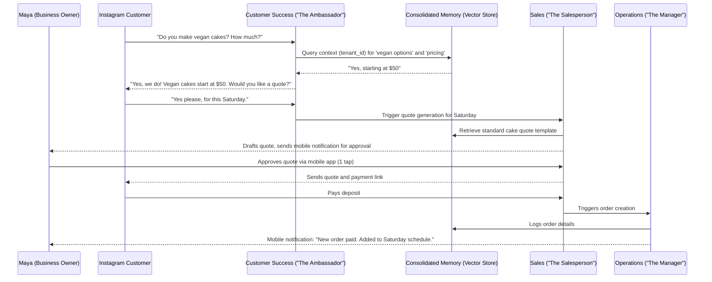

# Title: AI Agent Department Architecture

## Problem Statement

Small business owners—whether a baker, a handyman, or a boutique owner—are overwhelmed by the day-to-day operations of running a business. They are experts in their craft, not in customer support, marketing, bookkeeping, or legalese. They need a team of experts to handle the complexity invisibly in the background, without requiring them to read manuals, configure complex automation workflows, or learn developer jargon. The platform must provide an invisible, automated "staff" organized into familiar, real-world departments (like "The Manager" or "The Promoter") that understand the context of the business, coordinate seamlessly, and handle tasks automatically while staying within the mobile-first UX.

## Research Report

Small business software like Shopify, Wix, or Squarespace often places the burden of integration, automation, and configuration on the business owner. Owners have to install disparate apps, set up Zapier zaps, and configure complex rule engines.

OneHumanCorp aims to replace this fragmented experience with an integrated AI Agent Department Architecture. The agents mirror a real-world business structure:
1.  **Operations ("The Manager")**: Order/booking processing, inventory, fulfillment, refunds.
2.  **Marketing & Advertising ("The Promoter")**: SEO, social media, promotional content, link-in-bio pages.
3.  **Sales & Acquisition ("The Salesperson")**: Quote generation, lead follow-up, referrals, upsells.
4.  **Customer Success ("The Ambassador")**: Message replies, order updates, reviews.
5.  **Finance & Payments ("The Accountant")**: Payment processing, reports, subscriptions, tax summaries.
6.  **Legal & Compliance ("The Protector")**: Terms, policies, contracts, GDPR, liability.
7.  **Business Advisory ("The Advisor")**: Weekly health reports, trend suggestions, pricing recommendations.

Key findings:
*   Agents must be contextually aware across the business. They share memory implicitly via a `tenant_id` scoped `consolidated_memory` vector store.
*   Triggers can be scheduled (e.g., weekly health report), event-driven (e.g., order placed), or on-demand (e.g., "draft a quote for this customer").
*   Approvals: High-risk actions (e.g., spending money on ads, sending legal contracts) require draft-for-review; low-risk actions (e.g., replying to FAQs) can be auto-executed based on user preference.
*   Cross-department coordination is essential (e.g., Operations marks an order fulfilled, Customer Success automatically sends the tracking and review request).

## Design Doc

### Architecture Diagram

### Key Design Decisions

1.  **Implicit Shared Memory**: Agents do not pass long JSON payloads to each other. They communicate via the `consolidated_memory` vector store, ensuring all departments have the latest context on a customer or order.
2.  **Human-in-the-Loop Defaults**: The Progressive Disclosure Pattern applies here. By default, actions like generating quotes or publishing Instagram posts are drafted for review (1-tap approval on mobile). The owner can toggle "Advanced mode" to let trusted agents auto-execute.
3.  **Event-Driven Choreography**: Departments react to events (e.g., `OrderPaid`, `MessageReceived`) rather than being hardcoded into linear orchestrators. This makes it easy to add new agent behaviors without breaking existing flows.
4.  **Mobile-First Notifications**: Agent activity is summarized in simple, plain-language mobile notifications ("The Promoter drafted a new Instagram post for your approval") rather than technical logs.

### Mobile UX Flow
1.  **Dashboard**: The mobile home screen shows a "Staff Updates" section where agents surface drafts (e.g., a drafted quote, a suggested social media post) and summaries.
2.  **Interaction**: Tapping an update opens a simple preview with a clear "Approve" (swipe or tap) or "Edit" button. The UI uses large 44x44px touch targets.
3.  **Settings**: Under the "Staff" tab, the owner can view each department. They see a simple avatar and a plain-language description of what that "staff member" does. They can toggle "Auto-pilot" on or off for specific tasks.

## Implementation Prompt

Implement the core Event Bus and Shared Memory interfaces for the AI Agent Department Architecture.

**Acceptance Criteria:**
1.  Define a set of unified event interfaces (e.g., `EventReceived`) that can trigger specific AI agent departments.
2.  Implement a memory read/write abstraction that automatically scopes queries and insertions by `tenant_id` to ensure strict multi-tenancy isolation.
3.  Provide an example implementation of a cross-department flow: A mock Customer Success agent receives an event, writes the context to shared memory, and emits a subsequent event that triggers a mock Sales agent.
4.  Ensure all generated UI text or logging for the business owner uses plain language (e.g., "Quote generated for review") and strictly avoids technical jargon.
5.  Include comprehensive unit tests simulating event dispatching and scoped memory retrieval.

## Priority
P0

## Estimated Scope
Large
### Budgeting & Throttling
1.  **Action Quotas**: To prevent runaway costs, each tier grants a fixed pool of "AI Actions" per month (e.g., 1,000 for Starter).
2.  **Usage Tracking**: A middleware interceptor counts executed agent actions and credits the `tenant_id`.
3.  **Graceful Degradation**: Once a tenant exceeds their limit, agents stop auto-executing new tasks and switch exclusively to drafting manual actions, notifying the owner to either upgrade their tier or purchase a top-up block.
