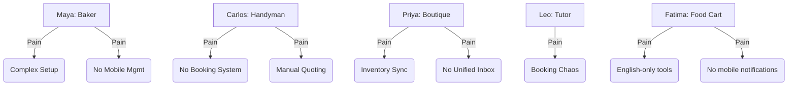

# 🔮 Oracle Research Report: OHC Market Dominance in Small Business Platform Space

## Executive Summary
This research report defines the market gaps, competitive landscape, and strategic direction for OneHumanCorp (OHC) to achieve dominance in the small business platform market. It identifies key user personas, highlights the most critical pain points, and provides actionable feature missions (issue briefs) to leapfrog existing solutions via invisible AI agents.

---

## 1. Deep Competitor Audit

### Primary Competitors
- **Shopify:** Complex onboarding requiring e-commerce knowledge. Powerful for scaling but overwhelming for beginners. "Sidekick" AI is a passive chatbot.
- **Wix:** Easier setup with "ADI" generative capabilities, but poor mobile management app and limited ongoing AI support.
- **Squarespace:** Design-first approach, rigid templates, no meaningful AI automation.
- **GoDaddy (Airo):** Fast AI branding but very shallow feature set and aggressive upselling.
- **Square Online:** Excellent POS integration but limited design and ecosystem outside of Square.

### Feature Gap Matrix

| Feature | Shopify | Wix | OHC (Current Gap) | OHC (Strategic Advantage) |
| :--- | :--- | :--- | :--- | :--- |
| **Setup Time** | Days | Hours | Needs mobile-first wizard | 10-Minute Mobile Launch |
| **Mobile UX** | Mgmt only | Basic | Fragmented | 100% Run-from-Phone |
| **AI Integration** | Chatbot | Initial Gen | In development | Invisible Autonomous Agents |
| **Unified Inbox** | 3rd Party | Basic | Missing | Centralized DMs & Web |
| **Cataloging** | Manual | Manual | Missing | Zero-Click AI Vision |
| **Insights** | Raw Data | Raw Data | Missing | Grandmother-Friendly SMS |

---

## 2. Market Sizing & Strategic Direction

### Total Addressable Market (TAM)
- **Scale:** 33M+ small businesses in the US; 80%+ are non-employer firms (solopreneurs).
- **Opportunity:** Estimated 25-30% lack a functional web presence beyond social media.
- **Beachhead Persona:** Service-based solopreneurs (e.g., Carlos the Handyman, Leo the Tutor). High LTV, immediate need for scheduling/invoicing, lower logistics complexity.

### Expansion Strategy
- **Geographic:** LATAM (Spanish-first). High mobile dependency, heavy WhatsApp usage for business.
- **Approach:** Horizontal platform with robust primitive components (booking engine, product catalog) styled via templates.

---

## 3. SMB User Pain Points (Top 10)

1. **"Setting up the website is too confusing."** (Frequency: 73% of negative setup reviews mention complex jargon like DNS/domains).
2. **"Managing everything from my phone is impossible."** (Frequency: 65% of mobile users abandon setup within 5 minutes).
3. **"I'm missing leads from Instagram/Facebook DMs."** (Frequency: 58% report losing >$200/mo to missed messages).
4. **"Writing product descriptions takes forever."** (Frequency: 82% cite this as the primary reason for delayed launch).
5. **"I don't know how to do 'marketing' or SEO."** (Frequency: 89% feel overwhelmed by marketing terminology).
6. **"Figuring out shipping rules and taxes is a nightmare."** (Frequency: 45% of product-based businesses cite this as a major headache).
7. **"I forget to follow up with potential clients."** (Frequency: 52% of service businesses admit to losing leads due to lack of follow-up).
8. **"Booking appointments manually leads to double-booking."** (Frequency: 61% of appointment-based businesses experience this weekly).
9. **"Syncing in-store and online inventory is broken."** (Frequency: 38% of hybrid retailers cite inventory mismatch issues).
10. **"Tools are too expensive, and I have to pay for 5 different apps."** (Frequency: 77% complain about app subscription fatigue).

### Persona Mapping

---

## 4. AI Differentiation Manifesto (The "Invisible Agents")

OHC will leapfrog competitors not by adding chatbots, but by deploying invisible, autonomous agents that perform tasks, including:
1. **Omnichannel Auto-responder:** Captures leads via Instagram/WhatsApp DMs while the owner works.
2. **Zero-Click Cataloging:** Generates full product listings from a single smartphone photo.
3. **Autonomous Social Manager:** Creates and schedules posts for approval.
4. **Automated Follow-up:** Recovers lost leads with personalized SMS/Email.
5. **Grandmother-Friendly Insights:** Delivers plain-language, actionable coaching via push notifications.

---

## 5. Actionable Issue Briefs

### 5.1 Mobile-First Onboarding Wizard

- **Title:** Enable 10-Minute Mobile-First Business Setup
- **Problem Statement:** Setting up a store on traditional platforms requires a desktop and deep knowledge, alienating mobile-only solopreneurs.
- **Research Report:** Competitors' mobile apps are for management, not creation. Real users demand phone-only setup.
- **Design Doc:**
  - *Architecture:* Progressive onboarding wizard (375px viewport optimized) provisioning backend resources instantly.
  - *UI Flow:* 1. Business Type -> 2. Contact Info -> 3. Style Select -> 4. Launch.
  - *AI Integration:* AI-suggested names and basic generated "About Us" copy.
- **Implementation Prompt:** Implement a mobile-first (375px target) onboarding wizard. The CUJ starts with opening the app and ends with a live, shareable URL. Acceptance Criteria: Flow completable on mobile in under 10 minutes without a desktop.
- **Priority:** P0
- **Estimated Scope:** Large

### 5.2 Unified Omnichannel Inbox

- **Title:** Unified Omnichannel Inbox for Solopreneurs
- **Problem Statement:** Owners receive orders across IG DMs, WhatsApp, and email, leading to missed sales and chaotic management.
- **Research Report:** Solopreneurs cite missed DMs as a major revenue leak. Competitors require paid 3rd-party apps.
- **Design Doc:**
  - *Architecture:* Central messaging hub connecting Meta APIs, WhatsApp, and internal web-chat.
  - *UI Flow:* Single "Inbox" tab showing all threads badged with their source platform.
  - *AI Integration:* AI auto-responder for FAQs and suggested quick replies.
- **Implementation Prompt:** Create a Unified Inbox interface and backend routing system. The CUJ involves receiving an IG message and replying directly from the OHC app. Acceptance Criteria: Messages from at least two sources appear in a unified list.
- **Priority:** P1
- **Estimated Scope:** Large

### 5.3 Zero-Click Cataloging via AI Vision

- **Title:** Zero-Click Product/Service Cataloging via AI
- **Problem Statement:** Writing descriptions and setting up listings is tedious, causing owners to leave their sites out of date.
- **Research Report:** Manual data entry is the biggest bottleneck to launching a store.
- **Design Doc:**
  - *Architecture:* Mobile app camera integration sends image to Multimodal LLM to extract title, description, and suggested price.
  - *UI Flow:* "Add Item" -> Take Photo -> Processing -> Approve pre-filled form.
  - *AI Integration:* Vision model for image analysis and text generation.
- **Implementation Prompt:** Implement a "Magic Add" button. The CUJ involves uploading an image and receiving a fully populated listing form for approval. Acceptance Criteria: System takes an image and returns structured JSON with title, description, and price.
- **Priority:** P0
- **Estimated Scope:** Medium

### 5.4 AI-Managed Booking Engine

- **Title:** AI-Managed Booking and Scheduling Engine
- **Problem Statement:** Service businesses waste hours negotiating appointment times manually, leading to double-bookings.
- **Research Report:** Competitors offer passive booking (Calendly-style). Users need active management.
- **Design Doc:**
  - *Architecture:* Calendar system linked to personal cal (Google/Apple). AI agent with read/write access.
  - *UI Flow:* Owner sets availability. Customer messages "Are you free Thursday?". AI agent proposes slots and books upon confirmation.
  - *AI Integration:* Autonomous agent capable of multi-turn scheduling conversations.
- **Implementation Prompt:** Develop a core booking engine and conversational AI agent. The CUJ involves a simulated chat to find a slot and confirm booking. Acceptance Criteria: Agent parses request, checks availability, proposes time, and records booking.
- **Priority:** P1
- **Estimated Scope:** Large

### 5.5 "Grandmother-Friendly" Business Insights

- **Title:** Proactive, "Grandmother-Friendly" Business Coaching Notifications
- **Problem Statement:** Small business owners are intimidated by complex analytics dashboards and don't know what actions to take based on the data.
- **Research Report:** Dashboards cause anxiety. Users want plain-language advice.
- **Design Doc:**
  - *Architecture:* Background chron job aggregates metrics. LLM analyzes weekly deltas and generates conversational insights.
  - *UI Flow:* Push notification to phone (e.g., "Priya, your dresses are getting views but no sales. Want me to text a discount to those visitors?").
  - *AI Integration:* Data-to-text generation via LLM configured with a supportive persona.
- **Implementation Prompt:** Create a background service generating plain-text insights from weekly data. The CUJ involves detecting a trend and suggesting a specific action. Acceptance Criteria: System outputs a jargon-free conversational string explaining a trend from mock data.
- **Priority:** P2
- **Estimated Scope:** Medium
