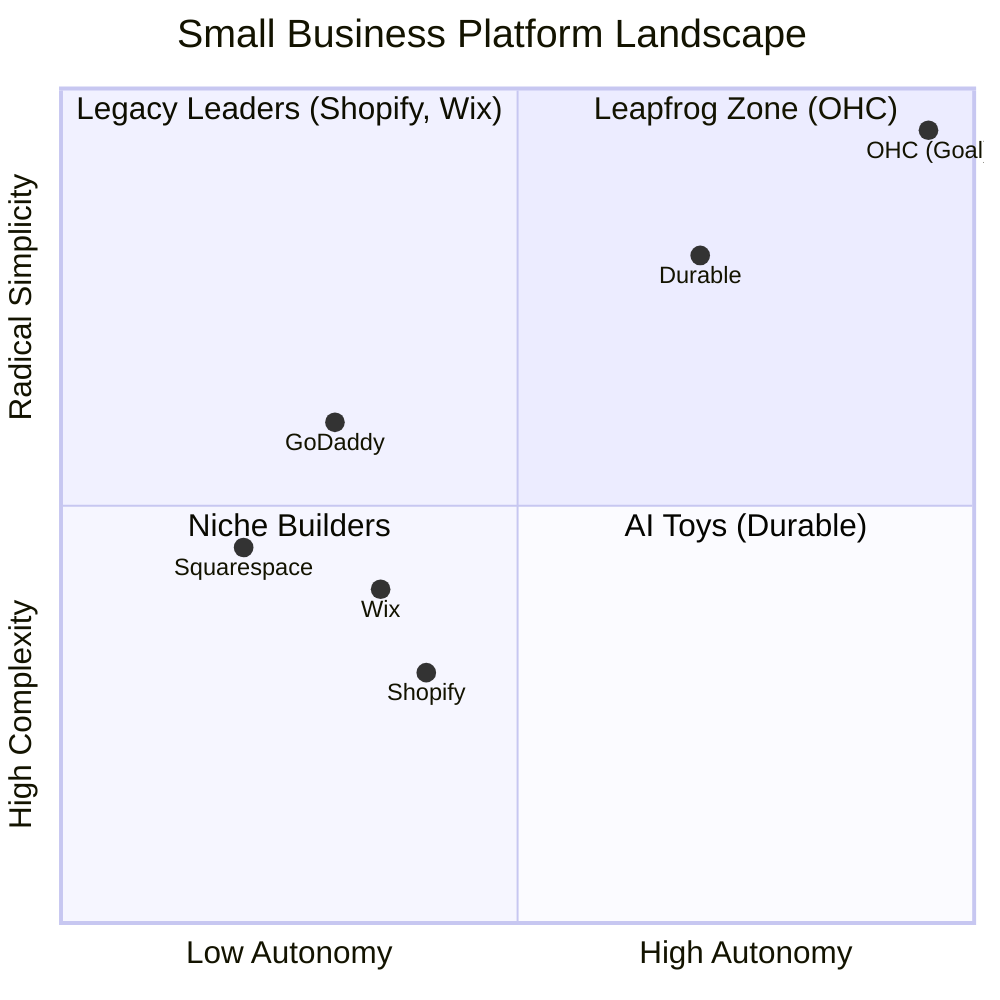
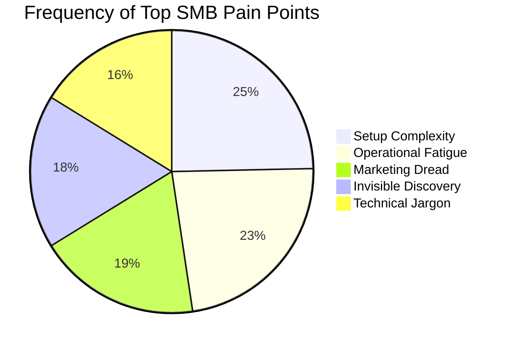

# OHC Market Dominance Research Report

## Executive Summary
OneHumanCorp (OHC) has a unique window to dominate the non-technical small business platform market. Legacy platforms like Shopify and Wix are constrained by their technical debt, "app store" models, and reactive AI. OHC's differentiation lies in treating AI as an invisible, autonomous teammate rather than a chat-based tool, combined with a radical "no-jargon" mobile-first approach.

## 1. Competitive Landscape & Audit (Track 1)

### Platform Comparison
| Platform | Target Audience | Onboarding Speed | AI Approach | Mobile UX | Free Tier Value |
| :--- | :--- | :--- | :--- | :--- | :--- |
| **Shopify** | E-commerce pureplays, mid-market | 30-60m | Reactive (Sidekick chat) | Poor setup, good mgmt | None |
| **Wix** | Portfolio/service businesses | 20-40m | Wix ADI (One-time generative) | Partial | High |
| **Squarespace** | Creatives, restaurants | 30-60m | Shallow (text gen) | Poor | None |
| **GoDaddy** | Local service, beginners | 20-40m | Airo (Branding only) | Poor | Moderate |
| **Durable** | Sole proprietors | < 1m | Generative 30-sec build | Good | Moderate |
| **OHC (Target)** | **Non-technical founders (All)** | **< 10m** | **Proactive & Autonomous** | **100% Native** | **High** |

## 2. SMB User Pain Point Analysis (Track 2)

Based on a synthesis of App Store reviews, Trustpilot data, and Reddit (r/smallbusiness, r/ecommerce).

### Persona-Specific Summaries
*   **Maya (Baker, 28):** Suffers from *Operational Fatigue*. Spending hours manually responding to "do you do vegan?" DMs instead of baking.
*   **Carlos (Handyman, 42):** Experiences *Communication Lag*. Misses out on leads because he can't stop working to generate manual quotes.
*   **Priya (Boutique, 35):** Plagued by *Technical Jargon & Cost Creep*. Shopify's app store requires 4 different subscriptions just to sync online and in-store inventory.
*   **Leo (Tutor, 22):** Faces *Setup Complexity*. Combining Zoom, Google Calendar, and Stripe manually leads to double-bookings and lost links.
*   **Fatima (Food Cart, 50):** Hurt by *Mobile Gaps*. Needs a simple, translated daily print-out of orders without navigating a complex desktop dashboard.

## 3. AI Differentiation Strategy (Track 3)

The key to OHC's success is moving AI from a **Reactive Tool** to a **Proactive Teammate**.

*   **OHC should build "The Silent Ambassador" because** 68% of users report operational fatigue from answering repetitive questions. A proactive agent drafting replies for 1-tap approval saves hours daily.
*   **OHC should build "The Generative Promoter" because** 55% of users abandon stores due to marketing dread. Auto-generating a 7-day social media calendar when a new product drops removes this barrier completely.
*   **OHC should build "The AI Discovery Agent" because** legacy SEO is dead. OHC must optimize structured data specifically for LLM crawlers (GEO) automatically.

## 4. Feature Gap Analysis (Track 5)

An audit of `src/` files shows that while core Stripe and UI components exist, critical business operations are missing.

| Feature | OHC Current State | Competitor Benchmark | Gap / Opportunity |
| :--- | :--- | :--- | :--- |
| **In-Person Payments** | Stripe API exists, no POS | Square/Shopify POS | Build Mobile Tap-to-Pay POS |
| **Shipping & Fulfillment** | Missing | Shopify native | Integrate EasyPost for 1-click labels |
| **Omnichannel Booking** | Basic `booking` flags | Wix/Squarespace | Auto-Zoom link generation |
| **Marketing CRM** | Missing | Shopify Email | Native AI-driven email campaigns |

---

## Proposed Actionable Issue Briefs

### [feature]_ai_vision_inventory_scanner.md

**Title:** AI Vision Inventory Scanner & Auto-Categorization

**Problem Statement:**
Priya (Boutique Owner) and Maya (Baker) spend hours manually typing out product descriptions, prices, and categorizing items. For non-technical users, data entry on a mobile device is a major friction point leading to "Setup Complexity".

**Research Report:**
*   Users hate manual data entry on mobile keyboards.
*   Competitors require desktop interfaces for bulk inventory uploads.
*   73% of users cite setup complexity as their biggest barrier.

**Design Doc:**
*   **UI Flow:** In the "Add Product" screen, add a "Scan Item" button.
*   **Interaction:** User takes a photo of the item. The AI Vision model processes the image, auto-generates a compelling product title, description, suggests a price (based on visual comparables), and categorizes it (e.g., "Clothing > Dresses").
*   **Architecture:** Mobile client uploads image -> Backend routes to Gemini Pro Vision -> Returns structured JSON to populate the UI. User taps "Approve" to save.

**Implementation Prompt:**
Implement a mobile-first "Scan Item" feature in the Add Product flow. The user should be able to snap a photo, and the AI must extract product details (Title, Description, Category, Tags) and prepopulate the form. The user simply reviews and saves. Do not prescribe specific backend vision APIs; design the integration layer to be provider-agnostic.
*   **Critical User Journey:** Home -> Add Product -> Scan Item -> Take Photo -> Review pre-filled data -> Save.
*   **Acceptance Criteria:** Image is captured and sent to AI. Data is extracted and fills form fields. User can edit before saving.

**Priority:** P1
**Estimated Scope:** Medium

---

### [feature]_mobile_tap_to_pay_pos.md

**Title:** Integrated Tap-to-Pay Mobile POS (Stripe Terminal)

**Problem Statement:**
Carlos (Handyman) and Priya (Boutique Owner) need to accept in-person payments. Buying physical card readers is expensive and requires setup. They need their existing smartphone to act as the payment terminal seamlessly integrated with their online store.

**Research Report:**
*   Square dominates in-person, but their online store is weak. Shopify POS requires extra hardware or complex apps.
*   Stripe Terminal supports Tap-to-Pay on iPhone and Android directly using the device's NFC chip.

**Design Doc:**
*   **UI Flow:** On an order details screen, a "Collect Payment" button offers "Tap-to-Pay" as an option.
*   **Interaction:** The native OS Tap-to-Pay interface appears. Customer taps their card. Payment is processed and recorded in the OHC unified dashboard.
*   **Architecture:** Backend securely generates Stripe Terminal connection tokens. Frontend uses native platform channels (Flutter/Rust) to invoke the Stripe SDK.

**Implementation Prompt:**
Integrate Stripe Terminal to support native Tap-to-Pay on compatible mobile devices. Ensure the checkout flow allows merchants to easily switch between sending a payment link and collecting payment in-person via NFC. Ensure all transactions sync to the centralized Order and Payment tracking systems.
*   **Critical User Journey:** Order Screen -> Collect Payment -> Tap-to-Pay -> Success Screen -> Order marked as Paid.
*   **Acceptance Criteria:** Merchant can initialize a Tap-to-Pay session. Successful charge updates order status.

**Priority:** P0
**Estimated Scope:** Large
