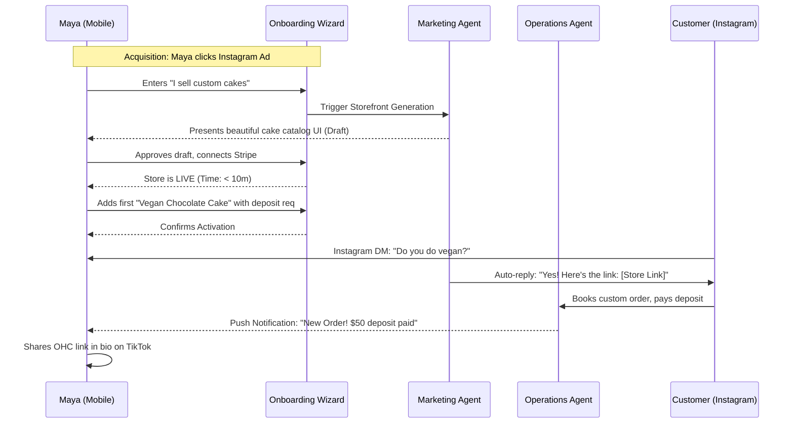
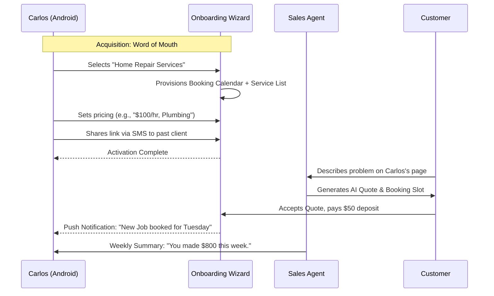
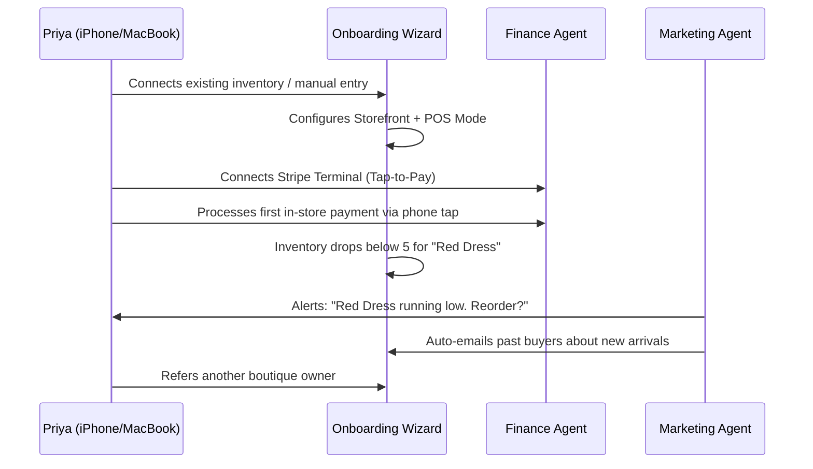
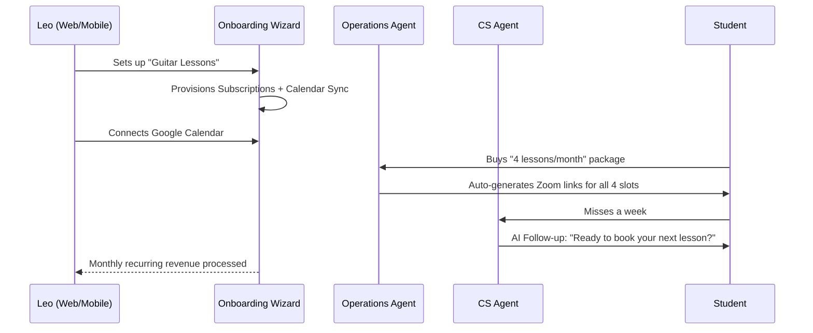
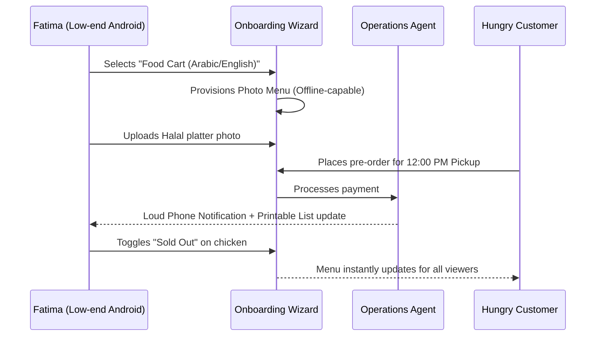

# Business Journey Architecture & Mobile-First UX Mappings

**Priority**: P0
**Estimated Scope**: Large

## Problem Statement
Small business owners (especially non-technical ones like bakers, handymen, food cart operators) are paralyzed by the initial friction of launching their business online. Existing platforms like Shopify, Wix, and Squarespace present them with a blank canvas, complex configuration panels, and industry jargon ("DNS", "SSL", "SEO"). The critical gap is the **"0 to 1" experience**: users need a guided, mobile-first, zero-configuration journey where their business context directly provisions a fully operational storefront, booking system, or catalog without manual assembly. If they can't get to their first sale within 10 minutes, they abandon the platform.

## Research Report
Our competitive analysis shows a stark contrast in "Time to First Sale" and "Mobile Management" capabilities:
*   **Shopify**: Geared toward semi-technical ecommerce merchants. Mobile app exists but is secondary to the desktop dashboard. Initial setup requires understanding shipping zones, payment gateways, and theme customization.
*   **Wix/Squarespace**: Visual site builders first. The journey is fundamentally "design a website," not "run a business." Highly desktop-oriented.
*   **GoDaddy**: Quick setup, but output is generic and lacks deep integration with booking or order management.

**OHC's Differentiation**: OHC flips the paradigm. Users don't build websites; they tell OHC about their business via a mobile chat/wizard, and OHC's AI agents automatically configure the required modules (catalog, calendar, pos, CRM). The platform is "Mobile-First" not just in presentation, but in *management*.

## Design Doc: High-Level Architecture

### Architectural Principles & Design Decisions
1.  **Context over Configuration**: Instead of asking the user to choose a theme, OHC asks what they sell. The `Onboarding Engine` automatically maps this to the required modules (e.g., Physical Products -> Catalog + Shipping; Services -> Calendar + Deposits).
2.  **Progressive Disclosure**: Only ask for what is strictly necessary to accept a payment. Defer complex setup (custom domains, tax settings) to the `Retention/Revenue` phases.
3.  **AI as the "Store Manager"**: AI agents (Operations, Marketing, Sales, CS, Finance, Legal, Advisory) are deeply integrated into the state machine of the user journey, proactively triggering the next step.

### End-to-End User Journeys (Mermaid.js Sequence Diagrams)

#### 1. Maya (The Home Baker) - Physical Products (Custom Orders)

#### 2. Carlos (The Freelance Handyman) - Services & Bookings

#### 3. Priya (The Boutique Owner) - Physical Products (Omnichannel)

#### 4. Leo (The Music Tutor) - Subscriptions

#### 5. Fatima (The Food Cart Operator) - Pre-orders (Low Data)

### Mobile UX Flows (375px First)

*   **Global Layout**: Bottom navigation bar (Home, Orders/Inbox, Products/Services, AI Advisory). All forms use native mobile keyboards (e.g., `keyboardType: TextInputType.number` for prices).
*   **Onboarding Flow**:
    1.  **Screen 1**: "What do you do?" (Large touch targets: Sell Products, Offer Services, Take Pre-orders).
    2.  **Screen 2**: "What's your business name?" (Text input with AI suggestion button).
    3.  **Screen 3**: "Generating your business..." (Shimmer loading with Glassmorphism blur, showing AI agents "working").
    4.  **Screen 4**: "You're live! Connect a bank to get paid." (Stripe Connect).
*   **The "Hub" (Home)**: Top-level daily stats (Revenue Today, Pending Orders). Actionable cards underneath ("You have 2 unanswered DMs", "Your AI drafted a new Instagram post").

### AI Agent Integration Points

*   **Acquisition**: The Marketing Agent (`The Promoter`) pre-fills the initial onboarding state based on minimal user input, drastically reducing time-to-value.
*   **Activation**: The Operations Agent (`The Manager`) seamlessly coordinates between Stripe (payment) and the local database (order state).
*   **Retention**: The Business Advisory Agent (`The Advisor`) pushes weekly plain-language summaries ("You sold 10 cakes this week!") directly via push notification, pulling users back into the app.
*   **Revenue**: The Sales Agent (`The Salesperson`) identifies upsell opportunities or churn risks (e.g., Leo's inactive student) and drafts outreach messages.

## Implementation Prompt

**To the Implementer:**
Your task is to build the foundational state machine and data models for the user journeys described above. Focus on the Onboarding/Acquisition flow.

**Acceptance Criteria:**
1.  Define the core `Tenant` and `OnboardingState` models (e.g., via proto/Go structs) supporting the different business types (Physical, Service, Food, Subscription).
2.  Implement the API endpoints for the Onboarding Wizard that securely transition a user from `Unregistered` -> `Configured` -> `Live`.
3.  Ensure the onboarding flow can be fully executed via an API call sequence suitable for a mobile client.
4.  Add comprehensive unit and E2E tests validating that a user can complete the setup for a "Service" business (like Carlos) and a "Physical Product" business (like Maya) and successfully reach the "Live" state. All tests must pass `bazel test //...`.
