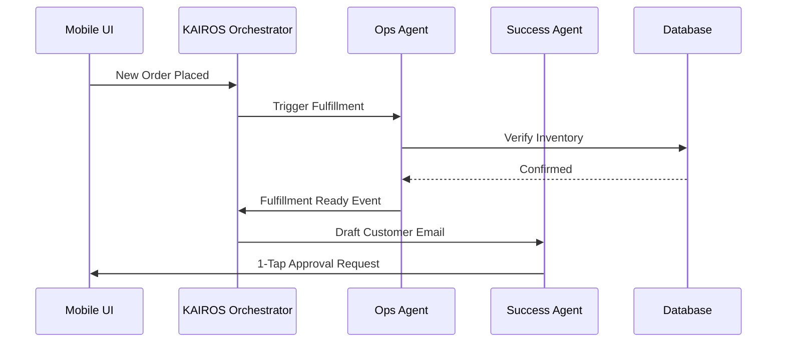

# OneHumanCorp (OHC) Architecture Research Report

## Master Architectural Overview
The OneHumanCorp platform relies on the KAIROS Orchestrator to route events between 7 core AI agent departments, ensuring non-technical small business owners can run a digital business completely from a mobile device without seeing any technical complexity. Multi-tenancy is enforced at the database level using PostgreSQL Row Level Security (RLS) over the `tenant_id` partition key, providing safe, shared schema performance.

## Persona-Specific Pain Point Summaries
- **Maya (Home Baker, 28):** Overwhelmed by IG DMs and manual payment tracking. Requires AI handling direct messages with 1-tap approval for draft responses.
- **Carlos (Handyman, 42):** Struggles to sync real-world availability. Needs mobile-first booking calendar and AI quote generator.
- **Priya (Boutique Owner, 35):** Suffers from fragmented inventory between in-store POS and online. Needs centralized, omnichannel data models.
- **Leo (Music Tutor, 22):** Lacks time for follow-ups. Needs subscription-based packages and automated links.
- **Fatima (Food Cart, 50):** Interface language and technical jargon barrier. Needs extreme simplicity and pre-order management.

## Comparative Tables
| Platform | Architecture Approach | AI Integration | Mobile-First UX | SMB Accessibility |
|---|---|---|---|---|
| **Shopify** | Monolithic SaaS, complex admin | Add-on, separate plugins | Desktop-primary admin | High learning curve |
| **Wix** | Drag-and-drop builder, monolithic | Generative AI for initial setup | Clunky on mobile devices | Medium learning curve |
| **OHC** | KAIROS Event-Driven Micro-agents | Native, invisible background execution | 100% 375px native priority | Zero-code, "Grandmother Test" |

## Premium Architectural Chart

## Actionable Recommendations
1.  **Enforce Strict Tenant Scoping:** Ensure every API endpoint correctly propagates `tenant_id` to PostgreSQL RLS context.
2.  **KAIROS Mesh Stabilization:** Transition all agent-to-agent communication to a durable message broker with explicit distributed locks.
3.  **UI/UX Refinement:** Apply Glassmorphism and Outfit + Inter typography strictly across all mobile-first dashboards.
