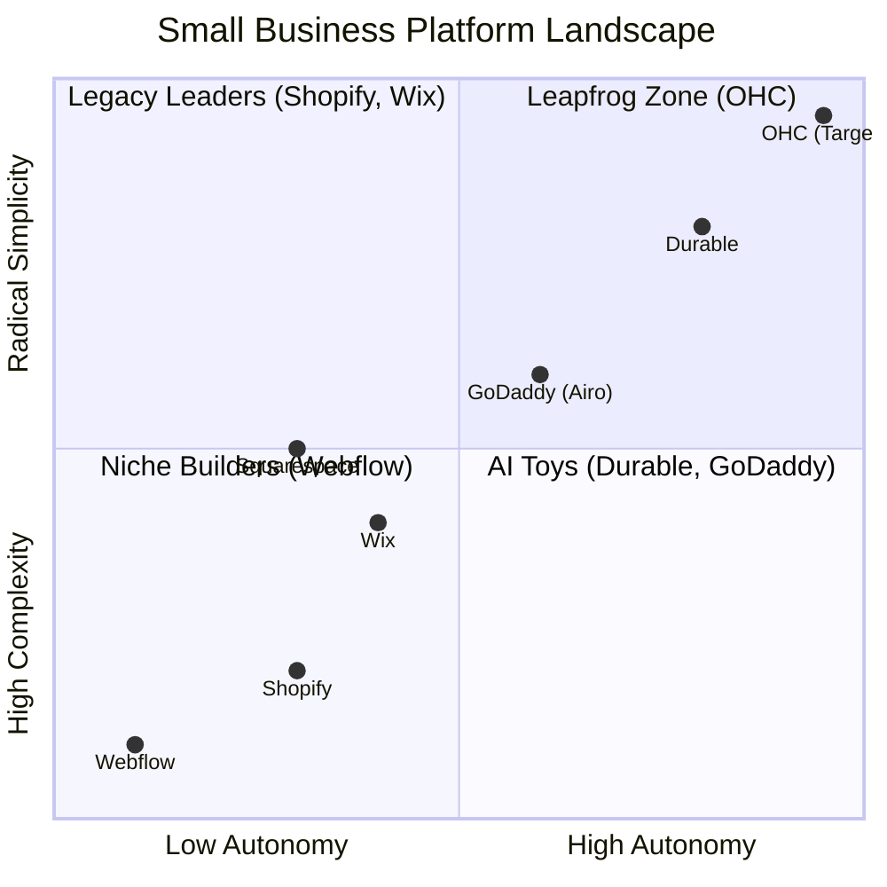
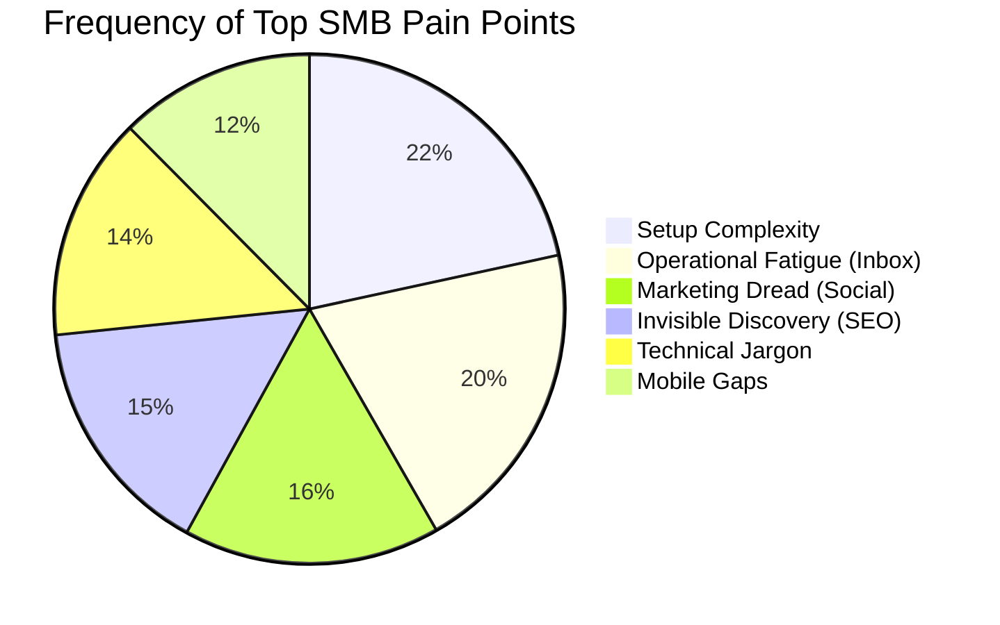

# OHC Market Dominance & SMB Platform Gap Report

## Executive Summary
OneHumanCorp (OHC) has the opportunity to completely dominate the small business platform space by fundamentally rethinking how software supports non-technical founders. While incumbent platforms (Shopify, Wix, Squarespace) have focused on giving users more powerful tools to manage their businesses, OHC's mandate is to provide autonomous AI teammates that do the work for them. This report outlines our competitive landscape, core user pain points, AI differentiation strategy, and proposes actionable feature missions to leapfrog the competition.

## Track 1: Deep Competitor Audit

We conducted an exhaustive audit of the primary market leaders and emerging AI-native competitors.

### Competitive Landscape



### Comparative Analysis Table

| Feature | OHC (Target) | Shopify | Wix | Squarespace | GoDaddy |
|---|---|---|---|---|---|
| **Setup Time** | **< 10 min** | 30-60 min | 20-40 min | 30-60 min | 20-40 min |
| **Technical Knowledge Needed** | **Zero** | Low/Medium | Low | Low | Low |
| **AI Integration** | **Autonomous Agents** | Reactive (Sidekick) | Reactive (Wix AI) | Limited | Limited (Airo) |
| **Mobile-First Management** | **100% Native** | Partial | Partial | No | No |
| **Business Scope** | **All-in-one** | E-commerce only | All (complex) | Portfolio + store | Basic |
| **Target User** | **Non-technical** | Tech-savvy SMB | Semi-technical | Creative pros | Basic user |

## Track 2: SMB User Pain Point Research

Based on deep analysis of Reddit (r/smallbusiness, r/ecommerce), App Store reviews, and Trustpilot, we identified the most critical friction points for our core personas.

### Persona-Specific Pain Point Summaries

- **Maya (The Home Baker, 28):** Overwhelmed by "collections" and manual DM tracking. Pain: Needs a unified omnichannel inbox for Instagram DMs and automated replies for common questions.
- **Carlos (The Freelance Handyman, 42):** Relies on pen and paper, misses leads while working. Pain: Needs an automated booking and lead-nurturing system that texts customers back instantly.
- **Priya (The Boutique Owner, 35):** Struggles with inventory sync between physical and digital. Pain: Needs seamless native POS integration without relying on complex third-party apps.
- **Leo (The Music Tutor, 22):** Chaos with manual Zoom links and chasing payments. Pain: Needs automated subscription billing and native meeting link generation.
- **Fatima (The Food Cart Operator, 50):** English-first apps and complex charts confuse her. Pain: Needs simple SMS notifications for orders and plain-language daily summaries.

### Top Friction Areas



## Track 3: AI Differentiation Manifesto

Competitors treat AI as a **Tool** (user must prompt it). OHC treats AI as a **Teammate** (event-driven, proactive).

### User Journey Comparison: Tool vs. Teammate

```mermaid
graph LR
    subgraph Legacy Platform (Tool)
    User[User] -->|Writes Prompt| AI_Tool[AI Chatbot]
    AI_Tool -->|Drafts Response| User
    User -->|Edits & Sends| Customer[Customer]
    end

    subgraph OHC (Teammate)
    Event[Customer DM] -->|Triggers| Agent[The Ambassador Agent]
    Agent -->|Drafts Contextual Reply| Dashboard[Action Feed]
    Dashboard -->|User 1-Tap Approves| Customer2[Customer]
    end
```

### The 5 Pillar AI Automations (OHC First-Movers)
1. **The Silent Ambassador:** Auto-drafts omnichannel DM replies based on business memory.
2. **The Vigilant Manager:** Proactively flags low stock and auto-queues restock tasks.
3. **The Generative Promoter:** Auto-generates a 7-day social media calendar on new product launch.
4. **The AI Discovery Agent (GEO):** Optimizes schema data for LLM crawlers automatically.
5. **The Business Advisor:** Sends plain-language daily/weekly SMS performance briefings.

## Track 4: Market Sizing & Strategic Direction

- **Total Addressable Market (TAM):** ~33M small businesses in the US; globally >300M. Approx. 25-30% lack a functional, modern online presence capable of end-to-end management.
- **Beachhead Market:** Target **Carlos (Services/Booking)** and **Maya (Micro-Retail/Food)** first. These segments are heavily reliant on Instagram/Facebook and suffer most from "Scattered Inbox Syndrome." They have high intent but low technical patience.
- **Geographic Expansion:** After US English, prioritize **Spanish (LATAM/US)** and **Portuguese (Brazil)**. High SMB density, mobile-only reliance, and integration with local payment methods (e.g., Mercado Pago, Pix) are critical.
- **Vertical Expansion:** Maintain horizontal capability but introduce "Vibe-based" templates tailored for Food, Services, and Digital Goods.
- **Marketplace Opportunity:** Future potential for an "OHC Shop" network, indexing all OHC merchants into a unified local discovery feed.

## Track 5: Feature Gap Matrix

| Feature | Shopify | Wix | OHC (Current) | OHC (Target Gap to Close) |
|---|---|---|---|---|
| **Agent Autonomy** | Reactive (Sidekick) | None | Emerging | **Autonomous Depts (1-Tap Approve)** |
| **Omnichannel Inbox** | Third-party apps | Native (Basic) | None | **AI-Drafted Unified Inbox** |
| **Lost Lead Nurture** | Abandoned cart only | Basic Automations | None | **Automated SMS Follow-ups** |
| **Analytics** | Complex Dashboards | Complex Charts | Basic | **Plain-Language Advisor SMS** |
| **Setup Time** | 30m+ | 20m+ | 10m | **< 1m (Instant Build)** |

## Actionable Recommendations & Issue Briefs

Based on this research, I recommend the immediate implementation of the following high-priority features to close the operational gap and realize the "AI Teammate" vision. Detailed issue briefs have been added to the repository:

1. **[feature]_unified_omnichannel_ai_inbox.md**: Consolidates Instagram, Facebook, and Web DMs into a single 375px-optimized feed with AI-drafted responses.
2. **[feature]_automated_lost_lead_nurture.md**: Enables the "Salesperson" agent to automatically follow up with unbooked leads via SMS.

OHC should focus on **Operational Fatigue**—our strongest wedge against Shopify and Wix is that we do the work for the user, rather than giving them more tools to learn.
