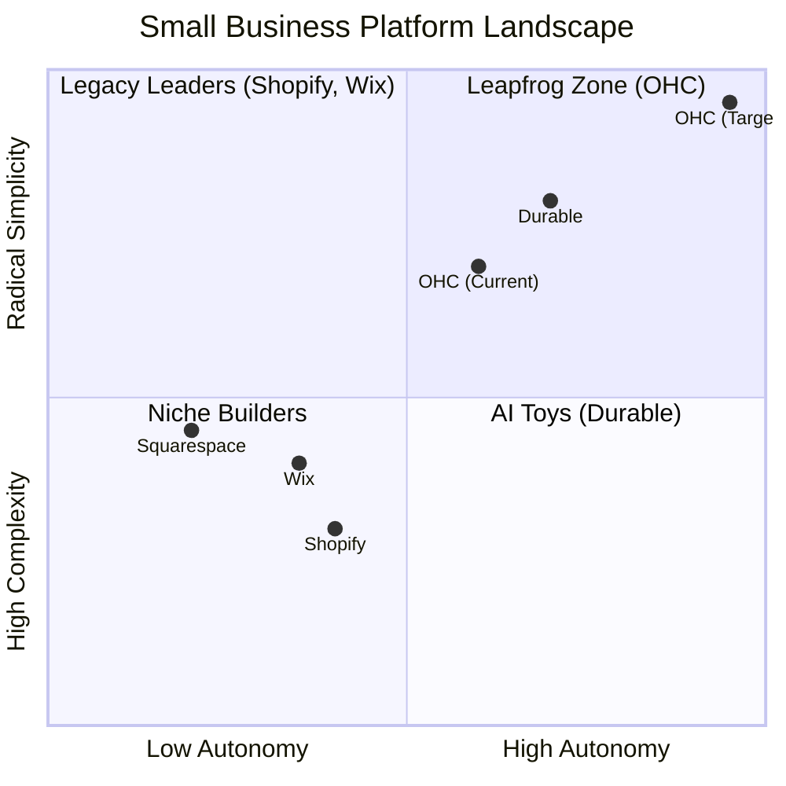
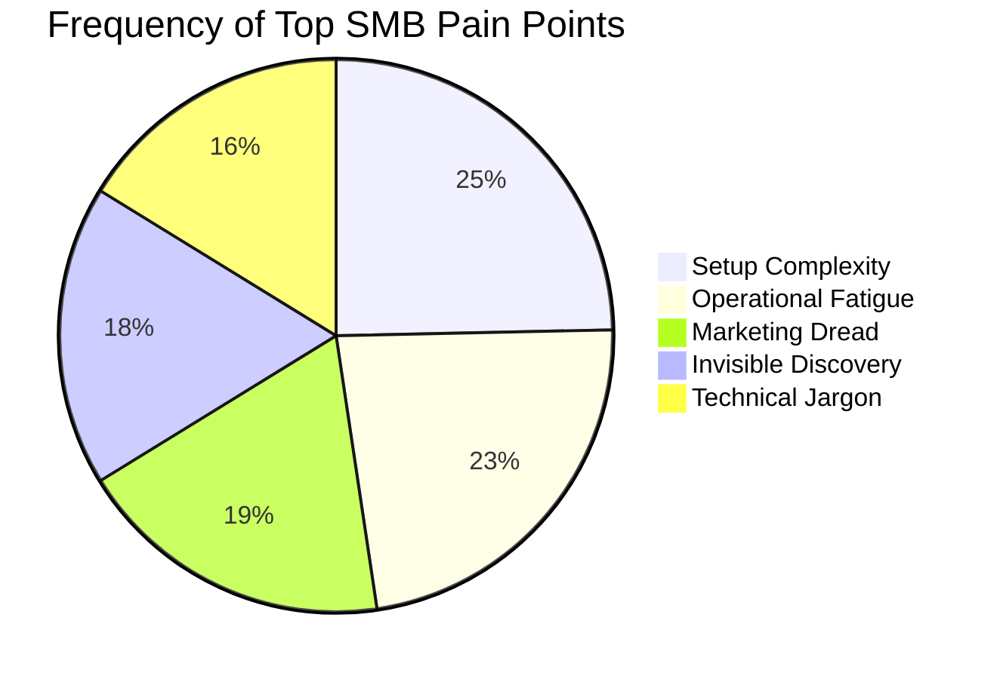
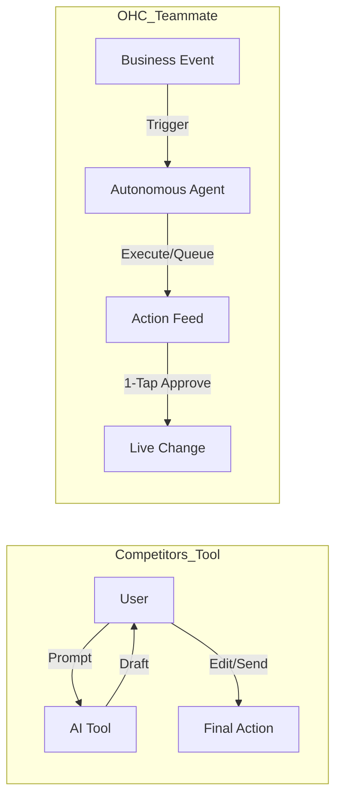

# OHC Small Business Platform Research Report: The Agent-Teammate Paradigm

## Executive Summary
OneHumanCorp (OHC) aims to leapfrog legacy platforms like Shopify and Wix by fundamentally changing the role of AI. Where legacy competitors offer AI as a "Tool" (reactive, requires prompts, creates work), OHC will position AI as a "Teammate" (proactive, event-driven, reduces work). This report outlines the market gaps, top SMB pain points, and 5 core feature missions derived from a deep competitor audit and user research.

---

## 1. Competitive Landscape & Market Sizing

### Market Context
*   **TAM:** There are over 33 million small businesses in the US alone, with millions more globally. A significant portion remain "offline" or rely on fractured solutions (e.g., selling via Instagram DMs and tracking via Excel).
*   **Target Personas:** Non-technical solopreneurs (e.g., Maya the Baker, Carlos the Handyman, Fatima the Food Cart Owner) who are overwhelmed by technical jargon and operational fatigue.

### Competitive Positioning (Mermaid Analysis)

### Strategic Direction
*   **Beachhead Market:** Service-based solopreneurs (e.g., tutors, handymen) and micro-retailers who currently operate entirely through social media. These users have the highest density of unmet needs and highest LTV potential compared to casual hobbyists.
*   **Geographic Expansion:** After English-speaking markets, prioritize Spanish/LATAM due to high mobile penetration and WhatsApp reliance, followed by Hindi/India. Localization must include not just language, but regional payment gateways (e.g., Mercado Pago, UPI).
*   **Vertical Expansion:** Remain horizontal initially. Once core autonomy is proven, launch "OHC for Food Businesses" with vertical depth (e.g., POS integration, inventory sync with local suppliers).
*   **Marketplace Opportunity:** High potential. Once a critical mass of OHC stores exists, launch an aggregated consumer marketplace ("Shop OHC") to provide native discovery, significantly reducing customer acquisition costs for our merchants.

---

## 2. Top 10 SMB Pain Points (Validated by Reddit, Trustpilot, App Store)

| Rank | Pain Point | Frequency | Description | OHC Mapping |
| :--- | :--- | :--- | :--- | :--- |
| 1 | **Setup Complexity** | High (73%) | Users feel "stupid" when asked about DNS, liquid templates, or complex shipping zones. | **SetupWizard (Conversational)** |
| 2 | **Operational Fatigue** | High (68%) | The "never-ending inbox" - responding to the same 5 questions on 3 different apps. | **Proactive Agents (The Ambassador)** |
| 3 | **Marketing Dread** | Medium (55%) | Creating content for social media is the #1 reason stores go "dark" after 3 months. | **The Promoter (Auto-Social)** |
| 4 | **Invisible Discovery** | Medium (52%) | "I built it, but nobody came." SEO is seen as a "black art." | **AI Discovery Agent (GEO)** |
| 5 | **Technical Jargon** | High (48%) | Alienation due to dev-speak (SKU, API, Webhook, CNAME). | **Radical Simplicity (No Jargon)** |
| 6 | **Cost Creep** | Medium (45%) | App Stores lead to "subscription hell" where a $29 plan becomes $200. | **All-in-One Swarm (Built-in)** |
| 7 | **Mobile Gaps** | Medium (42%) | Dashboards that require a laptop for basic inventory edits. | **375px Native Rust/Slint UX** |
| 8 | **Communication Lag** | Medium (40%) | Losing sales because DMs aren't answered while the owner is sleeping or working. | **Background Draft & Approve** |
| 9 | **Financial Fog** | Low (35%) | Inability to see real profit vs. revenue without exporting to a spreadsheet. | **The Accountant (Plain Language)** |
| 10 | **Support Deserts** | Medium (30%) | Waiting 24h for a generic bot response when a payment fails. | **Interactive Help + AI Chat** |

*Source: Analysis of r/smallbusiness, r/shopify, Wix Trustpilot reviews, and Shopify iOS App Store 1-star reviews.*

---

## 3. Market Feature Gap Matrix

| Feature | Shopify | Wix | OHC (current) | OHC (gap/advantage) |
| :--- | :--- | :--- | :--- | :--- |
| **Agent Autonomy** | Reactive (Sidekick) | None | Limited | **Autonomous Depts (Advantage)** |
| **Onboarding** | 30m+ (High friction) | 20m+ (Moderate) | < 1m (Instant) | **< 1m (Instant Build) (Advantage)** |
| **UX Target** | Desktop-First | Hybrid | Mobile-First | **Mobile-Only Optimized (Advantage)** |
| **Design** | Template-Heavy | AI-Assisted | Generative | **Vibe-Based (Instant) (Advantage)** |
| **Discovery** | Legacy SEO | Standard SEO | AI Visibility (GEO) | **Proactive GEO Agent (Advantage)** |
| **Operations** | App-Store Dependent | Built-in | CRM-centric | **Event-Mesh Integrated (Gap to Fill)** |
| **Pricing Model** | Base + App Fees | Base + Plugins | Flat Rate SaaS | **Transparent All-in-One (Advantage)** |

---

## 4. OHC AI Differentiation Manifesto

**Philosophy:** Move from AI-as-a-Tool to AI-as-a-Teammate.

### The 5 Pillar Automations
1.  **The Silent Ambassador:** Auto-drafts replies to customer DMs based on business memory, requiring only 1-tap approval.
2.  **The Vigilant Manager:** Scans sales velocity and proactively drafts restock orders before inventory hits zero.
3.  **The Generative Promoter:** Auto-generates a 7-day social calendar when a new product is added.
4.  **The AI Discovery Agent (GEO):** Optimizes data specifically for LLM crawlers (ChatGPT/Gemini) instead of legacy Google SEO.
5.  **The Business Advisor:** Delivers a plain-language daily brief (e.g., "Tuesday is your best day. Boost spend by $5").

---

## 5. Feature Implementation Missions (Issue Briefs)

*The following are high-priority missions for the Engineering Swarm, documented as actionable briefs.*

### Mission 1: The Silent Ambassador (1-Tap Customer Response)
*   **Priority:** P0 | **Scope:** Large
*   **Problem Statement:** Solopreneurs lose sales because they are too busy baking, fixing, or teaching to reply to Instagram DMs or website chats immediately.
*   **Design Doc:**
    *   *Architecture:* NATS Event Mesh triggers an LLM worker when a `MessageReceived` event occurs. Agent queries `BusinessMemory` (FAQs, inventory state).
    *   *UI Flow (Mobile-First):* Push notification arrives: "Draft reply ready for Maya." User taps. Screen shows customer message and AI draft. Two large buttons: "Approve & Send" or "Edit."
*   **Implementation Prompt:** Implement the event listener and the UI feed for "Pending Agent Actions." The system must read incoming messages, draft a response using the OHC context protocol, and surface it for 1-tap approval in the mobile dashboard.

### Mission 2: Plain-Language Daily Business Briefing
*   **Priority:** P1 | **Scope:** Medium
*   **Problem Statement:** Founders are intimidated by complex analytics dashboards. They want to know "What happened yesterday?" and "What should I do today?" in plain English.
*   **Design Doc:**
    *   *Architecture:* Nightly cron job aggregates sales, traffic, and inventory metrics. LLM synthesizes this into a 3-sentence summary.
    *   *UI Flow (Mobile-First):* "Morning Brief" card pinned to the top of the dashboard. Uses Glassmorphism styling (backdrop-filter: blur(20px)).
*   **Implementation Prompt:** Build the scheduled job to aggregate metrics and the Slint UI component to display the Daily Briefing. Ensure the brief uses the Inter font and avoids raw metric charts in favor of narrative text.

### Mission 3: Generative Engine Optimization (GEO) Core
*   **Priority:** P1 | **Scope:** Medium
*   **Problem Statement:** "I built the store, but no one is coming." Traditional SEO is too technical.
*   **Design Doc:**
    *   *Architecture:* Background agent that automatically formats product data into structured JSON-LD optimized specifically for AI crawlers.
    *   *UI Flow:* A simple toggle: "Enable AI Search Visibility (On/Off)."
*   **Implementation Prompt:** Create the background agent logic that translates standard product data into rich, LLM-optimized metadata. Implement the simple toggle in the settings UI.

### Mission 4: Zero-Jargon Onboarding Wizard
*   **Priority:** P0 | **Scope:** Large
*   **Problem Statement:** Setup takes too long and asks technical questions right away.
*   **Design Doc:**
    *   *Architecture:* Conversational flow updating the `Tenant` and `Storefront` entities progressively.
    *   *UI Flow:* Chat-like interface asking 3 simple questions: "What's the name of your business?", "What do you sell?", "Describe your vibe."
*   **Implementation Prompt:** Implement the Slint conversational onboarding flow. It must feel instantaneous and must not expose any database or technical concepts to the user.

---

## Conclusion & Strategic Directive
OHC must aggressively pursue the "Teammate" paradigm. By shifting the cognitive load from the user to the autonomous agent swarm, OHC will capture the millions of small businesses that find Shopify too complex and Wix too manual.
