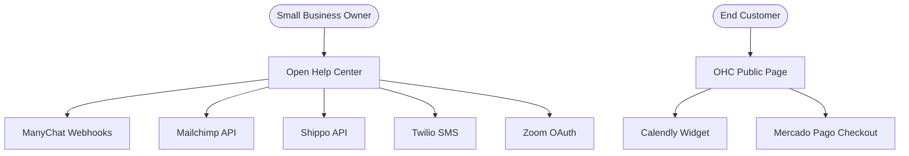

# OHC Tool Integration Research Report Q2

## Overview
This report evaluates third-party tools across 7 key categories to expand the capabilities of Open Help Center (OHC) for small business owners. The goal is to provide seamless integrations that solve real-world pain points, making OHC an indispensable central hub for managing business operations.

---

## 1. Social Media Integration

### Title: Integrate Unified Social Media Inbox via ManyChat
**Problem Statement:** Business owners spend countless hours manually replying to repetitive direct messages across Instagram, Facebook, and WhatsApp. They need a single place to see and reply to customer inquiries without jumping between apps.

**Research Report:**
* **Evaluated Tool:** ManyChat
* **Pricing:** Free tier available (up to 1,000 contacts). Pro plans start at $15/month and scale with active contacts.
* **Reputation:** Industry leader for visual flow builders and Meta integrations.
* **Ease of Use:** Extremely user-friendly visual builder designed for non-technical users.
* **Cloud/Standalone:** Works in both modes via webhook integration.
* **Pros:** Official Instagram/WhatsApp partner; easy template system.
* **Cons:** Costs can escalate quickly as contact lists grow.

**Design Doc:**
* **Trigger:** Customer sends a DM on Instagram/Facebook/WhatsApp.
* **Action:** ManyChat routes the message to the OHC unified inbox. OHC can automatically reply using AI or allow the business owner to reply manually.
* **User Experience:** The business owner sees a simple "Connect Facebook/Instagram" button in OHC settings. Once connected, all messages appear in a familiar chat interface within OHC. They can type replies directly in OHC, which are sent back to the customer's social app.

**Implementation Prompt:**
Create a connection flow in OHC to link a ManyChat account. Build a unified inbox interface that displays incoming messages from connected channels. Allow the business owner to reply to messages directly from this interface.
* **Priority:** P1 (High)
* **Estimated Scope:** Large

---

## 2. Calendar & Scheduling

### Title: Automated Meeting Scheduling via Calendly
**Problem Statement:** Scheduling consultations or meetings involves frustrating back-and-forth emails. Business owners need a simple link they can share that lets customers pick an available time automatically.

**Research Report:**
* **Evaluated Tool:** Calendly
* **Pricing:** Free tier allows 1 event type. Standard plan starts at $10/month.
* **Reputation:** The ubiquitous standard for scheduling. Highly reliable.
* **Ease of Use:** Very intuitive for both the business owner and the customer.
* **Cloud/Standalone:** Works well in Cloud mode; Standalone requires careful OAuth handling.
* **Pros:** Deep integrations with Google/Outlook calendars, automatic timezone handling.
* **Cons:** Advanced features (like routing or multiple event types) require a paid plan.

**Design Doc:**
* **Trigger:** Business owner needs to schedule a meeting.
* **Action:** OHC generates a unique scheduling link or embeds the Calendly widget in the help center.
* **User Experience:** The business owner connects their Google/Outlook calendar. OHC displays their personal scheduling link. Customers clicking "Book a Call" on the help center see a calendar view of available times in their own timezone and can book instantly.

**Implementation Prompt:**
Integrate a Calendly connection block in the OHC dashboard. Add a "Scheduling" widget to the customizable help center that embeds the business owner's Calendly booking page.
* **Priority:** P0 (Critical)
* **Estimated Scope:** Medium

---

## 3. Email Marketing

### Title: Customer List Sync & Campaigns via Mailchimp
**Problem Statement:** Business owners want to email their customers about promotions or updates but struggle with exporting/importing lists and avoiding spam filters.

**Research Report:**
* **Evaluated Tool:** Mailchimp
* **Pricing:** Free up to 500 contacts. Paid plans (Essentials) start around $13/month.
* **Reputation:** One of the most famous and reliable email platforms.
* **Ease of Use:** Famous for its easy drag-and-drop email builder.
* **Cloud/Standalone:** Fully supported via API in both modes.
* **Pros:** Great templates, solid analytics, easy to use.
* **Cons:** Becomes expensive quickly for larger contact lists.

**Design Doc:**
* **Trigger:** A new customer signs up or purchases through OHC.
* **Action:** OHC automatically adds the customer to a specific Mailchimp audience/list.
* **User Experience:** The business owner links their Mailchimp account. They can then check a box in OHC to "Automatically sync customers to Mailchimp." When they want to send a newsletter, they log into Mailchimp and their list is already perfectly up-to-date.

**Implementation Prompt:**
Build a synchronization engine that connects OHC customer records to a Mailchimp audience. Ensure the sync is bidirectional (if a user unsubscribes in Mailchimp, OHC notes this). Add a simple "Connect Mailchimp" button to the marketing settings.
* **Priority:** P1 (High)
* **Estimated Scope:** Medium

---

## 4. Payment Processing

### Title: Localized LATAM Payments via Mercado Pago
**Problem Statement:** While Stripe is great globally, small businesses in Latin America need to accept local payment methods (like Pix in Brazil or OXXO in Mexico) that their customers actually use.

**Research Report:**
* **Evaluated Tool:** Mercado Pago
* **Pricing:** Pay-as-you-go per transaction (varies by country, typically 3-5%).
* **Reputation:** The dominant and most trusted payment gateway in LATAM.
* **Ease of Use:** Standard checkout flow, very familiar to LATAM consumers.
* **Cloud/Standalone:** API fully supports both environments.
* **Pros:** Supports critical local payment methods that Stripe misses.
* **Cons:** Customer support can sometimes be slow to respond.

**Design Doc:**
* **Trigger:** Customer checks out or pays an invoice in OHC.
* **Action:** OHC presents Mercado Pago as a payment option, handling the redirect or embedded checkout.
* **User Experience:** The business owner in a supported country can connect Mercado Pago with one click. Their customers see familiar, local payment options at checkout, increasing conversion rates significantly.

**Implementation Prompt:**
Add Mercado Pago as an alternative payment gateway alongside Stripe. Create the checkout flow to support local payment methods based on the customer's region. Display clear transaction fee estimates to the business owner.
* **Priority:** P2 (Medium)
* **Estimated Scope:** Large

---

## 5. Shipping & Logistics

### Title: Automated Shipping Labels & Rates via Shippo
**Problem Statement:** Calculating shipping costs manually and typing out shipping labels is tedious and error-prone for businesses selling physical goods.

**Research Report:**
* **Evaluated Tool:** Shippo
* **Pricing:** Free tier available (pay only for postage). Pro features start at $19/month.
* **Reputation:** Strong multi-carrier platform with good developer tools.
* **Ease of Use:** Simplifies complex shipping rules into easy-to-understand options.
* **Cloud/Standalone:** Supported in both modes via REST API.
* **Pros:** Gives small businesses access to discounted carrier rates.
* **Cons:** International shipping setup can still be complicated for absolute beginners.

**Design Doc:**
* **Trigger:** An order is placed that requires physical shipping.
* **Action:** OHC calculates live shipping rates at checkout and allows the business owner to click "Print Label" from the order screen.
* **User Experience:** The business owner sets their box sizes in OHC. At checkout, customers see accurate shipping costs. When an order comes in, the business owner clicks one button in OHC to buy and print the shipping label, and the tracking number is automatically emailed to the customer.

**Implementation Prompt:**
Integrate the Shippo API to provide real-time shipping rate calculations at checkout. Add a "Fulfill Order" interface in the OHC dashboard that allows the business owner to purchase and download shipping labels in PDF format.
* **Priority:** P2 (Medium)
* **Estimated Scope:** Large

---

## 6. SMS & Notifications

### Title: Reliable SMS Alerts via Twilio
**Problem Statement:** Customers often miss email notifications. For urgent updates (like appointment reminders or order deliveries), business owners need to send text messages, especially for user bases with lower English proficiency.

**Research Report:**
* **Evaluated Tool:** Twilio
* **Pricing:** Pay-as-you-go (e.g., ~$0.0079 per outbound SMS in the US).
* **Reputation:** The gold standard for programmatic communications.
* **Ease of Use:** Developer-centric; OHC must abstract all the complexity for the user.
* **Cloud/Standalone:** Excellent support in both modes.
* **Pros:** Highly reliable, global reach, massive scale.
* **Cons:** Requires a technical integration layer; business owners cannot just "log in to Twilio" easily to set it up themselves.

**Design Doc:**
* **Trigger:** An important event occurs (e.g., appointment tomorrow).
* **Action:** OHC sends a customized SMS to the customer via Twilio.
* **User Experience:** The business owner simply toggles "Send SMS Reminders" in their OHC settings and tops up a small balance. OHC handles all the complex Twilio account provisioning and phone number purchasing behind the scenes.

**Implementation Prompt:**
Build an SMS notification engine powered by Twilio. Create a credit system or bundled pricing so the business owner doesn't have to create their own Twilio account. Allow the business owner to customize the SMS templates for key events like order confirmations and appointment reminders.
* **Priority:** P1 (High)
* **Estimated Scope:** Large

---

## 7. Video Conferencing

### Title: Auto-Generated Meeting Links via Zoom
**Problem Statement:** When a business owner books an online consultation, they currently have to manually create a Zoom link and email it to the client, leading to lost links and confusion.

**Research Report:**
* **Evaluated Tool:** Zoom
* **Pricing:** Free tier allows up to 40-minute meetings. Pro plan is $14.99/month.
* **Reputation:** Ubiquitous, stable, and widely understood by consumers.
* **Ease of Use:** Very familiar join experience for almost all users.
* **Cloud/Standalone:** API fully supported, though OAuth requires careful handling.
* **Pros:** Everyone knows how to use it; highly reliable video quality.
* **Cons:** The 40-minute limit on the free tier can be a surprise for new business owners.

**Design Doc:**
* **Trigger:** An online consultation or meeting is scheduled via OHC.
* **Action:** OHC automatically generates a unique Zoom link and adds it to the calendar invite.
* **User Experience:** The business owner connects their Zoom account once. Whenever a customer books a "Virtual Consultation," OHC instantly creates the Zoom meeting, puts the link on the receipt, and emails the link to both parties. No manual copying/pasting required.

**Implementation Prompt:**
Integrate Zoom's OAuth flow to allow business owners to connect their accounts. Update the scheduling system to automatically request and attach a Zoom meeting URL to new calendar events when the location is set to "Virtual."
* **Priority:** P1 (High)
* **Estimated Scope:** Medium

---

## Visual Summary

### Competitive Landscape Matrix
| Category | Tool | Starting Cost | Key Advantage | Cloud Support | Standalone Support |
|---|---|---|---|---|---|
| Social | ManyChat | $0 | Visual flow builder | Yes | Yes |
| Calendar | Calendly | $0 | Industry standard | Yes | Yes |
| Email | Mailchimp | $0 | Easy templates | Yes | Yes |
| Payments | Mercado Pago | Pay-as-you-go | LATAM localization | Yes | Yes |
| Shipping | Shippo | $0 | Discounted rates | Yes | Yes |
| SMS | Twilio | Pay-as-you-go | Global reliability | Yes | Yes |
| Video | Zoom | $0 | Familiarity | Yes | Yes |

### OHC Integration Architecture Map

## Recommendations
* **OHC should prioritize Calendly (P0) immediately**, as scheduling is a universal pain point for service-based small businesses and has an incredibly high ROI for user retention.
* **OHC should handle Twilio complexity directly.** Small business owners should not create Twilio accounts; OHC should provide "SMS Credits" as a built-in feature to abstract away the developer-centric nature of Twilio.
