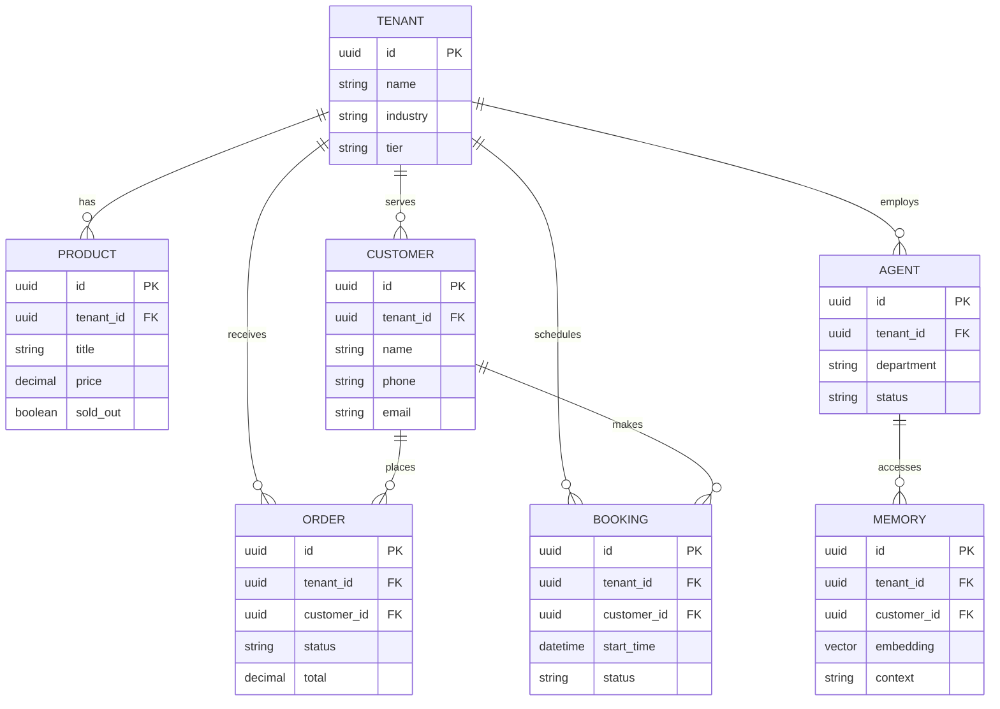

# Issue Brief: Data Model Architecture Evolution

## Title
Data Model Architecture: Entities, Relationships, and Multi-Tenancy Guarantees

## Problem Statement
As OneHumanCorp scales to support diverse business types—from bakers and freelance handymen to boutique owners—the underlying data model must remain robust, scalable, and strictly isolated per tenant. A non-technical small business owner relies on the system to keep their customer data, orders, and AI agent memories perfectly secure and separate from others. We must define clear entity relationships, access patterns, and invariants that guarantee row-level multi-tenancy without adding complexity to the business owner's experience.

## Research Report
- **Goal**: Review and evolve the OHC data model to ensure complete tenant isolation and optimized access patterns for both the mobile-first UI and the background AI agents.
- **Findings**:
  - **Multi-Tenancy**: The current architecture mandates row-level isolation in PostgreSQL using a `tenant_id` column with `ENABLE ROW LEVEL SECURITY`. This is critical and must be strictly maintained.
  - **Entity Types**: Key entities include Business (Tenant), Product, Order, Customer, Agent, Page, Booking, and Memory.
  - **Access Patterns**:
    - AI agents need fast access to customer history and long-term memory (pgvector).
    - The mobile app requires low-latency queries for orders and analytics.
- **Competitive Analysis**: Shopify and Wix handle multi-tenancy seamlessly but often struggle with deep AI integration at the data layer. By building pgvector memories directly into the tenant schema, OHC gains a significant advantage in personalized AI operations.

## Design Doc

### Entity-Relationship Diagram

### Key Invariants
1. **Tenant Isolation**: A business owner can only access data where `tenant_id` matches their authenticated session. This is enforced at the database level using RLS.
2. **Agent Scoping**: AI agents operating on behalf of a tenant must have their database queries automatically scoped to that `tenant_id`.
3. **Data Residency**: All entities (Products, Orders, Customers, Memories) must explicitly reference a `tenant_id`.

### Migration Strategy
- When evolving the schema (e.g., adding new entities like `Subscription`), use zero-downtime migrations.
- Ensure every new table includes a `tenant_id` column and the corresponding RLS policies are applied immediately upon creation.

## Implementation Prompt
Implement the data model enhancements for the OHC platform. Ensure that all new tables include a `tenant_id` column and that Row Level Security (RLS) is enabled and configured correctly. Update the Go backend repository layer to pass the `tenant_id` context in all queries. Implement E2E tests verifying that a user from one tenant cannot access data from another tenant, even via API manipulation.

## Priority
P0

## Estimated Scope
Medium
