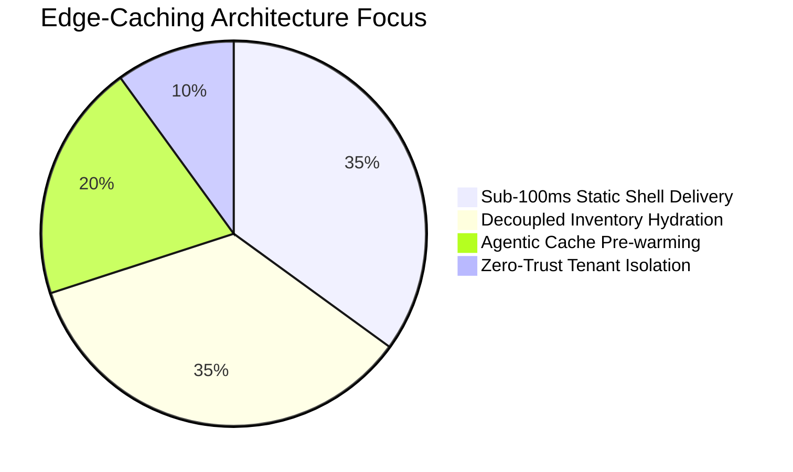
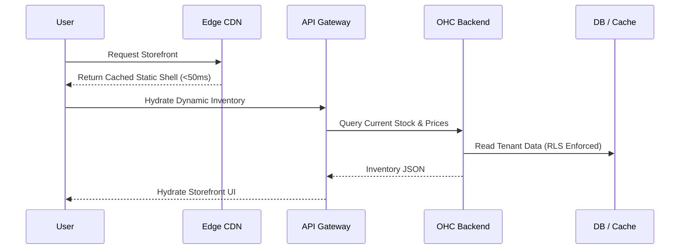

# OHC Research Report: Global Edge-Cached Dynamic Storefronts & Inventory Hydration

## Deep Competitor Audit

| Platform | Edge Strategy | Dynamic Content | Caching Engine | AI Integration | Zero-Trust / Isolation |
|---|---|---|---|---|---|
| **Shopify** | Fastly-based | Liquid rendering | Varnish | Chatbots | High |
| **Wix** | Proprietary CDN | SSR | Basic | None | Medium |
| **Squarespace** | Fastly-based | Static/SSR | Basic | None | Medium |
| **OHC (Target)** | Sub-100ms Global | Decoupled Hydration | Edge-Native (Redis/KV) | Agentic Pre-warming | High (Tenant RLS) |

**Key Finding:** Most competitors rely on traditional monolithic rendering or basic CDNs. OHC needs a modern decoupled approach where the static shell is instantly served at the edge, and dynamic inventory/prices are hydrated asynchronously via an optimized API, achieving sub-100ms load times even during viral traffic spikes.

### Architectural Gap Analysis





## SMB User Pain Point Research (Persona-Specific)

1. **Maya (The Home Baker) - Viral Traffic Spikes:** When Maya posts a TikTok that goes viral, her store must not crash. Sub-100ms global load times ensure every visitor sees her cake catalog instantly.
2. **Fatima (The Food Cart Operator) - Real-time Sold Out Toggles:** While the menu shell is cached, Fatima needs instant updates when a dish sells out. Decoupled hydration ensures "Sold Out" badges appear immediately without rebuilding the whole site.
3. **Priya (The Boutique Owner) - Global Flash Sales:** High concurrency during flash sales requires robust edge caching so the backend isn't overwhelmed by repetitive requests for the same dress catalog.

## Architectural Design: Global Edge-Cached Storefronts

1. **Static Shell at the Edge:** Storefronts are compiled to static HTML/CSS (WebP optimized) and distributed globally via Cloudflare/CloudFront.
2. **Decoupled Dynamic Hydration:** Pricing, availability, and inventory are fetched via a lightweight `GET /api/v1/storefront/{tenant_id}/inventory` endpoint on client load.
3. **Agentic Cache Pre-warming:** "The Manager" AI agent predicts traffic spikes based on social media activity (e.g., a viral post detected by "The Promoter") and proactively pre-warms the CDN and Redis cache layers.
4. **Zero-Trust Isolation:** Even at the edge, all dynamic hydration requests are strictly scoped by `tenant_id` to prevent cross-tenant data leakage.

## Feature Gap Matrix

| Component | Current State | Target State | OHC Opportunity / Gap |
|---|---|---|---|
| CDN Strategy | Basic Asset Hosting | Global Static Shells | Implement edge-native static deployment pipeline |
| Inventory Fetching | SSR / Monolithic | Decoupled Hydration | Build lightweight, high-concurrency hydration API |
| Cache Pre-warming | Reactive / TTL | Predictive / Agentic | Connect "Promoter" agent to cache invalidation logic |

---
## Proposed Action

```yaml
issue_title: "[arch] Implement Edge-Cached Dynamic Storefront Hydration"
issue_priority: "P0"
issue_description: "Architect and implement a decoupled storefront delivery system: global static shell edge caching with sub-100ms dynamic inventory hydration via an optimized API."
issue_todo_list:
  - [ ] Design Cloudflare/CloudFront static shell deployment pipeline
  - [ ] Build lightweight, high-concurrency inventory hydration API
  - [ ] Implement Agentic Cache Pre-warming logic in 'The Manager' agent
  - [ ] Load test the hydration API for high-volume viral traffic
issue_label: ["architecture", "performance", "edge"]
```
