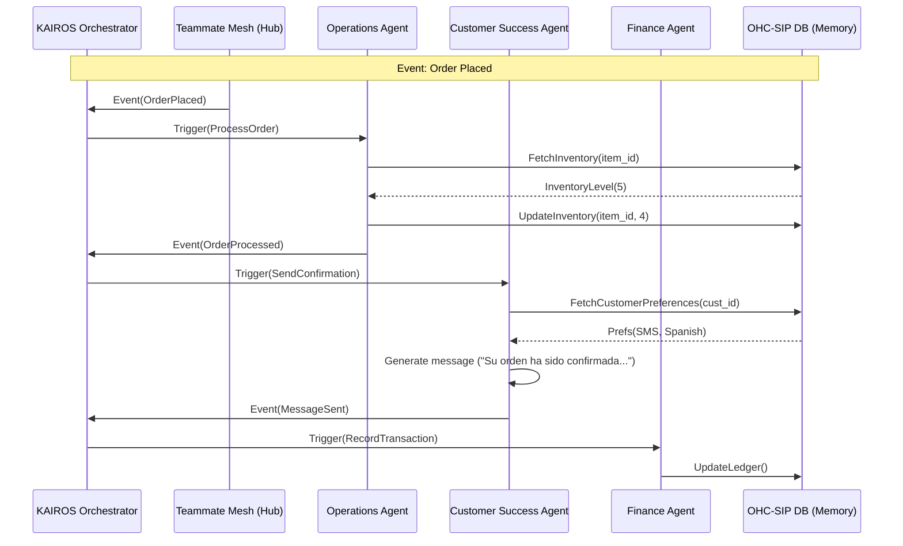

# Title
Architecture Brief: AI Agent Department Organization

## Problem Statement
Small business owners (e.g., Maya, Carlos, Priya) often struggle to manage the sheer volume of daily tasks required to run their businesses—from replying to Instagram DMs and generating quotes, to tracking inventory and managing subscriptions. Without technical expertise or the budget to hire a large team, these operational burdens create severe bottlenecks. The OHC platform must orchestrate a suite of invisible AI agents to handle this complexity. However, without clearly defined functional boundaries, memory access patterns, and coordination protocols, the system risks chaotic execution, data leakage between tenants, and a jarring user experience. We need a unified architectural map defining how AI departments mirror real-world business roles and operate seamlessly within the KAIROS Orchestrator.

## Research Report
- **Agent Roles**: Small business owners understand functional roles (e.g., "Manager", "Promoter", "Accountant") much better than technical abstractions (e.g., "RAG pipeline", "LLM routing"). Categorizing agents into distinct departments lowers the cognitive barrier to adoption.
- **Autonomy vs. Control**: Complete autonomy is dangerous and erodes trust. A "draft-for-review" mechanism with a unified 1-tap inbox is critical for high-stakes actions (e.g., sending a quote or processing a refund), while routine tasks (e.g., auto-categorizing expenses) can be fully autonomous.
- **Context & Memory**: AI agents need consistent access to historical context to make intelligent decisions (e.g., remembering a customer's preference or past seasonal trends). This requires a centralized memory layer.
- **Cost Control**: AI inference is expensive. A robust mechanism to throttle usage and upsell based on value delivered is essential for sustainable unit economics.

## Design Doc

### High-Level Architecture Diagram

### Department Functional Boundaries
1.  **Operations ("The Manager")**: Fulfillment, inventory management, calendar sync, booking resolution. Triggers on events (`OrderPlaced`). Auto-executes routine tasks.
2.  **Marketing & Advertising ("The Promoter")**: Storefront design, SEO meta-tags, social media drafting. Triggers on demand or schedule. Draft-for-review for public-facing content.
3.  **Sales & Acquisition ("The Salesperson")**: Quote generation, lead follow-up. Triggers on inquiries/cart abandonment. Drafts quotes for review.
4.  **Customer Success ("The Ambassador")**: Inbox management, FAQs, review requests. Auto-replies to known FAQs, drafts responses for complex queries.
5.  **Finance & Payments ("The Accountant")**: Ledger tracking, tax categorization, weekly summaries. Triggers on payment webhooks. Purely analytical.
6.  **Legal & Compliance ("The Protector")**: TOS generation, GDPR compliance. Triggers on storefront publishing. Generates templates requiring explicit approval.
7.  **Business Advisory ("The Advisor")**: Synthesizes cross-departmental data into daily/weekly briefings. High autonomy, internal read-only access.

### Memory & Context
- Agents share a global `VectorRepository` (backed by pgvector in Cloud, SQLite in Standalone) for semantic recall.
- **Access Pattern**: Queries are strictly scoped by `tenant_id` to prevent data leakage.
- **Context Window**: The Orchestrator injects the last N relevant events and the user's "Business Vibe" configuration into the prompt context.

### Approval Mechanism & Control
- Actions requiring approval (Drafts) are routed to a unified "Action Required" inbox in the mobile UI.
- The UI presents the drafted action with clear "Approve", "Edit", or "Reject" buttons.

### Throttling & Usage Limits
- **Budgeting**: Agents consume "Action Tokens" tracked by the `TierService`.
- **Soft Limits**: When a tenant nears their monthly limit, the Advisory Agent proactively suggests upgrading tiers.

## Implementation Prompt
**To Implementer Agent:**
Implement the routing engine for the KAIROS Orchestrator that directs incoming events to the appropriate AI Agent Department. Create the unified `VectorRepository` abstraction for agent memory, ensuring that all semantic queries strictly filter by `tenant_id`. Build the "Action Required" unified inbox API, allowing agents to submit "draft" actions and business owners to approve/reject them via a simple 1-tap interface. Ensure that action processing handles AI timeouts gracefully (max 60 seconds with 3 retries) and integrates with the `TierService` to soft-limit requests. Do not prescribe specific database schemas or backend frameworks; focus on the API contract and the behavioral flow. Include tests verifying proper event routing and tenant isolation.

## Priority
P0

## Estimated Scope
Large
